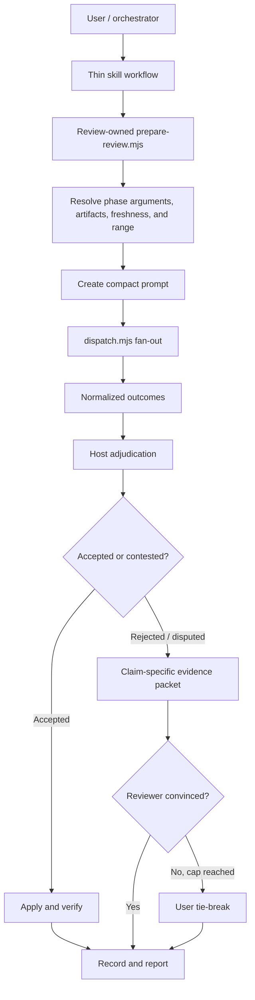

# Dispatch Skills Efficiency Proposal

Date: 2026-09-16

## Executive recommendation

Refactor the suite around review-owned executable preparation, generic `dispatch` fan-out, and short semantic `SKILL.md` workflows.

The current design has strong safety properties, but the host agent repeatedly interprets mechanics that scripts already know or could know: argument classification, artifact pairing, round detection, fan-out, reserve substitution, prompt filling, consensus state, and cleanup. This creates token cost, branching variance, and a large user-facing configuration surface.

Prioritize these changes:

1. Add stable finding IDs and delegate severity to the shared resolution-log schema.
2. Preserve consensus as an adversarial evidence debate, but send claim-specific rebuttal packets instead of replaying a broad review.
3. Preserve exact tool-turn budgets, compute them mechanically, and pre-authorize bounded evidence-backed headroom.
4. Measure those consensus-path changes before expanding scope.
5. If measurements support it, replace both full-review prompts in place with compact findings-only JSONL contracts.
6. Add review-owned preparation and generic fan-out only when Phase 1 measurements justify their added code surface.
7. Preserve phase/level provider matrices and whole-file replacement; make the effective flow easier to inspect.

This should preserve the suite's important guarantees: delegates remain read-only, claims require evidence, the host adjudicates findings, implementation requires approval, edits are verified, and configuration/integrity failures remain explicit.

**Implementation boundary:** Phase 1 is ready and is the only committed scope. Each later phase is a separate go/no-go decision after the preceding measurements; a failed Phase 2 prompt experiment retains the Phase 1 prompts and does not by itself forbid separately justified fan-out or preparation work.

## Measured baseline

Word counts are a stable instruction-load proxy rather than exact model token counts.

| Surface | Words |
|---|---:|
| `dispatch/SKILL.md` | 1,266 |
| `dispatch/references/alignment.md` | 2,045 |
| `dispatch/references/providers.md` | 1,217 |
| `dispatch-plan-review/SKILL.md` | 995 |
| Plan-review delegate prompt | 928 |
| Plan template | 206 |
| `dispatch-code-review/SKILL.md` | 1,329 |
| Code-review delegate prompt | 1,032 |
| Walkthrough template | 142 |
| `implement-dispatch/SKILL.md` | 1,776 |
| **Total reviewed instruction surface** | **10,936** |

The four entry-point skills alone contain **5,366 words**. A normal `implement-dispatch` run can expose the entry points, `alignment.md`, both prompts, and both templates: approximately **9,719 words before the plan, walkthrough, repository instructions, source context, or delegate output**. A fallback path that also reads `providers.md` reaches the full 10,936-word surface.

Prompt multiplication is more important than entry-point size. The shipped review caps allow these maximum review slots:

| Level | Plan slots | Code slots | Total slots | Base prompt words |
|---|---:|---:|---:|---:|
| `low` | 0 | 1 | 1 | 1,032 |
| `medium` | 2 x 1 | 3 x 2 | 8 | 8,048 |
| `high` | 3 x 2 | 3 x 3 | 15 | 14,856 |
| `xhigh` | 3 x 3 | 3 x 4 | 21 | 20,736 |
| `max` | 5 x 5 | 5 x 5 | 50 | 49,000 |

These are ceilings and target affinity can reduce later waves, but they exclude artifacts, repository reads, reasoning, and output. Repeated review prompts are therefore the dominant avoidable token cost.

## What is working well

Retain these design choices:

- **Read-only delegation:** provider runners enforce a structural boundary rather than relying only on prompt wording.
- **Claims are not verdicts:** neither delegate nor orchestrator is presumed correct; cited evidence and successful rebuttal drive consensus.
- **Fail-closed errors:** integrity, configuration, and membership failures are not converted into success-shaped fallbacks.
- **Single implementation approval:** the user sees the reviewed plan before code changes.
- **Explicit verification:** implementation and accepted code-review fixes rerun the repository's declared command.
- **Target affinity:** a recheck addresses only reviewers with live findings.
- **Scratch isolation:** logs and temporary prompts stay outside the repository.

The proposal simplifies how these guarantees are invoked; it does not weaken them.

## Main friction

### 1. Deterministic mechanics live in agent prose

The review skills ask the host model to perform algorithms:

- infer whether trailing prose is a path, requirement, summary, or focus;
- resolve and pair plan and walkthrough artifacts across three tiers;
- derive review rounds from Markdown headings;
- calculate changed scope;
- materialize prompt variables through a specific stdin/temp-file protocol;
- map target objects to CLI flags;
- launch targets in parallel and substitute reserves;
- translate outcomes into consensus statuses;
- place and rewrite resolution-log entries.

These are state transitions and parsing rules, not semantic judgment. Encoding them in `SKILL.md` spends tokens every run and makes correctness depend on the model following a long branch precisely.

### 2. Standalone and orchestrated modes duplicate control flow

`dispatch-plan-review` and `dispatch-code-review` each describe two products:

- a standalone command that resolves context, edits an artifact, and reports to the user;
- an orchestrated worker that accepts targets, suppresses user reporting, and returns state to `implement-dispatch`.

`implement-dispatch` then restates the orchestrated path. The result is three owners for review flow: the review skill, `alignment.md`, and the implementation skill.

### 3. Consensus debate pays too much context per rebuttal

Consensus is an epistemic safeguard, not a vote. The orchestrator can hallucinate its counter-evidence just as a reviewer can hallucinate a finding. Requiring the citing reviewer to accept the counter-reading or rebut it is therefore valuable; the user remains the tie-breaker when the agents cannot converge.

The efficiency problem is the payload, not the debate. A re-review can reload the full artifact, full review prompt, and broad axis contract when only one `[Rejected - pending confirmation]` or `[Disputed]` claim remains live. Target affinity narrows the reviewer set, but the prompt/context cost can still resemble a full review.

The consensus mechanism should remain. Its rebuttal path should carry only the live claim, original locus and severity, exact orchestrator counter-evidence, relevant changed excerpts, and a bounded request to confirm or rebut.

### 4. Provider policy is expressive but hard to inspect

The two configurations serve legitimate different roles:

- `dispatch/config.default.jsonc` defines standalone cascade membership and defaults.
- `implement-dispatch/config.default.jsonc` tunes review model and effort by phase and level, plus breadth, rounds, consensus, reserves, and implementation selection.

That distinction should remain because a low plan review, high code review, and standalone investigation may warrant different models and effort. Whole-file replacement should also remain: it makes the effective provider set explicit and prevents omitted providers from silently inheriting.

The friction is discoverability. Users must read a long schema and mentally resolve level inheritance, cross-config membership, exclusions, and candidate ordering. The CLI should explain the effective flow without changing replacement semantics.

### 5. Delegate prompts optimize for visible completeness, not useful output

The plan prompt requires seven clean/finding axis lines, a verdict, three severity sections, and a shorter-path summary. The code prompt similarly requires six axis lines, a verdict, three severity sections, and actionable next steps.

For clean reviews, nearly all output is scaffolding. For reviews with findings, "Actionable Next Steps" often repeats the required change already carried by every finding. Expanded axis prose also repeats concepts the tags and repository context already communicate.

### 6. Tool-turn budgets need mechanical calculation and bounded escalation

The exact `8 + 2 x units` budget gives a reviewer useful freedom: it can spend turns where evidence leads instead of following rigid per-file quotas. The friction is that the host calculates and transports the number, while a hard cap can cut off a concrete security, concurrency, migration, or lifecycle risk discovered late.

Keep the numeric budget, compute it in the flow tooling, and let the reviewer allocate it freely. Pre-authorize bounded evidence-backed **budget headroom** that the dispatched reviewer may activate during the same run without waiting for the orchestrator. "Headroom" avoids collision with provider **reserves**, which remain substitute targets. Timeout and output caps remain defense-in-depth controls rather than substitutes for tool turns.

### 7. Artifact freshness is inferred from prose

The stale-plan guard compares a requirement with plan content. The stale-walkthrough guard compares `## Changes Made` with a diff. Re-review scope is reconstructed from Markdown headings.

These checks cost host reasoning and remain ambiguous because artifacts do not record a reviewed base SHA, worktree fingerprint, or plan content hash.

### 8. The clean-tree code-review fallback is surprising

The delegate prompt reviews `HEAD~1` when the merge-base equals `HEAD`. On a clean base branch, `/dispatch-code-review` can therefore review the latest commit even though the user did not select it. A "current changes" command should report that no diff exists or require an explicit range rather than silently changing scope.

### 9. Progressive disclosure is too coarse

`alignment.md` combines artifact resolution, invocation modes, target mapping, reserve substitution, prompt transport, adjudication, logging, reporting, and lifecycle. A consumer needing one section commonly loads a 2,045-word monolith.

`dispatch/SKILL.md` also caches detailed configuration semantics already exposed by `config.default.jsonc`. Its complete flag table is intentional duplication enforced by parity tests; optimize the descriptions around it rather than removing it.

## Proposed target architecture



### Ownership

| Concern | Owner |
|---|---|
| Requirement interpretation, plan authoring, finding verification, edits, user decisions | Host agent |
| Finding IDs, severity, sources, finality, and resolution-log grammar | Shared alignment contract |
| Phase-specific argument parsing, freshness, round state, and prompt creation | Each review skill's `scripts/prepare-review.mjs` |
| Generic artifact and template primitives | Shared helpers, currently under `dispatch/scripts` |
| Review policy, resolved targets, and ordered provider reserves | `implement-dispatch` / calling review skill |
| Data-driven fan-out, supplied-reserve execution, provider fallback, normalized result envelope | `dispatch.mjs` |
| Review breadth, rounds, consensus, and model/effort by phase and level | `implement-dispatch` configuration |
| Review criteria and delegate output schema | Compact kind-specific prompt |
| Provider installation and diagnostics | CLI `--doctor`/`--help` plus provider-specific references |

## Detailed proposals

### P0: Establish a stable finding schema

Change the shared resolution-log entry syntax before introducing compact prompts or rebuttal packets:

```markdown
- **[<status>]** [R<round>-F<sequence>] [<severity>] [sources=<source-id>[,<source-id>...]] <locus> — <tag>: <defect> → <resolution>
```

- The host assigns the deterministic ID when appending a finding, for example `R1-F003`; delegates do not invent IDs.
- Every launched orchestrated target receives a stable `sourceId` from `resolve-flow.mjs` in the form `<phase>:<platform>:<configured-candidate-index>`; its target object retains the resolved model and effort. A fallback result retains the failed target ID with a `fallback:` prefix; a substituted provider reserve uses the reserve's ID.
- Deduplicated findings retain every citing `sourceId`, which makes target-affinity rebuttals mechanical even when one platform contributes multiple candidates.
- Severity is required and preserved across status rewrites: `MUST`, `SHOULD`, or `CONSIDER`.
- Delegate output vocabulary maps directly to existing finality terms: `MUST` -> `MUST-FIX`, `SHOULD` -> `SHOULD-FIX`, and `CONSIDER` -> `CONSIDER`.
- Parsers also accept `ACTIONABLE` as a read-only legacy log severity for unresolved entries that predate severity recording. Delegates never emit it; finality treats it like `MUST-FIX`/`SHOULD-FIX`, so it remains consensus-bound and is never silently downgraded.
- IDs remain stable when `[Rejected - pending confirmation]` becomes `[Rejected / Downgraded]` or `[Resolved Dispute]`.
- Keep the status immediately after the list marker so existing fail-closed detection remains structurally compatible.
- Immediately below each round heading, record a source map from every `sourceId` to provider, candidate index, effective model/effort, fallback/substitution status, and session handle. This preserves target affinity if configuration changes before a later round.

Update `alignment.md`, `resolve-flow.mjs`, both review skills, walkthrough/plan examples, and `check-consensus.mjs`. Add `check-consensus.mjs --json` output containing `id`, `severity`, `sourceIds`, `status`, `lineNumber`, and `originalLine`. Do not parse arbitrary defect/resolution prose back into fields; the fixed prefix is machine state and the original line is the durable human claim. Extend tests for new entries, legacy entries, status rewrites, duplicate text with distinct IDs, multi-source findings, delimiter characters inside prose, and fenced examples.

`check-consensus.mjs` remains read-only and preserves exit codes `0` settled, `1` unsettled, and `2` invalid input in JSON mode. For a legacy unsettled entry without ID/source/severity, JSON output returns `id: null`, `sourceIds` derived coarsely from the round heading when possible, `severity: "ACTIONABLE"`, and its line number. Before dispatching a rebuttal, the orchestrator rewrites those live legacy entries with durable IDs and sources, then reruns `--json`. When exact source recovery is impossible, target affinity falls back to every reviewer named by that round rather than guessing one.

Regenerate all affected skill hashes.

### P1: Mechanize preparation inside each review skill

Create two cohesive entry points:

```text
node dispatch-plan-review/scripts/prepare-review.mjs \
  --request <json-file|->

node dispatch-code-review/scripts/prepare-review.mjs \
  --request <json-file|->
```

Each script should:

1. accept free text, paths, scope, mode, and either a standalone selector or caller-resolved targets through JSON stdin/file input, preserving the current cross-shell-safe transport;
2. validate its phase-specific inputs;
3. call shared generic helpers to resolve relevant artifacts;
4. record or compare freshness metadata;
5. derive first-review, re-review, or rebuttal scope;
6. fill its own compact prompt;
7. return a preparation manifest containing artifact paths, prompt path, scope, resolved dispatch arguments, budget/headroom, and cleanup paths.

The preparation script does not wait for delegate reports. The host uses its manifest to launch one `dispatch` command in the background and yields, preserving the current lifecycle. On completion, report fields remain untrusted and are sanitized under `alignment.md` § Delegate Text Sanitization before logging or relay.

Each new script must call `verifySkillIntegrity` before processing input, remain compatible with the skill runtime's Node 18+ baseline, and have direct CLI/unit tests. `npm run hashes` must include it in the owning review skill's manifest; verify `.husky/pre-commit` still matches the new `scripts/` paths.

Expected effect:

- reduce each review `SKILL.md` to approximately 350-500 words;
- remove most of `alignment.md`'s resolution, prompt-filling, target-mapping, and lifecycle sections;
- make standalone and orchestrated modes data flags in their owning review skill rather than separate prose workflows;
- enable direct integration tests for every branch now interpreted by the model.

### P1: Make `dispatch` own fan-out

Support selectors directly:

```text
dispatch --targets claude,copilot
dispatch --targets 2
dispatch --targets all
dispatch --targets-file /tmp/resolved-review-targets.json
```

`--targets-file` accepts:

```json
{
  "targets": [
    {
      "sourceId": "code-review:claude:0",
      "platform": "claude",
      "model": "claude-opus-5",
      "effort": "low"
    }
  ],
  "reserves": []
}
```

Require a 64 KiB maximum file, at least one target, unique `sourceId` values, and configured platform membership. Each entry uses either `candidateIndex` or explicit `model`/`effort`, never both. Reject unknown fields, malformed values, duplicate target tuples, and combinations of `--targets-file` with `--provider`, `--candidate-index`, `--model`, `--effort`, or `--targets`. Parse data and spawn commands through argument arrays; never evaluate shell text. Keep the target file in OS temp and remove it after the wave. Preserve input order in the result envelope and echo `sourceId` on every success, failure, fallback, and substitution record.

Return one machine-readable envelope:

```json
{
  "targets": [
    {
      "platform": "claude",
      "candidateIndex": 0,
      "status": "ok",
      "session": "claude:...",
      "report": "..."
    }
  ],
  "failures": [],
  "logDir": "/tmp/..."
}
```

For standalone calls, `--targets <selector>` resolves candidates only from `dispatch`'s own effective config. For orchestrated calls, `--targets-file` receives a fully resolved JSON object containing ordered `targets` and `reserves` from `resolve-flow.mjs`; `dispatch` executes that data but never reads `implement-dispatch` configuration or decides review policy. Same-platform fallback and supplied-reserve behavior remain the shared alignment contract.

This eliminates host-managed process fan-out while preserving the dependency invariant. The existing single-target behavior remains compatible. Add both flags to `--help`, `SKILL.md`, and `README.md` together so flag-parity tests remain authoritative.

### P0: Make consensus rebuttals claim-specific

Preserve the existing finality model:

- `[Rejected - pending confirmation]` means the orchestrator's counter-reading is itself an unverified claim.
- The citing reviewer must accept that counter-evidence or rebut it.
- `[Disputed]` remains live when evidence cannot settle intent or a deliberate trade-off.
- `check-consensus.mjs`, target affinity, round caps, and user tie-breaking remain workflow gates.

Change the re-review payload. Send packets only for statuses that `check-consensus.mjs` treats as unsettled: `[Rejected - pending confirmation]` and `[Disputed]`. A downgrade of a delegate-reported MUST/SHOULD remains represented by `[Rejected - pending confirmation]` until confirmed.

```text
Finding ID and original severity
Original claim and exact locus
Orchestrator verdict
Exact counter-evidence with cited locus
Relevant artifact/code excerpt or changed lines
Request: CONFIRM, REBUT with evidence, or mark INTENT-DISPUTE
```

Do not replay clean axes, closed findings, unrelated artifact sections, or the full first-round brief. Accepted fixes may receive a separate targeted resolution check, but they do not enter the rejection debate.

At the configured cap, present the surviving claim, reviewer rebuttal, and orchestrator counter-evidence to the user. The user's ruling remains final. This retains the safeguard against orchestrator hallucination while reducing the cost of each debate turn.

Build packets from `check-consensus.mjs --json`; do not rediscover IDs or severity from prose. A rebuttal reviewer returns `CONFIRM`, `REBUT` with a cited locus, or `INTENT-DISPUTE` for each supplied ID.

Add `references/rebuttal-template.md` to each review skill. Extend the orchestrated handover with:

```text
Review Mode: rebuttal
Finding Packet Path: <OS-temp JSON path>
Review Scope: the supplied finding IDs only
Tool Turn Budget: soft=<n>; headroom=<n>; hard=<n>
```

Plan rebuttal template variables are `Plan Path`, `Finding Packet Path`, `Review Scope`, and `Tool Turn Budget`. Code rebuttal variables are `Walkthrough Path`, `Plan Path`, `Finding Packet Path`, `Review Scope`, and `Tool Turn Budget`. The JSON packet contains each finding's ID, severity, source IDs, original resolution-log line, orchestrator verdict, cited counter-evidence, and relevant changed excerpts. Attach the packet from OS temp and remove it with the filled prompt after the dispatch settles.

Return one JSON object per supplied ID:

```json
{"type":"rebuttal","id":"R1-F003","verdict":"CONFIRM|REBUT|INTENT-DISPUTE","evidence":"<cited explanation>"}
```

Precede replies with the same budget summary record defined for compact full reviews below. Reject missing/duplicate/unknown IDs and malformed verdicts. Group live findings by `sourceId`, so each citing reviewer receives only its own claims.

For a deduplicated finding with multiple sources, `[Rejected - pending confirmation]` closes only after every reachable citing source returns `CONFIRM`. Any `REBUT` keeps it live; any `INTENT-DISPUTE` converts it to `[Disputed]`. A source that cannot be resumed or redispatched follows the existing fallback path; if no reviewer can test the counter-evidence before the cap, present the missing confirmation explicitly to the user rather than treating silence as agreement.

### P1: Shrink delegate output to findings only

After Phase 1 measurements, replace both prompt templates in place; do not add a prompt-variant config flag. Regenerate hashes in the same change. Use a compact JSONL contract:

```text
Inspect only the supplied scope and its direct contracts.
Return JSON Lines. First emit exactly one summary:
{"type":"summary","status":"CLEAN|FINDINGS","headroomUsed":0}

Then, only when status is FINDINGS, emit one object per finding:
{"type":"finding","severity":"MUST|SHOULD|CONSIDER","locus":"<file/section>","tag":"<tag>","defect":"<defect>","requiredChange":"<required change>"}

Every finding requires a verifiable locus. Omit praise, clean-axis summaries,
verdicts, repeated next steps, and findings outside scope.
```

When headroom is activated, the summary also requires `headroomLocus`, `headroomEvidence`, and `headroomChecks`; the normal run does not emit a separate budget block. JSON escaping is authoritative; no custom delimiter escaping is required. The host validates record order and required fields, assigns a finding ID, and treats malformed or uncited lines as unverifiable claims rather than guessing their structure.

Keep `fill-template.mjs`'s declared-variable mechanism. The plan template retains `Plan Path`, `Requirement`, `User Focus Areas`, `Review Scope`, and `Tool Turn Budget`; the code template retains `Task Summary`, `Walkthrough Path`, `Plan Path`, `User Focus Areas`, `Review Scope`, and `Tool Turn Budget`. Encode the three budget values in the existing variable as `soft=<n>; headroom=<n>; hard=<n>` rather than adding three more variables.

Update `tests/integration/review-skill-parity.test.mjs` in the same change:

- replace the pipe-grammar assertion with JSONL field/schema parity;
- replace required report-skeleton headings with summary/finding JSONL schema assertions;
- retain and adapt re-review-scope and blast-radius assertions;
- update the budget assertion for the structured `Tool Turn Budget` value;
- retain the exact declared-variable arrays above and `fill-template.mjs`'s variable-block/integrity coverage.

Keep concise phase-specific checks:

- **Plan:** intent, domain invariants, architecture, trust boundaries, compatibility, verification, simpler path.
- **Code:** correctness, security/resources, compatibility, simplicity, tests/UX.

The existing six/seven-axis taxonomies can remain in a disclosed review rubric for maintainers or high-risk focused reviews. The default prompt should recruit those concepts with leading words rather than explain every subcase.

Target:

- plan prompt: 928 words to <=350;
- code prompt: 1,032 words to <=400;
- clean output: exactly one compact summary JSON object;
- remove `Axis Coverage`, duplicate `Verdict`, and duplicate next-step sections.

### P1: Simplify invocation grammar

Shape-based natural-language parsing is ambiguous. Preserve the short default command, but add explicit options:

```text
/dispatch-plan-review [plan.md] [--requirement "..."] [--focus "..."]
/dispatch-code-review [walkthrough.md] [--summary "..."] [--focus "..."] [--range "..."]
```

Rules:

- existing `(<pins>)` syntax remains the only user-facing reviewer selector; review skills translate it to internal target data, and `implement-dispatch (<pins>)` continues to pass pins into `resolve-flow.mjs`;
- an existing `.md` token can still be recognized as the artifact for convenience;
- all other trailing prose is the focus by default;
- authoring from a requirement requires `--requirement`;
- code intent requires `--summary`;
- during one compatibility release, a clean base-branch tree retains the implicit `HEAD~1` review but emits `Implicit HEAD~1 review is deprecated; pass --range HEAD~1..HEAD`; the following release returns "No reviewable changes" unless `--range` is supplied.

This trades a little syntax for predictable behavior and eliminates stale-artifact questions caused by misclassified prose.

### P1: Store machine-readable artifact metadata

Add compact frontmatter to the existing plan/walkthrough artifact:

```yaml
dispatch:
  kind: code
  slug: auth-v2
  baseSha: abc123
  headSha: def456
  worktreeHash: sha256:...
  contentHash: sha256:...
  sectionHashes:
    Proposed Changes: sha256:...
  pathHashes:
    src/auth.ts: sha256:...
  reviewedAt: 2026-09-16T10:00:00Z
```

Use it to:

- detect whether a plan changed since review;
- detect whether a walkthrough describes the current diff;
- derive changed files/sections for a recheck;
- prevent accidental reuse across unrelated work on the same branch slug.

Frontmatter is the only persistent metadata location; sidecars would violate the repository's `.scratch/` allowlist. For plans, hash the semantic body and each H2 section independently, excluding frontmatter and `## Review Findings & Resolutions`; compare `sectionHashes` to derive changed review scope. For walkthroughs, store the review range (`baseSha`, `headSha`), a `pathHashes` entry for each reviewed path, and an aggregate SHA-256 fingerprint over the sorted changed-path list plus staged/unstaged diff bytes and eligible untracked text-file bytes, excluding `.scratch/`, generated, vendored, and binary files under the same rules as code review. Compare path maps to derive changed code scope.

Legacy artifacts without metadata remain supported: run the existing semantic stale guard and `### Round` counting, then add frontmatter after the review succeeds. Missing metadata alone never fails closed. Once metadata exists, it is authoritative; retain the prose guard only as a human-readable cross-check.

Consensus status rewrites and appended entries under `## Review Findings & Resolutions` are excluded from the semantic body hash. Accepted edits to substantive plan sections intentionally change the hash and therefore trigger freshness handling.

### P1: Make `implement-dispatch` policy-only

Keep the host-visible workflow to six steps:

1. define success criteria and clarify decisions;
2. author plan;
3. optionally review plan;
4. present one approval gate;
5. implement and verify;
6. optionally review code, apply accepted fixes, verify, and hand off.

Keep scope/level classification with the host after the draft plan exists. Do not mechanize requirement interpretation. Preserve `resolve-flow.mjs`'s required orchestrator inputs and existing option names:

```text
resolve-flow.mjs --platform <key> [--orchestrator-model <model>] \
  [--level <level>] [--pins <selector>] [--exclude <keys>]
```

Preserve its existing kebab-case output keys and extend them only compatibly:

```json
{
  "plan-review": { "maxRounds": 2, "targets": [] },
  "implementation": { "platform": "copilot", "model": "..." },
  "code-review": { "maxRounds": 3, "targets": [] }
}
```

The skill can collapse duplicated prose around initial/final resolution, but it still classifies the initial plan, calls the resolver with that level, reclassifies after accepted plan changes, and re-resolves immediately before approval only when the level or exclusions changed. Update `resolve-flow-cli.test.mjs` and `resolve-flow.test.mjs` for any additive flags or fields without renaming the existing interface.

### P1: Make configuration inspectable without changing its semantics

Keep both matrices and their current responsibilities:

- standalone candidate defaults remain in `dispatch`;
- plan-review, implementation, and code-review model/effort remain tunable by level in `implement-dispatch`;
- override files continue to replace the selected default file wholly rather than merge.

Whole-file replacement is clearer and less error-prone for provider policy because the effective set is explicit. Improve usability with:

1. a shorter annotated example for one provider, one candidate array, and one level override;
2. schema validation that names the exact phase/platform/level path;
3. `resolve-flow.mjs --show-effective`, reporting the selected config path, requested/effective level, inherited level key, candidate order, model, effort, exclusions, reserves, and cross-config membership;
4. `dispatch.mjs --show-effective`, reporting standalone membership and candidate order;
5. documentation that explicitly explains why standalone defaults may differ from implementation-review policy.

Do not add partial merging or move phase/level model selection into `dispatch`.

### P1: Keep exact budgets with self-authorized headroom

Retain the current formula and adaptive allocation:

```text
initial tool turns = 8 + 2 x units under review
```

Move calculation into `resolve-flow.mjs` or the owning review preparation script so the host passes resolved numbers rather than performing arithmetic. Give a full reviewer a soft budget and pre-authorized headroom:

```text
soft budget = 8 + 2 x units under review
headroom = min(ceil(soft budget / 2), 8)
hard ceiling = soft budget + headroom
```

The reviewer may spend the soft budget anywhere within the declared blast radius and may stop early. When concrete in-scope evidence reveals an unresolved risk near the soft limit, it may activate headroom unilaterally during the same dispatch. It must spend headroom only on that named risk. During Phase 1's existing report format, append:

```text
BUDGET_HEADROOM_USED
Locus: <file/section>
Evidence at activation: <specific evidence>
Checks completed with headroom: <specific checks>
Headroom turns used: <n>
```

After Phase 2, carry the same fields in the compact JSONL summary record. No host round-trip or restarted dispatch is required. The hard ceiling remains fixed before launch.

A consensus rebuttal uses:

```text
soft budget = 4 + 2 x live claim IDs
headroom = min(ceil(soft budget / 2), 4)
hard ceiling = soft budget + headroom
```

The one additional post-ruling wave allowed by the current ruling-reset contract receives a fresh rebuttal soft budget and headroom. Record soft budget, headroom available, activation, reason, and turns used in diagnostics. Keep wall-clock timeout and output caps as separate runaway controls.

For the first implementation phase, extend `resolve-flow.mjs` additively with `--budget-kind full|rebuttal` and `--budget-units <n>`. Keep `--platform` required and preserve all existing output keys; when both budget flags are present, add:

```json
{
  "review-budget": {
    "kind": "full",
    "units": 3,
    "soft": 14,
    "headroom": 7,
    "hard": 21
  }
}
```

The caller still supplies the deterministic unit count; `resolve-flow.mjs` owns the arithmetic and validation. Standalone review keeps the prompt's self-calculated default until its Phase 4 preparation script can derive units and compute the same values mechanically. The caller formats the resolved object into the existing `<Tool Turn Budget>` variable.

### P2: Split provider reference by trigger

Defer this split until Phase 1 measurements show that provider-reference loading is a material cost on actual failure paths.

Keep `providers.md` as a short index and disclose:

- `providers/claude.md`
- `providers/agy.md`
- `providers/copilot.md`
- `providers/opencode.md`
- `providers/fallback.md`

Normal `dispatch` runs need none of them. A provider-specific failure loads only its provider page plus the fallback contract. Keep shared credential stripping, read-only guarantees, and terminal error classes in the main runner contract.

### P2: Remove environment caches from skill instructions

Delete or replace with pointers:

- repetitive explanations surrounding the runner flag tables; keep the complete tables in `dispatch/SKILL.md` and `README.md` because `flag-parity.test.mjs` requires both to mirror `--help`;
- detailed config schema prose -> `config.default.jsonc` plus the owning CLI's `--show-effective`;
- exact resolver output shape -> `resolve-artifact-paths.mjs --help` or `--json-schema`;
- prompt transport examples for POSIX and PowerShell -> hidden implementation inside each review skill's preparation script;
- maintainer-facing integrity and test details -> maintainer notes only.

`SKILL.md` should contain actions, completion criteria, and the concise flag reference required by parity tests.

### P2: Add one user-facing diagnostic command

Provide:

```text
dispatch --doctor
```

It should report:

- effective config path;
- configured candidates in actual order;
- provider binary/mode reachability;
- sandbox support;
- authentication/quota status when safely detectable;
- suggested corrective command.

`dispatch --doctor` remains strictly standalone/provider-scoped and never reads downstream skill configuration. Cross-config review membership and implementation-flow mismatches belong only to `resolve-flow.mjs --show-effective`. This preserves `dispatch -> (nothing)` and the dependency-direction test. Add `--doctor` to CLI help and both flag tables in the same change.

Every diagnosed failure should emit at least one concrete corrective command when remediation is known. This is the user-facing acceptance criterion for "more user friendly."

## Skill-by-skill target

### `dispatch`

Target role: one bounded read-only delegation command.

Keep in `SKILL.md`:

- when independent context is useful;
- read-only and untrusted-report contract;
- one basic invocation;
- launch/yield/relay workflow;
- terminal versus fallback distinction.

Move out:

- repetitive prose around the required option table;
- candidate selection algorithm;
- target fan-out mapping;
- detailed config semantics;
- provider discovery and recovery.

Target size: **450-600 words**.

### `dispatch-plan-review`

Target role: review or author one plan, then adjudicate findings.

Keep:

- explicit invocation examples;
- semantic ground truth: requirement, repo rules, cited code/plan section;
- accepted changes update the plan body;
- one approval-neutral user report.

Move to `dispatch-plan-review/scripts/prepare-review.mjs`:

- trailing-argument classification;
- artifact resolver branches;
- round derivation;
- template filling;
- target mapping and cleanup.

Target size: **350-450 words**.

### `dispatch-code-review`

Target role: review a selected diff, verify claims, apply safe accepted fixes in standalone mode.

Keep:

- diff is authoritative;
- every finding requires a cited changed line or direct contract locus;
- standalone applies accepted safe fixes and verifies;
- orchestrated returns adjudications without editing.

Move to `dispatch-code-review/scripts/prepare-review.mjs`:

- plan/walkthrough pairing;
- stale guard;
- clean-tree range selection;
- baseline walkthrough generation;
- recheck scope and prompt filling.

Target size: **400-550 words**.

### `implement-dispatch`

Target role: approval-gated implementation with optional plan and code review.

Keep:

- success criteria and clarification;
- plan authoring;
- one approval gate;
- implementation and verification;
- evidence-first review/fix/recheck;
- handoff.

Remove:

- initial versus final duplicated scope steps;
- duplicated restatement of the full reserve/consensus contract (retain the shared contract);
- prose-level target-exclusion bookkeeping (retain the behavior in executable flow state);
- duplicated diagnostics list that scripts can emit.

Keep the per-wave `check-consensus.mjs` gate and user tie-break because they protect against both reviewer and orchestrator error.

Target size: **650-850 words**.

## User experience proposal

### Simple path

```text
/dispatch Trace the cache invalidation path
/dispatch-plan-review .scratch/plan/cache-v2.md
/dispatch-code-review --focus "authorization and tenant isolation"
/implement-dispatch Add CSV export to the transactions table
```

### Explicit path

```text
/dispatch (2) Trace the cache invalidation path
/dispatch-plan-review --requirement "Replace Redis pubsub" --focus "rollback"
/dispatch-code-review --range origin/main...HEAD --focus "migration compatibility"
/implement-dispatch high (claude,copilot): Refactor webhook idempotency
```

### Predictable outcomes

- no current diff -> during the compatibility release, warn with the exact implicit `HEAD~1` range; afterward, "No reviewable changes; pass `--range` to review committed work";
- missing plan with no requirement -> ask for a path or `--requirement`;
- stale metadata -> state the mismatched SHA/hash and offer reuse or new artifact;
- provider failure -> one normalized diagnostic with attempted target and corrective action;
- clean review -> `CLEAN`, recorded without verbose axis boilerplate;
- genuine intent dispute -> one focused user decision.

## Migration plan

### Phase 1: Cut consensus-wave context and mechanize budgets

1. Add finding IDs and severity to the shared resolution-log grammar.
2. Add stable `sourceId` values to `resolve-flow.mjs` targets/reserves and preserve them through fallback diagnostics.
3. Extend `check-consensus.mjs` with backward-compatible parsing and `--json`.
4. Add review-owned claim-specific rebuttal templates for `[Rejected - pending confirmation]` and `[Disputed]` IDs, plus `Review Mode`/`Finding Packet Path` handover fields.
5. Add the optional `resolve-flow.mjs` budget flags/output and pass `soft/headroom/hard` through the existing `Tool Turn Budget` variable.
6. Update `implement-dispatch` and both review skills to build, route, validate, and clean up per-source rebuttal packets while preserving reviewer confirmation, round caps, and user tie-breaking.
7. Measure rebuttal convergence, rebuttal payload size, and tool-turn use.

Phase 1 touches `alignment.md`, `implement-dispatch/SKILL.md`, both review `SKILL.md` files, both new `references/rebuttal-template.md` files, `resolve-flow.mjs`, `check-consensus.mjs`, their targeted tests, parity tests, and manifests. Deliver with:

- 100% fixture parity for existing settled/unsettled outcomes, including legacy entries;
- `check-consensus --json` returning all and only `[Rejected - pending confirmation]`/`[Disputed]` entries with stable IDs, severity, and sources;
- each rebuttal template at <=250 words before substituted evidence;
- packet routing tests proving every live ID reaches all and only its citing sources;
- exact budget/headroom formula and hard-ceiling tests;
- no increase in review rounds or user escalations across the consensus fixture corpus.

Run `npm run hashes` and `npm test`. This is the committed first implementation scope.

### Phase 2: Compact the full-review prompts

Proceed only after Phase 1 measurements establish a useful baseline.

1. Replace both full-review prompt templates in place with the compact JSONL contract.
2. Preserve the declared-variable sets and structured `Tool Turn Budget` transport.
3. Update every affected review-skill-parity assertion listed in P0.
4. Compare the compact prompts with the Phase 1 prompts on a fixed corpus containing clean reviews, accepted defects, refuted defects, multi-source duplicates, and scoped re-reviews.
5. Regenerate hashes and run targeted parity/fill-template tests plus `npm test`.

Advance only when both prompts meet their word targets, retain every baseline accepted finding on the corpus, introduce no additional accepted false positive after host adjudication, and preserve exact scope/finality behavior. Otherwise retain the Phase 1 full-review prompts.

### Phase 3: Centralize fan-out and configuration

Proceed only when measured host fan-out overhead justifies the new CLI surface.

1. Add `dispatch --targets` for standalone selection and `--targets-file` for caller-resolved targets/reserves.
2. Preserve phase/level provider matrices and whole-file replacement.
3. Add `--show-effective` to `dispatch.mjs` and `resolve-flow.mjs`.
4. Improve schema diagnostics and explain standalone-versus-workflow model policy.

### Phase 4: Mechanize review setup

Proceed only after Phase 3 is stable and measured host setup errors/context cost justify two new runtime scripts.

1. Add `dispatch-plan-review/scripts/prepare-review.mjs` and golden tests for every plan input branch.
2. Add `dispatch-code-review/scripts/prepare-review.mjs`, including explicit range and freshness metadata.
3. Accept request data through JSON stdin/file input and return preparation manifests only.
4. Add top-of-process integrity gates, Node 18 compatibility tests, and legacy artifact fallback coverage.
5. Share only generic artifact, template, and invocation helpers.
6. Remove prompt-filling and artifact-resolution mechanics from the two review skills.
7. Regenerate review-skill hashes and verify `.husky/pre-commit` still matches both new script paths.

Deliver Phases 3-4 with targeted dispatch/config, dependency-direction, path-convention, flag-parity, review-skill-parity, integrity, and new preparation-script tests, then run `npm test`.

### Phase 5: Prune and disclose

1. Rewrite the four `SKILL.md` files to their target roles.
2. Reduce `alignment.md` to a short adjudication/logging contract or replace it with focused references.
3. Split provider references by trigger only if post-Phase-1 measurement shows material normal-path or failure-path savings.
4. Add `dispatch --doctor`; keep cross-config diagnostics in `resolve-flow.mjs --show-effective`.
5. Deprecate implicit clean-base `HEAD~1` review for one release with a corrective `--range` command before removing it.
6. Update all links, anchors, README flag tables, and parity expectations in the same changes.

Deliver with link-integrity, review-skill-parity, flag-parity, dependency-direction, and instruction-budget tests, then run `npm test`.

## Rollback and compatibility

- Land each phase independently; do not combine Phase 1 with the conditional runtime/CLI work.
- Phase 1 readers accept both legacy and enriched resolution lines. New lines keep the existing status prefix, so reverting structured output does not hide unsettled findings from the current checker.
- Phase 2 changes only prompt/template contracts and their parity tests; rollback restores the prior templates and regenerates hashes.
- Phase 3 flags are additive and mutually exclusive with existing single-target flags; existing invocations remain unchanged.
- Phase 4 preparation scripts are additive until their `SKILL.md` callers switch over. Rollback restores the prose path without changing artifact contents.
- Frontmatter adoption is write-on-success and legacy-readable. Removing metadata falls back to the existing semantic guards; no source artifact is made unreadable.
- Whole-file configuration precedence, provider membership, model/effort defaults, and existing pin grammar do not migrate.

## Out of scope

- Removing or weakening consensus, reviewer confirmation, round caps, or the user tie-break.
- Merging configuration tiers or eliminating phase/level model and effort controls.
- Changing provider defaults, credentials, sandbox posture, or read-only boundaries.
- Adding external runtime dependencies.
- Implementing all five phases as one change; only Phase 1 is currently committed.

## Acceptance metrics

Set measurable completion criteria:

| Metric | Current | Target |
|---|---:|---:|
| Four entry-point `SKILL.md` files | 5,366 words | <=2,450 words |
| Normal implementation instruction path | ~9,719 words | <=4,000 words |
| Shared alignment loaded on the normal path | 2,045 words | <=450 words |
| Plan delegate base prompt | 928 words | <=350 words |
| Code delegate base prompt | 1,032 words | <=400 words |
| Consensus rebuttal payload | Broad review prompt/context | One live claim plus cited evidence |
| Clean delegate output | Verdict + 6/7 axes + sections | One summary JSON object |
| Phase/level model tuning | Full matrices, hard to inspect | Preserved matrices plus effective-flow output |
| Config override behavior | Whole-file replacement | Preserved and documented |
| Model-interpreted setup branches | Multiple across 3 documents | 2 cohesive tested preparation scripts |
| Tool-turn escalation | Hard formula only | Soft formula plus self-authorized evidence-backed headroom under a fixed ceiling |
| Clean-tree code-review scope | Implicit `HEAD~1` | Explicit no-diff or `--range` |
| Failure-path UX | Inconsistent troubleshooting prose | Every known failure emits a corrective command |

Make instruction-size targets executable in `tests/integration/instruction-budget.test.mjs` using a documented whitespace-word counter:

- entry-point total: the four `skills/*/SKILL.md` files named in the baseline;
- normal implementation path: those four entry points plus `dispatch/references/alignment.md`, both delegate prompt templates, and both artifact templates;
- prompt limits: each `references/prompt-template.md` independently.

READMEs and maintainer-only `references/notes.md` are excluded because they are not loaded on the normal agent execution path. Threshold changes require an explicit test update rather than silent drift.

Quality gates:

- every accepted finding still has a verifiable locus;
- orchestrator rejections of MUST-FIX/SHOULD-FIX findings remain pending until the citing reviewer confirms the counter-evidence or the user rules;
- claim-specific rebuttal packets preserve all evidence needed to challenge an orchestrator hallucination;
- read-only, credential stripping, sandbox, and integrity tests remain green;
- new skill scripts remain compatible with Node 18 even though repository test tooling requires Node 22;
- old invocations receive deterministic compatibility behavior or a corrective diagnostic;
- no success path hides provider, verification, or artifact failures.

## Review Findings & Resolutions

### Round 1 — Claude Code, 2026-09-16

- **[Accepted]** [R1-F001] [MUST] § P0: Establish a stable finding schema — coherence: rebuttal packets had no persistent finding identifier → added host-assigned stable IDs, backward-compatible log syntax, structured consensus output, and tests; the status prefix remains compatible, so implementation should change the regex only where structured parsing requires it.
- **[Accepted]** [R1-F002] [MUST] § P0: Establish a stable finding schema — state-machine: compact output did not persist delegate severity needed by finality rules → made severity mandatory in JSONL and resolution entries, preserved it across rewrites, and defined `ACTIONABLE` legacy behavior.
- **[Accepted]** [R1-F003] [MUST] § P1: Make `dispatch` own fan-out — architecture: generic fan-out risked pulling downstream reserve policy into `dispatch` → kept target/reserve resolution with callers and limited `dispatch` to standalone selectors or explicitly supplied target/reserve data.
- **[Accepted]** [R1-F004] [MUST] § P2: Add one user-facing diagnostic command — standards: cross-config diagnosis in `dispatch` violated `dispatch -> (nothing)` → scoped `dispatch --doctor` to standalone/provider diagnostics and kept workflow mismatch checks in `resolve-flow.mjs --show-effective`.
- **[Accepted]** [R1-F005] [MUST] § Migration plan, Phase 1 — spec-gap: no configuration surface existed for prompt variants → removed the flag and scheduled in-place prompt replacement with hash regeneration as a measured Phase 2 change.
- **[Accepted]** [R1-F006] [MUST] § P1: Mechanize preparation inside each review skill — blast-radius: new scripts lacked integrity and hook obligations → required top-of-process integrity checks, manifest regeneration, pre-commit pattern verification, direct tests, and Node 18 compatibility.
- **[Accepted]** [R1-F007] [MUST] § P1: Store machine-readable artifact metadata — migration: existing artifacts had no metadata path → committed to frontmatter with legacy prose/round fallback and post-success metadata adoption.
- **[Accepted]** [R1-F008] [SHOULD] § P1: Mechanize preparation inside each review skill — coherence: a preparation envelope containing reports conflicted with background launch/yield → changed scripts to return preparation manifests only; the host launches `dispatch` in the background.
- **[Accepted]** [R1-F009] [SHOULD] § P1: Mechanize preparation inside each review skill — security: free text in CLI arguments reintroduced shell quoting hazards → moved all request data to JSON stdin/file transport.
- **[Accepted]** [R1-F010] [SHOULD] § P1: Mechanize preparation inside each review skill — validation: normalized output did not restate delegate-text trust boundaries → made collected reports explicitly subject to shared sanitization before logging or relay.
- **[Accepted]** [R1-F011] [SHOULD] § P1: Keep exact budgets with self-authorized headroom — spec-gap: "reserve" collided with substitute provider reserves → renamed the tool-turn concept to budget headroom throughout the operational proposal.
- **[Accepted]** [R1-F012] [SHOULD] § P1: Keep exact budgets with self-authorized headroom — spec-gap: rebuttal budgeting and ruling reset were undefined → added claim-count formulas and restored fresh rebuttal budget/headroom for the one post-ruling wave.
- **[Accepted]** [R1-F013] [SHOULD] § P1: Simplify invocation grammar — compat: immediate removal of implicit `HEAD~1` review was breaking → added one release of deprecation diagnostics with an exact `--range` replacement.
- **[Accepted]** [R1-F014] [SHOULD] § P1: Simplify invocation grammar — coherence: `(<pins>)` and `--targets` competed as user syntax → retained `(<pins>)` as the skill grammar and restricted target flags to internal/direct CLI transport.
- **[Accepted]** [R1-F015] [SHOULD] § P1: Store machine-readable artifact metadata — standards: sidecars violated the scratch allowlist → committed to artifact frontmatter only.
- **[Accepted]** [R1-F016] [SHOULD] § Acceptance metrics — testability: word-count goals had no drift gate or measurement scope → added a named integration test, explicit file sets, counter semantics, and exclusions.
- **[Accepted]** [R1-F017] [SHOULD] § Migration plan — blast-radius: documentation and CLI changes omitted existing integration guards → named parity, link, dependency, path, integrity, and full-suite checks in each phase.
- **[Accepted]** [R1-F018] [CONSIDER] § P2: Add one user-facing diagnostic command — standards: a `doctor` subcommand diverged from the flag-only CLI → changed it to `--doctor` and included flag-parity obligations.
- **[Accepted]** [R1-F019] [CONSIDER] § P1: Mechanize preparation inside each review skill — yagni: new runtime scripts could accidentally use Node 22-only APIs → added Node 18 compatibility as a quality gate.
- **[Accepted]** [R1-F020] [CONSIDER] § Acceptance metrics — traceability: "more user friendly" had no observable criterion → required known failure paths to emit a corrective command.
- **[Accepted]** [R1-F021] [CONSIDER] § P1: Shrink delegate output to findings only — edge-case: pipe-delimited prose had no escaping rule → switched findings to JSONL with standard JSON escaping.

### Round 2 — Claude Code, 2026-09-16

- **[Accepted]** [R2-F001] [MUST] § P2: Remove environment caches from skill instructions — coherence: removing the `dispatch/SKILL.md` flag table contradicted the fan-out change and existing parity guard → retained complete SKILL/README flag tables and limited pruning to surrounding prose.
- **[Accepted]** [R2-F002] [MUST] § P1: Shrink delegate output to findings only — testability: the compact contract invalidates several hard-coded parity assertions → enumerated replacement assertions, preserved `fill-template.mjs`'s declared-variable mechanism, and kept the existing variable sets by encoding `soft/headroom/hard` in `Tool Turn Budget`.
- **[Accepted]** [R2-F003] [MUST] § P1: Make `implement-dispatch` policy-only — coherence: the proposed resolver command/output dropped required orchestrator inputs and renamed stable keys → restored `--platform`, optional `--orchestrator-model`, existing flags, and kebab-case output keys; budget output is additive only.
- **[Accepted]** [R2-F004] [MUST] § P0: Make consensus rebuttals claim-specific — state-machine: packets included terminal `[Rejected / Downgraded]` findings → restricted packets to `[Rejected - pending confirmation]` and `[Disputed]`, exactly matching structured unsettled output.
- **[Accepted]** [R2-F005] [SHOULD] § P1: Make `implement-dispatch` policy-only — domain-logic: `--ask-file` would mechanize host-owned scope judgment → retained host classification after plan authoring and passed only the selected `--level` to the existing resolver.
- **[Accepted]** [R2-F006] [SHOULD] § P0: Establish a stable finding schema — validation: legacy `ACTIONABLE` severity lacked parser/finality semantics → defined it as read-only legacy vocabulary treated like MUST/SHOULD and prohibited delegates from emitting it.
- **[Accepted]** [R2-F007] [SHOULD] § P1: Shrink delegate output to findings only — coherence: compact `MUST`/`SHOULD` vocabulary did not map to existing `MUST-FIX`/`SHOULD-FIX` finality terms → added an explicit mapping.
- **[Accepted]** [R2-F008] [SHOULD] § Executive recommendation — traceability: preparation and fan-out were marked P0 despite being measurement-gated → relabelled both proposals P1.
- **[Accepted]** [R2-F009] [SHOULD] § Acceptance metrics — spec-gap: the normal-path total implied an unstated alignment reduction → added a <=450-word target for the normal-path shared alignment contract.
- **[Accepted]** [R2-F010] [CONSIDER] § P1: Store machine-readable artifact metadata — blast-radius: frontmatter changes affect hashed templates → added Phase 4 hash regeneration and pre-commit coverage.
- **[Accepted]** [R2-F011] [CONSIDER] § P1: Store machine-readable artifact metadata — edge-case: consensus rewrites could appear to stale the plan → explicitly excluded frontmatter and the resolutions log from semantic hashing while retaining substantive plan edits.
- **[Accepted]** [R2-F012] [CONSIDER] § P2: Split provider reference by trigger — yagni: splitting a small off-normal-path file may add more complexity than it saves → made the split conditional on post-Phase-1 measurement.

### Round 3 — GPT-5.6 Sol (host), 2026-09-16

- **Sources:** `host:gpt-5.6-sol` = host / GPT-5.6 Sol / direct repository review.
- **[Accepted]** [R3-F001] [MUST] [sources=host:gpt-5.6-sol] § P0: Establish a stable finding schema — traceability: target affinity lacked per-finding reviewer provenance → added stable source IDs to resolver outputs, resolution entries, structured consensus output, fallback/substitution records, and deduplicated findings.
- **[Accepted]** [R3-F002] [MUST] [sources=host:gpt-5.6-sol] § P0: Establish a stable finding schema — migration: legacy unsettled entries could not supply durable IDs or exact sources → defined read-only null-ID output, orchestrator migration before rebuttal, and conservative round-wide source fallback.
- **[Accepted]** [R3-F003] [MUST] [sources=host:gpt-5.6-sol] § P0: Make consensus rebuttals claim-specific — coherence: no concrete template, handover, packet, or response interface connected structured findings to reviewers → specified review-owned rebuttal templates, exact variables/handover fields, packet schema, per-ID JSON replies, validation, grouping, and temp cleanup.
- **[Accepted]** [R3-F004] [MUST] [sources=host:gpt-5.6-sol] § P1: Make `dispatch` own fan-out — security: `--targets-file` lacked an input schema and validation boundary → added the JSON shape, source IDs, exclusivity rules, membership/schema/size validation, argument-array spawning, ordering, and cleanup.
- **[Accepted]** [R3-F005] [SHOULD] [sources=host:gpt-5.6-sol] § P1: Store machine-readable artifact metadata — coherence: aggregate hashes detect staleness but cannot derive changed sections or paths → added per-section and per-path hashes with explicit comparison semantics.
- **[Accepted]** [R3-F006] [SHOULD] [sources=host:gpt-5.6-sol] § Migration plan — testability: measurement-gated phases had no go/no-go thresholds → added fixture parity, packet-routing, prompt-size, finding-recall, false-positive, round-count, escalation, and budget-ceiling gates.
- **[Accepted]** [R3-F007] [SHOULD] [sources=host:gpt-5.6-sol] § P2: Remove environment caches from skill instructions — coherence: "only actions and completion criteria" excluded the parity-required flag reference → explicitly retained the concise flag table.
- **[Accepted]** [R3-F008] [SHOULD] [sources=host:gpt-5.6-sol] § Migration plan — approach: preparation manifests assumed single-command fan-out before that capability existed → moved generic fan-out before review preparation.
- **[Accepted]** [R3-F009] [SHOULD] [sources=host:gpt-5.6-sol] § Executive recommendation — traceability: priority order implied compact prompts before their measurement gate → aligned the executive order with the five migration phases.
- **[Accepted]** [R3-F010] [SHOULD] [sources=host:gpt-5.6-sol] § `implement-dispatch` — state-machine: "remove target exclusion" could delete required auth/quota behavior rather than only prose → retained exclusion behavior in executable flow state and removed only model-managed bookkeeping.
- **[Accepted]** [R3-F011] [SHOULD] [sources=host:gpt-5.6-sol] § Executive recommendation — scope-creep: the roadmap did not clearly distinguish committed work from conditional experiments → marked Phase 1 as the only committed scope and added independent go/no-go gates for later phases.
- **[Accepted]** [R3-F012] [SHOULD] [sources=host:gpt-5.6-sol] § P1: Shrink delegate output to findings only — coherence: an exact `CLEAN` response could not also account for self-authorized headroom → replaced it with a required summary JSON record followed by zero or more finding/rebuttal records.
- **[Accepted]** [R3-F013] [MUST] [sources=host:gpt-5.6-sol] § P0: Make consensus rebuttals claim-specific — state-machine: deduplicated findings with several citing reviewers had no convergence rule → required confirmation from every reachable source, kept any rebuttal live, converted intent disputes explicitly, and prohibited treating an unavailable reviewer as agreement.
- **[Accepted]** [R3-F014] [SHOULD] [sources=host:gpt-5.6-sol] § P0: Establish a stable finding schema — simplicity: parsing free-form defect/resolution prose into structured consensus fields reintroduced delimiter ambiguity → limited machine parsing to the fixed prefix and retained the complete original line as the durable claim.
- **[Accepted]** [R3-F015] [SHOULD] [sources=host:gpt-5.6-sol] § Rollback and compatibility — migration: the phased roadmap lacked explicit rollback and non-goals → added phase-local rollback boundaries, dual-read compatibility, additive CLI behavior, frontmatter fallback, and an out-of-scope list.

## Decision record

Recorded after proposal review on 2026-09-16.

### Consensus and orchestrator fallibility

**User comment:** "`3. Consensus conflicts with evidence-first adjudication`: the orchestrator may think he has the evidence and truth, but can be hallucinating. The consensus mechanism is meant to get the orchestrator to 'debate' and convincingly satisfy the other agent if possible. User remains the tie breaker should that fail."

**Response:** The original proposal incorrectly treated orchestrator adjudication as ground truth. Both agents are fallible. Consensus is an adversarial evidence exchange in which the orchestrator's rejection must survive challenge by the citing reviewer; it is not reviewer voting.

**Decision:** Keep consensus, but send targeted evidence packets only for live `[Rejected - pending confirmation]` and `[Disputed]` findings. Preserve target affinity, round caps, `check-consensus.mjs`, and the user tie-break.

**Amendment:** Replaced the proposal to remove consensus with "Make consensus rebuttals claim-specific"; updated the architecture, migration plan, skill targets, metrics, and quality gates.

### Ownership of review preparation

**User comment:** "`P0: Add one executable review entry point`: Is it right for `dispatch/scripts/review.mjs` to belong to dispatch when it's beyond its scope?"

**Response:** No. A `--kind plan|code` entry point under `dispatch` would make the runner own review semantics. `dispatch` should own generic fan-out, fallback, and normalized outcomes; each review skill should own its phase-specific preparation.

**Decision:** Add a small `prepare-review.mjs` to each review skill, sharing only generic helpers.

**Amendment:** Replaced the single `dispatch/scripts/review.mjs` proposal with two cohesive review-owned scripts and updated architecture, ownership, migration, and skill-specific recommendations.

### Phase/level model and effort tuning

**User comment:** "`P1: Remove duplicated review provider matrices`: but how then can I tune model and effort to the level?"

**Response:** The matrices encode legitimate policy: standalone dispatch defaults and phase/level workflow choices are different concerns. Removing the workflow matrices would reduce useful control. Partial merging was considered, but it can silently retain inherited providers.

**Decision:** Keep the existing phase/level matrices and whole-file replacement. The user judged whole-file replacement clearer and less error-prone. Improve examples, validation, and effective-flow inspection instead.

**Amendment:** Removed the proposal for candidate-profile indirection and partial config merging. Added `--show-effective` diagnostics while preserving configuration semantics.

### Adaptive review depth

**User comment:** "`P1: Replace exact tool-turn formulas with scope classes`: I'd still want to give the reviewer the space to go deep when needed, as the need arises during the review; wouldn't a tool-turn budget give it more flexibility on how to spend it?"

**Response:** Yes. A numeric pool lets the reviewer allocate effort adaptively; scope classes would constrain breadth but would not solve depth. The robust pattern is bounded autonomy with progressive escalation: deterministic initial allowance, free allocation, early stopping, and evidence-backed headroom under a hard ceiling.

**Follow-up user comment:** "`The orchestrator validates that the request is evidence-backed and in scope.`: the dispatch does not direct 2-way communication to request for budget increase without restarting the dispatch -> it's ok to let the dispatch make the decision to extend it unilaterally."

**Response:** Agreed. A host-approved extension would require the reviewer to end its run and restart or resume after another turn. Instead, calculate a soft budget and headroom before launch. The dispatched reviewer may activate the headroom itself when concrete in-scope evidence warrants deeper inspection, while remaining under the predeclared hard ceiling and reporting its rationale and use.

**Decision:** Keep the exact formula as the soft budget, calculate it mechanically, and pre-authorize evidence-backed scoped headroom. Headroom is capped at `min(ceil(soft budget / 2), 8)`, may be activated unilaterally by the reviewer during the same dispatch, and must be accounted for in its report.

**Amendment:** Replaced scope classes and the host-approved extension request with a two-stage in-run budget: soft formula plus self-authorized headroom, claim-specific rebuttal budgets, a fixed hard ceiling, and diagnostic accounting. "Headroom" distinguishes tool turns from provider reserves.

## Recommended first change

Start with the committed Phase 1 scope: stable finding IDs, required delegate severity, backward-compatible structured consensus output, claim-specific rebuttal templates, and additive budget/headroom calculation in `resolve-flow.mjs`.

Measure that change before replacing the full-review prompts or committing to preparation scripts, generalized fan-out, artifact fingerprints, diagnostics, or provider-reference splitting. If the targeted consensus savings meet the acceptance thresholds without reducing review quality, implement the later phases in order and prune only the prose each executable path replaces.
