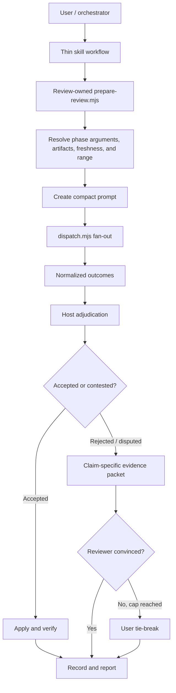

# Dispatch Skills Efficiency Proposal

Date: 2026-09-16

**Path exception:** This already tracked/staged proposal remains at `.scratch/audit/refactor-proposal.md` by explicit user decision even though new scratch audit artifacts must follow `.scratch/audits/<run>-audit.md` or `<run>-work/`. Do not treat this one-file exception as precedent.

## Executive recommendation

Refactor the suite around review-owned executable preparation, generic `dispatch` fan-out, and short semantic `SKILL.md` workflows.

The current design has strong safety properties, but the host agent repeatedly interprets mechanics that scripts already know or could know: argument classification, artifact pairing, round detection, fan-out, reserve substitution, prompt filling, consensus state, and cleanup. This creates token cost, branching variance, and a large user-facing configuration surface.

Prioritize these changes:

1. Add durable, machine-readable run measurements before using measurements as a gate.
2. State the resolved review flow before wave 1, explicitly including `plan review: off`, while retaining the single implementation approval gate.
3. Fix the clean-tree `HEAD~1` fallback and make successful artifact cleanup explicitly ephemeral.
4. Bound re-review payload growth with a generated review view while preserving the complete canonical audit log.
5. Replace both full-review prompts in place with compact findings-only JSONL contracts; this is the largest certain saving on the highest-multiplicity path.
6. Then add stable finding IDs, delegate severity, and claim-specific consensus rebuttal packets for the minority dispute path.
7. Prune duplicated skill/reference prose after the compact contracts establish the smaller semantic core.
8. Add generic fan-out and review-owned preparation only when measured host overhead justifies their runtime and CLI surface.
9. Preserve phase/level provider matrices and whole-file replacement; make the effective workflow inspectable from one workflow diagnostic.

This should preserve the suite's important guarantees: delegates remain read-only, claims require evidence, the host adjudicates findings, implementation requires approval, edits are verified, and configuration/integrity failures remain explicit.

**Implementation boundary:** Phase 0 is the only committed scope because it makes later gates observable and fixes two correctness/UX defects. Each later phase is a separate go/no-go decision. Phase 1 is the first optimization experiment; if its compact prompt contract fails the review corpus, restore the original prompts without blocking separately justified later work.

## Measured baseline

The table preserves the original whitespace-word baseline for comparison. Word counts are descriptive only: they underprice punctuation- and table-dense text. Automated drift gates use raw character counts and `ceil(characters / 4)` as a model-neutral **estimated text-token** proxy. They never label that estimate as provider-billed tokens; exact tokenizer counts are model-specific and would add a dependency without making cross-provider comparisons exact.

| Surface | Words |
|---|---:|
| `dispatch/SKILL.md` | 1,266 |
| `dispatch/references/alignment.md` | 2,045 |
| `dispatch/references/providers.md` | 1,217 |
| `dispatch-plan-review/SKILL.md` | 995 |
| Plan-review delegate prompt | 928 |
| Plan template | 206 |
| `dispatch-code-review/SKILL.md` | 1,329 |
| Code-review delegate prompt | 1,032 |
| Walkthrough template | 142 |
| `implement-dispatch/SKILL.md` | 1,776 |
| **Total reviewed instruction surface** | **10,936** |

The four entry-point skills alone contain **5,366 words**. A normal `implement-dispatch` run can expose the entry points, `alignment.md`, both prompts, and both templates: approximately **9,719 words before the plan, walkthrough, repository instructions, source context, or delegate output**. A fallback path that also reads `providers.md` reaches the full 10,936-word surface.

The same reviewed surface contains **80,420 characters**, or approximately **20,105 estimated text tokens** at `ceil(characters / 4)`. The normal implementation instruction path contains **71,170 characters**, or approximately **17,793 estimated text tokens**. These estimates are only drift indicators; Phase 0 records actual prompt/report characters at each dispatch boundary.

Prompt multiplication is more important than entry-point size. The shipped review caps allow these maximum review slots:

| Level | Plan slots | Code slots | Total slots | Base prompt words |
|---|---:|---:|---:|---:|
| `low` | 0 | 1 | 1 | 1,032 |
| `medium` | 2 x 1 | 3 x 2 | 8 | 8,048 |
| `high` | 3 x 2 | 3 x 3 | 15 | 14,856 |
| `xhigh` | 3 x 3 | 3 x 4 | 21 | 20,736 |
| `max` | 5 x 5 | 5 x 5 | 50 | 49,000 |

These are ceilings and target affinity can reduce later waves, but they exclude artifacts, repository reads, reasoning, and output. Repeated review prompts are therefore the dominant avoidable token cost.

## What is working well

Retain these design choices:

- **Read-only delegation:** provider runners enforce a structural boundary rather than relying only on prompt wording.
- **Claims are not verdicts:** neither delegate nor orchestrator is presumed correct; cited evidence and successful rebuttal drive consensus.
- **Fail-closed errors:** integrity, configuration, and membership failures are not converted into success-shaped fallbacks.
- **Single implementation approval:** the user sees the reviewed plan before code changes.
- **Explicit verification:** implementation and accepted code-review fixes rerun the repository's declared command.
- **Target affinity:** a recheck addresses only reviewers with live findings.
- **Scratch isolation:** logs and temporary prompts stay outside the repository.

The proposal simplifies how these guarantees are invoked; it does not weaken them.

## Main friction

### 1. Deterministic mechanics live in agent prose

The review skills ask the host model to perform algorithms:

- infer whether trailing prose is a path, requirement, summary, or focus;
- resolve and pair plan and walkthrough artifacts across three tiers;
- derive review rounds from Markdown headings;
- calculate changed scope;
- materialize prompt variables through a specific stdin/temp-file protocol;
- map target objects to CLI flags;
- launch targets in parallel and substitute reserves;
- translate outcomes into consensus statuses;
- place and rewrite resolution-log entries.

These are state transitions and parsing rules, not semantic judgment. Encoding them in `SKILL.md` spends tokens every run and makes correctness depend on the model following a long branch precisely.

### 2. Standalone and orchestrated modes duplicate control flow

`dispatch-plan-review` and `dispatch-code-review` each describe two products:

- a standalone command that resolves context, edits an artifact, and reports to the user;
- an orchestrated worker that accepts targets, suppresses user reporting, and returns state to `implement-dispatch`.

`implement-dispatch` then restates the orchestrated path. The result is three owners for review flow: the review skill, `alignment.md`, and the implementation skill.

### 3. Consensus debate pays too much context per rebuttal

Consensus is an epistemic safeguard, not a vote. The orchestrator can hallucinate its counter-evidence just as a reviewer can hallucinate a finding. Requiring the citing reviewer to accept the counter-reading or rebut it is therefore valuable; the user remains the tie-breaker when the agents cannot converge.

The efficiency problem is the payload, not the debate. A re-review can reload the full artifact, full review prompt, and broad axis contract when only one `[Rejected — pending confirmation]` or `[Disputed]` claim remains live. Target affinity narrows the reviewer set, but the prompt/context cost can still resemble a full review.

The consensus mechanism should remain. Its rebuttal path should carry only the live claim, original locus and severity, exact orchestrator counter-evidence, relevant changed excerpts, and a bounded request to confirm or rebut.

The canonical plan/walkthrough is also attached again on every round, so its growing resolution log compounds the cost. At five targets across five rounds, even a 700-word accumulated log can be resent up to 25 times in one phase. Do not solve that by deleting the audit trail. For re-review, generate a bounded view containing:

- the complete semantic artifact body without the canonical resolution log;
- every entry from the immediately preceding round, so the reviewer can verify that accepted resolutions landed;
- every still-live finding from any round;
- one fixed summary for each older settled round: `R<n> settled accepted=<n> rejected=<n> disputed=0 hash=<12-hex-prefix>`.

The canonical artifact retains every original entry and remains the source of truth. The generated view is an OS-temp projection attached only to the next wave and removed after that wave settles. Handover keeps `Canonical Artifact Path` distinct from optional `Review View Path`: review skills attach the view and fill the delegate's plan/walkthrough path variable with it, while adjudication and edits always target the canonical path. The projection starts with a data-only banner naming the canonical artifact and marking the projection read-only.

### 4. Provider policy is expressive but hard to inspect

The two configurations serve legitimate different roles:

- `dispatch/config.default.jsonc` defines standalone cascade membership and defaults.
- `implement-dispatch/config.default.jsonc` tunes review model and effort by phase and level, plus breadth, rounds, consensus, reserves, and implementation selection.

That distinction should remain because a low plan review, high code review, and standalone investigation may warrant different models and effort. Whole-file replacement should also remain: it makes the effective provider set explicit and prevents omitted providers from silently inheriting.

The friction is discoverability. Users must read a long schema and mentally resolve level inheritance, cross-config membership, exclusions, and candidate ordering. The CLI should explain the effective flow without changing replacement semantics.

### 5. Delegate prompts optimize for visible completeness, not useful output

The plan prompt requires seven clean/finding axis lines, a verdict, three severity sections, and a shorter-path summary. The code prompt similarly requires six axis lines, a verdict, three severity sections, and actionable next steps.

For clean reviews, nearly all output is scaffolding. For reviews with findings, "Actionable Next Steps" often repeats the required change already carried by every finding. Expanded axis prose also repeats concepts the tags and repository context already communicate.

### 6. Tool-turn budgets are advisory, not enforceable

The `8 + 2 x units` target gives a reviewer useful freedom: it can spend turns where evidence leads instead of following rigid per-file quotas. The runner does not enforce delegate tool calls, however, so `soft`, `headroom`, and `hard` values would be self-reported ceremony rather than real ceilings.

Keep one advisory target, let the reviewer allocate it freely, and permit evidence-backed overflow without a host round-trip. Record actual tool use only when the provider exposes it; otherwise record the target and any delegate-reported overflow reason without treating either as authoritative. `--timeout` and `--max-buffer` remain the enforceable runaway controls. Do not add budget-kind, unit, headroom, or hard-ceiling CLI fields.

### 7. Artifact freshness is inferred from prose

The stale-plan guard compares a requirement with plan content. The stale-walkthrough guard compares `## Changes Made` with a diff. Re-review scope is reconstructed from Markdown headings.

These checks cost host reasoning and remain ambiguous because artifacts do not record a reviewed base SHA, worktree fingerprint, or plan content hash.

### 8. The clean-tree code-review fallback is surprising

The delegate prompt reviews `HEAD~1` when the merge-base equals `HEAD`. On a clean base branch, `/dispatch-code-review` can therefore review the latest commit even though the user did not select it. A "current changes" command should report that no diff exists or require an explicit range rather than silently changing scope.

### 9. Progressive disclosure is too coarse

`alignment.md` combines artifact resolution, invocation modes, target mapping, reserve substitution, prompt transport, adjudication, logging, reporting, and lifecycle. A consumer needing one section commonly loads a 2,045-word monolith.

`dispatch/SKILL.md` also caches detailed configuration semantics already exposed by `config.default.jsonc`. Its complete flag table is intentional duplication enforced by parity tests; optimize the descriptions around it rather than removing it.

### 10. Later phases have no observable baseline

The proposal gates later work on rebuttal convergence, payload size, tool-turn use, and user escalation, but `## Run Diagnostics` is prose inside an artifact that successful runs relocate to OS temp. No durable record captures per-target input, delegate output entering host context, waves, slots, or substitutions. A gate that cannot be measured will either block forever or be waived by intuition.

Phase 0 must write content-free run records outside the worktree under `<git-common-dir>/dispatch-skills/runs/<run-id>/`; `.scratch/audit/runs/` is inside the worktree and is not ignored in this repository, so it would pollute user status. Resolve the common directory with `git rev-parse --path-format=absolute --git-common-dir`; if the installed Git lacks that option, resolve relative output against the exact `cwd` passed to Git, never against an inferred repository root. Use a Windows-safe run ID such as `20260916T110000Z-a1b2` and keep the ISO timestamp as JSON data. Add one documented `dispatch --metrics-file <absolute-path>` transport, plus `implement-dispatch/scripts/run-record.mjs init|finalize|pin-baseline`. `init` exclusively creates the run directory and an owner-only marker file and returns its path. On POSIX, create directories as `0700` and files as `0600`; on Windows, preserve the user's inherited ACL and treat mode bits as best effort while still rejecting symbolic links and junction/reparse-point destinations. A Git resolution failure is terminal because the shipped skills require a Git working tree.

Each logical review target is one slot. Its original dispatch, same-provider candidate attempts, and terminal best-partial result stay in that slot; a reserve is a new slot and records `substitutesFor`, while an in-process native fallback is a substitution diagnostic outside dispatch-attempt coverage. The orchestrator allocates a unique slot metrics path before each dispatch and hands `Metrics File Path` to the review skill alongside the canonical/view paths. `expectedSlots` is the number of dispatch slots actually launched, including reserves, and excludes in-process native fallbacks; “all terminal outcomes” and the coverage denominator refer to those launched dispatch slots. Pre-attempt dispatch failures write a zero-attempt terminal slot when the metrics path was accepted. Standalone review invocations remain untelemetered in Phase 0.

Each target writes one bounded, closed-schema atomic JSON record on its terminal outcome. Resolve real paths, require the initialized marker, reject symlinks/reparse points in every existing path component, reject destinations outside the initialized run directory, reject an existing destination, cap files at 256 KiB, and use an owner-only temp file plus exclusive publish so a path cannot be replaced silently. Slot records permit only schema-declared enums, nullable usage numbers, bounded non-negative integers, and stable repository-relative artifact labels; raw errors, stderr, prompts, reports, environment values, and credentials are forbidden. `finalize` receives `expectedSlots` as a count, aggregates every present slot record, rejects duplicate embedded slot IDs, fails if the count differs, adds requested/initial/final levels plus per-wave effective level and finding/substitution totals, writes `run.json`, retains the latest 100 unpinned finalized runs per repository, and removes incomplete runs older than seven days. `pin-baseline --label <phase:corpus>` updates a locked `baselines.json` index beneath `dispatch-skills/`, gives one finalized run a validated unique label, and atomically replaces a prior run under that label; `pin-baseline --clear <phase:corpus>` removes it after its dependent gate. Pinned baselines are exempt from age/count pruning until explicitly superseded or cleared. Durable repository-local telemetry is required because later phases compare separate runs; OS temp remains appropriate for disposable logs, prompt spills, and review projections.

One slot can contain several same-provider candidate attempts because pinned `dispatch` still cascades within that provider. Every provider runner measures at its own formatting boundary and returns one metrics attempt for every invoked provider mode/model; nested model or mode failures are retained in order. Brief-file transport does not change the measured input: count the complete fully formatted prompt before it is replaced by a pointer. The slot record contains `attempts[]` plus nullable `effectiveAttempt`, and is written once when the slot terminates; it never overwrites an earlier attempt. `effectiveAttempt` selects the successful or returned best-partial attempt, so a truncated/non-`ok` attempt may be effective. Each attempt measures the exact fully formatted prompt after attachment truncation and safety-wrapper insertion, plus the final cleaned output returned by that attempt. Normalize strings to NFC, count Unicode code points, and estimate `ceil(characters / 4)`. Record phase, requested/initial/final/effective level, wave, slot, provider/model/mode, result/failure class, truncation, and provider-reported usage when available. The finalized run adds live/settled finding and substitution totals. Use `null` for unavailable values.

```json
{
  "schemaVersion": 1,
  "runId": "20260916T110000Z-a1b2",
  "startedAt": "2026-09-16T11:00:00Z",
  "requestedLevel": "high",
  "initialLevel": "high",
  "finalLevel": "high",
  "waves": [{
    "phase": "plan-review",
    "round": 1,
    "effectiveLevel": "high",
    "targets": [{
      "slotId": "plan-review:R1:S1",
      "attempts": [{
        "provider": "claude",
        "model": "claude-sonnet-5",
        "inputChars": 12000,
        "inputEstimate": 3000,
        "outputChars": 0,
        "outputEstimate": 0,
        "toolTurns": null,
        "result": "error"
      }, {
        "provider": "claude",
        "model": "claude-opus-5",
        "inputChars": 12000,
        "inputEstimate": 3000,
        "outputChars": 900,
        "outputEstimate": 225,
        "toolTurns": null,
        "result": "ok"
      }],
      "effectiveAttempt": 1
    }]
  }]
}
```

### 11. Review-cost and artifact-lifecycle UX is hidden

`low` resolves `plan-review.maxRounds` and `targetCount` to zero, silently skipping plan review. At higher levels, plan review intentionally happens before the implementation approval gate because it helps produce the plan being approved; moving approval earlier would defeat that gate's purpose. Before the first wave, state the resolved level, whether each review phase is on, reviewer platforms/models, maximum rounds, and consensus mode. This is disclosure, not a second confirmation gate.

Successful runs relocate the plan and walkthrough to OS temp, where the OS may eventually remove the audit trail. Keep that behavior by user decision, but warn clearly before relocation and report the exact destination afterward.

## Proposed target architecture



### Ownership

| Concern | Owner |
|---|---|
| Requirement interpretation, plan authoring, finding verification, edits, user decisions | Host agent |
| Finding IDs, severity, sources, finality, and resolution-log grammar | Shared alignment contract |
| Phase-specific argument parsing, freshness, round state, and prompt creation | Each review skill's `scripts/prepare-review.mjs` |
| Generic artifact and template primitives | Shared helpers, currently under `dispatch/scripts` |
| Fence-aware resolution-log scanning | `dispatch/scripts/resolution-log.mjs` |
| Review policy, resolved targets, and ordered provider reserves | `implement-dispatch` / calling review skill |
| Data-driven fan-out, supplied-reserve execution, provider fallback, normalized result envelope | `dispatch.mjs` |
| Review breadth, rounds, consensus, and model/effort by phase and level | `implement-dispatch` configuration |
| Review criteria and delegate output schema | Compact kind-specific prompt |
| Per-target content-free measurements | `dispatch` provider result + internal `--metrics-file` |
| Run initialization, aggregation, retention | `implement-dispatch/scripts/run-record.mjs` |
| Bounded orchestrated re-review projection | `implement-dispatch/scripts/build-review-view.mjs` until reuse justifies extraction |
| Provider installation and diagnostics | CLI `--doctor`/`--help` plus provider-specific references |

### Working glossary

| Term | Meaning |
|---|---|
| candidate | One configured provider/model/effort entry before selection |
| target | A candidate selected for the current wave |
| reserve | An ordered substitute candidate used after an eligible target failure |
| pin | User-supplied provider/count selector that overrides default breadth |
| level | `low` through `max`; selects policy and model/effort settings |
| change class | `trivial`, `focused`, or `cross-cutting`; host judgment used to derive an automatic level |
| review scope | Artifact sections, files, lines, or finding IDs a reviewer may inspect in one wave |
| blast radius | Adjacent contracts and behavior a change can affect |
| round | One numbered adjudication record in the canonical artifact |
| wave | One concurrent set of review targets launched for a round |
| slot | One target execution within a wave |
| affinity | Reusing a finding's source reviewer, or a recorded replacement, for rebuttal/recheck |

Use **change class**, **review scope**, and **blast radius** instead of overloading "scope" for all three.

## Detailed proposals

The sections below are grouped by architectural concern. Their `P<n>` prefixes, not document order, define the implementation sequence in the Migration plan.

### P0: Record runs and project bounded re-review context

Add:

```text
node implement-dispatch/scripts/run-record.mjs init
node implement-dispatch/scripts/run-record.mjs finalize --run-dir <path> --summary <json-file|->
node implement-dispatch/scripts/build-review-view.mjs \
  --artifact <canonical-path> --next-round <n> --temp-out
```

`init` resolves an absolute Git common directory using the exact Git invocation CWD, creates a filename-safe owner-only run directory plus marker, and returns JSON containing `runId`, `runDir`, and `markerPath`. `dispatch --metrics-file` accepts only a new slot path beneath a marked run directory and writes one closed-schema slot record. Review handover includes optional `Metrics File Path`; the orchestrator creates one path per launched target or reserve. `finalize` accepts an `expectedSlots` count equal to launched dispatch slots, aggregates all present slot files, rejects duplicate embedded slot IDs, reports count mismatches rather than inventing records, records native fallbacks separately in the summary, writes `run.json` atomically, and applies retention only after the new manifest is durable. `pin-baseline --label` updates the locked common-directory label index, atomically replaces the prior label target, and exempts the new run from rotation; replacement and `--clear` are explicit so a phase gate cannot silently lose its comparator. Phase 0 does not require the host to predict source-key-based slot IDs; stable candidate/source identity arrives in Phase 2.

Extract the generic fence-aware findings/round scan into `dispatch/scripts/resolution-log.mjs`, imported by `check-consensus.mjs`, `build-review-view.mjs`, and later both review preparation scripts. Preserve `check-consensus.mjs`'s exported `findUnsettled` compatibility wrapper. This preserves the enforced `review skills -> dispatch` dependency direction and avoids moving the module in Phase 5. Parse only the first unfenced `## Review Findings & Resolutions` section through the next `##` heading; reject duplicate sections, duplicate/out-of-order round numbers, finding entries before the first round, and unterminated fences. Unknown bullets remain verbatim in the immediately preceding round but do not affect status counts. Normalize source text to NFC and LF, and hash the exact normalized resolution-section bytes with SHA-256; summaries expose the first 12 lowercase hex characters while `canonicalLogHash` exposes the full digest. Status mapping is fixed: accepted, rejected/downgraded, resolved-dispute, disputed, pending-confirmation, and unknown. Clean rounds are permitted with zero counts.

The view builder fails closed on malformed round structure and returns JSON containing `canonicalPath`, `viewPath`, `sourceRoundCount`, and `canonicalLogHash`. It never mutates the canonical artifact. Add optional `Review View Path` and `Metrics File Path` fields to the orchestrated handover; review skills attach/read the view path but continue writing only `Canonical Artifact Path`, and pass the metrics path only to `dispatch`. Every new hashed skill CLI verifies its owning manifest before processing input; `build-review-view.mjs` also relies on the verified `dispatch` scanner, and both owning manifests are regenerated.

### P2: Establish a stable finding schema

Change the shared resolution-log entry syntax before introducing rebuttal packets. Phase 1's compact reports carry severity but continue writing the legacy log grammar; Phase 2 enriches newly appended entries and treats earlier Phase 1 entries as legacy.

```markdown
- **[<status>]** [R<round>-F<sequence>] [<severity>] [sources=<source-key>[,<source-key>...]] <locus> — <tag>: <defect> → <resolution>
```

- The host assigns the deterministic ID when appending a finding, for example `R1-F003`; delegates do not invent IDs.
- Every candidate in the resolved level's full configured list receives a `candidateId` before liveness, exclusions, sorting, or target/reserve slicing, in the form `<phase>:<platform>:<resolved-level-candidate-index>`. Each wave pairs it with `roundId=<phase>:R<round>` to form source key `<phase>:R<round>:<platform>:<resolved-level-candidate-index>`. Exclusion re-resolution therefore cannot renumber surviving candidates within that level.
- Findings cite only source keys that actually produced their reports. A same-provider fallback or reserve substitution uses the effective candidate's source key; diagnostics separately retain the failed attempted source and `substitutesFor` relationship. Target affinity resumes the effective session, never the failed slot.
- Deduplicated findings retain every effective citing source key, which makes target-affinity rebuttals mechanical even when one platform contributes multiple candidates.
- Severity is required and preserved across status rewrites: `MUST`, `SHOULD`, or `CONSIDER`.
- Delegate output vocabulary maps directly to existing finality terms: `MUST` -> `MUST-FIX`, `SHOULD` -> `SHOULD-FIX`, and `CONSIDER` -> `CONSIDER`.
- The structured severity field replaces the existing special-case `<tag> (CONSIDER)` encoding for newly written lines and adds severity to `[Accepted]` lines for the first time. Legacy `(CONSIDER)` lines remain readable as `severity: "CONSIDER"`. Update `review-skill-parity.test.mjs` from requiring the parenthetical form to asserting structured-severity plus legacy-read compatibility.
- Parsers also accept `ACTIONABLE` as a read-only legacy log severity for unresolved entries that predate severity recording. Delegates never emit it; finality treats it like `MUST-FIX`/`SHOULD-FIX`, so it remains consensus-bound and is never silently downgraded.
- IDs remain stable when `[Rejected — pending confirmation]` becomes `[Rejected / Downgraded]` or `[Resolved Dispute]`.
- Keep the status immediately after the list marker so existing fail-closed detection remains structurally compatible.
- Immediately below each round heading, record a source map from every source key to provider, configured candidate index, effective model/effort, fallback/substitution status, and session handle. This preserves target affinity if configuration changes before a later round.

Update `alignment.md`, `resolve-flow.mjs`, both review skills, walkthrough/plan examples, and `check-consensus.mjs`. `check-consensus.mjs --json` returns `{ settled, unsettled }`; every unsettled item contains `key`, nullable `id`, `severity`, `sourceKeys`, `status`, `lineNumber`, and `originalLine`. For enriched entries, `key === id`; legacy entries receive an invocation-local key such as `legacy:R2:L417`. Do not parse arbitrary defect/resolution prose back into fields; the fixed prefix is machine state and the original line is the durable human claim. Extend tests for new entries, legacy entries, status rewrites, duplicate text with distinct IDs, multi-source findings, delimiter characters inside prose, and fenced examples.

`check-consensus.mjs` remains read-only and preserves exit codes `0` settled, `1` unsettled, and `2` invalid input in JSON mode. For a legacy unsettled entry without ID/source/severity, JSON output returns an invocation-local `key`, `id: null`, `sourceKeys` derived coarsely from the round heading when possible, `severity: "ACTIONABLE"`, and its line number. Do not make the host rewrite legacy state on the fail-closed path. Legacy rebuttals use that temporary key and conservative round-wide affinity for the invocation; only newly appended entries receive durable IDs.

Regenerate all affected skill hashes.

### P5: Mechanize preparation inside each review skill

Create two cohesive entry points:

```text
node dispatch-plan-review/scripts/prepare-review.mjs \
  --request <json-file|->

node dispatch-code-review/scripts/prepare-review.mjs \
  --request <json-file|->
```

Each script should:

1. accept free text, paths, scope, mode, and either a standalone selector or caller-resolved targets through JSON stdin/file input, preserving the current cross-shell-safe transport;
2. validate its phase-specific inputs;
3. call shared generic helpers to resolve relevant artifacts;
4. record or compare freshness metadata;
5. derive first-review, re-review, or rebuttal scope;
6. fill its own compact prompt;
7. return a preparation manifest containing artifact paths, prompt path, scope, resolved dispatch arguments, advisory review target, and cleanup paths.

The preparation script does not wait for delegate reports. The host uses its manifest to launch one `dispatch` command in the background and yields, preserving the current lifecycle. On completion, report fields remain untrusted and are sanitized under `alignment.md` § Delegate Text Sanitization before logging or relay.

Each new script must call `verifySkillIntegrity` before processing input, target the suite-wide Node.js 22+ runtime baseline, and have direct CLI/unit tests. `npm run hashes` must include it in the owning review skill's manifest. The existing `.husky/pre-commit` hashed-skill `scripts/` pattern already covers these locations; no hook change is required unless that pattern changes.

Expected effect:

- reduce each review `SKILL.md` to approximately 2,800-4,000 characters;
- remove most of `alignment.md`'s resolution, prompt-filling, target-mapping, and lifecycle sections;
- make standalone and orchestrated modes data flags in their owning review skill rather than separate prose workflows;
- enable direct integration tests for every branch now interpreted by the model.

### P4: Make `dispatch` own fan-out with one internal batch interface

Do not add a second user-facing selector grammar beside the skill's existing `(<pins>)` syntax. Add only an internal/direct CLI transport:

```text
dispatch --batch-file /tmp/resolved-review-targets.json
```

`--batch-file` accepts:

```json
{
  "targets": [
    {
      "roundId": "code-review:R1",
      "candidateId": "code-review:claude:0",
      "platform": "claude",
      "model": "claude-opus-5",
      "effort": "low",
      "metricsFile": "/absolute/git-common-dir/dispatch-skills/runs/<run-id>/code-review-R1-S1.json"
    }
  ],
  "reserves": []
}
```

Require a 64 KiB maximum file, at least one target, unique source keys, configured platform membership, and metrics paths within the initialized run directory. Each entry uses either `candidateIndex` or explicit `model`/`effort`, never both. Reject unknown fields, malformed values, duplicate target tuples, and combinations of `--batch-file` with `--provider`, `--candidate-index`, `--model`, or `--effort`. Parse data and spawn commands through argument arrays; never evaluate shell text. Keep the batch file in OS temp and remove it after the wave. Preserve input order in the result envelope and echo attempted/effective source keys on every success, failure, fallback, and substitution record.

Return one machine-readable envelope:

```json
{
  "targets": [
    {
      "roundId": "code-review:R1",
      "candidateId": "code-review:claude:0",
      "sourceKey": "code-review:R1:claude:0",
      "platform": "claude",
      "candidateIndex": 0,
      "status": "ok",
      "session": "claude:...",
      "report": "...",
      "substitutesFor": null
    }
  ],
  "failures": [],
  "logDir": "/tmp/..."
}
```

For orchestrated calls, `--batch-file` receives a fully resolved JSON object containing ordered `targets` and `reserves` from `resolve-flow.mjs`; `dispatch` executes that data but never reads `implement-dispatch` configuration or decides review policy. Standalone multi-review selection remains the owning skill's concern unless measured demand justifies a public batch selector. Same-platform fallback and supplied-reserve behavior remain the shared alignment contract.

This eliminates host-managed process fan-out while preserving the dependency invariant and adding one flag rather than two. Existing single-target behavior remains compatible. Add the flag to `--help`, `SKILL.md`, and `README.md` together so flag-parity tests remain authoritative.

### P2: Make consensus rebuttals claim-specific

Preserve the existing finality model:

- `[Rejected — pending confirmation]` means the orchestrator's counter-reading is itself an unverified claim.
- The citing reviewer, or a recorded replacement when that source is unreachable, must accept that counter-evidence or rebut it.
- `[Disputed]` remains live when evidence cannot settle intent or a deliberate trade-off.
- `check-consensus.mjs`, target affinity, round caps, and user tie-breaking remain workflow gates.

Change the re-review payload. Send packets only for statuses that `check-consensus.mjs` treats as unsettled: `[Rejected — pending confirmation]` and `[Disputed]`. A downgrade of a delegate-reported MUST/SHOULD remains represented by `[Rejected — pending confirmation]` until confirmed.

Attach the bounded re-review view rather than the growing canonical artifact. The view carries the complete semantic body, the immediately preceding round, all live findings, and summaries of older settled rounds. It is a projection only: adjudication always updates the canonical artifact.

```text
Finding ID and original severity
Original claim and exact locus
Orchestrator verdict
Exact counter-evidence with cited locus
Relevant artifact/code excerpt or changed lines
Request: CONFIRM, REBUT with evidence, or mark INTENT-DISPUTE
```

Do not replay clean axes, closed findings, unrelated artifact sections, or the full first-round brief. Accepted fixes may receive a separate targeted resolution check, but they do not enter the rejection debate.

At the configured cap, present the surviving claim, reviewer rebuttal, and orchestrator counter-evidence to the user. The user's ruling remains final. This retains the safeguard against orchestrator hallucination while reducing the cost of each debate turn.

Build packets from `check-consensus.mjs --json`; do not rediscover keys or severity from prose. A rebuttal reviewer returns `CONFIRM`, `REBUT` with a cited locus, or `INTENT-DISPUTE` for each supplied finding key.

Add `references/rebuttal-template.md` to each review skill. Extend the orchestrated handover with:

```text
Review Mode: rebuttal
Finding Packet Path: <OS-temp JSON path>
Review Scope: the supplied finding keys only
Tool Turn Budget: <advisory target>
```

Plan rebuttal template variables are `Plan Path`, `Finding Packet Path`, `Review Scope`, and `Tool Turn Budget`. Code rebuttal variables are `Walkthrough Path`, `Plan Path`, `Finding Packet Path`, `Review Scope`, and `Tool Turn Budget`. The JSON packet contains each finding's key, nullable durable ID, severity, source keys, original resolution-log line, orchestrator verdict, cited counter-evidence, and relevant changed excerpts. Attach the packet from OS temp and remove it with the filled prompt after the dispatch settles.

Return exactly one JSON object per supplied key:

```json
{"type":"rebuttal","key":"R1-F003","verdict":"CONFIRM|REBUT|INTENT-DISPUTE","evidence":"<cited explanation>"}
```

Do not prepend the full-review `CLEAN|FINDINGS` summary: neither status describes a rebuttal packet. Completeness is exact key-set equality between packet and response. Reject missing, duplicate, or unknown keys and malformed verdicts. Group live findings by source key, so each citing reviewer receives only its own claims.

For a deduplicated finding with multiple sources, `[Rejected — pending confirmation]` closes only after every reachable citing source returns `CONFIRM`. Any `REBUT` keeps it live; any `INTENT-DISPUTE` converts it to `[Disputed]`.

If an original source cannot be resumed or redispatched after an auth/quota exclusion, dispatch the packet to a replacement reviewer holding the same bounded view. Record `substitutesFor`, provider/model, and session in the round source map. A replacement `CONFIRM` may settle that source; a replacement `REBUT` or `INTENT-DISPUTE` keeps it live. Escalate to the user only when no replacement can test the counter-evidence or the replacement review remains unresolved at the cap. This deliberately relaxes "the exact original reviewer must agree" to "an independent reviewer must test the rejection" while preserving adversarial confirmation and avoiding automatic piles of user questions.

### P1: Shrink delegate output to findings only

After Phase 0 captures a baseline, replace both prompt templates in place; do not add a prompt-variant config flag. Regenerate hashes in the same change. Use a compact JSONL contract:

```text
Inspect only the supplied scope and its direct contracts.
Return JSON Lines. First emit exactly one summary:
{"type":"summary","status":"CLEAN|FINDINGS"}

Then, only when status is FINDINGS, emit one object per finding:
{"type":"finding","severity":"MUST|SHOULD|CONSIDER","locus":"<file/section>","tag":"<tag>","defect":"<defect>","requiredChange":"<required change>"}

Every finding requires a verifiable locus. Omit praise, clean-axis summaries,
verdicts, repeated next steps, and findings outside scope.
```

The prompt carries one advisory review target: `8 + 2 x units under review`. It tells the reviewer to stop early when grounded, and to exceed the target only for a named in-scope risk supported by evidence. If the provider exposes actual tool-use metadata, the runner records it; otherwise no self-reported count is required. JSON escaping is authoritative; no custom delimiter escaping is required.

Add `scripts/parse-report.mjs` to each review skill in this phase. Each parser reads line-wise through stdin/file transport. Ignore non-JSON provider chrome and count it in `ignoredLineCount`; any line whose first non-whitespace character is `{` must parse and satisfy the schema. Validate exactly one leading summary object among parsed records, status consistency, severity, kind-specific tags, required strings, duplicate records, and plan/code locus form. Exit `0` returns a valid normalized report, exit `1` identifies an unusable delegate report with field-level diagnostics, and exit `2` is invocation/I/O failure. The host never repairs guessed JSON. Exit `1` produces no adjudication/log entries and follows the existing empty-report reserve/fallback path while recording `invalid-report`; exit `2` halts. Phase 1 continues writing the existing resolution-log grammar and does not assign durable finding IDs; Phase 2 adds enriched log state.

Keep `fill-template.mjs`'s declared-variable mechanism. The plan template retains `Plan Path`, `Requirement`, `User Focus Areas`, `Review Scope`, and `Tool Turn Budget`; the code template retains `Task Summary`, `Walkthrough Path`, `Plan Path`, `User Focus Areas`, `Review Scope`, and `Tool Turn Budget`. The existing budget variable carries the single advisory target, so no CLI fields or extra template variables are added.

Update `tests/integration/review-skill-parity.test.mjs` in the same change:

- replace the pipe-grammar assertion with JSONL field/schema parity;
- replace required report-skeleton headings with summary/finding JSONL schema assertions;
- retain and adapt re-review-scope and blast-radius assertions;
- retain the budget assertion for the single numeric `Tool Turn Budget` target;
- retain the exact declared-variable arrays above and `fill-template.mjs`'s variable-block/integrity coverage.

Add direct parser tests for clean output, multiple findings, leading/interleaved provider chrome, malformed JSON-looking lines, invalid tags/severity, duplicate records, mismatched summary status, and missing/invalid loci. Include both parsers in their skill hash manifests.

Keep concise phase-specific checks:

- **Plan:** intent, domain invariants, architecture, trust boundaries, compatibility, verification, simpler path.
- **Code:** correctness, security/resources, compatibility, simplicity, tests/UX.

The existing six/seven-axis taxonomies can remain in a disclosed review rubric for maintainers or high-risk focused reviews. The default prompt should recruit those concepts with leading words rather than explain every subcase.

Target:

- plan prompt: 6,854 characters to <=2,800;
- code prompt: 7,169 characters to <=3,200;
- clean output: exactly one compact summary JSON object;
- remove `Axis Coverage`, duplicate `Verdict`, and duplicate next-step sections.

### P0: Clarify invocation without growing the public CLI

Do not add `--requirement`, `--summary`, `--focus`, or `--range` to the slash-skill grammar. Their descriptions would expand always-loaded skill/help surfaces and duplicate meanings already available in the request handover.

Rules:

- existing `(<pins>)` syntax remains the only user-facing reviewer selector;
- an existing `.md` token remains the artifact path;
- other trailing prose remains review focus unless the skill cannot distinguish an authoring request from a review request, in which case it asks one focused question;
- internal preparation manifests may carry explicit `requirement`, `summary`, `focus`, and `range` fields without exposing four new flags;
- Phase 0 adds a deterministic code-review preflight before dispatch: inspect unstaged, staged, and untracked files after excluding `.scratch/`, generated, vendored, and binary paths under the same shared rule as the delegate prompt; when those changes are empty, resolve the branch merge-base and return `No reviewable changes; name a commit or range to review` when its diff is empty;
- when the user explicitly names one commit before Phase 5, validate it with argument-array Git as `<rev>^{commit}` and review `<rev>^..<rev>`; accept explicit two-dot and three-dot ranges only after validating both commit endpoints; reject option-like revisions, malformed/multiple ranges, unborn repositories, and missing revisions, and report shallow-history or missing-base diagnostics without substituting another range. Dirty changes do not join an explicit committed range. Carry the validated range in the existing `Review Scope` variable; Phase 5 moves that interpretation into the preparation manifest;
- the delegate prompt obeys an explicit range in `Review Scope` and never silently substitutes `HEAD~1`.

This fixes the correctness bug without creating a second mini-CLI inside each skill.

### P5: Store machine-readable artifact metadata

Add compact JSON-in-YAML-frontmatter to the existing plan/walkthrough artifact. JSON is valid YAML 1.2, but the implementation deliberately parses only the JSON object with `JSON.parse`; it does not introduce or hand-roll a general YAML parser:

```yaml
---
{
  "dispatch": {
    "schemaVersion": 1,
    "kind": "code",
    "slug": "auth-v2",
    "baseSha": "abc123",
    "headSha": "def456",
    "worktreeHash": "sha256:...",
    "contentHash": "sha256:...",
    "sectionHashes": {"Proposed Changes": "sha256:..."},
    "pathHashes": {"src/auth.ts": "sha256:..."},
    "reviewedAt": "2026-09-16T10:00:00Z"
  }
}
---
```

Use it to:

- detect whether a plan changed since review;
- detect whether a walkthrough describes the current diff;
- derive changed files/sections for a recheck;
- prevent accidental reuse across unrelated work on the same branch slug.

Frontmatter is the only persistent metadata location; sidecars would violate the repository's `.scratch/` allowlist. For plans, hash the semantic body and each H2 section independently, excluding frontmatter and `## Review Findings & Resolutions`; compare `sectionHashes` to derive changed review scope. For walkthroughs, store the review range (`baseSha`, `headSha`), a `pathHashes` entry for each reviewed path, and an aggregate SHA-256 fingerprint over the sorted changed-path list plus staged/unstaged diff bytes and eligible untracked text-file bytes, excluding `.scratch/`, generated, vendored, and binary files under the same rules as code review. Compare path maps to derive changed code scope.

Legacy artifacts without metadata remain supported: run the existing semantic stale guard and `### Round` counting, then add frontmatter after the review succeeds. Missing metadata alone never fails closed. Once metadata exists, it is authoritative; retain the prose guard only as a human-readable cross-check.

Consensus status rewrites and appended entries under `## Review Findings & Resolutions` are excluded from the semantic body hash. Accepted edits to substantive plan sections intentionally change the hash and therefore become visible to the next invocation's freshness check.

Freshness is an invocation-boundary guard, not an intra-run round guard. Snapshot metadata once when a review invocation begins; accepted edits during that loop define the next re-review scope and do not trigger a stale-artifact failure. Refresh persistent hashes only after the invocation settles. A later invocation compares against that settled checkpoint.

### P3: Make `implement-dispatch` policy-only

Keep the host-visible workflow to six steps:

1. define success criteria and clarify decisions;
2. author plan;
3. optionally review plan;
4. present one approval gate;
5. implement and verify;
6. optionally review code, apply accepted fixes, verify, and hand off.

Keep scope/level classification with the host after the draft plan exists. Do not mechanize requirement interpretation. Preserve `resolve-flow.mjs`'s required orchestrator inputs and existing option names:

```text
resolve-flow.mjs --platform <key> [--orchestrator-model <model>] \
  [--level <level>] [--pins <selector>] [--exclude <keys>]
```

Preserve its existing kebab-case output keys and extend them only compatibly:

```json
{
  "plan-review": { "maxRounds": 2, "targets": [] },
  "implementation": { "platform": "copilot", "model": "..." },
  "code-review": { "maxRounds": 3, "targets": [] }
}
```

The skill can collapse duplicated prose around initial/final resolution, but it still classifies the initial plan, calls the resolver with that level, reclassifies after accepted plan changes, and re-resolves immediately before approval only when the level or exclusions changed. Update `resolve-flow-cli.test.mjs` and `resolve-flow.test.mjs` for any additive flags or fields without renaming the existing interface.

### P4: Make configuration inspectable without changing its semantics

Keep both matrices and their current responsibilities:

- standalone candidate defaults remain in `dispatch`;
- plan-review, implementation, and code-review model/effort remain tunable by level in `implement-dispatch`;
- override files continue to replace the selected default file wholly rather than merge.

Whole-file replacement is clearer and less error-prone for provider policy because the effective set is explicit. Improve usability with:

1. a shorter annotated example for one provider, one candidate array, and one level override;
2. schema validation that names the exact phase/platform/level path;
3. `resolve-flow.mjs --show-effective`, reporting the selected config path, requested/effective level, inherited level key, candidate order, model, effort, exclusions, reserves, and cross-config membership;
4. `dispatch --doctor`, which composes validation, effective standalone configuration, and provider health rather than adding a separate `dispatch --show-effective`; keep `--validate-only`, `--list-platforms`, and `--list-targets` as stable narrow/machine-readable interfaces;
5. documentation that explicitly explains why standalone defaults may differ from implementation-review policy, including a three-line inheritance example for requests below, at, and above the lowest defined level.

For example, with keys `{ medium: A, max: B }`: requesting `low` selects `medium` because no lower key exists; requesting `high` selects `medium`; requesting `max` selects `max`. Replace the current contradictory "only ever rounded down" sentence with this exact-match, nearest-lower, otherwise-lowest-higher rule.

Do not add partial merging or move phase/level model selection into `dispatch`.

### P0: Keep one advisory review target

Retain the current formula as a planning target:

```text
review target = 8 + 2 x units under review
```

The reviewer may allocate the target anywhere within the declared blast radius and stop early. Concrete in-scope evidence may justify exceeding it during the same dispatch; the reviewer names that risk and continues without a host round-trip. The number is guidance, not a security boundary or acceptance gate.

The owning preparation layer eventually computes the target and fills the existing `<Tool Turn Budget>` variable. Until then, preserve the current self-calculation. Do not add `--budget-kind`, `--budget-units`, `headroom`, or `hard` fields to `resolve-flow.mjs`.

Record provider-reported tool use when available. If it is unavailable, record `toolTurns: null`; never infer an exact count from prose. Wall-clock timeout and output caps are the enforceable bounds.

### P3: Split provider reference by trigger

Defer this split until Phase 0 measurements show that provider-reference loading is a material cost on actual failure paths.

Keep `providers.md` as a short index and disclose:

- `providers/claude.md`
- `providers/agy.md`
- `providers/copilot.md`
- `providers/opencode.md`
- `providers/fallback.md`

Normal `dispatch` runs need none of them. A provider-specific failure loads only its provider page plus the fallback contract. Keep shared credential stripping, read-only guarantees, and terminal error classes in the main runner contract.

### P3: Remove environment caches from skill instructions

Delete or replace in Phase 3:

- repetitive explanations surrounding the runner flag tables; keep the complete tables in `dispatch/SKILL.md` and `README.md` because `flag-parity.test.mjs` requires both to mirror `--help`;
- maintainer-facing integrity and test details -> maintainer notes only.

Retain prompt transport, artifact resolution, target mapping, and lifecycle mechanics until Phase 5's preparation scripts replace them. Removing those instructions earlier would leave the host without an executable path. Phase 4 may replace detailed config schema prose with `config.default.jsonc`, `resolve-flow.mjs --show-effective`, and `dispatch --doctor` only after those commands exist.

After the Phase 5 cutover, `SKILL.md` should contain actions, completion criteria, and the concise flag reference required by parity tests.

### P4: Add one user-facing diagnostic command

Provide:

```text
dispatch --doctor
```

It should report:

- effective config path;
- configured candidates in actual order;
- provider binary/mode reachability;
- sandbox support;
- authentication/quota status when safely detectable;
- suggested corrective command.

`dispatch --doctor` remains strictly standalone/provider-scoped and never reads downstream skill configuration. Cross-config review membership and implementation-flow mismatches belong only to `resolve-flow.mjs --show-effective`. This preserves `dispatch -> (nothing)` and the dependency-direction test. Add `--doctor` to CLI help and both flag tables in the same change.

Do not remove or silently change `--validate-only`, `--list-platforms`, or `--list-targets`. `--doctor` may reuse their resolution logic, but its human-oriented report supersets rather than duplicates their public purpose: unlike current `--validate-only`, it must name the selected config path; unlike the list flags, it adds reachability and corrective diagnostics.

Every diagnosed failure should emit at least one concrete corrective command when remediation is known. This is the user-facing acceptance criterion for "more user friendly."

## Skill-by-skill target

### `dispatch`

Target role: one bounded read-only delegation command.

Keep in `SKILL.md`:

- when independent context is useful;
- read-only and untrusted-report contract;
- one basic invocation;
- launch/yield/relay workflow;
- terminal versus fallback distinction.

Move out:

- repetitive prose around the required option table;
- candidate selection algorithm;
- target fan-out mapping;
- detailed config semantics;
- provider discovery and recovery.

Target size: **3,500-4,500 characters**.

### `dispatch-plan-review`

Target role: review or author one plan, then adjudicate findings.

Keep:

- explicit invocation examples;
- semantic ground truth: requirement, repo rules, cited code/plan section;
- accepted changes update the plan body;
- one approval-neutral user report.

Move to `dispatch-plan-review/scripts/prepare-review.mjs`:

- trailing-argument classification;
- artifact resolver branches;
- round derivation;
- template filling;
- target mapping and cleanup.

Target size: **2,800-3,600 characters**.

### `dispatch-code-review`

Target role: review a selected diff, verify claims, apply safe accepted fixes in standalone mode.

Keep:

- diff is authoritative;
- every finding requires a cited changed line or direct contract locus;
- standalone applies accepted safe fixes and verifies;
- orchestrated returns adjudications without editing.

Move to `dispatch-code-review/scripts/prepare-review.mjs`:

- plan/walkthrough pairing;
- stale guard;
- clean-tree range selection;
- baseline walkthrough generation;
- recheck scope and prompt filling.

Target size: **3,200-4,400 characters**.

### `implement-dispatch`

Target role: approval-gated implementation with optional plan and code review.

Keep:

- success criteria and clarification;
- plan authoring;
- one approval gate;
- implementation and verification;
- evidence-first review/fix/recheck;
- handoff.

Remove:

- initial versus final duplicated scope steps;
- duplicated restatement of the full reserve/consensus contract (retain the shared contract);
- prose-level target-exclusion bookkeeping (retain the behavior in executable flow state);
- duplicated diagnostics list that scripts can emit.

Keep the per-wave `check-consensus.mjs` gate and user tie-break because they protect against both reviewer and orchestrator error.

Target size: **5,200-6,800 characters**.

## User experience proposal

### Simple path

```text
/dispatch Trace the cache invalidation path
/dispatch-plan-review .scratch/plan/cache-v2.md
/dispatch-code-review Focus on authorization and tenant isolation
/implement-dispatch Add CSV export to the transactions table
```

### Explicit path

```text
/dispatch (2) Trace the cache invalidation path
/dispatch-plan-review .scratch/plan/redis-pubsub.md Focus on rollback
/dispatch-code-review Review origin/main...HEAD for migration compatibility
/implement-dispatch high (claude,copilot): Refactor webhook idempotency
```

### Predictable outcomes

- before wave 1 -> state level, plan-review/code-review on/off, reviewer platforms/models, rounds, and consensus; do not add a confirmation gate;
- no current diff -> "No reviewable changes"; review committed work only when the request explicitly names a commit/range;
- missing plan with ambiguous authoring intent -> ask one focused question;
- stale metadata -> state the mismatched SHA/hash and offer reuse or new artifact;
- provider failure -> one normalized diagnostic with attempted target and corrective action;
- clean review -> `CLEAN`, recorded without verbose axis boilerplate;
- genuine intent dispute -> one focused user decision;
- successful cleanup -> warn that the plan/walkthrough are moving to OS temp and may be deleted by the OS, then report the exact destination.

## Migration plan

### Phase 0: Make optimization observable and fix unsafe defaults

**Phase 0A — instrument and baseline**

1. Add documented `dispatch --metrics-file`, have every provider result report exact formatted-input/final-output counts and effective model/mode at the runner boundary, and add `implement-dispatch/scripts/run-record.mjs init|finalize|pin-baseline` under the Git common directory with marked atomic per-slot files, closed schemas, launched-slot accounting, and bounded retention.
2. Create `tests/fixtures/review-corpus/manifest.json` plus at least eight synthetic repository fixtures spanning plan/code, clean/seeded-defect, full/re-review, and multi-source cases. Version the manifest as `review-corpus-v1`; each entry declares its kind, mode, materialized files, deterministic seed/order, and oracle. The benchmark materializes each fixture as a temporary Git repository so code-review commands operate on the fixture rather than this repository. Each oracle lists required MUST findings, scored SHOULD findings, allowed optional findings, and forbidden findings by kind/tag/locus. Add `scripts/benchmark-review-prompts.mjs` with adapters for the current Markdown grammar and candidate JSONL, a checked-in provider matrix file, and a closed result schema. Keep live provider benchmarking opt-in rather than part of `npm test`; run each available pinned provider/model three times per prompt version, fail an explicitly required unavailable pin, allow an explicitly optional unavailable pin to be recorded as skipped, and retain normalized per-run scores plus aggregate metrics inside the finalized/pinned run without raw provider reports.
3. Capture and pin the current full-artifact/full-prompt `phase0:review-corpus-v1` baseline before changing review payloads. Check in the initial instruction-budget manifest/test in 0A using NFC Unicode-code-point counts plus `ceil(characters / 4)`. The benchmark command, matrix version, corpus version, prompt hashes, Node/Git versions, repeats, score schema, availability outcomes, and aggregate MUST/SHOULD/forbidden/clean metrics make the baseline reproducible.

**Phase 0B — fix correctness and disclose behavior**

4. State the resolved flow immediately after initial resolution, including level, phase on/off state, reviewer platforms/models, rounds, and consensus. When final re-scope changes it, state the delta before approval. Keep the single implementation approval gate.
5. Add a deterministic pre-dispatch code-review range check sharing the delegate's exclusions. Replace the clean-base `HEAD~1` fallback with `No reviewable changes; name a commit or range to review`; carry an explicitly requested and validated commit/range in `Review Scope`, and cover single commits, `..`, `...`, dirty trees, option-like revisions, shallow/missing history, detached HEAD, and unborn repositories.
6. Add the pre-relocation ephemerality warning to `implement-dispatch/SKILL.md` and the shared alignment lifecycle contract. Pass only eligible scratch paths to `relocate-scratch.mjs`, retain and report native paths, and keep the relocator responsible for reporting every successful destination even if a later move fails.

**Phase 0C — bound repeated artifact context**

7. Extract the shared resolution-log scanner and add `implement-dispatch/scripts/build-review-view.mjs`; extend the shared handover with optional `Review View Path`. Keep the semantic body, the immediately preceding round, all live findings, and fixed-size summaries of older settled rounds; attach/fill from the view while preserving the canonical artifact as the only adjudication/edit target.
8. Record the Phase 0B instruction delta as an allowed correctness/UX exception and capture a post-0B/pre-projection comparator. Measure the projection against that identical prompt revision, compare both with the frozen Phase 0A baseline for total-cost reporting, then make the projected path the Phase 1 baseline.
9. Add instruction drift gates using normalized Unicode-code-point counts plus `ceil(characters / 4)`.

Deliver with metrics-path marker/ancestor boundary, atomic write-once/collision/path-swap, same-provider fallback attempts, success/error/timeout/buffer/best-partial/pre-attempt outcomes, redaction, closed-schema/size/range validation, aggregation, expected-count mismatch, retention, baseline-pin replacement/exemption, and stale-incomplete cleanup tests; runner-specific Unicode, attachment-truncation, brief-spill, mode/model cascade, partial-output, timeout/buffer, and usage-metadata fixtures; deterministic review-view fixtures including CRLF, Unicode normalization, unknown bullets, clean rounds, fences, and malformed sections; clean-tree/explicit-range behavior coverage; exact flow-disclosure coverage for low, multi-target, omitted-model, missing-companion, empty-target, changed-final, and unchanged-final flows; lifecycle-message and mixed native/scratch partial-failure coverage; Node.js 22 prerequisite consistency; and a recorded baseline for the versioned corpus. Add `--metrics-file` to help/SKILL/README parity and regenerate all affected hashes. Run `npm run hashes` and `npm test` after 0A, 0B, and 0C independently. Record Phase 0B's instruction-character increase as an intentional, measured exception to the non-increasing ratchet: flow disclosure, range safety, and the lifecycle warning are correctness/UX additions whose delta becomes part of the Phase 0C baseline.

This is the committed first implementation scope, but land 0A, 0B, and 0C as independently revertible changes in that order. It creates the baseline required by every later gate without changing finding finality, consensus semantics, or user-facing skill invocation; the only CLI addition is the internal metrics transport.

### Phase 1: Compact the guaranteed full-review path

1. Replace both full-review prompt templates in place with the compact JSONL contract.
2. Preserve declared variables and the single advisory `Tool Turn Budget` target.
3. Delete expanded axis sub-bullets from the default prompts; keep concise tags and move the detailed taxonomy to disclosed rubric tables in each review skill's README for focused/high-risk use.
4. Remove `Axis Coverage`, duplicate verdict prose, `Actionable Next Steps`, and equivalent clean-output scaffolding.
5. Add one strict report parser to each review skill and use its normalized output for adjudication; continue writing the legacy resolution-log grammar in this phase.
6. Compare baseline and compact prompts on the versioned Phase 0 corpus with the same provider/model/repeat matrix.
7. Update every axis/count dependency in `review-skill-parity.test.mjs`: prompt-to-README axis parity, literal axis count wording/headings, required clean/finding skeleton sections, and any review-skill frontmatter that declares an axis count. Regenerate hashes and run parser, parity, and fill-template tests plus `npm test`.

Advance when both prompts meet their estimated-text-token targets; every required MUST appears in at least two of three candidate runs and no less often than baseline; aggregate SHOULD recall is no more than five percentage points below baseline; forbidden-finding, clean-case false-positive, and `invalid-report` frequencies do not increase; and prompt/output characters decline. Otherwise restore the baseline prompts and parsers.

### Phase 2: Compact the minority consensus path

1. Add finding IDs and severity to the shared resolution-log grammar.
2. Assign configured `candidateId` values before exclusions, pair them with `roundId`, and preserve attempted/effective source keys through fallback and substitution.
3. Extend `check-consensus.mjs` with backward-compatible parsing and `--json`; leave legacy artifacts read-only and use conservative round-wide affinity.
4. Add review-owned claim-specific rebuttal templates for `[Rejected — pending confirmation]` and `[Disputed]`.
5. Route each packet to its citing source; when that source is unavailable after auth/quota exclusion, use a recorded replacement reviewer before escalating.
6. Measure rebuttal input/output characters, convergence, substitutions, rounds, and user escalations against the Phase 0 baseline.

Deliver with 100% settled/unsettled fixture parity, structured-output tests, source-key stability across exclusion re-resolution, bounded-view packet routing, replacement-confirmation coverage, and no increase in accepted false positives or unresolved findings on the corpus.

### Phase 3: Prune and disclose

1. Prune no-op and duplicated prose that does not carry current executable mechanics.
2. Add a short glossary for targets, reserves, pins, candidates, levels, rounds, waves, slots, affinity, and the three meanings currently carried by "scope"; rename ambiguous uses where practical.
3. Replace the contradictory "only ever rounded down" sentence in `skills/implement-dispatch/config.default.jsonc` and add a three-line exact -> nearest lower -> lowest higher inheritance example beside it.
4. Split provider references by trigger only if Phase 0 measurements show material loaded-context savings.
5. Retain prompt filling, artifact resolution, target mapping, lifecycle, and full review-skill workflow steps until Phase 5 replaces them.

Deliver with link-integrity, review-skill-parity, and a non-increasing character-budget ratchet. Final size targets do not gate this phase because the still-live mechanics cannot yet be removed.

### Phase 4: Centralize fan-out and configuration

Proceed only when measured host fan-out overhead justifies one new internal CLI surface.

1. Add `dispatch --batch-file` for caller-resolved targets/reserves; do not add public `--targets`.
2. Preserve phase/level provider matrices and whole-file replacement.
3. Add `resolve-flow.mjs --show-effective`; fold standalone effective-config reporting into `dispatch --doctor`.
4. Improve schema diagnostics and explain standalone-versus-workflow model policy.
5. Replace detailed config caches only after both diagnostics exist.

### Phase 5: Mechanize review setup and freshness

Proceed only after Phase 4 is stable and measured host setup errors/context cost justify two new runtime scripts.

1. Add `dispatch-plan-review/scripts/prepare-review.mjs` and golden tests for every plan input branch.
2. Add `dispatch-code-review/scripts/prepare-review.mjs`, including explicit request-manifest range data and freshness metadata.
3. Accept request data through JSON stdin/file input and return preparation manifests only.
4. Treat freshness as an invocation-boundary checkpoint; accepted intra-run edits define re-review scope rather than firing stale-artifact failures.
5. Add top-of-process integrity gates, Node.js 22+ runtime coverage, and legacy artifact fallback coverage.
6. Move bounded-view creation into the owning preparation scripts and delete `implement-dispatch/scripts/build-review-view.mjs` once both modes use the new owner.
7. Share only generic artifact, template, and invocation helpers; then remove prompt-filling, artifact-resolution, target-mapping, and lifecycle mechanics from the two review skills and `alignment.md`.
8. Rewrite the four `SKILL.md` files to their final target roles and enforce the final character ceilings.
9. Regenerate review-skill hashes.

Deliver Phases 4-5 with targeted dispatch/config, dependency-direction, path-convention, flag-parity, review-skill-parity, integrity, and preparation-script tests, then run `npm test`.

## Rollback and compatibility

- Land each phase independently; do not combine Phase 0 or the compact-prompt experiment with conditional fan-out/preparation work.
- Phase 0 metrics transport and run records are additive and content-free. The bounded view is disposable; the canonical artifact remains unchanged. Each correctness/UX change can roll back independently, and removing `--metrics-file` restores the prior runner interface.
- Phase 1 changes prompt/template contracts plus their strict parsers and tests; rollback restores the prior templates, removes the parsers, and regenerates hashes.
- Phase 2 readers accept both legacy and enriched resolution lines. New lines keep the existing status prefix, so reverting structured output does not hide unsettled findings from the current checker.
- Phase 4's `--batch-file` is additive and mutually exclusive with existing single-target flags; existing invocations remain unchanged.
- Phase 5 preparation scripts are additive until their `SKILL.md` callers switch over. Rollback restores the prose path without changing artifact contents.
- Frontmatter adoption is write-on-success and legacy-readable. Removing metadata falls back to the existing semantic guards; no source artifact is made unreadable.
- Whole-file configuration precedence, provider membership, model/effort defaults, and existing pin grammar do not migrate.
- Node.js 22+ becomes the explicit skill-runtime prerequisite, matching `package.json`; update repository guidance and every installation/prerequisite surface in the same phase that first relies on it.

## Out of scope

- Removing or weakening consensus, reviewer confirmation, round caps, or the user tie-break.
- Treating an advisory tool-turn target as an enforceable security or cost boundary.
- Claiming exact provider token usage from the model-neutral character estimate.
- Merging configuration tiers or eliminating phase/level model and effort controls.
- Changing provider defaults, credentials, sandbox posture, or read-only boundaries.
- Adding runtime dependencies beyond Node.js 22+ and its standard library.
- Implementing all six phases as one change; only Phase 0 is currently committed.

## Acceptance metrics

Set measurable completion criteria:

| Metric | Current | Target |
|---|---:|---:|
| Four entry-point `SKILL.md` files | 39,027 chars / ~9,757 est. tokens | <=20,000 chars / <=5,000 est. tokens |
| Normal implementation instruction path | 71,170 chars / ~17,793 est. tokens | <=32,000 chars / <=8,000 est. tokens |
| Shared alignment loaded on the normal path | 15,526 chars / ~3,882 est. tokens | <=3,600 chars / <=900 est. tokens |
| Plan delegate base prompt | 6,854 chars / ~1,714 est. tokens | <=2,800 chars / <=700 est. tokens |
| Code delegate base prompt | 7,169 chars / ~1,793 est. tokens | <=3,200 chars / <=800 est. tokens |
| Base prompt characters | 6,854 plan / 7,169 code | Phase 1 reduces each >=55% |
| Total formatted input entering providers | Unmeasured | Recorded per target; Phase 1 does not increase any corpus case and reports median savings |
| Per-wave delegate output entering host context | Unmeasured | Recorded per target; clean report <=160 chars; corpus median reduced >=40% |
| Terminal target run-record coverage | 0% | 100% for success, failure, timeout, truncation, and fallback outcomes |
| Re-review attachment growth | Full canonical log resent | Prior round + live findings + <=120-char fixed count/hash summary per older settled round |
| Consensus rebuttal payload | Broad review prompt/context | One live claim plus cited evidence |
| Clean delegate output | Verdict + 6/7 axes + sections | One summary JSON object |
| Phase/level model tuning | Full matrices, hard to inspect | Preserved matrices plus effective-flow output |
| Config override behavior | Whole-file replacement | Preserved and documented |
| Model-interpreted setup branches | Multiple across 3 documents | 2 cohesive tested preparation scripts |
| Tool-turn guidance | Formula described as a budget | One advisory target; actual usage recorded only when observable |
| Clean-tree code-review scope | Implicit `HEAD~1` | Explicit no-diff unless the request names committed work |
| Low-level plan review | Off without disclosure | Resolved flow explicitly states `plan review: off` |
| Failure-path UX | Inconsistent troubleshooting prose | Every known failure emits a corrective command |
| Successful artifact cleanup | Relocated silently | Ephemerality warning plus exact OS-temp destination |

The final entry-point/alignment ceilings gate Phase 5, after executable preparation replaces the prose mechanics. Phases 0-4 use non-increasing ratchets for surfaces they do not intentionally expand; an intentional flag/schema addition records its measured delta in the phase result.

Make instruction-size targets executable in `tests/integration/instruction-budget.test.mjs` using LF-normalized Unicode-code-point counts and `Math.ceil(characters / 4)` estimates:

- entry-point total: the four `skills/*/SKILL.md` files named in the baseline;
- normal implementation path: those four entry points plus `dispatch/references/alignment.md`, both delegate prompt templates, and both artifact templates;
- prompt limits: each `references/prompt-template.md` independently.

READMEs and maintainer-only `references/notes.md` are excluded because they are not loaded on the normal agent execution path. The test reports both raw characters and estimates, never calls them exact tokens, and requires an explicit threshold update rather than silent drift.

Quality gates:

- every accepted finding still has a verifiable locus;
- compact reports pass a deterministic kind-specific parser before adjudication;
- orchestrator rejections of MUST-FIX/SHOULD-FIX findings remain pending until the citing reviewer, a recorded replacement reviewer, or the user confirms/rules on the counter-evidence;
- claim-specific rebuttal packets preserve all evidence needed to challenge an orchestrator hallucination;
- the canonical artifact preserves every full finding even when re-review delegates receive a bounded projection;
- every measurement gate reads durable structured data rather than relocated prose diagnostics, and telemetry creates no worktree files;
- benchmark gates name the corpus version, provider/model matrix, repeat count, and finding oracle used for the comparison;
- read-only, credential stripping, sandbox, and integrity tests remain green;
- all shipped skill scripts and documentation consistently require Node.js 22+;
- old invocations receive deterministic compatibility behavior or a corrective diagnostic;
- no success path hides provider, verification, or artifact failures.

## Review Findings & Resolutions

This log is chronological. Later accepted entries and Decision record amendments supersede conflicting earlier resolutions.

### Round 1 — Claude Code, 2026-09-16

- **[Accepted]** [R1-F001] [MUST] § P0: Establish a stable finding schema — coherence: rebuttal packets had no persistent finding identifier → added host-assigned stable IDs, backward-compatible log syntax, structured consensus output, and tests; the status prefix remains compatible, so implementation should change the regex only where structured parsing requires it.
- **[Accepted]** [R1-F002] [MUST] § P0: Establish a stable finding schema — state-machine: compact output did not persist delegate severity needed by finality rules → made severity mandatory in JSONL and resolution entries, preserved it across rewrites, and defined `ACTIONABLE` legacy behavior.
- **[Accepted]** [R1-F003] [MUST] § P1: Make `dispatch` own fan-out — architecture: generic fan-out risked pulling downstream reserve policy into `dispatch` → kept target/reserve resolution with callers and limited `dispatch` to standalone selectors or explicitly supplied target/reserve data.
- **[Accepted]** [R1-F004] [MUST] § P2: Add one user-facing diagnostic command — standards: cross-config diagnosis in `dispatch` violated `dispatch -> (nothing)` → scoped `dispatch --doctor` to standalone/provider diagnostics and kept workflow mismatch checks in `resolve-flow.mjs --show-effective`.
- **[Accepted]** [R1-F005] [MUST] § Migration plan, Phase 1 — spec-gap: no configuration surface existed for prompt variants → removed the flag and scheduled in-place prompt replacement with hash regeneration as a measured Phase 2 change.
- **[Accepted]** [R1-F006] [MUST] § P1: Mechanize preparation inside each review skill — blast-radius: new scripts lacked integrity and hook obligations → required top-of-process integrity checks, manifest regeneration, pre-commit pattern verification, direct tests, and explicit runtime coverage.
- **[Accepted]** [R1-F007] [MUST] § P1: Store machine-readable artifact metadata — migration: existing artifacts had no metadata path → committed to frontmatter with legacy prose/round fallback and post-success metadata adoption.
- **[Accepted]** [R1-F008] [SHOULD] § P1: Mechanize preparation inside each review skill — coherence: a preparation envelope containing reports conflicted with background launch/yield → changed scripts to return preparation manifests only; the host launches `dispatch` in the background.
- **[Accepted]** [R1-F009] [SHOULD] § P1: Mechanize preparation inside each review skill — security: free text in CLI arguments reintroduced shell quoting hazards → moved all request data to JSON stdin/file transport.
- **[Accepted]** [R1-F010] [SHOULD] § P1: Mechanize preparation inside each review skill — validation: normalized output did not restate delegate-text trust boundaries → made collected reports explicitly subject to shared sanitization before logging or relay.
- **[Accepted]** [R1-F011] [SHOULD] § P1: Keep exact budgets with self-authorized headroom — spec-gap: "reserve" collided with substitute provider reserves → renamed the tool-turn concept to budget headroom throughout the operational proposal.
- **[Accepted]** [R1-F012] [SHOULD] § P1: Keep exact budgets with self-authorized headroom — spec-gap: rebuttal budgeting and ruling reset were undefined → added claim-count formulas and restored fresh rebuttal budget/headroom for the one post-ruling wave.
- **[Accepted]** [R1-F013] [SHOULD] § P1: Simplify invocation grammar — compat: immediate removal of implicit `HEAD~1` review was breaking → added one release of deprecation diagnostics with an exact `--range` replacement.
- **[Accepted]** [R1-F014] [SHOULD] § P1: Simplify invocation grammar — coherence: `(<pins>)` and `--targets` competed as user syntax → retained `(<pins>)` as the skill grammar and restricted target flags to internal/direct CLI transport.
- **[Accepted]** [R1-F015] [SHOULD] § P1: Store machine-readable artifact metadata — standards: sidecars violated the scratch allowlist → committed to artifact frontmatter only.
- **[Accepted]** [R1-F016] [SHOULD] § Acceptance metrics — testability: word-count goals had no drift gate or measurement scope → added a named integration test, explicit file sets, counter semantics, and exclusions.
- **[Accepted]** [R1-F017] [SHOULD] § Migration plan — blast-radius: documentation and CLI changes omitted existing integration guards → named parity, link, dependency, path, integrity, and full-suite checks in each phase.
- **[Accepted]** [R1-F018] [CONSIDER] § P2: Add one user-facing diagnostic command — standards: a `doctor` subcommand diverged from the flag-only CLI → changed it to `--doctor` and included flag-parity obligations.
- **[Rejected / Downgraded]** [R1-F019] [CONSIDER] § P1: Mechanize preparation inside each review skill — yagni: new runtime scripts could accidentally use Node 22-only APIs → superseded by the user's decision to require Node.js 22+ for skill runtime.
- **[Accepted]** [R1-F020] [CONSIDER] § Acceptance metrics — traceability: "more user friendly" had no observable criterion → required known failure paths to emit a corrective command.
- **[Accepted]** [R1-F021] [CONSIDER] § P1: Shrink delegate output to findings only — edge-case: pipe-delimited prose had no escaping rule → switched findings to JSONL with standard JSON escaping.

### Round 2 — Claude Code, 2026-09-16

- **[Accepted]** [R2-F001] [MUST] § P2: Remove environment caches from skill instructions — coherence: removing the `dispatch/SKILL.md` flag table contradicted the fan-out change and existing parity guard → retained complete SKILL/README flag tables and limited pruning to surrounding prose.
- **[Accepted]** [R2-F002] [MUST] § P1: Shrink delegate output to findings only — testability: the compact contract invalidates several hard-coded parity assertions → enumerated replacement assertions, preserved `fill-template.mjs`'s declared-variable mechanism, and kept the existing variable sets by encoding `soft/headroom/hard` in `Tool Turn Budget`.
- **[Accepted]** [R2-F003] [MUST] § P1: Make `implement-dispatch` policy-only — coherence: the proposed resolver command/output dropped required orchestrator inputs and renamed stable keys → restored `--platform`, optional `--orchestrator-model`, existing flags, and kebab-case output keys; budget output is additive only.
- **[Accepted]** [R2-F004] [MUST] § P0: Make consensus rebuttals claim-specific — state-machine: packets included terminal `[Rejected / Downgraded]` findings → restricted packets to `[Rejected — pending confirmation]` and `[Disputed]`, exactly matching structured unsettled output.
- **[Accepted]** [R2-F005] [SHOULD] § P1: Make `implement-dispatch` policy-only — domain-logic: `--ask-file` would mechanize host-owned scope judgment → retained host classification after plan authoring and passed only the selected `--level` to the existing resolver.
- **[Accepted]** [R2-F006] [SHOULD] § P0: Establish a stable finding schema — validation: legacy `ACTIONABLE` severity lacked parser/finality semantics → defined it as read-only legacy vocabulary treated like MUST/SHOULD and prohibited delegates from emitting it.
- **[Accepted]** [R2-F007] [SHOULD] § P1: Shrink delegate output to findings only — coherence: compact `MUST`/`SHOULD` vocabulary did not map to existing `MUST-FIX`/`SHOULD-FIX` finality terms → added an explicit mapping.
- **[Accepted]** [R2-F008] [SHOULD] § Executive recommendation — traceability: preparation and fan-out were marked P0 despite being measurement-gated → relabelled both proposals P1.
- **[Accepted]** [R2-F009] [SHOULD] § Acceptance metrics — spec-gap: the normal-path total implied an unstated alignment reduction → added a <=450-word target for the normal-path shared alignment contract.
- **[Accepted]** [R2-F010] [CONSIDER] § P1: Store machine-readable artifact metadata — blast-radius: frontmatter changes affect hashed templates → added Phase 4 hash regeneration and pre-commit coverage.
- **[Accepted]** [R2-F011] [CONSIDER] § P1: Store machine-readable artifact metadata — edge-case: consensus rewrites could appear to stale the plan → explicitly excluded frontmatter and the resolutions log from semantic hashing while retaining substantive plan edits.
- **[Accepted]** [R2-F012] [CONSIDER] § P2: Split provider reference by trigger — yagni: splitting a small off-normal-path file may add more complexity than it saves → made the split conditional on post-Phase-1 measurement.

### Round 3 — GPT-5.6 Sol (host), 2026-09-16

- **Sources:** `host:gpt-5.6-sol` = host / GPT-5.6 Sol / direct repository review.
- **[Accepted]** [R3-F001] [MUST] [sources=host:gpt-5.6-sol] § P0: Establish a stable finding schema — traceability: target affinity lacked per-finding reviewer provenance → added stable source IDs to resolver outputs, resolution entries, structured consensus output, fallback/substitution records, and deduplicated findings.
- **[Accepted]** [R3-F002] [MUST] [sources=host:gpt-5.6-sol] § P0: Establish a stable finding schema — migration: legacy unsettled entries could not supply durable IDs or exact sources → defined read-only null-ID output, orchestrator migration before rebuttal, and conservative round-wide source fallback.
- **[Accepted]** [R3-F003] [MUST] [sources=host:gpt-5.6-sol] § P0: Make consensus rebuttals claim-specific — coherence: no concrete template, handover, packet, or response interface connected structured findings to reviewers → specified review-owned rebuttal templates, exact variables/handover fields, packet schema, per-ID JSON replies, validation, grouping, and temp cleanup.
- **[Accepted]** [R3-F004] [MUST] [sources=host:gpt-5.6-sol] § P1: Make `dispatch` own fan-out — security: `--targets-file` lacked an input schema and validation boundary → added the JSON shape, source IDs, exclusivity rules, membership/schema/size validation, argument-array spawning, ordering, and cleanup.
- **[Accepted]** [R3-F005] [SHOULD] [sources=host:gpt-5.6-sol] § P1: Store machine-readable artifact metadata — coherence: aggregate hashes detect staleness but cannot derive changed sections or paths → added per-section and per-path hashes with explicit comparison semantics.
- **[Accepted]** [R3-F006] [SHOULD] [sources=host:gpt-5.6-sol] § Migration plan — testability: measurement-gated phases had no go/no-go thresholds → added fixture parity, packet-routing, prompt-size, finding-recall, false-positive, round-count, escalation, and budget-ceiling gates.
- **[Accepted]** [R3-F007] [SHOULD] [sources=host:gpt-5.6-sol] § P2: Remove environment caches from skill instructions — coherence: "only actions and completion criteria" excluded the parity-required flag reference → explicitly retained the concise flag table.
- **[Accepted]** [R3-F008] [SHOULD] [sources=host:gpt-5.6-sol] § Migration plan — approach: preparation manifests assumed single-command fan-out before that capability existed → moved generic fan-out before review preparation.
- **[Accepted]** [R3-F009] [SHOULD] [sources=host:gpt-5.6-sol] § Executive recommendation — traceability: priority order implied compact prompts before their measurement gate → aligned the executive order with the five migration phases.
- **[Accepted]** [R3-F010] [SHOULD] [sources=host:gpt-5.6-sol] § `implement-dispatch` — state-machine: "remove target exclusion" could delete required auth/quota behavior rather than only prose → retained exclusion behavior in executable flow state and removed only model-managed bookkeeping.
- **[Accepted]** [R3-F011] [SHOULD] [sources=host:gpt-5.6-sol] § Executive recommendation — scope-creep: the roadmap did not clearly distinguish committed work from conditional experiments → marked Phase 1 as the only committed scope and added independent go/no-go gates for later phases.
- **[Accepted]** [R3-F012] [SHOULD] [sources=host:gpt-5.6-sol] § P1: Shrink delegate output to findings only — coherence: an exact `CLEAN` response could not also account for self-authorized headroom → replaced it with a required summary JSON record followed by zero or more finding/rebuttal records.
- **[Accepted]** [R3-F013] [MUST] [sources=host:gpt-5.6-sol] § P0: Make consensus rebuttals claim-specific — state-machine: deduplicated findings with several citing reviewers had no convergence rule → required confirmation from every reachable source, kept any rebuttal live, converted intent disputes explicitly, and prohibited treating an unavailable reviewer as agreement.
- **[Accepted]** [R3-F014] [SHOULD] [sources=host:gpt-5.6-sol] § P0: Establish a stable finding schema — simplicity: parsing free-form defect/resolution prose into structured consensus fields reintroduced delimiter ambiguity → limited machine parsing to the fixed prefix and retained the complete original line as the durable claim.
- **[Accepted]** [R3-F015] [SHOULD] [sources=host:gpt-5.6-sol] § Rollback and compatibility — migration: the phased roadmap lacked explicit rollback and non-goals → added phase-local rollback boundaries, dual-read compatibility, additive CLI behavior, frontmatter fallback, and an out-of-scope list.

### Round 4 — Claude Opus 5, 2026-09-16

- **Sources:** `external:claude-opus-5` = user-supplied independent review of the proposal and repository.
- **[Accepted]** [R4-F001] [MUST] [sources=external:claude-opus-5] § Main friction / Phase 0 — testability: later phases were gated on measurements no durable mechanism produced → added content-free per-run JSON records with actual dispatch-boundary input/output characters, waves, slots, findings, substitutions, and observable provider usage.
- **[Accepted]** [R4-F002] [MUST] [sources=external:claude-opus-5] § Consensus payload / Phase 0 — efficiency: the growing resolution log was reattached on the highest-multiplicity path → accepted with modification: added a bounded re-review projection, but retained the complete canonical log because destructive round collapse would discard the audit evidence the workflow intentionally creates.
- **[Accepted]** [R4-F003] [MUST] [sources=external:claude-opus-5] § Acceptance metrics — testability: delegate output entering host context was unmeasured → added per-target output characters/estimates and reduction thresholds.
- **[Accepted]** [R4-F004] [SHOULD] [sources=external:claude-opus-5] § Measured baseline / Acceptance metrics — measurement: whitespace words underprice table/punctuation-heavy prompts → accepted with modification: changed drift gates to raw characters plus `ceil(characters / 4)` estimates; rejected a "real tokenizer" requirement because no tokenizer is exact across all configured providers and a dependency would not make the cross-provider metric authoritative.
- **[Accepted]** [R4-F005] [MUST] [sources=external:claude-opus-5] § Migration plan — approach: the guaranteed full-review prompt saving was gated behind the minority rebuttal path → inserted a small Phase 0 baseline and reordered optimization to compact prompts, rebuttals, pruning, fan-out, then preparation.
- **[Accepted]** [R4-F006] [MUST] [sources=external:claude-opus-5] § Stable finding schema — safety: host-written legacy migration reintroduced model-executed state mutation on the fail-closed path → kept `check-consensus` read-only and made legacy entries use temporary references plus round-wide affinity.
- **[Accepted]** [R4-F007] [MUST] [sources=external:claude-opus-5] § Stable finding schema / Rebuttals — state-machine: source IDs shifted under exclusion and unavailable original reviewers caused automatic escalation → user decision: assign candidate identity before filtering, key sources by round plus candidate, and allow a recorded replacement reviewer to test counter-evidence before escalating.
- **[Accepted]** [R4-F008] [SHOULD] [sources=external:claude-opus-5] § Advisory review target — correctness: the proposed hard ceiling was not runner-enforced → accepted with modification: removed soft/headroom/hard fields and budget CLI flags; retained one advisory target because the user values adaptive depth, with enforceable timeout/output limits stated separately.
- **[Accepted]** [R4-F009] [SHOULD] [sources=external:claude-opus-5] § CLI surface — simplicity: the roadmap added too many flags and diagnostics → removed four review-skill flags, public `--targets`, `dispatch --show-effective`, and all budget flags; retained only one internal batch interface, workflow `--show-effective`, and provider `--doctor`.
- **[Accepted]** [R4-F010] [MUST] [sources=external:claude-opus-5] § Artifact metadata — state-machine: persistent freshness would fire after every accepted intra-run plan edit → made freshness an invocation-boundary checkpoint and intra-run changes re-review scope.
- **[Accepted]** [R4-F011] [MUST] [sources=external:claude-opus-5] § Review-cost UX — user-gap: low silently disables plan review and review cost is hidden → accepted with modification: disclose the resolved flow before wave 1, including `plan review: off`; rejected calling this a cancel point because that would require a second confirmation gate, which the user chose not to add.
- **[Accepted]** [R4-F012] [SHOULD] [sources=external:claude-opus-5] § Artifact lifecycle — user-gap: successful audit artifacts move to sweepable OS temp without warning → user decision: preserve the current cleanup behavior, but warn that it is ephemeral and report the exact destination.
- **[Accepted]** [R4-F013] [SHOULD] [sources=external:claude-opus-5] § Compact prompts / Prune and disclose — efficiency: axis prose, duplicate report sections, invocation-mode prose, and terminology add load → moved prompt/output deletion to Phase 1 and alignment/glossary pruning to Phase 3.

### Round 5 — GPT-5.6 Sol (host), 2026-09-16

- **Sources:** `host:gpt-5.6-sol:rereview` = host / GPT-5.6 Sol / direct coherence and implementation-readiness review against the current repository.
- **[Accepted]** [R5-F001] [MUST] [sources=host:gpt-5.6-sol:rereview] § Phase 0 observability — approach: `.scratch/audit/runs/` is tracked and the current runner exposes no durable per-target metrics channel → moved records under the Git common directory and specified internal `--metrics-file`, exact provider-boundary measurement, atomic slot files, aggregation, redaction, and retention.
- **[Accepted]** [R5-F002] [MUST] [sources=host:gpt-5.6-sol:rereview] § Phase 1 compact reports — state-machine: Phase 1 assigned stable IDs that Phase 2 had not introduced and left JSONL validation to the host → kept Phase 1 logs legacy-compatible and added strict kind-specific report parsers with tests and hash coverage.
- **[Accepted]** [R5-F003] [MUST] [sources=host:gpt-5.6-sol:rereview] § Phase ordering — coherence: Phase 3 removed prompt/artifact/target mechanics before Phase 5 replaced them → limited Phase 3 to safe pruning and moved final workflow thinning plus size gates after the Phase 5 preparation cutover.
- **[Accepted]** [R5-F004] [MUST] [sources=host:gpt-5.6-sol:rereview] § Rebuttal contract — edge-case: legacy findings have `id: null`, yet responses required IDs; the full-review summary vocabulary also did not describe rebuttals → added a non-null durable-or-legacy `key`, exact packet/response key-set validation, and removed the inapplicable summary record.
- **[Accepted]** [R5-F005] [MUST] [sources=host:gpt-5.6-sol:rereview] § Clean-tree behavior — coherence: explicit range review was deferred to Phase 5 even though Phase 0 removed the only fallback → added Phase 0 preflight plus exact-range transport through the existing `Review Scope`.
- **[Accepted]** [R5-F006] [SHOULD] [sources=host:gpt-5.6-sol:rereview] § Source provenance — state-machine: attempted and effective fallback/reserve identities were ambiguous → findings now cite only the effective reporting source; diagnostics retain failed attempts and `substitutesFor`.
- **[Accepted]** [R5-F007] [MUST] [sources=host:gpt-5.6-sol:rereview] § Measurement gates — testability: no versioned corpus or repeat/oracle protocol existed, and a 50% total-input target could be impossible when artifacts dominate → specified fixtures, an opt-in benchmark adapter, a three-run matrix, quality thresholds, prompt-specific reduction, and non-increase/reporting for total formatted input.
- **[Accepted]** [R5-F008] [SHOULD] [sources=host:gpt-5.6-sol:rereview] § Bounded review view — safety: the projection/canonical write targets were not distinguished and ID-rich summaries could exceed the fixed bound before IDs exist → added separate handover paths, a data-only projection banner, canonical-only edits, and fixed count/hash summaries.
- **[Accepted]** [R5-F009] [SHOULD] [sources=host:gpt-5.6-sol:rereview] § Artifact metadata — dependency: nested YAML required a parser despite the no-dependency constraint → constrained frontmatter to a versioned JSON object parsed with `JSON.parse`.
- **[Accepted]** [R5-F010] [SHOULD] [sources=host:gpt-5.6-sol:rereview] § Diagnostics and pruning — coherence: workflow diagnostics were scheduled in both Phases 3 and 4, and final character ceilings gated prose still required until Phase 5 → assigned diagnostics to Phase 4 and made final size gates apply only after preparation cutover.
- **[Accepted]** [R5-F011] [SHOULD] [sources=host:gpt-5.6-sol:rereview] § Metrics coverage — failure-mode: "successful run" coverage omitted the runs most useful for diagnostics → required per-slot records for success, failure, timeout, truncation, and fallback outcomes.
- **[Accepted]** [R5-F012] [MUST] [sources=host:gpt-5.6-sol:rereview] § Phase 0 sequencing — testability: measuring only after installing the bounded view would erase the current full-artifact baseline and confound its savings with later prompt changes → split Phase 0 into instrument/baseline, correctness/UX, and bounded-view slices, with measurements frozen between them.

### Round 6 — Claude Opus 5 and host adjudication, 2026-09-16

- **Sources:** `external:claude-opus-5:rereview` = dispatched independent proposal/repository review; `host:gpt-5.6-sol:adjudication` = direct verification and user-decided resolution.
- **[Accepted]** [R6-F001] [MUST] [sources=external:claude-opus-5:rereview,host:gpt-5.6-sol:adjudication] § Phase 0 telemetry — state-machine: one pinned provider slot may attempt several same-provider candidates, so a scalar provider/result record loses failed attempts → changed each slot to one terminal record containing `attempts[]` and nullable `effectiveAttempt`, with all failure/truncation classes retained.
- **[Accepted]** [R6-F002] [MUST] [sources=external:claude-opus-5:rereview,host:gpt-5.6-sol:adjudication] § Resolution-log scanner — dependency: placing a helper under `implement-dispatch/scripts/` would violate the test-enforced prohibition on review skills naming or importing `implement-dispatch` → assigned generic scanner ownership to `dispatch/scripts/resolution-log.mjs`.
- **[Accepted]** [R6-F003] [MUST] [sources=external:claude-opus-5:rereview,host:gpt-5.6-sol:adjudication] § JSONL parsing — compatibility: provider CLI chrome can survive response cleanup, so rejecting every non-JSON line would discard otherwise valid reports → user decision: ignore/count non-JSON lines, but require every JSON-looking line to parse and validate; malformed or invalid JSON-looking output fails closed.
- **[Accepted]** [R6-F004] [MUST] [sources=external:claude-opus-5:rereview,host:gpt-5.6-sol:adjudication] § Finding-schema migration — compatibility: current canonical logs and parity tests encode advisory severity as `<tag> (CONSIDER)`, while the proposal did not define its migration and used inconsistent pending-status punctuation → specified legacy `(CONSIDER)` reads, structured severity for new lines, parity-test migration, and canonical `[Rejected — pending confirmation]`.
- **[Accepted]** [R6-F005] [SHOULD] [sources=external:claude-opus-5:rereview,host:gpt-5.6-sol:adjudication] § Phase 1 axis pruning — blast-radius: prompt axes are coupled to README tables, count wording/headings, parity tests, and review-skill frontmatter → enumerated those surfaces and retained the full taxonomies as disclosed README rubrics.
- **[Accepted]** [R6-F006] [SHOULD] [sources=external:claude-opus-5:rereview,host:gpt-5.6-sol:adjudication] § Artifact lifecycle — ownership: `relocate-scratch.mjs` already reports destination paths, while the required pre-relocation warning is an orchestration/lifecycle responsibility → assigned the warning to `implement-dispatch/SKILL.md` and `alignment.md` without inventing redundant script behavior.
- **[Accepted]** [R6-F007] [SHOULD] [sources=external:claude-opus-5:rereview,host:gpt-5.6-sol:adjudication] § Run finalization — scope: requiring predicted slot IDs before Phase 2 would add host bookkeeping that Phase 0 does not otherwise need → finalize all present records against `expectedSlots` count; stable candidate/source IDs remain a Phase 2 concern.
- **[Accepted]** [R6-F008] [SHOULD] [sources=external:claude-opus-5:rereview,host:gpt-5.6-sol:adjudication] § Diagnostics — interface: existing inspection flags overlap with but do not replace the proposed health report, and `--validate-only` does not expose the config path → made `--doctor` a human-oriented superset while preserving narrow `--validate-only`, `--list-platforms`, and `--list-targets` behavior.
- **[Rejected / Downgraded]** [R6-F009] [SHOULD] [sources=external:claude-opus-5:rereview,host:gpt-5.6-sol:adjudication] § Telemetry location — approach: Claude preferred OS temp because repository-internal Git state is a new storage surface → user decision: cross-run gates require durable records, so retain owner-only Git-common storage, resolve relative Git output correctly, rotate the newest 100 unpinned finalized runs, delete incomplete runs after seven days, and exempt explicitly pinned baselines until their dependent gate completes.
- **[Accepted]** [R6-F010] [CONSIDER] [sources=external:claude-opus-5:rereview,host:gpt-5.6-sol:adjudication] § Integrity obligations — simplicity: repeated hash/pre-commit language obscured that current hook patterns already cover hashed skill script directories → consolidated the requirement around manifest inclusion and normal `npm run hashes`/test verification rather than proposing hook changes.
- **[Rejected / Downgraded]** [R6-F011] [SHOULD] [sources=external:claude-opus-5:rereview,host:gpt-5.6-sol:adjudication] § Recorded baseline — measurement: Claude reported drift in four character counts → direct repository measurements reproduced the proposal's values (`8,971`, `15,526`, `6,854`, `7,169`, total `39,027`), so no baseline correction was made.
- **[Accepted]** [R6-F012] [SHOULD] [sources=external:claude-opus-5:rereview,host:gpt-5.6-sol:adjudication] § Level inheritance — precision: the implementation follows exact -> nearest lower -> lowest higher, but the proposal did not identify the contradictory source sentence → named `skills/implement-dispatch/config.default.jsonc` as the required edit surface.
- **[Rejected / Downgraded]** [R6-F013] [CONSIDER] [sources=external:claude-opus-5:rereview,host:gpt-5.6-sol:adjudication] § Proposal location — repository-convention: `.scratch/audit/refactor-proposal.md` is outside the documented `.scratch/audits/` convention → user decision: leave this already tracked/staged file in place as an explicit one-file exception rather than create rename/staging churn; do not reuse the exception for new artifacts.
- **[Accepted]** [R6-F014] [SHOULD] [sources=external:claude-opus-5:rereview,host:gpt-5.6-sol:adjudication] § Phase 0B size ratchet — coherence: flow disclosure, range safety, and the ephemerality warning intentionally add prose before later pruning → record their measured delta as a correctness/UX exception and roll it into the Phase 0C baseline.

### Round 7 — Claude Opus 5, GPT-5.6 Sol fallback, and host adjudication, 2026-09-16

- **Sources:** `external:claude-opus-5:phase0` = dispatched Claude review; `fallback:copilot:gpt-5.6-sol:phase0` = same-platform native fallback after Copilot CLI policy denial; `host:gpt-5.6-sol:phase0` = host verification and adjudication.
- **[Accepted]** [R7-F001] [MUST] [sources=external:claude-opus-5:phase0,fallback:copilot:gpt-5.6-sol:phase0] § Phase 0 telemetry boundary — portability: relative Git-common resolution and colon-bearing run IDs fail from nested CWDs or on Windows → require absolute Git output or resolution against the exact Git CWD and filename-safe run IDs.
- **[Accepted]** [R7-F002] [MUST] [sources=external:claude-opus-5:phase0,fallback:copilot:gpt-5.6-sol:phase0] § Phase 0 telemetry state — coherence: slots, reserves, native fallbacks, best-partial results, re-scoped levels, and expected-count coverage were ambiguous → defined logical dispatch slots, reserve slots, native-fallback diagnostics, launched-slot coverage, effective partial attempts, and requested/initial/final/per-wave levels.
- **[Accepted]** [R7-F003] [MUST] [sources=external:claude-opus-5:phase0,fallback:copilot:gpt-5.6-sol:phase0] § Phase 0 telemetry transport — architecture: review skills build dispatch invocations but had no metrics-path handover → added optional `Metrics File Path`, orchestrator allocation, and standalone untelemetered behavior.
- **[Accepted]** [R7-F004] [MUST] [sources=external:claude-opus-5:phase0,fallback:copilot:gpt-5.6-sol:phase0] § Provider measurement — testability: the exact formatted prompt and nested model/mode attempts exist only inside provider runners → require runner-boundary measurement, effective model/mode metadata, brief-file pre-pointer counting, and per-attempt cascade records.
- **[Accepted]** [R7-F005] [MUST] [sources=fallback:copilot:gpt-5.6-sol:phase0] § Run-record security — validation: rename alone was neither write-once nor a bounded content-free schema → added exclusive creation/publication, marker and ancestor checks, junction/reparse rejection, 256 KiB closed schemas, numeric bounds, raw-error exclusion, and collision/path-swap tests.
- **[Accepted]** [R7-F006] [MUST] [sources=fallback:copilot:gpt-5.6-sol:phase0] § Run-record permissions — compatibility: owner-only mode bits have no Windows enforcement → specified POSIX modes and Windows inherited-ACL/best-effort behavior while retaining symlink/junction rejection.
- **[Accepted]** [R7-F007] [MUST] [sources=fallback:copilot:gpt-5.6-sol:phase0] § Phase 0 CLI integrity — security: new hashed skill scripts lacked explicit startup verification → require owning-manifest checks before input and both manifests for the shared scanner/view-builder path.
- **[Accepted]** [R7-F008] [MUST] [sources=external:claude-opus-5:phase0,fallback:copilot:gpt-5.6-sol:phase0] § Benchmark baseline — reproducibility: the matrix, corpus version, score schema, availability policy, output location, and metadata were unspecified → versioned the corpus/matrix/result contracts and stored normalized scores in finalized pinned runs.
- **[Accepted]** [R7-F009] [MUST] [sources=external:claude-opus-5:phase0,fallback:copilot:gpt-5.6-sol:phase0] § Instruction and projection comparison — measurement: a pre-0C ratchet could not police 0B and a pre-0B baseline confounded projection savings → moved the initial budget gate to 0A, required a measured 0B exception, and added an identical-revision post-0B comparator.
- **[Accepted]** [R7-F010] [MUST] [sources=external:claude-opus-5:phase0,fallback:copilot:gpt-5.6-sol:phase0] § Code-review preflight — correctness: `.scratch/` artifacts would make a literal dirty-tree check always non-empty, while range syntax and edge cases were undefined → aligned exclusions and specified commit, two-dot, three-dot, dirty, option-like, detached, shallow, missing, and unborn outcomes.
- **[Accepted]** [R7-F011] [MUST] [sources=fallback:copilot:gpt-5.6-sol:phase0] § Artifact lifecycle — compatibility: native artifacts and partial relocation failures could not satisfy exact-destination reporting → relocate only eligible scratch paths, retain/report native paths, and preserve successful destinations on later failure.
- **[Accepted]** [R7-F012] [MUST] [sources=fallback:copilot:gpt-5.6-sol:phase0] § Node runtime — consistency: repository guidance still claimed shipped Node 18 support despite the accepted Node 22 baseline → include every prerequisite surface and a consistency test in 0A.
- **[Accepted]** [R7-F013] [SHOULD] [sources=external:claude-opus-5:phase0,fallback:copilot:gpt-5.6-sol:phase0] § Resolution-log projection — determinism: round grammar, malformed handling, status counts, normalization, and hash input were undefined → fixed the scanned section, round validation, unknown/clean behavior, NFC/LF bytes, and SHA-256 forms.
- **[Accepted]** [R7-F014] [SHOULD] [sources=external:claude-opus-5:phase0,fallback:copilot:gpt-5.6-sol:phase0] § Phase 0 tests — completeness: aggregate tests missed provider formatting boundaries and disclosure branches → enumerated runner cascade/truncation/usage fixtures and exact disclosure cases.
- **[Accepted]** [R7-F015] [SHOULD] [sources=external:claude-opus-5:phase0] § Metrics path identity — security: a path beneath the generic common-directory subtree could target another run → added a required initialized run marker and ancestor validation.
- **[Accepted]** [R7-F016] [SHOULD] [sources=external:claude-opus-5:phase0] § Baseline labels — state: label uniqueness and storage were undefined → assigned an atomically updated common-directory label index with replacement and clear semantics.
- **[Accepted]** [R7-F017] [SHOULD] [sources=external:claude-opus-5:phase0] § Shared counters — consistency: the audit baseline used UTF-16 length and rounding while Phase 0 required code points and ceiling → require the same NFC code-point counter for the ratchet and benchmark.
- **[Accepted]** [R7-F018] [SHOULD] [sources=external:claude-opus-5:phase0] § Scanner compatibility — blast-radius: extracting `findUnsettled` could break direct imports → preserve a compatibility re-export and regenerate both owning skill manifests.
- **[Rejected / Downgraded]** [R7-F019] [SHOULD] [sources=external:claude-opus-5:phase0] § Phase 0 scope — approach: defer the corpus to Phase 1 and bounded views to Phase 2 → retained the user-approved Phase 0 boundary because the corpus establishes the comparator before prompt changes and the view isolates repeated canonical-log growth independently of Phase 2 rebuttal packets.
- **[Rejected / Downgraded]** [R7-F020] [SHOULD] [sources=external:claude-opus-5:phase0] § Range preflight ownership — approach: defer deterministic range handling to Phase 5 → retained Phase 0 deterministic preflight because removing `HEAD~1` without explicit-range support would leave the approved correctness fix incomplete.

## Decision record

Recorded after proposal review on 2026-09-16.

### Consensus and orchestrator fallibility

**User comment:** "`3. Consensus conflicts with evidence-first adjudication`: the orchestrator may think he has the evidence and truth, but can be hallucinating. The consensus mechanism is meant to get the orchestrator to 'debate' and convincingly satisfy the other agent if possible. User remains the tie breaker should that fail."

**Response:** The original proposal incorrectly treated orchestrator adjudication as ground truth. Both agents are fallible. Consensus is an adversarial evidence exchange in which the orchestrator's rejection must survive challenge by the citing reviewer; it is not reviewer voting.

**Decision:** Keep consensus, but send targeted evidence packets only for live `[Rejected — pending confirmation]` and `[Disputed]` findings. Preserve target affinity, round caps, `check-consensus.mjs`, and the user tie-break.

**Amendment:** Replaced the proposal to remove consensus with "Make consensus rebuttals claim-specific"; updated the architecture, migration plan, skill targets, metrics, and quality gates.

### Ownership of review preparation

**User comment:** "`P0: Add one executable review entry point`: Is it right for `dispatch/scripts/review.mjs` to belong to dispatch when it's beyond its scope?"

**Response:** No. A `--kind plan|code` entry point under `dispatch` would make the runner own review semantics. `dispatch` should own generic fan-out, fallback, and normalized outcomes; each review skill should own its phase-specific preparation.

**Decision:** Add a small `prepare-review.mjs` to each review skill, sharing only generic helpers.

**Amendment:** Replaced the single `dispatch/scripts/review.mjs` proposal with two cohesive review-owned scripts and updated architecture, ownership, migration, and skill-specific recommendations.

### Phase/level model and effort tuning

**User comment:** "`P1: Remove duplicated review provider matrices`: but how then can I tune model and effort to the level?"

**Response:** The matrices encode legitimate policy: standalone dispatch defaults and phase/level workflow choices are different concerns. Removing the workflow matrices would reduce useful control. Partial merging was considered, but it can silently retain inherited providers.

**Decision:** Keep the existing phase/level matrices and whole-file replacement. The user judged whole-file replacement clearer and less error-prone. Improve examples, validation, and effective-flow inspection instead.

**Amendment:** Removed the proposal for candidate-profile indirection and partial config merging. Added `--show-effective` diagnostics while preserving configuration semantics.

### Adaptive review depth

**User comment:** "`P1: Replace exact tool-turn formulas with scope classes`: I'd still want to give the reviewer the space to go deep when needed, as the need arises during the review; wouldn't a tool-turn budget give it more flexibility on how to spend it?"

**Response:** Yes. A numeric target lets the reviewer allocate effort adaptively; scope classes would constrain breadth but would not solve depth. The initial proposal overstated enforcement, however: the runner cannot count or stop delegate tool calls.

**Follow-up user comment:** "`The orchestrator validates that the request is evidence-backed and in scope.`: the dispatch does not direct 2-way communication to request for budget increase without restarting the dispatch -> it's ok to let the dispatch make the decision to extend it unilaterally."

**Response:** Agreed. A host-approved extension would require the reviewer to end its run and restart or resume after another turn. The review target should therefore permit evidence-backed overflow during the same dispatch, but it must not be described as a hard ceiling.

**Decision:** Keep `8 + 2 x units` as one advisory target. Permit evidence-backed overflow without a host round-trip. Record actual tool use only when provider metadata exposes it; timeout and output limits are the enforceable bounds.

**Amendment:** Removed soft/headroom/hard transport, budget-specific resolver flags, and mandatory self-report blocks. Retained the existing template variable with a single target.

### Re-review payload and audit retention

**External recommendation:** Collapse settled rounds in the canonical resolution log so they are not retransmitted to every reviewer.

**Response:** The payload diagnosis is correct, but destructive collapse conflicts with the audit-trail purpose of the artifact and makes later review of prior rulings impossible.

**Decision:** Preserve the full canonical log. Re-review delegates receive a generated bounded view containing the semantic body, the immediately preceding round, all live findings, and summaries of older settled rounds.

### Replacement confirmation

**External recommendation:** When an original citing reviewer becomes unreachable, allow another reviewer holding the same artifact to test the orchestrator's counter-evidence.

**Response:** This changes the original consensus identity rule, but preserves the stronger invariant: an independent reviewer must test the rejection. It also avoids turning one provider auth/quota failure into many user questions.

**Decision:** Allow a recorded replacement reviewer to confirm or rebut on behalf of an unreachable source. Preserve `substitutesFor` provenance and escalate only when replacement review cannot settle the claim.

### Flow disclosure and approval count

**External recommendation:** State the resolved flow before wave 1 to expose that low disables plan review and to provide a cancellation point.

**Response:** Disclosure is necessary. A guaranteed cancellation point would require pausing for confirmation, adding a second gate before the existing implementation approval.

**Decision:** State level, phase on/off state, reviewer platforms/models, rounds, and consensus before wave 1. Explicitly say `plan review: off`. Keep one approval gate after the plan is reviewed.

### Successful artifact lifecycle

**External question:** Is moving the plan and walkthrough to sweepable OS temp after success intentional?

**Decision:** Keep relocation to OS temp. Before moving, warn that the audit artifacts are ephemeral; afterward, report their exact destination.

### Measurement unit

**External recommendation:** Replace whitespace-word thresholds with a real tokenizer because tables and punctuation are undercounted.

**Response:** Word counts are too weak, but no one tokenizer is exact for Claude, Gemini, OpenAI, and local models. Adding one would produce false precision and violate the no-runtime-dependency goal.

**Decision:** Use raw character counts and `ceil(characters / 4)` as a clearly labelled model-neutral estimate. Record actual provider usage separately when available.

### Implementation readiness after host re-review

**Finding:** The revised direction was sound, but Phase 0 lacked a writable telemetry boundary, Phase 1 depended on Phase 2 state, Phase 3 removed live mechanics too early, and the benchmark/rebuttal contracts were underspecified.

**Decision:** Correct those dependencies in Round 5. Phase 0 is ready to break into implementation tasks in its listed order. Phases 1-5 are viable roadmap stages, but each remains conditional on the preceding measurements and must not be implemented as one batch.

### Strict JSONL boundary

**External recommendation:** Ignore every unparseable non-JSON line so provider CLI chrome cannot invalidate an otherwise useful structured report.

**Response:** Tolerating chrome is necessary, but ignoring a malformed JSON-looking finding could silently turn a damaged report into a clean one. A fixed provider-chrome allowlist would fail whenever CLI wording changes.

**Decision:** Parse line-wise, ignore and count lines that do not begin with `{` after whitespace, and fail closed when any JSON-looking line is malformed or schema-invalid.

### Durable telemetry and retention

**External recommendation:** Keep metrics in OS temp rather than introduce repository-internal state beneath the Git common directory.

**Response:** OS temp is appropriate for disposable payloads but cannot reliably support gates that compare separately executed phases. Plain newest-100 retention also risks deleting the comparator before a later phase uses it.

**Decision:** Store content-free owner-only run records beneath the resolved Git common directory. Retain the newest 100 unpinned finalized runs, remove incomplete runs older than seven days, and exempt explicitly pinned phase/corpus baselines until superseded or unpinned after the dependent gate.

### Proposal path exception

**External finding:** This proposal's `.scratch/audit/` location does not follow the repository's `.scratch/audits/` allowlist.

**Decision:** Leave the already tracked/staged file in place as an explicit one-file exception to avoid rename/staging churn. All new audit artifacts must follow the documented convention.

### Implementation readiness after external re-review

**Finding:** Claude's implementation blockers were the multi-attempt metrics shape, helper dependency direction, parser boundary, schema migration, and enumerated parity/test surfaces. The remaining points were interface refinements or explicit design choices.

**Decision:** Corrected the substantiated blockers in Round 6 and recorded the three user-decided disagreements above. Phase 0 remains ready for implementation as ordered 0A -> 0B -> 0C; Phases 1-5 remain measurement-gated.

### Node.js runtime

**User comment:** "It's ok to require node >=22."

**Response:** This aligns shipped skill runtime with the repository's existing `package.json` engine requirement and removes the need to constrain new scripts to Node 18-compatible APIs. Because it changes a previously documented runtime invariant, every prerequisite and repository-guidance surface must change together.

**Decision:** Require Node.js 22+ for both shipped skills and development tooling.

**Amendment:** Removed Node 18 compatibility requirements and tests; added Node.js 22+ to runtime, documentation, rollback, and quality-gate requirements. The earlier Node 18 review recommendation is marked superseded.

## Recommended first change

Start with Phase 0: durable content-free run records, bounded re-review projections, resolved-flow disclosure, removal of the implicit clean-tree `HEAD~1` fallback, explicit OS-temp ephemerality messaging, and character-based instruction drift gates.

Then run Phase 1's compact full-review prompt experiment against the fixed corpus. It attacks the guaranteed multiplicative cost before the minority consensus path. Only after input/output measurements preserve finding quality should the roadmap proceed to targeted rebuttals, prose pruning, generic batch fan-out, or review preparation/freshness scripts.
