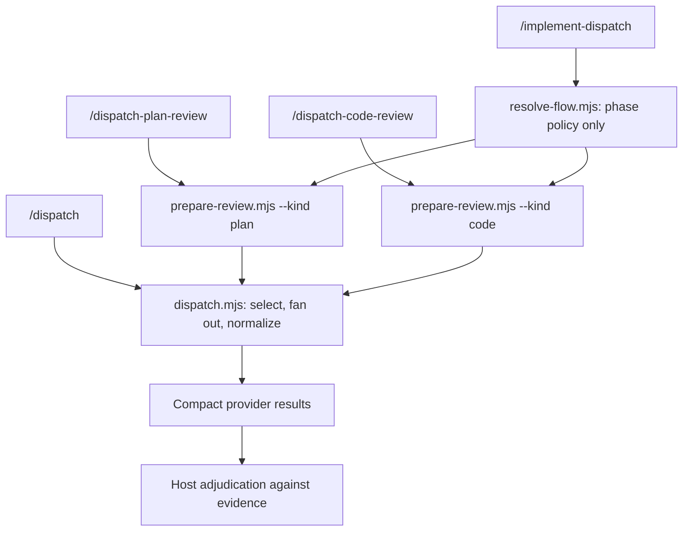

# Dispatch Skill Token-Efficiency and Complexity Review

Date: 2026-09-16

## Executive recommendation

Refactor the suite around one small, executable review preparation layer and make the four skills thin workflow descriptions.

The highest-value changes are:

1. Replace default multi-round consensus with one evidence-first review wave and one targeted recheck only when accepted findings changed the artifact or code.
2. Reduce the plan and code delegate prompts to compact checklists and findings-only output.
3. Move deterministic work—argument parsing, artifact pairing, round detection, prompt creation, fan-out, and outcome normalization—from prose into scripts.
4. Let `dispatch` own all provider selection, including multi-provider fan-out, and let `implement-dispatch` configure review breadth without repeating provider/model matrices.
5. Remove the monolithic `alignment.md` normal-path dependency. Keep a short shared adjudication policy; expose mechanical behavior through script output and `--help`.

This preserves the important controls: read-only delegates, cited evidence, host adjudication, explicit approval before implementation, verification after edits, and visible terminal failures.

## Measured baseline

Word counts are a stable proxy for instruction cost, not an exact tokenizer count.

| Surface | Lines | Words |
|---|---:|---:|
| `skills/dispatch/SKILL.md` | 123 | 1,130 |
| `skills/dispatch/references/providers.md` | 161 | 1,217 |
| `skills/dispatch/references/alignment.md` | 243 | 2,017 |
| `skills/dispatch-plan-review/SKILL.md` | 80 | 995 |
| Plan review delegate prompt | 80 | 928 |
| Plan artifact template | 49 | 206 |
| `skills/dispatch-code-review/SKILL.md` | 99 | 1,329 |
| Code review delegate prompt | 76 | 1,032 |
| Walkthrough artifact template | 32 | 142 |
| `skills/implement-dispatch/SKILL.md` | 155 | 2,013 |

The four entrypoint `SKILL.md` files alone contain **5,467 words**. A full `implement-dispatch` path can expose roughly **9,792 words** of skill, alignment, prompt, and artifact-template instructions before provider fallback documentation, repository context, the plan, the walkthrough, or delegate output. Following the provider fallback pointer raises that document path to roughly **11,009 words**.

The suite also has a large mechanical control surface:

| Mechanical surface | Lines |
|---|---:|
| `dispatch.mjs` | 709 |
| `common.mjs` | 2,288 |
| `resolve-artifact-paths.mjs` | 550 |
| `fill-template.mjs` | 424 |
| `resolve-flow.mjs` | 1,131 |
| `check-consensus.mjs` | 103 |
| **Total** | **5,205** |

That is not inherently excessive—the provider boundary needs real code—but the agent instructions still restate many decisions those scripts make or could make. The result pays both code complexity and prompt complexity.

### Multiplied delegate cost

The base plan prompt is 928 words and the base code prompt is 1,032 words. The configured round and target caps can multiply those prompts substantially:

| Level | Maximum configured review slots | Base prompt words before artifacts, repository reads, and output |
|---|---:|---:|
| `low` | 1 | 1,032 |
| `medium` | 8 | 8,048 |
| `high` | 15 | 14,856 |
| `xhigh` | 21 | 20,736 |
| `max` | 50 with the five shipped candidates | 49,000 |

These are upper bounds; consensus may arrive earlier and target affinity can narrow later waves. Provider failures and reserves can add attempts. Even so, the configured ceiling shows that repeated review waves dominate token cost far more than a few hundred words in an entrypoint.

## Main sources of complexity

### 1. Deterministic mechanics are encoded as prose

The plan and code review skills tell the host model how to:

- distinguish positional paths, requirements, summaries, and focus text;
- pair plans and walkthroughs;
- handle three artifact tiers;
- derive round numbers and changed scope;
- build prompt-variable JSON;
- launch one process per target;
- substitute reserves;
- classify terminal outcomes;
- format and place round-log entries.

These are mostly parsing and state-transition problems. Keeping them in prose makes every invocation spend tokens reinterpreting the same algorithm and creates more variance than executable code would.

The clearest example is `dispatch-code-review` lines 28–68: one “assemble context” step contains mode detection, two-kind artifact resolution, three sub-branches for supplied paths, stale comparison, walkthrough authoring, verification, round derivation, template filling, dispatch mapping, and cleanup.

### 2. Standalone and orchestrated modes double the review skills

Both review skills contain two workflows:

- standalone resolution, editing, verification, and user reporting;
- orchestrated handover, no fixes, no user report, and special consensus statuses.

`implement-dispatch` then restates the orchestrated behavior in its own Steps 3 and 5–7. This is the largest source of cross-document branching. It also means an implementation run may load both review skills even though it needs their criteria and prompt templates, not their standalone orchestration instructions.

### 3. Consensus rounds conflict with the stated evidence model

`alignment.md` correctly says “evidence decides” and reviewer votes are not evidence. The later finality rules nevertheless require a citing delegate to confirm a host rejection or downgrade under `consensus: true`. That creates additional calls without improving the ground-truth check:

- a verified defect should be accepted even if only one delegate found it;
- a refuted defect should remain rejected even if the delegate repeats it;
- a genuine intent dispute needs the user, not another model vote.

The statuses `[Rejected — pending confirmation]`, `[Disputed]`, and `[Resolved Dispute]`, plus cap/reset behavior, exist mainly to support this loop. They increase prompt size, artifact churn, parsing rules, and user-facing complexity.

### 4. Provider/model configuration has two authorities

`dispatch/config.default.jsonc` defines provider candidates. `implement-dispatch/config.default.jsonc` repeats plan-review and code-review provider/model/effort matrices and adds level inheritance, target counts, rounds, consensus, reserves, exclusions, and implementation candidates.

The implement config is 212 lines versus 56 lines for dispatch. Review candidates must also remain a subset of dispatch membership, so the duplicated matrices require cross-validation and make `resolve-flow.mjs` much larger. The two files already disagree on some defaults, making it difficult to tell whether differences are deliberate policy or drift.

### 5. Delegate prompts require verbose clean output

Each prompt repeats general review guidance, expands every axis into multiple prose bullets, and requires:

- a verdict;
- one line for every axis, including clean or out-of-scope axes;
- three severity sections;
- a second summary section (`Shorter Path` or `Actionable Next Steps`).

For a clean review, most output is scaffolding. For a review with findings, “next steps” often restate the required change already present in every finding. “Industry best practices” and instructions to read repository guidance are also weak or redundant when the provider already starts in the workspace and loads its agent instructions.

### 6. Artifact state is inferred semantically

The stale-plan and stale-walkthrough guards ask the model to compare prose with the requirement or diff. Re-review scope asks it to identify sections or lines changed since the last round, but the artifacts do not persist a reviewed content hash, base SHA, or diff fingerprint. This costs inspection turns and leaves an important branch underspecified.

### 7. Progressive disclosure is only nominal

`alignment.md` is a 2,017-word file containing artifact resolution, invocation modes, prompt filling, adjudication, logging, reporting, and lifecycle. A pointer to one section commonly results in loading the whole file. It is a shared monolith rather than branch-specific disclosure.

`dispatch/SKILL.md` likewise includes a full 17-row flag table and configuration rules that are already discoverable through `dispatch.mjs --help` and `config.default.jsonc`.

## Proposed target architecture



The host model should retain semantic work:

- turn the requirement into success criteria;
- author or amend the plan;
- verify findings against code and repository rules;
- apply code changes;
- decide whether a claim is an intent dispute;
- ask for approval or a user ruling.

Scripts should own deterministic work:

- parse explicit arguments;
- resolve and pair artifact paths;
- calculate and persist review fingerprints;
- calculate numeric budgets;
- fill prompts;
- resolve provider targets;
- launch fan-out and normalize outcomes;
- append structurally valid round records from host-supplied fields.

Do not automate semantic adjudication. A script cannot decide whether a code claim is true merely because its output is valid JSON.

## Ranked proposals

### P0 — Change the review policy from consensus loops to evidence-first rechecks

Use one initial wave per phase. Run one additional, targeted recheck only when:

- an accepted blocking finding caused a plan or code change; or
- the host has concrete counter-evidence for a disputed claim and the configured assurance level explicitly requests a rebuttal check.

Ask the user only for true intent/trade-off disputes. Make evidence-backed rejection final. Reduce review statuses to:

- `Accepted`
- `Rejected`
- `Deferred`
- `Disputed`

Remove `[Rejected — pending confirmation]`, citing-delegate confirmation, cap reset, and the extra post-ruling verification wave.

Suggested shipped breadth:

| Level | Plan | Code |
|---|---:|---:|
| `low` | off | 1 reviewer |
| `medium` | 1 reviewer | 1 reviewer |
| `high` | 2 reviewers | 2 reviewers |
| `xhigh` | 3 reviewers | 3 reviewers |
| `max` | all reviewers | all reviewers |

A targeted recheck is conditional and should include only reviewers whose accepted or disputed findings remain live. Under this policy, normal maximum slots fall from 8 to 2 for `medium`, 15 to 4 for `high`, and 50 to 10 for `max`, before any justified targeted recheck.

This is the largest token saving and removes much of the Review contract, Finality rules, consensus parser states, and loop orchestration.

### P0 — Replace both delegate prompts with findings-only contracts

Keep the axes, but compress each to one high-signal phrase. Do not require clean-axis enumeration or duplicated next steps.

Suggested plan-review prompt shape:

```text
Review the attached plan against its requirement and the named review scope.
Inspect only files and adjacent contracts needed to verify a claim.

Check: requirement traceability and scope; domain invariants and lifecycles;
architecture and producer/consumer contracts; auth and input boundaries;
compatibility, migration, and rollback; concrete verification; simplest safe
approach and failure modes.

Return CLEAN when there are no actionable defects. Otherwise return findings only:
MUST|SHOULD|CONSIDER § <section> [<tag>] <defect> -> <required change>
Cite <file>:L<line> for claims about existing code.

Scope: <Review Scope>
Focus: <User Focus Areas>
Tool-call cap: <Tool Turn Budget>
```

The code-review version should use the same shape with `<file>:L<line>` as the required locus and a compact checklist for correctness, contracts, security/resources, simplicity, compatibility, tests, and UI/accessibility when applicable.

Remove:

- `## Axis Coverage`;
- `## Actionable Next Steps`;
- mandatory `## Shorter Path` when no shorter path exists;
- prose definitions that restate common review knowledge;
- “industry best practices”;
- task summaries already present in attached artifacts;
- the original requirement variable when the plan already contains it.

Target **250–350 words** per prompt, down from 928 and 1,032 words. At the current `max` ceiling, prompt-only input would fall from about 49,000 words to roughly 15,000 even before changing review rounds; applying both P0 changes brings a normal all-provider plan-plus-code run to roughly 3,000 prompt words.

### P0 — Add a shared `prepare-review.mjs`

Create one wrapper around the existing artifact resolver and template filler:

```text
prepare-review.mjs --kind plan|code
  [--artifact <path>] [--plan <path>] [--walkthrough <path>]
  [--requirement <text>] [--summary <text>] [--focus <text>]
  [--scope <text>] [--budget <n>] [--slug <slug>]
```

It should emit compact JSON containing:

- resolved plan and walkthrough paths;
- which artifact must be authored;
- stale/fingerprint status;
- round number;
- final review scope and numeric budget;
- filled prompt path;
- attachment list.

Extend `resolve-artifact-paths.mjs` or call it internally so the host no longer implements the supplied-one-kind/canonical-path/non-canonical-path branches in prose.

Then make both review skills three short steps:

1. Run `prepare-review`.
2. Author only the artifacts marked missing, then dispatch.
3. Verify actionable findings, update the artifact, and report.

This removes most of `dispatch-plan-review` lines 28–55 and `dispatch-code-review` lines 28–68 while preserving their distinct semantic responsibilities.

### P1 — Let `dispatch.mjs` own multi-provider fan-out

Add:

```text
--providers <comma-separated keys|all>
--result-format compact-json
```

`dispatch.mjs` should:

- resolve aliases and `all`;
- validate membership before launching anything;
- run one pinned provider cascade per key concurrently;
- return one normalized record per requested provider;
- include provider, status, failure kind, answer, session handle, and log path.

The host should no longer call `--list-platforms`, manually launch N background commands, retain N shell handles, and merge process-level outcomes. Native in-process fallback can remain a host responsibility because the Node process cannot invoke every host's native subagent API.

This makes the `dispatch` skill substantially smaller and benefits all callers, not only the three companion skills.

### P1 — Make dispatch the single source of review candidates

Remove duplicated review model/effort matrices from `implement-dispatch/config.default.jsonc`.

Keep only phase policy in `implement-dispatch`:

```jsonc
{
  "levels": {
    "low":    { "planReviewers": 0, "codeReviewers": 1 },
    "medium": { "planReviewers": 1, "codeReviewers": 1 },
    "high":   { "planReviewers": 2, "codeReviewers": 2 },
    "xhigh":  { "planReviewers": 3, "codeReviewers": 3 },
    "max":    { "planReviewers": "all", "codeReviewers": "all" }
  },
  "implementation": {
    "platforms": {}
  }
}
```

Resolve review targets from dispatch's effective candidate list. If phase-specific model overrides are genuinely needed, add named profiles to dispatch and reference a profile by name; do not copy full provider maps into a second file.

This removes subset cross-validation, duplicate diversity sorting, most level-aware candidate resolution, and a major portion of the 1,131-line `resolve-flow.mjs`. Keep implementation platform selection separate because it selects a write-capable native subagent rather than a read-only dispatch provider.

### P1 — Persist exact artifact fingerprints

Add a compact metadata comment to generated plans and walkthroughs:

```html
<!-- dispatch-review {"artifactHash":"...","base":"...","diffHash":"...","round":1} -->
```

For plans, record the reviewed artifact hash and optionally a requirement hash. For walkthroughs, record:

- merge-base or `HEAD` used for the review;
- a hash of the reviewed diff plus untracked-file manifest;
- the walkthrough hash at review time.

`prepare-review.mjs` can then return `fresh`, `stale`, or `unknown`. This replaces semantic stale detection and gives re-review scope an exact basis. If exact changed sections are still expensive to derive, prefer a full standalone re-review over pretending the scope can be reconstructed from round headings alone.

### P1 — Keep artifact lifecycle uniform

Retain review artifacts in `.scratch/plan` for standalone and orchestrated runs. Do not relocate them to OS temp at successful completion.

Relocation introduces another state transition, makes reported paths unstable, and requires lifecycle prose and a cleanup command. If ephemeral artifacts are required for a particular host, create them in OS temp from the beginning. Otherwise, add `.scratch/` to the consuming repository's ignore convention and keep stable paths.

### P2 — Prune `dispatch/SKILL.md` to the live path

Target 450–550 words.

Keep:

- when to dispatch;
- read-only/host-owns-judgment boundary;
- concise prompt requirements;
- one command form;
- background launch/yield;
- terminal versus fallback distinction;
- sanitized provider-attributed relay.

Remove from the skill body:

- the complete flag table—`dispatch.mjs --help` is authoritative;
- config schema details—`config.default.jsonc` and `--validate-only` are authoritative;
- provider discovery and recovery detail from the normal path;
- repeated completion criteria where the next step already provides a binary outcome.

Keep one conditional provider pointer: read provider diagnostics only after a provider-specific failure or when the user explicitly changes provider mode/sandboxing.

### P2 — Replace `alignment.md` with a short policy reference

After mechanical behavior moves into scripts, retain one shared `review-policy.md` of about 400–600 words containing only:

- evidence-over-votes adjudication;
- the four verdicts;
- delegate-text sanitization;
- concise round-log syntax;
- the standalone versus orchestrated ownership distinction.

Artifact resolution, target mapping, prompt filling, reserve substitution, and lifecycle should live in command behavior and `--help`, not agent prose. If provider fallback still needs prose, keep it in `providers.md` behind a failure-only pointer.

### P2 — Simplify invocation grammar

Prefer explicit fields over shape-based interpretation:

```text
/dispatch-plan-review [--plan <path>] [--focus <text>] [--requirement <text>]
/dispatch-code-review [--walkthrough <path>] [--plan <path>] [--focus <text>] [--summary <text>]
/implement-dispatch [--level <level>] [--reviewers <pins|count|all>] <ask>
```

Allow one positional `.md` path as a convenience, but stop asking the model to infer whether arbitrary prose is a requirement, task summary, or focus area. Remove the colon rule from `implement-dispatch`.

### P2 — Tighten invocation policy

`implement-dispatch` is already user-invoked only. Consider making plan and code review user-invoked only if automatic review triggering is not a deliberate product behavior. If automatic invocation is valuable, keep their descriptions but shorten them to distinct branches:

- plan: “Review an implementation plan before coding.”
- code: “Review active code changes and verify cited findings.”

Do not add another model-invoked router skill. It would add permanent context load while the existing names already form a coherent family.

## Per-skill target

| Skill | Current issue | Target |
|---|---|---|
| `dispatch` | Prose owns flags, fan-out, and outcome bookkeeping | Thin read-only delegation contract; CLI owns fan-out and normalized results |
| `dispatch-plan-review` | Standalone/orchestrated branches plus artifact and prompt mechanics | Standalone wrapper over `prepare-review`; compact plan-specific adjudication |
| `dispatch-code-review` | Most branching of the four; duplicates review, fix, and verification ownership | Standalone wrapper over `prepare-review`; compact code-specific adjudication/fix rules |
| `implement-dispatch` | Eight-step state machine, duplicated review policy, expensive consensus loops | Four phases: plan, approve/implement, review/fix, handoff; one conditional recheck |

Suggested word-count budgets:

| Document | Current words | Target words |
|---|---:|---:|
| `dispatch/SKILL.md` | 1,130 | 450–550 |
| `dispatch-plan-review/SKILL.md` | 995 | 300–450 |
| Plan delegate prompt | 928 | 250–350 |
| `dispatch-code-review/SKILL.md` | 1,329 | 350–500 |
| Code delegate prompt | 1,032 | 300–400 |
| `implement-dispatch/SKILL.md` | 2,013 | 700–900 |
| Shared review policy | 2,017 (`alignment.md`) | 400–600 |

These are constraints, not goals by themselves. A short document that hides a required decision is worse than a longer deterministic one.

## Recommended migration sequence

1. Add behavioral tests for current artifact resolution, target ordering, terminal outcomes, and round logging.
2. Add `dispatch --providers` and compact normalized results without changing existing single-provider behavior.
3. Add `prepare-review.mjs` using the existing resolver and filler modules; switch both review skills to it.
4. Introduce compact prompts and compare finding recall on a fixed corpus of seeded plan/code defects.
5. Change defaults to one wave plus conditional targeted recheck.
6. Simplify verdict states and `check-consensus.mjs`.
7. Collapse implement review configuration onto dispatch's effective candidates, with a temporary compatibility reader for the old config shape.
8. Shrink the four skill files and replace `alignment.md` only after the executable contracts are stable.

## Acceptance metrics

- Four entrypoint `SKILL.md` files total at most 2,400 words.
- Normal implement path consults at most 3,500 words of skill/reference prose before repository artifacts.
- Plan and code prompts are each at most 400 words.
- Clean delegate output is exactly one verdict token or one short line.
- Default `medium` performs two review calls total unless an accepted blocking finding changes the reviewed material.
- Default `high` performs four review calls total under the same condition.
- Every provider target and failure remains accounted for in structured output.
- Every accepted code finding still requires a concrete path and line; every plan finding still requires a section locus.
- Read-only isolation, integrity validation, one approval gate, host verification, and explicit terminal errors remain covered by tests.
- Seeded-review evaluation shows no material drop in MUST-FIX recall before the compact prompts replace the current ones.

## Changes to avoid

- Do not move semantic adjudication into regexes or JSON parsing.
- Do not create more model-invoked helper skills; use scripts and plain references.
- Do not trade one large `alignment.md` for several references that every path must still load.
- Do not remove citations, read-only enforcement, integrity checks, or verification to hit a word target.
- Do not keep five review rounds merely because the resolver can express them; review depth should come from reviewer diversity and targeted evidence, not repeated full prompts.
