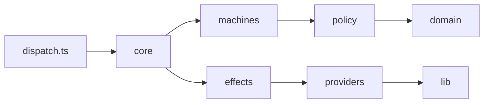

---
{
  "dispatch": {
    "schemaVersion": 1,
    "kind": "design",
    "slug": "scratch-dispatch-skills-20260929t1754z",
    "invocationId": "b732344c-f237-44b3-abea-2f3f63356949",
    "contentHash": "sha256:f6da905af1e0c5084dd0dd3d99e5ee75a735137e2d8729b079f3908aa65d59f5",
    "sectionHashes": {
      "__preamble__": "sha256:e0f85a8b756b5d67903e2bf8421536103dda7af38d5d082fb2090223c9d6363c",
      "Context & Intent": "sha256:a429cbcb54a99f8abd621407c7046565a889120127648bf9a3db7ef630aceea2",
      "Goals & Requirements": "sha256:b01b8050d59fd1bee60654fc947206425b1e27233afa1c4b95050e35184ac9d8",
      "Architecture & Boundaries": "sha256:899a33adfc19e5f410856d0f56d3373955bf9e45a00bb95b95419ed361f2b51f",
      "Alternatives & Decisions": "sha256:3ac8f4a0d7d062f75f50a35bf3672dd78ad9388c94e8c3c408aae843bbb6f2b1",
      "Risks, Security & Operations": "sha256:f9ab2b306e259edb69c7cfd0d26275eec50c1597658a3c804867fee6e6b9915f",
      "Increment Dependency Graph": "sha256:04d5110c248ef4ae697bef147187ac2c1b5bb0806442ab89a5de39162a1c89c7",
      "Increment Details": "sha256:19001c673a25544c315da0ece3d22981a2ed82f4b7828dcb05465c9ab5bc39a2",
      "Final Integration": "sha256:adca78d5d6106d5aac7121c2f6bd9f7ddd8208894672e4a67de29df282d28167",
      "Execution Status": "sha256:f81051152eb90b992fc5294a2cd17bcde8c7fec12d182fb29a0c9d7e6dded2b4"
    },
    "reviewedAt": "2026-09-29T18:39:57.389Z",
    "approvedContentHash": "sha256:d1be0985399b2a70dc700b05a2566c5b1d014c82e7a8afd6fd914e455820e506",
    "approvedAt": "2026-09-29T18:39:57.389Z"
  }
}
---
# Dispatch state-machine rewrite — technical design

> **TL;DR:** Rebuild `dispatch` as strict native TypeScript: pure reducer machines over an append-only event journal, one closed host-await protocol, one rounds-policy review loop, declarative provider specs, and a six-tier test suite. Deliver it in a `next/` overlay (I01–I08) and swap the trees in one cutover (I09).
> **Parent:** `.scratch/dispatch-skills/20260929T1754Z-68393a1a0a77-rewrite-dispatch-as/dispatch-state-machine.spec.md` · sha256:4df069733dead5722f65d6cf02848432ab7ea36119cd3672f0b3ddd2feb3e227
> **Decide:** approve this design (DD1, DD2, DD3, and DD7 settled by the user on 2026-09-30)
> **Risk:** high — clean-break rewrite of the whole skill, host protocol, and test suite while the legacy driver delivers it
> **Increments:** 9

## Context & Intent

`dispatch` today is ~28k lines of `.mjs` under `skills/dispatch/scripts/` (five runners alone are ~7.2k lines; `runners/shared.mjs` 1394, `opencode.mjs` 1950, `driver/review-phase.mjs` 1876). Workflow state is a `state.json` snapshot plus artifact re-parsing, HTML-comment markers, a separate ledger, and a hydrator; host actions carry guidance arrays; recovery and phase selection are bespoke per phase; the test suite (~104 dispatch test files) takes ~320 s, dominated by per-step driver process spawns. The root `tsconfig.json` is non-strict `checkJs`.

The spec (Parent) records the user's intent and 29 brainstorming decisions D1–D29 plus S1–S12. This design is the implementation-facing contract: it fixes boundaries, invariants, increment scope, and the deltas found while checking the spec against the repository. Spec sections are normative for detail not repeated here and are cited as `spec §N`.

Clarified intent (spec §1.2): whole-skill rewrite; no backward compatibility; no new external dependency; `strict: true`; fast, high-signal tests; start fresh.

## Goals & Requirements

### Goals

- Workflow logic readable as explicit states and transitions; every missing case a compile error.
- Deterministic crash/resume by journal replay; no artifact parse-back.
- Fewer host tokens per turn: frames carry decision data only; instructions live once in `SKILL.md`.
- Fast verification: pure tiers run in < 5 s with zero child processes; full `npm test` < 60 s after cutover.
- Preserve every behaviour in spec §17 and the product pillars in `AGENTS.md`.

### Non-goals

Spec §1.4: no compatibility with legacy state, ledgers, actions, CLI flags, or markers (a journal `v` mismatch is refused); user grammar unchanged; config format unchanged beyond ADR 0005's `consensus` removal; no new providers or platforms.

### Requirements

- R1 Runtime: Node `^22.18 || >=23.6` (the releases with type stripping on by default), no flags, no build, no runtime dependency; `typescript` and `@types/node` stay the only type-related devDependencies.
- R2 Typing: one strict `tsconfig.json` (spec §3.3), erasable syntax only, `.ts` relative imports, `import type` for types.
- R3 Purity: `machines/`, `policy/`, `domain/` import no `node:fs`, `node:child_process`, `node:os`, and read no `Date`, `Math.random`, or `process.env`.
- R4 Protocol: 8 await kinds, host events validated by type guards against the current await, one JSON frame per invocation on stdout, exit codes 0/1/2/3 (spec §11.1).
- R5 Safety: read delegates structurally read-only; strict sandbox (D28); production writes need recorded approval; the driver never edits production code and never reverts on disposition; the failed-writer restore (spec §8.7) is its only tree mutation.
- R6 Delivery: the legacy tree, tooling, and tests stay untouched until I09; every increment leaves root `npm test` green.

### Acceptance criteria

| # | Criterion (spec §1.3) | Owning increments | Check |
|---|---|---|---|
| SC1 | Every shipped script is `.ts`; runs unmodified on Node `^22.18 \|\| >=23.6`; strict typecheck passes | I01, I08, I09 | typecheck; runtime-version guard (`engines.node` and README state the range; no `.mjs` under `skills/`); e2e runs `dispatch.ts` |
| SC2 | Zero runtime dependencies | I01, I09 | `package.json` guard |
| SC3 | Pure layers import no I/O, clock, or randomness | I01 (guard), I02, I04–I07 | dependency-direction/purity guard |
| SC4 | Exhaustive `never` checks over awaits, decide kinds, events, effects, failure classes, state tags | I01, I03–I07 | typecheck |
| SC5 | Exact recovery by replay; in-flight effects relaunch whole | I01, I03, I08 | core tier; e2e kill/resume |
| SC6 | `npm test` < 60 s; tiers 1–5 < 5 s with zero processes | I01 (reporter), I09 (measured) | reporter budget; spawn block |
| SC7 | Frames carry no static guidance; one `SKILL.md` section per await | I01, I08 | frame tests; contract guard |
| SC8 | Every spec §17 behaviour maps to a test or compile-time check | I01 (matrix and guard), I02–I08 (rows) | preserved-behaviour matrix guard |
| SC9 | Every legacy artifact in spec §18 is deleted | I09 | layout guard |

## Architecture & Boundaries

### Layers and dependency direction

Final layout under `skills/dispatch/scripts/` (built at `next/skills/dispatch/scripts/`):

```text
dispatch.ts    CLI entry: start | send | status | doctor | session; internal wave-worker (no version check, DD1)
core/          run types, journal, interpreter, frame projection, validation, lock, progress
machines/      pure step() reducers: root, ask, review, implement, design, revision
policy/        pure rules: rounds + convergence, cascade, hotfix budget, roster/level/pins/affinity, drift permission
domain/        pure parsers, linters, renderers: plan, design, walkthrough, report, prompt, fix clustering, sanitize
effects/       I/O handlers returning result events, one per effect kind, plus I/O helpers git.ts (ADR 0002 caching) and artifacts.ts (file writes for rendering)
providers/     ProviderSpec type, generic runner, discovery scanner, one spec per provider
lib/           config loader/validator, platform + orchestrator detection, session paths/lifecycle, integrity, fs helpers
```



Allowed imports (the whole matrix is enforced by `tests/integration/dependency-direction.test.ts`; anything not listed is forbidden, which also rules out cycles):

| Importer | May import (value imports) |
|---|---|
| `dispatch.ts` | `core/`, `policy/`, `effects/`, `providers/`, `lib/` (`doctor` reads roster policy and discovery; `wave-worker` runs the worker entry in `effects/wave.ts`) |
| `core/` | `machines/`, `policy/`, `domain/`, `effects/`, `lib/` |
| `machines/` | `policy/`, `domain/` |
| `policy/` | `domain/` |
| `domain/` | none |
| `effects/` | `providers/`, `policy/`, `domain/`, `lib/` |
| `providers/` | `lib/` |
| `lib/` | none |

- Type-only imports (`import type`) of `core/types.ts` are allowed from every layer; `core/types.ts` itself imports no value.
- `core/interpreter.ts` is the only `core/` file that may value-import `machines/` or `effects/`; the dependency guard enforces this file-level rule alongside the matrix.
- Pure layers obey R3; time enters only through event `at` stamps assigned by the interpreter.

### Engine

- Each machine exports `initial`, `step(state, event) → { state, effects }`, `awaitOf`, `project`, and a `transitions` table (spec §5.1, §5.9). States and events are discriminated unions; every `switch` ends in a `never` default.
- Nesting: a parent embeds child state as a field, forwards events, and maps child terminal tags (`settled`, `escalated`, `failed`, `skipped`). `review` is one reusable sub-machine for plan, design, and code reviews in fix or report mode.
- `revision` wraps `implement` and `design`: `REVISE` saves the parent as `resume`, runs author → delta review → rebind, and returns (spec §5.7). Rebind is a pure computation on review settlement, so replay needs no dedicated event.

### Journal and interpreter

- One `events.jsonl` per run at `<session>/.state/runs/NNN-kind/`; line `{ seq, v: 1, at, type, data }`; append = open-append + write + fsync; `seq` contiguous from 1. A torn last line is dropped (its effect re-executes); a bad mid-file line, `seq` gap, or `v ≠ 1` is an engine fault (spec §4.1).
- The journal is the only authority: no `state.json`, ledger, evidence, telemetry, or cache files. `fold.json` is deferred until profiling shows need (S2).
- `send` loop (spec §4.4): lock → fold → validate and append host event → run pending effects sequentially (the wave is internally concurrent), appending `EFFECT_STARTED` and each result → render driver-owned Markdown from state (idempotent overwrite through `effects/artifacts.ts`; rendering is not an effect) → print one frame → unlock. `MAX_STEPS = 200` per `send`; exceeding it is an engine fault.
- Effect kinds are the closed set of spec §4.3, each with exactly one terminal result event; `EFFECT_FAILED` is terminal for every kind:

  | Effect kind | Terminal result | Increment |
  |---|---|---|
  | `parse-artifact` | `ARTIFACT_PARSED` | I04 |
  | `prepare-review` | `REVIEW_PREPARED` | I04 |
  | `wave` | `WAVE_DONE` (`WAVE_PROGRESS` is non-terminal) | I03 |
  | `verify` | `VERIFY_DONE` | I04 |
  | `write-brief` | `BRIEF_READY` | I04 |
  | `check-envelope` | `ENVELOPE_CHECKED` | I05 |
  | `snapshot` | `SNAPSHOT` | I04 |
  | `restore` | `RESTORED` | I06 |
  | `handoff` | `HANDOFF_DONE` | I04 |

- Effect ids are deterministic and filesystem-safe: lowercase `[a-z0-9-]` segments joined by `.` (machine path, kind, ordinal, e.g. `implement.code-review.wave.2`), used verbatim in run-file names because NTFS rejects `:`. The ordinal is a run-global monotonic counter held in state per machine path and kind, so a sub-machine re-entered after `REVISE` never reuses an id; tier-1 tests assert the pattern and uniqueness across a replayed journal. `EFFECT_STARTED` carries `attempt`. An effect is in flight when the latest start for its id has no terminal result; a relaunch appends `EFFECT_STARTED` with the next attempt, and the pending effect clears once its terminal result is appended. Replay relaunches an in-flight effect whole, except that a live wave worker is reattached (below) and `restore` resumes by its idempotent phases.
- **Wave worker claim.** Each wave attempt n has one registration file `<run>/<effectId>.a<n>.claim.json`, published atomically: the writer writes the complete content to a temp file, fsyncs, then hard-links it to the final name, which fails when the name exists and never exposes partial content. The worker publishes `{ pid, host, startedAt }` before launching any slot and exits without launching anything when the link fails; it then refreshes `heartbeatAt` in `<run>/<effectId>.a<n>.heartbeat.json` every 30 s (temp file, fsync, rename).
  - Resume never checks existence first: `send` tries to link a tombstone `{ fenced: true, by: "send", at }` to the attempt's name. Success fences out a late worker, which can then never launch slots, and `send` relaunches as attempt n+1. On `EEXIST` it reads the file: a tombstone is never reattached, never feeds `status` progress, and leads to attempt n+1; a registration from another host is an engine fault naming the file (runs are single-host, as the lock assumes); a live pid is reattached and waited on; a dead pid leads to attempt n+1.
  - The `wave` effect carries `timeoutMs`: the largest slot timeout in its roster plus a fixed margin. The worker enforces it on itself, killing its slot process trees and exiting at `startedAt + timeoutMs`, and writes progress and outcomes only to files named for its attempt. A live pid whose heartbeat is stale past `startedAt + timeoutMs` plus one interval can no longer launch or report anything the next attempt reads, so `send` relaunches as attempt n+1 without killing a pid that may have been recycled; before that deadline, heartbeat staleness only feeds `status` stall hints.
  - Registration, heartbeat, and per-slot outcome files are ephemeral transport: never read by fold, superseded by `WAVE_DONE`; a relaunch ignores earlier attempts' files.
- **Spec deltas.** This design extends the spec §4.2–§4.3 taxonomy: `EFFECT_STARTED` gains `attempt`, and the `wave` effect gains `timeoutMs` (below). Where the two differ, this design wins; I01 updates the event and effect types accordingly.
- **Restore phases.** `restore` writes the patch to `<run>/<effectId>.patch` with a sha256 sidecar (temp file, fsync, rename), then restores the paths to the pre-attempt fingerprint. A relaunch that finds a verified patch skips recomputing it and only re-runs the restore, which is idempotent; a patch that cannot be saved or verified stops the run (ADR 0004 D10).
- Handlers receive `Ports` (`fs`, `spawn`, `git`, `clock`, `env`); the core tier injects fakes.

### Host protocol

- Awaits: `author`, `native`, `rule`, `fix`, `write`, `evidence`, `decide`, `done`; `DecideKind` = `approval | baseline | failure | concerns | escalation | needs-user | opt-in | drift` with the owners in spec §5.2. Frame `data` per await is spec §11.2.
- Frame: `{ v, run, at, await, data, reply, error?, progress? }`, one JSON line on stdout; only `status` sets `progress`; bulk content by path only; progress and milestones on stderr; `progress.json` heartbeat every 30 s (spec §4.8).
- `reply` templates use `--event @<file>` so hosts avoid JSON quoting differences across bash, zsh, and PowerShell.
- Failure tiers (spec §12): bad event → same frame plus one-line `error`, nothing appended, exit 0; domain failure → result event, machine decides; engine fault (invariant breach, unhandled exception, mid-file journal corruption, `MAX_STEPS` exceeded) → exit 2, fault frame, nothing appended past the last good event. Lock held → exit 3.
- `send --dry-run` validates (and checks a write envelope) without appending; the write subagent self-checks with it.
- `status` is read-only and lock-free: the pending frame with `progress` (breadcrumb, effect, per-slot state, elapsed vs expected, stall hints; `STALL_HINT_MS = 5 min`) when an effect is in flight.

### Drift

Every await records a tree fingerprint; the next `send` parks the validated host event, snapshots, and classifies changes against the await's permitted paths (spec §9). Out-of-permission changes enter `decide:drift` per path (`adopt` or `stop`); caller-dirty paths at run start never count.

### Providers and waves

- One generic runner (`providers/runner.ts`) plus one declarative `ProviderSpec` per provider (spec §6.1–6.2): credential stripping, sensitive-file guardrail, prompt spill to file, timeout and output caps, process-tree kill.
- Discovery expands per-OS candidate globs for CLI, desktop, and VS Code modes with one scanner (D10).
- `policy/cascade.ts` maps each `FailureClass` to next model, next mode, reserve, native fallback, or terminal. `sandbox-unsupported` skips the rest of that provider (D28).
- The machine computes the wave roster through `policy/roster.ts` and passes it in the `wave` effect (spec §4.3). The wave effect applies `policy/cascade.ts` to slot failures, launches CLI slots in a detached internal wave worker, yields native slots and early fallbacks as a `native` await, and reconciles every slot before `WAVE_DONE` through one report parse path (spec §6.5).

### Review policy

`policy/rounds.ts` implements ADR 0005 for every review kind (spec §7): cap from phase config, `SHOULD` threshold until the cap then `MUST` (uncapped), full / delta / disputes-only scope, affinity as a roster rule, accept-by-omission, orchestrator closure below threshold, `intent` findings ruled `needs-user`, convergence escalation, and `fixedUnreviewed` reporting.

### Implementation flow

`implement` runs plan entry → plan review → baseline → approval → tests-only stage and RED gate → production stage (write cascade, scoped verify, evidence, concerns) → code review → final verify → completion (spec §8). Failure disposition is `hotfix | retry | stop`; `manual-complete` exists only as a user ruling at `stop` (D12). Hotfix budget and hard limits follow ADR 0004 (spec §8.6).

### Design flow

`design: <objective>` stops at an approved design; `implement: <design.md>` delivers every ready increment in dependency order without pausing, then integration, in one run (D29, spec §5.8). Approval binds to the governed hash, which excludes only the driver-owned `## Review Findings & Resolutions` section.

### Session and artifacts

ADR 0003 lifecycle unchanged (spec §10). Driver-rendered Markdown is write-only; host-authored plans and designs are parsed once at submission and the parse result lives in `ARTIFACT_PARSED` (D5).

### Delivery boundary (overlay)

`.claude/skills` and `.agents/skills/dispatch` resolve to `skills/dispatch/`, so the legacy driver that runs I01–I08 re-imports the tree being replaced. I01–I08 therefore write only under `next/**` (which mirrors the repository root) plus the `test:next` and `test` scripts in root `package.json`; no overlay import crosses `next/`; overlay skill contracts are named `SKILL.next.md`; root `AGENTS.md`, `README.md`, and `docs/decisions/**` change only in I09 (spec §21.2). Overlay `.ts` files resolve as ES modules through the root `package.json` `type: module`; the overlay adds no `package.json` of its own.

## Alternatives & Decisions

Settled brainstorming decisions are spec §2 (D1–D29, `(user)` where marked) and spec §20 (S1–S12); reviews treat them as final. Summary of the load-bearing ones:

| # | Decision | Rejected |
|---|---|---|
| D2, D3 (user) | Native `.ts` via Node type stripping; Node `^22.18 \|\| >=23.6` (default type stripping); `tsc` checks only | JSDoc `.mjs`; compiled output tree |
| D4–D6 (user) | Event journal is the authority; rendered Markdown is write-only; a lost journal restarts the run | Snapshot plus artifact re-parsing |
| D7–D9 (user) | One rounds-policy loop for all review kinds, with disputes-only rounds, roster affinity, and `intent` findings | Separate rebuttal/consensus waves |
| D10, D11 | Keep bundle discovery as spec data; one generic runner | Five ported runners; PATH-only |
| D12–D15 (user) | Three-way failure disposition; no cross-run verify cache; no `--phases`; one `REVISE` mechanism | Seven-way disposition; amendment lifecycle |
| D16, D17 (user) | Typed reducers; one `send` runs automatic work until judgment | Statechart engine; coroutines; per-step processes |
| D18–D22 (user) | Eight awaits; no guidance in frames; type-guard validation; progress visibility; three failure tiers | Legacy nine actions with guidance arrays |
| D23 (user) | One drift rule per await | Per-phase checks |
| D24, D25 (user) | Six test tiers; mechanical test-rule guards | Porting the harness; tests README |
| D26, D27 (user) | Nine increments in a `next/` overlay; I09 cutover in a manual session | Big-bang; in-place additive edits |
| D28 (user) | Strict sandbox: unsupported isolation fails the slot | Unsandboxed rerun with warning |
| D29 (user) | `design` stops at approval; `implement: <design.md>` delivers all increments | Design running increments itself |

### Design decisions found while checking the spec against the repository

| # | Decision | Rationale | Rejected |
|---|---|---|---|
| DD1 (user) | No runtime version check: the entry is `scripts/dispatch.ts`, the skill ships no `.mjs`, and the README plus `engines.node` state `^22.18 \|\| >=23.6`. On Node without default type stripping, users see Node's own `ERR_UNKNOWN_FILE_EXTENSION` | Spec §3.3's `guard.mjs` imported from `dispatch.ts` could never run, because such Node rejects a `.ts` entry before evaluating any import; the user chose documented requirements over a plain-JS shim | A plain-JS `dispatch.mjs` shim with an actionable message; spec §3.3's imported guard |
| DD2 (user) | The repository-development audit skills (`.agents/skills/audit-dispatch-skills`, `.agents/skills/audit-dispatch-skills-fix`) are out of scope and stay untouched; they break at cutover (they import legacy internals such as `lib/platform.mjs` and `runners/shared.mjs`) until the user revamps them. Their `.mjs` tests under `tests/skills/audit-*` are removed with the legacy `tests/**` in I09; the new typecheck, guards, hashes, and terms checks skip `.agents/skills/audit-*` | The user does not use them before a planned revamp | Porting them in I08 |
| DD3 | Generated maintainer notes are written to `next/docs/dispatch-notes.md` in I08 and moved over `docs/dispatch-notes.md` in I09; `docs/dispatch-implement-notes.md` folds into it and is deleted in I09. ADRs under `docs/decisions/**` still change only in I09 | Spec §19 has I08 generate diagrams into `docs/`, which conflicts with spec §21.2 (root `docs/**` changes only in I09); the overlay mirror resolves it without touching live files | Generating diagrams into root `docs/` during I08 |
| DD4 | Tests for repository tooling (`scripts/*.ts`) live in `tests/tooling/` and obey tier 1–5 rules (no processes, < 1 s per file) | Spec §15.1 lists no location for tooling tests; the existing `tests/scripts/*` need one, and they must not spawn outside `tests/e2e/` | A seventh tier with its own rules |
| DD5 | During I01–I08, increment plans verify with `npm run test:next` (scoped) and the legacy gate runs root `npm test` (legacy suite, then `test:next`); SC6 is measured only after I09 | The ~320 s legacy suite stays until cutover (spec §21.2 accepted risk); overlay budgets are enforced by the overlay reporter from I01 | Changing the legacy test command mid-delivery |
| DD6 | The e2e stub provider is one `.ts` script behind per-provider shims placed first on `PATH` (one per provider command name the scenario uses; a `.cmd` file on Windows, an executable shell script elsewhere); a scenario file selects each shim's behaviour. Multi-slot reconciliation, reserves, native fallback, resume, mode cascades, and OpenCode preflight stay tier-5-only with fake ports | Discovery resolves CLI mode through `PATH`; Windows needs a `.cmd` shim to resolve a bare command name; the e2e cap of 3 files (D24) keeps provider-specific paths in tier 5 | Injecting a provider override flag (not part of the CLI) |
| DD7 (user) | I09 preserves git-ignored and untracked files under replaced trees (`skills/dispatch/config.local.jsonc`, `skills/dispatch/config.jsonc`, `skills/dispatch-implement/config*.jsonc`) by operating per tracked file: `git rm` each legacy file and `git mv` each overlay file to its final path, never whole directories. A one-shot cutover tool at `next/scripts/cutover.ts` (built in I08, never moved) plans these operations from `git ls-files`, excludes itself, prints them with `--dry-run`, refuses when a destination is an existing untracked file, and executes them; I09 runs it from that path, and `next/` (including the tool) is removed last | Those files hold the user's live provider config and are untracked, so `git mv` does not carry them and a directory delete would lose them; `git mv` of a directory onto a surviving directory nests it instead of merging | Deleting legacy directories recursively; whole-tree `git mv` |
| DD8 | A committed preserved-behaviour matrix `tests/preserved-behaviour.json` holds one keyed row per spec §17 clause (stable key, verbatim clause, owning increment, test files or compile-time checks). I01 seeds every row with an empty test list, and the I01 plan review checks the seeded clauses against spec §17; each increment fills its own rows. The guard checks every listed test file exists and contains its row key; I08 sets the `complete` flag, after which the guard also fails on any row without a test or check | SC8 needs one owning artifact that can fail mechanically, so cross-increment behaviours cannot fall between plans, while I01–I07 gates stay green | Per-plan traceability only; file-existence checks over coarse rows |

### Open questions

None.

## Risks, Security & Operations

| Risk | Mitigation |
|---|---|
| Editing the running driver mid-run | Overlay invariant (spec §21.2); increment plans approve only `next/**` (plus `package.json` in I01), so the legacy write-scope check enforces it |
| Legacy guards scanning overlay files | Verified: legacy `check-terms`, link-integrity, path-convention, skill-contract, and hash checks scan `skills/` and authored skill directories only; root `tsconfig.json` includes only `skills/**/*.mjs` and `scripts/**/*.mjs` |
| Duplicate skill discovery from the overlay | `SKILL.next.md` for every overlay skill |
| Opaque failure on unsupported Node | Accepted (DD1): README and `engines.node` state the range; the runtime-version guard keeps them equal |
| Audit skills break at cutover | Accepted (DD2) until the user's revamp; new checks skip them |
| Replay divergence (non-deterministic reducer) | Purity guard; time only from event `at`; tier-1 `play` tests replay journals; `transitions` table parity test |
| Torn or corrupt journal | Torn tail dropped and effect re-executed; mid-file corruption is an engine fault that appends nothing; `status` reports it |
| Stale lock after crash | Dead pid on the same host breaks the lock and journals `LOCK_BROKEN`; a reused live pid keeps the lock, and `status` names the holder so the user can remove it |
| Wave worker orphaned when the host kills `send` | Atomically published per-attempt registration (Journal and interpreter): a registered live worker is reattached, a late unregistered worker is fenced out by the tombstone, and a stale worker has exited by its own deadline, so no two attempts run slots at once |
| Crash during failed-writer restore | Restore phases: a verified patch keyed by effect id is reused on relaunch and the restore itself is idempotent |
| Sandbox gaps turning into failed reviews | D28 is intentional; `doctor` predicts `sandbox-unsupported` per provider and prints the `sandbox: false` fix; I09 runs `doctor` before acceptance |
| Credential or secret exposure to delegates | Runner strips credentials from the delegate environment and applies the sensitive-file prompt guardrail; hotfix hard limits exclude secret paths |
| Behaviour loss in the rewrite | SC8 preserved-behaviour matrix and guard (DD8); I09 acceptance review runs at `max (all)` |
| Cutover leaves a broken tree | I09 runs the tested cutover tool (DD7) outside the old driver, and ends with hashes, `npm test`, and `doctor`; the pre-I09 commit is the rollback point |
| Lost local config at cutover | DD7 |

**Security.** Least privilege stays structural: read delegates receive read-only flags from each `ProviderSpec` (tier-5 invariant test over provider × mode × sandbox); delegate text is sanitized data; production writes require a recorded approval event; the driver's only tree mutation is the patch-then-restore of a failed writer attempt, and a patch that cannot be saved stops the run.

**Observability.** stderr milestone lines, `progress.json` heartbeat, `EFFECT_STARTED` journal entries, `status` stall hints, `doctor` probe table.

**Migration.** None: legacy run folders are refused by `v` mismatch; config format is unchanged.

**Rollout and rollback.** Each increment is one user commit (spec §21.1). Before I09, rollback is reverting overlay commits; the legacy skill is untouched. After I09, rollback is reverting the cutover commit, which restores the legacy tree through Git renames.

## Increment Dependency Graph

| ID | Priority | Summary | Prerequisites | Paths |
| --- | ---: | --- | --- | --- |
| I01 | 1 | Foundations: strict config, core engine, test helpers, reporter, purity and test-rule guards | none | next/tsconfig.json, next/skills/dispatch/scripts/core/**, next/tests/helpers/**, next/tests/unit/core/**, next/tests/integration/**, next/tests/preserved-behaviour.json, next/scripts/test-reporter.ts, package.json |
| I02 | 2 | Pure logic: policy and domain modules | I01 | next/skills/dispatch/scripts/policy/**, next/skills/dispatch/scripts/domain/**, next/skills/dispatch/references/templates/**, next/tests/unit/policy/**, next/tests/unit/domain/**, next/tests/fixtures/**, next/tests/preserved-behaviour.json |
| I03 | 3 | Providers, discovery, runner, wave effect and worker; lib config, platform, session | I02 | next/skills/dispatch/scripts/providers/**, next/skills/dispatch/scripts/effects/wave.ts, next/skills/dispatch/scripts/lib/**, next/skills/dispatch/config.sample.jsonc, next/skills/dispatch/references/native-model-mappings.json, next/tests/unit/providers/**, next/tests/unit/lib/**, next/tests/preserved-behaviour.json |
| I04 | 4 | Machines I: root, review, ask; plan and review verbs; remaining effects | I03 | next/skills/dispatch/scripts/machines/**, next/skills/dispatch/scripts/effects/**, next/tests/unit/machines/**, next/tests/unit/core/**, next/tests/preserved-behaviour.json |
| I05 | 5 | Machines IIa: implement core from plan entry through completion | I04 | next/skills/dispatch/scripts/machines/**, next/skills/dispatch/scripts/effects/**, next/tests/unit/machines/**, next/tests/unit/core/**, next/tests/preserved-behaviour.json |
| I06 | 6 | Machines IIb: failure disposition, hotfix, failed-attempt restore, drift, plan revision | I05 | next/skills/dispatch/scripts/machines/**, next/skills/dispatch/scripts/policy/**, next/skills/dispatch/scripts/effects/**, next/tests/unit/**, next/tests/preserved-behaviour.json |
| I07 | 7 | Machines III: design to approval, design delivery and integration, design revision | I06 | next/skills/dispatch/scripts/machines/**, next/skills/dispatch/scripts/domain/**, next/tests/unit/**, next/tests/preserved-behaviour.json |
| I08 | 8 | CLI, contracts, tooling, cutover tool, e2e tier | I07 | next/skills/**, next/scripts/**, next/tests/**, next/docs/dispatch-notes.md |
| I09 | 9 | Cutover: delete legacy, move overlay into place, root files, hashes | I08 | skills/**, scripts/**, tests/**, next/**, tsconfig.json, package.json, AGENTS.md, README.md, docs/** |

## Increment Details

### I01

- Outcome: A strict, flag-free TypeScript engine skeleton exists in the overlay and runs under root `npm test` via `test:next`.
- Scope: `next/tsconfig.json` per spec §3.3; root `package.json` scripts `test:next` (typecheck `next`, then `node --test` over `next/tests/**/*.test.ts` with overlay preloads and reporter) and `test` calling it last; `core/` types (events, effects, awaits, frames, `Ports`), journal (append, read, torn tail, `v` check), interpreter loop with `MAX_STEPS`, frame projection, validation combinators, lock, progress writer; `tests/helpers/` isolated-temp and spawn-blocking preloads and `play(machine, events)`; overlay `scripts/test-reporter.ts` with the 1 s per-file budget; guards for the dependency matrix and purity, timing, snapshots, runtime version, and the preserved-behaviour matrix (DD8), which I01 seeds with every row.
- Non-scope: machines beyond a test fixture machine; providers; CLI commands; contracts.
- Observable behavior: `npm run test:next` typechecks the overlay strictly and runs core-tier tests; a fixture machine drives the interpreter to an await, replays after a simulated torn tail, refuses `v ≠ 1`, breaks a dead-pid lock, re-emits a frame with `error` on a bad event without appending, treats an effect with only non-terminal results as in flight, keeps effect ids unique when a fixture sub-machine is re-entered, relaunches a started effect with no result as attempt 2 with exactly one terminal result, and turns a never-awaiting fixture into an exit-2 fault frame at `MAX_STEPS` with nothing appended.
- Affected contracts: journal line format, frame envelope, `Ports`, exit codes 0/1/2/3, root `package.json` test scripts.
- Validation: `npm run test:next` green with zero child processes in tiers 1–5; root `npm test` green; guard failure messages name the rule and the fix.
- Rollback boundary: reverting removes `next/` foundations and the two `package.json` script entries; the legacy tree is untouched.
- Parallel safety: unsafe beside any other increment; every later increment builds on its types.

### I02

- Outcome: All pure decision logic exists as tested, strict modules.
- Scope: `policy/` (rounds and convergence, cascade, hotfix budget, roster with level, pins, diversity sort, overrides, affinity, and reserves, drift permission) and `domain/` (plan and design parse and lint, report parse, fix clustering, renderers for walkthrough, report, and review-resolution sections, prompt fill, sanitize), ported by copying logic from the legacy pure modules; kept templates under `references/templates/` (review prompts, report schemas, plan, design, walkthrough, write briefs) without rebuttal templates or driver schemas; review-prompt golden fixtures.
- Non-scope: I/O, machines, providers.
- Observable behavior: table-driven policy tests cover each ADR 0001, 0004, and 0005 clause; domain tests parse and lint plans and designs and render the walkthrough minimum contract (spec §10.2) with no HTML comment markers.
- Affected contracts: `ParsedPlan`, `ParsedDesign`, `LintDefect`, `Finding`, `FailureClass`, roster slot identity `provider[index]`, rendered section formats.
- Validation: tiers 2–3 green within budget; purity guard green; spec §17 review, routing, and walkthrough items traced to tests.
- Rollback boundary: reverting removes `policy/`, `domain/`, templates, and their tests; I01 stays intact.
- Parallel safety: unsafe beside I03–I09; providers and machines consume these types.

### I03

- Outcome: Delegates launch through one runner and five declarative provider specs, and a wave reconciles every slot.
- Scope: `ProviderSpec` and specs for claude, agy, copilot, opencode, codex (spec §6.1 specifics, including resume handles, mode cascades, OpenCode preflight, GPU lock, and WAN trap); discovery scanner; runner (credential stripping, guardrail, prompt spill, timeout, output cap, tree kill); wave effect and internal worker entry with the per-attempt claim and ephemeral outcome files (Journal and interpreter); native fallback descriptors and mapping verification; `lib/` config loader and validator, platform and orchestrator detection, session paths and lifecycle, integrity; `config.sample.jsonc`; `native-model-mappings.json`.
- Non-scope: machines; the CLI surface (the worker entry is wired in I08).
- Observable behavior: tier-5 tests assert read-only flags for every provider × mode × sandbox combination, `sandbox-unsupported` on unsupported hosts with `sandbox: true`, `parse` results on recorded outputs, and discovery on a fake filesystem table; wave tests with fake ports reconcile direct success, reserve substitution, native capture, and named failure, and reattach, fence, or relaunch by the claim rule in both link orderings, after a crash between temp write and link, for a tombstone, a foreign host, and a stale heartbeat past the wave deadline; `lib` tests in `tests/unit/lib/` (tier-4 rules: isolated-temp filesystem, no processes) cover config resolution and validation, session lifecycle, and integrity.
- Affected contracts: `ProviderSpec`, `DelegateRequest`, `ProcessResult`, `RunOutcome`, native fallback descriptor, config schema (unchanged format), session manifest (ADR 0003).
- Validation: tiers 1–5 green with zero processes; config validation rejects unknown keys with a pointer to `config.sample.jsonc`.
- Rollback boundary: reverting removes providers, `lib/`, and the wave effect; I01–I02 intact.
- Parallel safety: unsafe beside I04–I09; machines and effects depend on it.

### I04

- Outcome: `ask`, `plan`, and standalone `review` flows run end to end through the interpreter with fake ports.
- Scope: `root`, `ask`, and `review` machines with `transitions` tables; plan authoring and plan review flow; standalone review in report and `--fix` modes including disputes-only rounds, affinity, `intent` rulings, convergence escalation, and single opt-in; effect kinds `parse-artifact`, `prepare-review`, `verify`, `write-brief`, `snapshot`, `handoff`, plus the `effects/git.ts` (ADR 0002 caching) and `effects/artifacts.ts` (render writes) helpers.
- Non-scope: implement stages, disposition, drift, revision, design flows.
- Observable behavior: tier-1 `play` tests assert frames for every `review` and `ask` transition, `skipped` when rounds are 0, and handoff on terminal states; parity tests match each `transitions` table to its reducer.
- Affected contracts: `review` sub-machine input `ReviewSpec`, frame data for `author`, `native`, `rule`, `fix`, `decide`, `done`.
- Validation: tiers 1 and 4 green; exhaustive `never` checks compile.
- Rollback boundary: reverting removes these machines and effects; I01–I03 intact.
- Parallel safety: unsafe beside I05–I09; they extend these machines.

### I05

- Outcome: A plan-driven implementation completes through code review and final verify.
- Scope: `implement` machine: plan entry and settled-plan skip, baseline with known-red acceptance, approval with `{by, quote}`, tests-only stage and RED gate (one row per red criterion, pre-existing collisions, one quality repair, RED exceptions, narrowing), production stage with brief and hash, the `check-envelope` effect kind, writer launcher cascade and attempt bound, scoped verify with `[FINAL]` deferral, evidence postdating mutation, concerns, code review via the `review` machine, final verify with `[GENERATED]` reruns and within-run reuse, completion summary.
- Non-scope: failure disposition beyond routing to a `decide:failure` stub, hotfix, restore, drift, revision.
- Observable behavior: tier-1 tests drive a plan from `author` to `done: complete` and assert each await frame, including `write`, `evidence`, `decide:baseline`, and `decide:concerns`.
- Affected contracts: frame data for `write` and `evidence`; write envelope shape; brief files.
- Validation: tiers 1–4 green; spec §17 Implement items for this scope traced.
- Rollback boundary: reverting removes the implement machine additions; I04 flows intact.
- Parallel safety: unsafe beside I06–I09; shared machine files.

### I06

- Outcome: Implementation runs recover from failures and change mid-flight without manual state edits.
- Scope: `decide:failure` with `hotfix | retry | stop` and user-only `manual-complete`; hotfix inline and writer modes with budget, hard limits, no-progress withdrawal, finalFocus, pre-RED restriction; failed-attempt patch-then-restore (`restore` effect kind with the idempotent phases in Journal and interpreter); drift parking, snapshot, and `decide:drift` per path with skill-hash auto-adopt; `revision` machine for plans with rebind rules and objective-change refusal.
- Non-scope: design revision and design flows.
- Observable behavior: tier-1 tests for each disposition branch, hotfix violation re-ask, restore journaling, core-tier crash tests after the patch write and mid-restore that reuse the verified patch, drift adopt and stop, and plan `REVISE` keeping verified evidence for unchanged criteria.
- Affected contracts: `DECISION` answers for `failure`, `baseline`, `drift`; `REVISE` event; walkthrough revision log.
- Validation: tiers 1–4 green; spec §17 Implement recovery items traced.
- Rollback boundary: reverting removes recovery and revision logic; I05 happy path intact.
- Parallel safety: unsafe beside I07–I09; shared machine files.

### I07

- Outcome: Designs are authored, reviewed, approved, and delivered increment by increment with integration.
- Scope: `design` machine to approval bound to the governed hash; `implement: <design.md>` delivery of all ready increments by graph priority with derived approvals, traceability-bound plan authoring, and per-increment walkthroughs; resume of an unfinished delivery run by replay; integration over increment-owned paths with fail-closed baseline rules and reopen on defect; `revision` for designs.
- Non-scope: CLI and contracts.
- Observable behavior: tier-1 tests drive a two-increment design to `done: complete`, a reopened increment, a fail-closed integration, and a design `REVISE` that rebinds unstarted increments silently.
- Affected contracts: `ParsedDesign` graph fields, design approval `DECISION`, integration walkthrough.
- Validation: tiers 1–4 green; spec §17 Design items traced.
- Rollback boundary: reverting removes design flows; I06 intact.
- Parallel safety: unsafe beside I08–I09; I08 wires these machines.

### I08

- Outcome: The overlay is a complete, documented, self-checking skill tree ready to swap in.
- Scope: `dispatch.ts` (`start`, `send` with `--dry-run`, `status`, `doctor`, `session`, internal `wave-worker`) per spec §11.1; overlay contracts `SKILL.next.md` for `dispatch` and the four aliases (mapped CLI line → `start`), `references/` (review, verbs, providers, glossary), dispatch README and `references/readme/*`; `skill-hashes.json` generation logic; `scripts/*.ts` (hashes, check-terms, validate-configs, diagram), each taking a root so `test:next` checks the overlay; the one-shot `next/scripts/cutover.ts` (DD7) whose pure planner is tested in `tests/tooling/`; DD3 notes at `next/docs/dispatch-notes.md` with generated diagrams; e2e tier (≤ 3 files: implement happy path, `review code --fix` with dispute, a kill of `send` while the wave worker lives, `status`, and a resume that reattaches without relaunching slots, `doctor`) using the DD6 stub matrix; skill-contract, CLI/alias parity, link, path-convention, layout, and terms guards against `next/`.
- Non-scope: root `AGENTS.md`, `README.md`, `docs/decisions/**`; deleting legacy files.
- Observable behavior: `node next/skills/dispatch/scripts/dispatch.ts doctor` prints the probe table; e2e runs pass on Windows and POSIX; `SKILL.next.md` has one section per await and a lower word count than the legacy `SKILL.md`.
- Affected contracts: CLI surface and exit codes; `SKILL.md` host contract; alias CLI lines.
- Validation: `npm run test:next` green including e2e; overlay terms, links, and config checks green; root `npm test` green.
- Rollback boundary: reverting removes the CLI, contracts, tooling, and e2e tier; engine increments intact.
- Parallel safety: unsafe beside I09; I09 moves these files.

### I09

- Outcome: The repository runs only the new driver; `npm test` meets SC6.
- Scope: in an ordinary session (not under the legacy driver), per spec §21.3 with DD7: run `node next/scripts/cutover.ts --dry-run`, review the plan, then run it, which `git rm`s every legacy tracked file in spec §18 and those the overlay replaces (skills, `scripts/*.mjs`, `tests/**` including `tests/skills/audit-*` per DD2, root `tsconfig.json`), `git mv`s each overlay file to its final path, renames each `SKILL.next.md` to `SKILL.md`, and finally removes `next/`, including the tool; `docs/dispatch-notes.md` is replaced from the overlay and `docs/dispatch-implement-notes.md` deleted (DD3); update root `package.json` (`test` pipeline, drop `test:next`, `engines.node` `^22.18 || >=23.6`), `AGENTS.md` (Node requirement, `.ts` conventions, test judgment rules of spec §15.3, verify command shape), root `README.md`, ADRs 0001–0006 paths and ADR 0006's spec pointer to this session folder; `npm run hashes`; `npm test`; `doctor`, confirming it reports the preserved `config.local.jsonc` at the skill root, with `sandbox: false` set locally for providers it reports unable to sandbox.
- Non-scope: behaviour changes; new features.
- Observable behavior: no `.mjs` remains under `skills/` or `scripts/`; `npm test` < 60 s; the layout guard passes; local config files survive at their skill roots and `doctor` loads them.
- Affected contracts: every shipped path and the repository toolchain.
- Validation: `npm test` green under budget; `dispatch.ts doctor` clean or with documented sandbox opt-outs; the §21.1 acceptance review (`/dispatch max (all) review code` by the new driver) settles.
- Rollback boundary: reverting the cutover commit restores the legacy tree and the overlay.
- Parallel safety: unsafe beside every increment; it must run last and alone.

## Final Integration

After I09, the new driver reviews the whole rewrite branch with `/dispatch max (all) review code` (spec §21.1 step 5), which exercises the new protocol end to end. Cross-increment checks: root `npm test` (typecheck, hashes, terms, all tiers, guards) under 60 s; tiers 1–5 under 5 s with zero processes; dependency-direction and purity guard; layout guard for spec §18 deletions; every spec §17 item listed in the preserved-behaviour matrix (DD8) with an existing test file or compile-time check; `doctor` on the reference Windows machine; e2e kill-and-resume on Windows and one POSIX host.

## Execution Status
### Ready

| I01 | ready | Foundations: strict config, core engine, test helpers, reporter, purity and test-rule guards |

Next Action: implement:I01


## Review Findings & Resolutions
<!-- machine-managed review history; excluded from governed content -->

<!-- dispatch-review-budget {"schemaVersion":1,"phase":"design-review","budgetId":"001-design:design-review","reviewWaves":1,"roundLimit":3} -->

### Round 1 — 2026-09-29
<!-- dispatch-sources {"design-review:R1:agy:0":{"candidateIndex":0,"effort":"medium","model":"gemini-3.8-flash","provider":"agy","session":null,"status":"target","substitutesFor":null},"design-review:R1:opencode:2":{"candidateIndex":2,"effort":"high","model":"opencode-go/deepseek-v4.1-flash","provider":"opencode","session":null,"status":"reserve","substitutesFor":"design-review:R1:codex:0"},"design-review:R1:opencode:0":{"candidateIndex":0,"effort":"xhigh","model":"opencode-go/muse-spark-1.3-contributor","provider":"opencode","session":null,"status":"target","substitutesFor":null},"design-review:R1:opencode:1":{"candidateIndex":1,"effort":"xhigh","model":"opencode-go/gpt-6-luna","provider":"opencode","session":null,"status":"target","substitutesFor":null}} -->
- Reviewers: agy gemini-3.8-flash (medium), opencode opencode-go/deepseek-v4.1-flash (high) [reserve], opencode opencode-go/muse-spark-1.3-contributor (xhigh), opencode opencode-go/gpt-6-luna (xhigh)
- **[Rejected / Downgraded]** [R1-F001] [SHOULD] [sources=design-review:R1:agy:0] § Architecture & Boundaries — architecture: Partly valid. Verified: the design's increment scopes never allocate the spec §4.3 effect kinds prepare-review (REVIEW_PREPARED, needed by review in I04) and check-envelope (ENVELOPE_CHECKED, needed by implement in I05), and rendering is not an effect (spec §4.3). Not valid: effects/git.ts and effects/artifacts.ts are spec-sanctioned modules (spec §3.1 lists effects/ as wave, verify, git, artifacts, brief, restore, handoff; spec §13 routes Git reads through effects/git.ts), so git need not move to lib/. Downgraded to SHOULD: an allocation gap for plans, not an architectural contradiction. → List the closed effect-kind set from spec §4.3, distinguish effect kinds from effects/ helper modules (git.ts, artifacts.ts), state that rendering runs from state after each send, and allocate parse-artifact and prepare-review to I04 and check-envelope to I05.
- **[Accepted]** [R1-F002] [MUST] [sources=design-review:R1:opencode:1] § Increment Details — migration: I09 preserves ignored local configs by removing tracked files only, then says to “git mv the overlay into place,” but does not specify how to move into the skill directories that remain. The active skills/dispatch/config.local.jsonc is ignored (.gitignore:L7-L10), and config discovery checks config.local.jsonc at the skill root first (skills/dispatch/scripts/lib/platform.mjs:L591-L614). A directory-level move into that retained destination can fail or nest the overlay; deleting the directory instead loses the config. Either can leave the new driver unable to find its config, so DD7 does not yet make the cutover executable while preserving local state. → Verified: git mv of a directory onto an existing directory nests it, and DD7 keeps skills/dispatch/, skills/dispatch-implement/ (ignored configs) and .agents/skills/audit-* alive. I08 adds a one-shot cutover tool that plans per-file git rm and git mv operations (pure planner tested in the tooling tier) with a dry-run; I09 runs it, verifies config discovery at the skill root with doctor, then deletes it.
  <!-- dispatch-application {"v":1,"findingId":"R1-F002","state":"applied","scope":"in-scope","affectedPaths":[".scratch/dispatch-skills/20260929T1754Z-68393a1a0a77-rewrite-dispatch-as/scratch-dispatch-skills-20260929t1754z.design.md"],"dependsOn":[],"verification":[],"reason":"applied; no verification commands"} -->
  Applied → `.scratch/dispatch-skills/20260929T1754Z-68393a1a0a77-rewrite-dispatch-as/scratch-dispatch-skills-20260929t1754z.design.md` · no verification
- **[Accepted]** [R1-F003] [SHOULD] [sources=design-review:R1:agy:0] § Increment Details — migration: In scratch-dispatch-skills-20260929t1754z.design.md:L327, I09 cutover states 'git mv the overlay into place, renaming each SKILL.next.md to SKILL.md, and remove the empty next/'. However, per DD7 (L187-L188), untracked config files such as skills/dispatch/config.local.jsonc remain on disk after git rm of tracked files, and .agents/skills/ contains live non-overlay skills (.agents/skills/grilling, etc.). In Git, executing a top-level git mv next/skills skills or git mv next/.agents .agents fails or nests unexpectedly when destination directories already exist on disk. → Same defect as F5 (directory-level git mv into surviving directories); resolved by F5's per-file cutover tool.
  <!-- dispatch-application {"v":1,"findingId":"R1-F003","state":"applied","scope":"in-scope","affectedPaths":[".scratch/dispatch-skills/20260929T1754Z-68393a1a0a77-rewrite-dispatch-as/scratch-dispatch-skills-20260929t1754z.design.md"],"dependsOn":["R1-F002"],"verification":[],"reason":"applied; no verification commands"} -->
  Applied → `.scratch/dispatch-skills/20260929T1754Z-68393a1a0a77-rewrite-dispatch-as/scratch-dispatch-skills-20260929t1754z.design.md` · no verification
- **[Accepted]** [R1-F004] [MUST] [sources=design-review:R1:opencode:1] § Architecture & Boundaries — correctness: Replay restarts an EFFECT_STARTED effect from the beginning, but failed-writer restore is a multi-step preserve-then-mutate operation. The current implementation saves a patch first (skills/dispatch/scripts/driver/discard.mjs:L76-L97) and then restores paths (skills/dispatch/scripts/driver/discard.mjs:L112-L132). If the process dies during a partial restore, replay observes an already-altered tree and can produce a different or incomplete patch result; the original patch may then be orphaned from journal state. The design specifies no stable patch identity, durable phase marker, or idempotent replay rule. This undermines SC5’s exact recovery and S5’s lossless failed-writer fallback. → Verified: spec §4.4 relaunches an EFFECT_STARTED effect whole, and a relaunch after a partial restore would recompute the patch from an already-altered tree. Define restore as two idempotent phases keyed by effect id: write the patch to a deterministic run path with a sha256 sidecar (temp file, fsync, rename); on relaunch reuse a verified patch and only re-run the restore to the pre-attempt fingerprint. Allocate to I06 with core-tier crash tests after patch write and mid-restore.
  <!-- dispatch-application {"v":1,"findingId":"R1-F004","state":"applied","scope":"in-scope","affectedPaths":[".scratch/dispatch-skills/20260929T1754Z-68393a1a0a77-rewrite-dispatch-as/scratch-dispatch-skills-20260929t1754z.design.md"],"dependsOn":[],"verification":[],"reason":"applied; no verification commands"} -->
  Applied → `.scratch/dispatch-skills/20260929T1754Z-68393a1a0a77-rewrite-dispatch-as/scratch-dispatch-skills-20260929t1754z.design.md` · no verification
- **[Accepted]** [R1-F005] [SHOULD] [sources=design-review:R1:opencode:1] § Architecture & Boundaries — data-flow: The design promises to reattach a live wave worker, but the send sequence records EFFECT_STARTED before invoking the handler; the worker PID is available only after spawn. Although EFFECT_STARTED has an optional pid, it cannot capture that PID in the specified order, and the progress schema does not explicitly define an internal wave-worker handle. The existing implementation persists the PID after spawn (skills/dispatch/scripts/driver/wave-process.mjs:L60-L78), showing recovery needs a durable post-spawn identity. If send is killed while the detached worker remains alive, resumed execution has no specified way to reattach and may duplicate provider calls, consuming quota and cost. → Verified: EFFECT_STARTED is appended before the handler spawns the worker, so no post-spawn identity is durable. The worker writes an atomic handle file keyed by effect id (pid, host, startedAt, heartbeat) before launching slots; resume reattaches only when the handle matches the effect id, the pid is alive, and the heartbeat is fresh, otherwise relaunches the whole wave. Owner I03; the I08 e2e kill case kills send while the worker lives.
  <!-- dispatch-application {"v":1,"findingId":"R1-F005","state":"applied","scope":"in-scope","affectedPaths":[".scratch/dispatch-skills/20260929T1754Z-68393a1a0a77-rewrite-dispatch-as/scratch-dispatch-skills-20260929t1754z.design.md"],"dependsOn":[],"verification":[],"reason":"applied; no verification commands"} -->
  Applied → `.scratch/dispatch-skills/20260929T1754Z-68393a1a0a77-rewrite-dispatch-as/scratch-dispatch-skills-20260929t1754z.design.md` · no verification
- **[Accepted]** [R1-F006] [SHOULD] [sources=design-review:R1:opencode:2] § Alternatives & Decisions — correctness: DD1's shim checks only >= 22.18, but default type stripping arrived in 22.18.0 and 23.6.0; Node 23.0 to 23.5 passes the check and then fails the .ts import with ERR_UNKNOWN_FILE_EXTENSION, the opaque error DD1 exists to prevent. → The shim accepts ^22.18 or >=23.6 and also translates ERR_UNKNOWN_FILE_EXTENSION from the cli.ts import into the actionable message; engines.node, R1, SC1, and the runtime-version guard use the same range.
  <!-- dispatch-application {"v":1,"findingId":"R1-F006","state":"applied","scope":"in-scope","affectedPaths":[".scratch/dispatch-skills/20260929T1754Z-68393a1a0a77-rewrite-dispatch-as/scratch-dispatch-skills-20260929t1754z.design.md"],"dependsOn":[],"verification":[],"reason":"applied; no verification commands"} -->
  Applied → `.scratch/dispatch-skills/20260929T1754Z-68393a1a0a77-rewrite-dispatch-as/scratch-dispatch-skills-20260929t1754z.design.md` · no verification
- **[Accepted]** [R1-F007] [SHOULD] [sources=design-review:R1:opencode:2] § Architecture & Boundaries — correctness: The in-flight rule (EFFECT_STARTED without a matching result) is ambiguous because WAVE_PROGRESS carries the wave's effectId before WAVE_DONE; treating it as the result would drop an unfinished wave on resume. → Define exactly one terminal result event per effect kind, with EFFECT_FAILED terminal for all; WAVE_PROGRESS is non-terminal. inFlightEffect keys on terminal results; a tier-4 replay test covers a wave with progress events.
  <!-- dispatch-application {"v":1,"findingId":"R1-F007","state":"applied","scope":"in-scope","affectedPaths":[".scratch/dispatch-skills/20260929T1754Z-68393a1a0a77-rewrite-dispatch-as/scratch-dispatch-skills-20260929t1754z.design.md"],"dependsOn":[],"verification":[],"reason":"applied; no verification commands"} -->
  Applied → `.scratch/dispatch-skills/20260929T1754Z-68393a1a0a77-rewrite-dispatch-as/scratch-dispatch-skills-20260929t1754z.design.md` · no verification
- **[Accepted]** [R1-F008] [SHOULD] [sources=design-review:R1:opencode:2] § Increment Details — verification: I03 delivers lib/ (config, platform, session, integrity) but no test location exists for lib in the tier table or I03's paths, so session and config behaviours have no home for SC8 traceability. → Add tests/unit/lib/ under tier-4 rules (isolated-temp fs, no processes) and include it in I03's paths.
  <!-- dispatch-application {"v":1,"findingId":"R1-F008","state":"applied","scope":"in-scope","affectedPaths":[".scratch/dispatch-skills/20260929T1754Z-68393a1a0a77-rewrite-dispatch-as/scratch-dispatch-skills-20260929t1754z.design.md"],"dependsOn":[],"verification":[],"reason":"applied; no verification commands"} -->
  Applied → `.scratch/dispatch-skills/20260929T1754Z-68393a1a0a77-rewrite-dispatch-as/scratch-dispatch-skills-20260929t1754z.design.md` · no verification
- **[Accepted]** [R1-F009] [SHOULD] [sources=design-review:R1:opencode:2] § Alternatives & Decisions — migration: DD7 (git rm tracked files, keep directories) conflicts with whole-tree git mv of the overlay, which nests into surviving directories including .agents/skills/audit-*. → Duplicate of F5; resolved by the per-file cutover tool, and DD7 names the audit-skill directories.
  <!-- dispatch-application {"v":1,"findingId":"R1-F009","state":"applied","scope":"in-scope","affectedPaths":[".scratch/dispatch-skills/20260929T1754Z-68393a1a0a77-rewrite-dispatch-as/scratch-dispatch-skills-20260929t1754z.design.md"],"dependsOn":["R1-F002"],"verification":[],"reason":"applied; no verification commands"} -->
  Applied → `.scratch/dispatch-skills/20260929T1754Z-68393a1a0a77-rewrite-dispatch-as/scratch-dispatch-skills-20260929t1754z.design.md` · no verification
- **[Accepted]** [R1-F010] [CONSIDER] [sources=design-review:R1:opencode:2] § Architecture & Boundaries — interfaces: status output adds a progress object, but the frame envelope is declared closed and stdout carries one JSON line, so a typed host cannot place progress. → The frame type gains an optional progress field emitted only by status.
  <!-- dispatch-application {"v":1,"findingId":"R1-F010","state":"applied","scope":"in-scope","affectedPaths":[".scratch/dispatch-skills/20260929T1754Z-68393a1a0a77-rewrite-dispatch-as/scratch-dispatch-skills-20260929t1754z.design.md"],"dependsOn":[],"verification":[],"reason":"applied; no verification commands"} -->
  Applied → `.scratch/dispatch-skills/20260929T1754Z-68393a1a0a77-rewrite-dispatch-as/scratch-dispatch-skills-20260929t1754z.design.md` · no verification
- **[Accepted]** [R1-F011] [SHOULD] [sources=design-review:R1:opencode:0] § Architecture & Boundaries — data-flow: Wave-worker outcome files are unspecified against the journal-only-authority invariant: naming, atomic writes, fold behaviour, cleanup, and the reattach-versus-relaunch rule are undefined. → Outcome and handle files are ephemeral transport under the run folder keyed by effect id: atomic temp-fsync-rename writes, never read by fold, superseded by WAVE_DONE, discarded on relaunch. Reattach rule per F7.
  <!-- dispatch-application {"v":1,"findingId":"R1-F011","state":"applied","scope":"in-scope","affectedPaths":[".scratch/dispatch-skills/20260929T1754Z-68393a1a0a77-rewrite-dispatch-as/scratch-dispatch-skills-20260929t1754z.design.md"],"dependsOn":["R1-F005"],"verification":[],"reason":"applied; no verification commands"} -->
  Applied → `.scratch/dispatch-skills/20260929T1754Z-68393a1a0a77-rewrite-dispatch-as/scratch-dispatch-skills-20260929t1754z.design.md` · no verification
- **[Rejected / Downgraded]** [R1-F012] [SHOULD] [sources=design-review:R1:opencode:0] § Architecture & Boundaries — operations: Finding asks for a fold.json snapshot trigger and replay budget. This contradicts recorded decision S2 (spec §20), whose rationale already weighed journal scale: replay of hundreds of events is sub-millisecond, and the cache stays pure and seq-validated if profiling ever warrants it. The cited SC6 budget measures npm test with small fixture journals, not production replay length, so the finding offers no evidence outside the recorded rationale. → Keep S2 as recorded; no change.
- **[Accepted]** [R1-F013] [SHOULD] [sources=design-review:R1:opencode:0] § Architecture & Boundaries — correctness: MAX_STEPS = 200 is stated but its failure path (spec §12: engine fault, exit 2, fault frame, nothing appended) is missing from the design's failure tiers and from I01 validation. → Add MAX_STEPS exhaustion to the engine-fault tier and an I01 core test with a never-awaiting fixture machine.
  <!-- dispatch-application {"v":1,"findingId":"R1-F013","state":"applied","scope":"in-scope","affectedPaths":[".scratch/dispatch-skills/20260929T1754Z-68393a1a0a77-rewrite-dispatch-as/scratch-dispatch-skills-20260929t1754z.design.md"],"dependsOn":[],"verification":[],"reason":"applied; no verification commands"} -->
  Applied → `.scratch/dispatch-skills/20260929T1754Z-68393a1a0a77-rewrite-dispatch-as/scratch-dispatch-skills-20260929t1754z.design.md` · no verification
- **[Accepted]** [R1-F014] [SHOULD] [sources=design-review:R1:opencode:0] § Architecture & Boundaries — boundaries: The dependency guard enforces only two invariants; the linear chain diagram leaves domain-to-policy, policy-to-machines, and cycles unguarded. → State an explicit allowed-import matrix (type-only imports of core/types.ts allowed everywhere; machines import policy and domain; policy imports domain; domain imports no layer) and have the I01 guard enforce the whole matrix.
  <!-- dispatch-application {"v":1,"findingId":"R1-F014","state":"applied","scope":"in-scope","affectedPaths":[".scratch/dispatch-skills/20260929T1754Z-68393a1a0a77-rewrite-dispatch-as/scratch-dispatch-skills-20260929t1754z.design.md"],"dependsOn":[],"verification":[],"reason":"applied; no verification commands"} -->
  Applied → `.scratch/dispatch-skills/20260929T1754Z-68393a1a0a77-rewrite-dispatch-as/scratch-dispatch-skills-20260929t1754z.design.md` · no verification
- **[Rejected / Downgraded]** [R1-F015] [CONSIDER] [sources=design-review:R1:opencode:0] § Alternatives & Decisions — verification: Partly valid: DD6 does not say how one stub presents several provider identities or which wave paths stay tier-5-only. Not a SHOULD: the e2e cap of 3 files is recorded user decision D24, and multi-slot reconciliation, reserves, and native fallback are covered in tier 5 with fake ports (I03). → DD6 names the stub matrix: per-provider shims all invoking one stub whose behaviour comes from a scenario file; provider-specific paths (resume, mode cascade, OpenCode preflight) stay tier-5-only.
- **[Accepted]** [R1-F016] [SHOULD] [sources=design-review:R1:opencode:0] § Final Integration — integration: SC8 traceability is scattered across per-increment plans with no single artifact, so cross-increment behaviours can fall between plans unnoticed. → I01 creates a committed preserved-behaviour matrix (spec §17 item to test file or compile-time check) with a guard that every listed test file exists; each increment adds its rows; Final Integration requires every §17 item listed.
  <!-- dispatch-application {"v":1,"findingId":"R1-F016","state":"applied","scope":"in-scope","affectedPaths":[".scratch/dispatch-skills/20260929T1754Z-68393a1a0a77-rewrite-dispatch-as/scratch-dispatch-skills-20260929t1754z.design.md"],"dependsOn":[],"verification":[],"reason":"applied; no verification commands"} -->
  Applied → `.scratch/dispatch-skills/20260929T1754Z-68393a1a0a77-rewrite-dispatch-as/scratch-dispatch-skills-20260929t1754z.design.md` · no verification
- **[Rejected / Downgraded]** [R1-F017] [SHOULD] [sources=design-review:R1:opencode:0] § Increment Dependency Graph — risk: Finding asks to split I09, run acceptance before the cutover commit, and reword rollback lines. Increment count and shape (D26) and acceptance by the new driver after I09 (D27) are recorded user decisions; the finding brings no evidence those rationales missed. I09's mechanical risk is further reduced by F5's tested cutover tool. Rollback by reverting the increment commit is accurate for shared machine files, since a revert undoes edits as well as additions. Acceptance findings are new work under the new driver. → Keep D26 and D27 as recorded; F5 addresses I09 executability.

<!-- dispatch-review-budget {"schemaVersion":1,"phase":"design-review","budgetId":"001-design:design-review","reviewWaves":2,"roundLimit":3} -->

### Round 2 — 2026-09-29
<!-- dispatch-sources {"design-review:R2:agy:0":{"candidateIndex":0,"effort":"medium","model":"gemini-3.8-flash","provider":"agy","session":null,"status":"target","substitutesFor":null},"design-review:R2:opencode:2":{"candidateIndex":2,"effort":"high","model":"opencode-go/deepseek-v4.1-flash","provider":"opencode","session":null,"status":"reserve","substitutesFor":"design-review:R2:codex:0"},"design-review:R2:opencode:0":{"candidateIndex":0,"effort":"xhigh","model":"opencode-go/muse-spark-1.3-contributor","provider":"opencode","session":null,"status":"target","substitutesFor":null},"design-review:R2:opencode:1":{"candidateIndex":1,"effort":"xhigh","model":"opencode-go/gpt-6-luna","provider":"opencode","session":null,"status":"target","substitutesFor":null}} -->
- Reviewers: agy gemini-3.8-flash (medium), opencode opencode-go/deepseek-v4.1-flash (high) [reserve], opencode opencode-go/muse-spark-1.3-contributor (xhigh), opencode opencode-go/gpt-6-luna (xhigh)
- **[Accepted]** [R2-F001] [MUST] [sources=design-review:R2:agy:0] § Architecture & Boundaries — correctness: The design specifies in § Architecture & Boundaries that the wave worker writes '&lt;run>/&lt;effectId>.worker.json' and the failed-writer restore writes '&lt;run>/&lt;effectId>.patch' with a sha256 sidecar, where effect IDs are defined as 'machine-path:kind:n'. On Windows (the reference test platform per spec §1.3 SC6), colons (':') are reserved characters for drive prefixes and NTFS Alternate Data Streams, making them illegal in standard filenames. Creating files named with unencoded effect IDs will fail with ENOENT/EINVAL or write to an NTFS stream, breaking worker detachment, recovery, and failed-writer restores on Windows. → Verified: NTFS rejects ":" in file names (it denotes a stream). Effect ids become filesystem-safe: lowercase segments of [a-z0-9-] joined by "." (machine path, kind, ordinal), used verbatim in run-file names; a tier-1 test asserts every generated id matches that pattern.
  <!-- dispatch-application {"v":1,"findingId":"R2-F001","state":"applied","scope":"in-scope","affectedPaths":[".scratch/dispatch-skills/20260929T1754Z-68393a1a0a77-rewrite-dispatch-as/scratch-dispatch-skills-20260929t1754z.design.md"],"dependsOn":[],"verification":[],"reason":"applied; no verification commands"} -->
  Applied → `.scratch/dispatch-skills/20260929T1754Z-68393a1a0a77-rewrite-dispatch-as/scratch-dispatch-skills-20260929t1754z.design.md` · no verification
- **[Accepted]** [R2-F002] [SHOULD] [sources=design-review:R2:opencode:2] § Architecture & Boundaries — boundaries: The F014 allowed-import matrix (L83-L91) restricts effects/ to providers/, domain/, lib/ (L89), but the same section states the wave effect 'builds the roster in policy/roster.ts' (L145) and yields early fallbacks that policy/cascade.ts decides (L164, spec §6.4); doctor's provider discovery table (L216, L224) lives in providers/discovery.ts while cli.ts may import only core/, lib/ (L84). As written, the I01 dependency guard (L79) would reject the design's own I03 effects/wave.ts and the I08 cli.ts doctor path, so I03/I08 cannot leave npm test green. → Verified against the matrix. The machine computes the roster through policy/roster.ts and passes it in the wave effect (spec §4.3 carries roster in the effect); effects/ may also import policy/ (pure, acyclic) for cascade decisions during reconciliation; cli.ts may import policy/ and providers/ for doctor. Wave prose and matrix now say the same thing.
  <!-- dispatch-application {"v":1,"findingId":"R2-F002","state":"applied","scope":"in-scope","affectedPaths":[".scratch/dispatch-skills/20260929T1754Z-68393a1a0a77-rewrite-dispatch-as/scratch-dispatch-skills-20260929t1754z.design.md"],"dependsOn":[],"verification":[],"reason":"applied; no verification commands"} -->
  Applied → `.scratch/dispatch-skills/20260929T1754Z-68393a1a0a77-rewrite-dispatch-as/scratch-dispatch-skills-20260929t1754z.design.md` · no verification
- **[Accepted]** [R2-F003] [SHOULD] [sources=design-review:R2:agy:0] § Architecture & Boundaries — boundaries: The allowed-import matrix in § Architecture & Boundaries restricts 'effects/' to importing only 'providers/', 'domain/', and 'lib/' (enforced by tests/integration/dependency-direction.test.ts), excluding 'policy/'. However, under § Providers and waves, the design states that 'The wave effect builds the roster in policy/roster.ts...'. In addition, slot reconciliation and fallback handling require 'policy/cascade.ts'. If 'effects/wave.ts' imports 'policy/roster.ts' or 'policy/cascade.ts', it violates the allowed-import matrix and fails the dependency-direction guard; conversely, if the machine computes the roster purely and passes 'roster: RosterSlot[]' in the 'wave' effect (per spec §4.3 Effect definition), the text stating that the wave effect builds the roster contradicts the architectural boundary. → Same matrix-versus-wave contradiction as F3; resolved there.
  <!-- dispatch-application {"v":1,"findingId":"R2-F003","state":"applied","scope":"in-scope","affectedPaths":[".scratch/dispatch-skills/20260929T1754Z-68393a1a0a77-rewrite-dispatch-as/scratch-dispatch-skills-20260929t1754z.design.md"],"dependsOn":["R2-F002"],"verification":[],"reason":"applied; no verification commands"} -->
  Applied → `.scratch/dispatch-skills/20260929T1754Z-68393a1a0a77-rewrite-dispatch-as/scratch-dispatch-skills-20260929t1754z.design.md` · no verification
- **[Accepted]** [R2-F004] [SHOULD] [sources=design-review:R2:opencode:2] § Architecture & Boundaries — correctness: The F007 resolution fixes in-flight detection by terminal results, but the send loop still says it appends EFFECT_STARTED while running a pending effect (L107), and spec §4.4's pseudocode leaves the already-started pending effect in effects on every iteration and never clears it. On resume a send therefore re-appends EFFECT_STARTED for the same deterministic effect id (two starts, one result) and/or re-runs the pending effect until MAX_STEPS, so replay cannot reproduce the run exactly (SC5) and the fault frame's 'nothing appended past the last good event' (L132) is violated. → A relaunch appends EFFECT_STARTED for the same effect id with attempt n+1; in flight means the latest start has no terminal result; the pending effect is cleared once its terminal result is appended. Tier-4 test: one start, no result, resume yields attempt 2 and exactly one terminal result.
  <!-- dispatch-application {"v":1,"findingId":"R2-F004","state":"applied","scope":"in-scope","affectedPaths":[".scratch/dispatch-skills/20260929T1754Z-68393a1a0a77-rewrite-dispatch-as/scratch-dispatch-skills-20260929t1754z.design.md"],"dependsOn":[],"verification":[],"reason":"applied; no verification commands"} -->
  Applied → `.scratch/dispatch-skills/20260929T1754Z-68393a1a0a77-rewrite-dispatch-as/scratch-dispatch-skills-20260929t1754z.design.md` · no verification
- **[Accepted]** [R2-F005] [CONSIDER] [sources=design-review:R2:opencode:2] § Increment Details — migration: I09 (L337) says to run scripts/cutover.ts --dry-run, but at that moment the tool is committed in the overlay as next/scripts/cutover.ts (I08, L326) and root scripts/ still holds legacy .mjs; only after the move does scripts/cutover.ts exist. The documented run step names a path that does not exist yet, in the one increment DD7 exists to make executable. → I09 runs next/scripts/cutover.ts (dry-run, then real run) under the documented Node range; the tool excludes itself from the move plan, and next/ is removed after it finishes.
  <!-- dispatch-application {"v":1,"findingId":"R2-F005","state":"applied","scope":"in-scope","affectedPaths":[".scratch/dispatch-skills/20260929T1754Z-68393a1a0a77-rewrite-dispatch-as/scratch-dispatch-skills-20260929t1754z.design.md"],"dependsOn":[],"verification":[],"reason":"applied; no verification commands"} -->
  Applied → `.scratch/dispatch-skills/20260929T1754Z-68393a1a0a77-rewrite-dispatch-as/scratch-dispatch-skills-20260929t1754z.design.md` · no verification
- **[Accepted]** [R2-F006] [CONSIDER] [sources=design-review:R2:opencode:2] § Architecture & Boundaries — risk: The F005 reattach rule (L123) treats a handle as dead when the heartbeat is older than two intervals even if the pid is alive, then 'discards the handle and outcome files and relaunches the whole wave'. A live worker whose heartbeat stalls past 60 s is thus orphaned while its outcome files are deleted and a second wave launches, duplicating provider calls/quota and contradicting the risk-table mitigation 'no slot launches twice' (L214). → Relaunch is gated on pid liveness: a live registered worker is reattached and waited on; heartbeat staleness only feeds status stall hints, and a live pid is treated as dead only after the wave timeout plus one heartbeat interval passes with a stale heartbeat (runner timeouts have killed its slots by then).
  <!-- dispatch-application {"v":1,"findingId":"R2-F006","state":"applied","scope":"in-scope","affectedPaths":[".scratch/dispatch-skills/20260929T1754Z-68393a1a0a77-rewrite-dispatch-as/scratch-dispatch-skills-20260929t1754z.design.md"],"dependsOn":["R2-F007"],"verification":[],"reason":"applied; no verification commands"} -->
  Applied → `.scratch/dispatch-skills/20260929T1754Z-68393a1a0a77-rewrite-dispatch-as/scratch-dispatch-skills-20260929t1754z.design.md` · no verification
- **[Accepted]** [R2-F007] [MUST] [sources=design-review:R2:opencode:1] § Architecture & Boundaries — correctness: The worker-owned handle does not close the startup race: if send is killed after spawning the detached worker but before its handle is durable, resume sees no handle and relaunches. The original worker may then register and launch slots too; the design specifies no exclusive per-effect claim or startup handshake to prevent both workers proceeding. The current detached launch pattern demonstrates that a worker can outlive its parent (skills/dispatch/scripts/driver/wave-process.mjs:L60-L78). Duplicate provider calls can violate SC5’s exact-recovery promise. → Verified: a worker-written handle leaves a spawn-to-registration window. Add an exclusive per-attempt claim: before launching any slot the worker for attempt n must create the run file for (effect id, attempt n, running) with an exclusive create, writing its pid; a resume that wants to relaunch first creates that same file itself as a tombstone. If the resume wins, the old worker fails its create and exits without launching; if the file already exists, the worker registered, so the resume reattaches when the pid is alive or relaunches as attempt n+1 when it is dead. Tier-4 tests cover both orderings with fake ports.
  <!-- dispatch-application {"v":1,"findingId":"R2-F007","state":"applied","scope":"in-scope","affectedPaths":[".scratch/dispatch-skills/20260929T1754Z-68393a1a0a77-rewrite-dispatch-as/scratch-dispatch-skills-20260929t1754z.design.md"],"dependsOn":[],"verification":[],"reason":"applied; no verification commands"} -->
  Applied → `.scratch/dispatch-skills/20260929T1754Z-68393a1a0a77-rewrite-dispatch-as/scratch-dispatch-skills-20260929t1754z.design.md` · no verification
- **[Accepted]** [R2-F008] [SHOULD] [sources=design-review:R2:opencode:0] § Architecture & Boundaries — boundaries: The allowed-import matrix forbids effects/ from importing policy/, yet the wave effect is described as building the roster in policy/roster.ts and deciding reserves via policy/cascade.ts. → Duplicate of F3; resolved there.
  <!-- dispatch-application {"v":1,"findingId":"R2-F008","state":"applied","scope":"in-scope","affectedPaths":[".scratch/dispatch-skills/20260929T1754Z-68393a1a0a77-rewrite-dispatch-as/scratch-dispatch-skills-20260929t1754z.design.md"],"dependsOn":["R2-F002"],"verification":[],"reason":"applied; no verification commands"} -->
  Applied → `.scratch/dispatch-skills/20260929T1754Z-68393a1a0a77-rewrite-dispatch-as/scratch-dispatch-skills-20260929t1754z.design.md` · no verification
- **[Accepted]** [R2-F009] [SHOULD] [sources=design-review:R2:opencode:0] § Increment Details — migration: I08 builds the cutover tool under next/scripts/, but I09 invokes it as scripts/cutover.ts, which does not exist before the move, and the delete order is unspecified. → Duplicate of F5; resolved there.
  <!-- dispatch-application {"v":1,"findingId":"R2-F009","state":"applied","scope":"in-scope","affectedPaths":[".scratch/dispatch-skills/20260929T1754Z-68393a1a0a77-rewrite-dispatch-as/scratch-dispatch-skills-20260929t1754z.design.md"],"dependsOn":["R2-F005"],"verification":[],"reason":"applied; no verification commands"} -->
  Applied → `.scratch/dispatch-skills/20260929T1754Z-68393a1a0a77-rewrite-dispatch-as/scratch-dispatch-skills-20260929t1754z.design.md` · no verification
- **[Accepted]** [R2-F010] [SHOULD] [sources=design-review:R2:opencode:0] § Alternatives & Decisions — verification: The DD8 guard checks only that listed test files exist; spec §17 has no item keys, so a coarse row can silently drop clauses and Final Integration completeness is a manual judgment. → I01 seeds the matrix with one keyed row per spec §17 clause (stable key, verbatim clause, owning increment, tests); the guard fails when a listed test is missing, and from I08 on it also fails on any row with no test or compile-time check. The seeded clause list is reviewed in the I01 plan review against spec §17.
  <!-- dispatch-application {"v":1,"findingId":"R2-F010","state":"applied","scope":"in-scope","affectedPaths":[".scratch/dispatch-skills/20260929T1754Z-68393a1a0a77-rewrite-dispatch-as/scratch-dispatch-skills-20260929t1754z.design.md"],"dependsOn":[],"verification":[],"reason":"applied; no verification commands"} -->
  Applied → `.scratch/dispatch-skills/20260929T1754Z-68393a1a0a77-rewrite-dispatch-as/scratch-dispatch-skills-20260929t1754z.design.md` · no verification

<!-- dispatch-review-budget {"schemaVersion":1,"phase":"design-review","budgetId":"001-design:design-review","reviewWaves":3,"roundLimit":3} -->

### Round 3 — 2026-09-29
<!-- dispatch-sources {"design-review:R3:agy:0":{"candidateIndex":0,"effort":"medium","model":"gemini-3.8-flash","provider":"agy","session":null,"status":"target","substitutesFor":null},"design-review:R3:opencode:2":{"candidateIndex":2,"effort":"high","model":"opencode-go/deepseek-v4.1-flash","provider":"opencode","session":null,"status":"reserve","substitutesFor":"design-review:R3:codex:0"},"design-review:R3:opencode:0":{"candidateIndex":0,"effort":"xhigh","model":"opencode-go/muse-spark-1.3-contributor","provider":"opencode","session":null,"status":"target","substitutesFor":null},"design-review:R3:opencode:1":{"candidateIndex":1,"effort":"xhigh","model":"opencode-go/gpt-6-luna","provider":"opencode","session":null,"status":"target","substitutesFor":null}} -->
- Reviewers: agy gemini-3.8-flash (medium), opencode opencode-go/deepseek-v4.1-flash (high) [reserve], opencode opencode-go/muse-spark-1.3-contributor (xhigh), opencode opencode-go/gpt-6-luna (xhigh)
- **[Accepted]** [R3-F001] [SHOULD] [sources=design-review:R3:agy:0] § Architecture & Boundaries — boundaries: In § Architecture & Boundaries, the allowed-import matrix restricts dispatch.ts to importing core/, policy/, providers/, lib/ (L102), omitting effects/. However, dispatch.ts is defined as the entrypoint for the internal wave-worker subcommand (L81, L345, spec §6.3), whose worker entry function is implemented in effects/wave.ts (I03, L289). Because tests/integration/dependency-direction.test.ts strictly enforces this matrix (L98), dispatch.ts cannot import effects/wave.ts to execute wave-worker without failing the dependency-direction test. → Add effects/ to dispatch.ts value imports for the internal wave-worker entry (effects/wave.ts); the core/interpreter.ts choke point is about machines plus effects in one module, which dispatch.ts does not do.
  <!-- dispatch-application {"v":1,"findingId":"R3-F001","state":"applied","scope":"in-scope","affectedPaths":[".scratch/dispatch-skills/20260929T1754Z-68393a1a0a77-rewrite-dispatch-as/scratch-dispatch-skills-20260929t1754z.design.md"],"dependsOn":[],"verification":[],"reason":"applied; no verification commands"} -->
  Applied → `.scratch/dispatch-skills/20260929T1754Z-68393a1a0a77-rewrite-dispatch-as/scratch-dispatch-skills-20260929t1754z.design.md` · no verification
- **[Accepted]** [R3-F002] [MUST] [sources=design-review:R3:opencode:1] § Architecture & Boundaries — correctness: The per-attempt claim does not specify atomic publication of its owner metadata. If send is killed after the detached worker creates the claim but before it finishes writing pid, host, and startedAt, the worker may still be alive while resume sees an incomplete claim. Detached workers can outlive send (skills/dispatch/scripts/driver/wave-process.mjs:L60-L119). The defined resume cases do not cover this state: treating it as dead risks relaunching slots while the original worker runs; treating it as live or faulting can strand recovery. Thus the F007 resolution does not fully establish SC5's recovery guarantee. → Verified: an exclusive create followed by a metadata write exposes a partial claim. Replace the claim text with one atomic protocol: the registration file for (effect id, attempt n) is published only by writing a complete temp file, fsync, then an exclusive hard link to the final name (fails if it exists, never exposes partial content). The worker publishes {pid, host, startedAt, token} before launching any slot and exits if the link fails; a resuming send never reads-then-acts, it attempts to link a tombstone {fenced: true, by, at} and branches only on that result. Tier-4 tests cover a crash between temp write and link, and both link orderings.
  <!-- dispatch-application {"v":1,"findingId":"R3-F002","state":"applied","scope":"in-scope","affectedPaths":[".scratch/dispatch-skills/20260929T1754Z-68393a1a0a77-rewrite-dispatch-as/scratch-dispatch-skills-20260929t1754z.design.md"],"dependsOn":[],"verification":[],"reason":"applied; no verification commands"} -->
  Applied → `.scratch/dispatch-skills/20260929T1754Z-68393a1a0a77-rewrite-dispatch-as/scratch-dispatch-skills-20260929t1754z.design.md` · no verification
- **[Accepted]** [R3-F003] [CONSIDER] [sources=design-review:R3:agy:0] § Architecture & Boundaries — correctness: In § Architecture & Boundaries, the wave recovery text states 'when the claim is missing, send first creates it itself as a tombstone... then relaunches as attempt n+1; when the claim exists... send reattaches' (L141). Phrasing this as checking if the claim is missing before creating it introduces a check-then-act TOCTOU race with a starting worker. As specified in the R2-F007 resolution (L406), the race-free handshake requires send to attempt an atomic exclusive create of the tombstone file; if creation fails with EEXIST, the worker registered its claim first and send inspects that claim. → Resolved by F6: the resume action is the exclusive link itself, with no existence check first.
  <!-- dispatch-application {"v":1,"findingId":"R3-F003","state":"applied","scope":"in-scope","affectedPaths":[".scratch/dispatch-skills/20260929T1754Z-68393a1a0a77-rewrite-dispatch-as/scratch-dispatch-skills-20260929t1754z.design.md"],"dependsOn":["R3-F002"],"verification":[],"reason":"applied; no verification commands"} -->
  Applied → `.scratch/dispatch-skills/20260929T1754Z-68393a1a0a77-rewrite-dispatch-as/scratch-dispatch-skills-20260929t1754z.design.md` · no verification
- **[Accepted]** [R3-F004] [SHOULD] [sources=design-review:R3:agy:0] § Architecture & Boundaries — correctness: Under § Architecture & Boundaries, when resuming an in-flight wave where the claim exists and the worker PID is alive but the heartbeat is stale for longer than the wave timeout plus one interval, send relaunches as attempt n+1 without terminating the stale worker (L141). If the stale worker process remains alive (e.g. hung, stalled, or delayed in exiting), it continues executing concurrently with attempt n+1 and may write to &lt;run>/progress.json or outcome files, violating the single-worker invariant and risk mitigation ('no slot launches twice', L233). → Verified the concurrency risk, resolved without killing a pid that may have been recycled: the wave effect carries timeoutMs = the largest slot timeout in its roster plus a fixed margin; the worker enforces it on itself (kills its slot process trees and exits at startedAt + timeoutMs) and writes progress and outcomes only to files named for its attempt. After that deadline plus one heartbeat interval, a stale attempt can no longer launch or report anything the current attempt reads, so send relaunches as attempt n+1 without terminating anything.
  <!-- dispatch-application {"v":1,"findingId":"R3-F004","state":"applied","scope":"in-scope","affectedPaths":[".scratch/dispatch-skills/20260929T1754Z-68393a1a0a77-rewrite-dispatch-as/scratch-dispatch-skills-20260929t1754z.design.md"],"dependsOn":["R3-F002"],"verification":[],"reason":"applied; no verification commands"} -->
  Applied → `.scratch/dispatch-skills/20260929T1754Z-68393a1a0a77-rewrite-dispatch-as/scratch-dispatch-skills-20260929t1754z.design.md` · no verification
- **[Accepted]** [R3-F005] [SHOULD] [sources=design-review:R3:opencode:2] § Alternatives & Decisions — verification: DD8 says I01 seeds every row and the guard fails on missing test files, which would turn the I01–I07 gates red, or leave the matrix incomplete if I01 seeds only its own rows. → I01 seeds one row per spec §17 clause with key, clause, owner, and an empty test list; each increment fills its rows; the guard checks only listed files and fails on empty rows once I08 sets the complete flag.
  <!-- dispatch-application {"v":1,"findingId":"R3-F005","state":"applied","scope":"in-scope","affectedPaths":[".scratch/dispatch-skills/20260929T1754Z-68393a1a0a77-rewrite-dispatch-as/scratch-dispatch-skills-20260929t1754z.design.md"],"dependsOn":[],"verification":[],"reason":"applied; no verification commands"} -->
  Applied → `.scratch/dispatch-skills/20260929T1754Z-68393a1a0a77-rewrite-dispatch-as/scratch-dispatch-skills-20260929t1754z.design.md` · no verification
- **[Accepted]** [R3-F006] [SHOULD] [sources=design-review:R3:opencode:2] § Architecture & Boundaries — correctness: The tombstone step is check-then-act: a worker that registers between send's read and send's create leaves send relaunching while the worker launches slots. → Resolved by F6 (the exclusive link is the arbiter; send branches only on its result).
  <!-- dispatch-application {"v":1,"findingId":"R3-F006","state":"applied","scope":"in-scope","affectedPaths":[".scratch/dispatch-skills/20260929T1754Z-68393a1a0a77-rewrite-dispatch-as/scratch-dispatch-skills-20260929t1754z.design.md"],"dependsOn":["R3-F002"],"verification":[],"reason":"applied; no verification commands"} -->
  Applied → `.scratch/dispatch-skills/20260929T1754Z-68393a1a0a77-rewrite-dispatch-as/scratch-dispatch-skills-20260929t1754z.design.md` · no verification
- **[Accepted]** [R3-F007] [SHOULD] [sources=design-review:R3:opencode:2] § Architecture & Boundaries — correctness: Effect ids are filesystem-safe but not guaranteed unique across a run: a sub-machine re-entered after REVISE could restart its ordinal and reuse an earlier id, so in-flight detection, claims, and restore patches could match the wrong effect. → The ordinal is a run-global monotonic counter held in state per machine path and kind; the tier-1 test asserts uniqueness across a replayed journal; claim and patch names inherit it.
  <!-- dispatch-application {"v":1,"findingId":"R3-F007","state":"applied","scope":"in-scope","affectedPaths":[".scratch/dispatch-skills/20260929T1754Z-68393a1a0a77-rewrite-dispatch-as/scratch-dispatch-skills-20260929t1754z.design.md"],"dependsOn":[],"verification":[],"reason":"applied; no verification commands"} -->
  Applied → `.scratch/dispatch-skills/20260929T1754Z-68393a1a0a77-rewrite-dispatch-as/scratch-dispatch-skills-20260929t1754z.design.md` · no verification
- **[Accepted]** [R3-F008] [CONSIDER] [sources=design-review:R3:opencode:2] § Architecture & Boundaries — interfaces: EFFECT_STARTED now carries attempt, but the spec §4.2 taxonomy (normative for detail) does not, so the field has two diverging homes. → The design records its deltas from the spec event taxonomy explicitly (EFFECT_STARTED gains attempt; the wave effect timeout rule) and states that the design wins where they differ.
  <!-- dispatch-application {"v":1,"findingId":"R3-F008","state":"applied","scope":"in-scope","affectedPaths":[".scratch/dispatch-skills/20260929T1754Z-68393a1a0a77-rewrite-dispatch-as/scratch-dispatch-skills-20260929t1754z.design.md"],"dependsOn":[],"verification":[],"reason":"applied; no verification commands"} -->
  Applied → `.scratch/dispatch-skills/20260929T1754Z-68393a1a0a77-rewrite-dispatch-as/scratch-dispatch-skills-20260929t1754z.design.md` · no verification
- **[Accepted]** [R3-F009] [SHOULD] [sources=design-review:R3:opencode:0] § Architecture & Boundaries — boundaries: The single machines-plus-effects choke point (core/interpreter.ts) is a file-level rule, but the guard is described only as a directory-level matrix, so another core/ file could couple both unnoticed. → The dependency guard also denies value imports of machines/ and effects/ from any core/ file other than core/interpreter.ts, failing with the rule and the fix.
  <!-- dispatch-application {"v":1,"findingId":"R3-F009","state":"applied","scope":"in-scope","affectedPaths":[".scratch/dispatch-skills/20260929T1754Z-68393a1a0a77-rewrite-dispatch-as/scratch-dispatch-skills-20260929t1754z.design.md"],"dependsOn":[],"verification":[],"reason":"applied; no verification commands"} -->
  Applied → `.scratch/dispatch-skills/20260929T1754Z-68393a1a0a77-rewrite-dispatch-as/scratch-dispatch-skills-20260929t1754z.design.md` · no verification
- **[Accepted]** [R3-F010] [SHOULD] [sources=design-review:R3:opencode:0] § Architecture & Boundaries — operations: The wave timeout used by the reattach rule is undefined, and the rule never handles a registration from a different host, whose pid cannot be checked. → Wave timeout defined as in F2; a registration from another host is an engine fault naming the run file (runs are single-host, as the lock already assumes), never a reattach or relaunch.
  <!-- dispatch-application {"v":1,"findingId":"R3-F010","state":"applied","scope":"in-scope","affectedPaths":[".scratch/dispatch-skills/20260929T1754Z-68393a1a0a77-rewrite-dispatch-as/scratch-dispatch-skills-20260929t1754z.design.md"],"dependsOn":["R3-F004"],"verification":[],"reason":"applied; no verification commands"} -->
  Applied → `.scratch/dispatch-skills/20260929T1754Z-68393a1a0a77-rewrite-dispatch-as/scratch-dispatch-skills-20260929t1754z.design.md` · no verification
- **[Accepted]** [R3-F011] [SHOULD] [sources=design-review:R3:opencode:0] § Architecture & Boundaries — interfaces: The tombstone shares the worker claim file name without a distinct shape, so readers cannot tell a fenced attempt from a live worker and could wait on a recycled pid. → Tombstone shape {fenced: true, by, at}; a fenced attempt is never reattached, never feeds status progress, and resume proceeds to attempt n+1. Covered by F6 tests.
  <!-- dispatch-application {"v":1,"findingId":"R3-F011","state":"applied","scope":"in-scope","affectedPaths":[".scratch/dispatch-skills/20260929T1754Z-68393a1a0a77-rewrite-dispatch-as/scratch-dispatch-skills-20260929t1754z.design.md"],"dependsOn":["R3-F002"],"verification":[],"reason":"applied; no verification commands"} -->
  Applied → `.scratch/dispatch-skills/20260929T1754Z-68393a1a0a77-rewrite-dispatch-as/scratch-dispatch-skills-20260929t1754z.design.md` · no verification
- **[Accepted]** [R3-F012] [CONSIDER] [sources=design-review:R3:opencode:0] § Alternatives & Decisions — verification: The DD8 guard proves file existence only; a listed test need not relate to its clause. → Each listed test file must contain its row key; the guard asserts key presence as well as file existence.
  <!-- dispatch-application {"v":1,"findingId":"R3-F012","state":"applied","scope":"in-scope","affectedPaths":[".scratch/dispatch-skills/20260929T1754Z-68393a1a0a77-rewrite-dispatch-as/scratch-dispatch-skills-20260929t1754z.design.md"],"dependsOn":[],"verification":[],"reason":"applied; no verification commands"} -->
  Applied → `.scratch/dispatch-skills/20260929T1754Z-68393a1a0a77-rewrite-dispatch-as/scratch-dispatch-skills-20260929t1754z.design.md` · no verification
