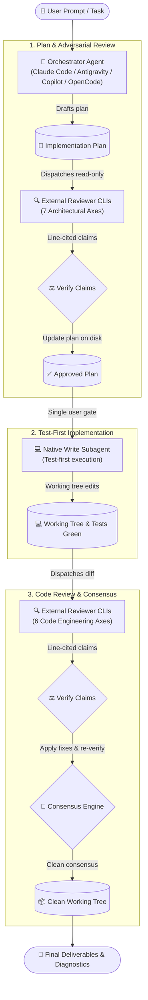

# dispatch-skills

[](package.json)
[](LICENSE)
[](package.json)
[](https://github.com/Gyunikuchan/dispatch-skills)

Four production-grade agent skills for **cross-agent CLI delegation, multi-axis adversarial review, and autonomous consensus** across [Claude Code](https://claude.ai), [Antigravity](https://deepmind.google), [GitHub Copilot](https://github.com/features/copilot), and [OpenCode](https://opencode.ai).

---

## Table of Contents

- [Why Dispatch Skills?](#why-dispatch-skills)
  - [Key Differentiators & Unique Strengths](#key-differentiators--unique-strengths)
  - [What Review Claims Look Like](#what-review-claims-look-like)
- [The Skills Suite](#the-skills-suite)
- [Installation](#installation)
- [Quick Start & Usage Examples](#quick-start--usage-examples)
- [Evaluation Axes Overview](#evaluation-axes-overview)
- [Supported Providers & Requirements](#supported-providers--requirements)
- [Architecture Invariants](#architecture-invariants)
- [Contributing & Local Development](#contributing--local-development)
- [License](#license)

---

## Why Dispatch Skills?

Single-agent coding is stochastic: every prompt is a roll of the dice. Asking the same model to review its own output creates an echo chamber where blind spots and flawed assumptions slip through.

`dispatch-skills` introduces structured cross-agent collaboration, enabling you to harness multiple AI models and subscriptions with zero token bloat and zero human babysitting.



### Key Differentiators & Unique Strengths

| Differentiator | How Dispatch Skills Solves It |
|---|---|
| **🎲 Roll the Dice a Few More Times** | Don't let a single model grade its own homework. Route tasks across fundamentally different model architectures (e.g. Claude Opus/Fable, Gemini 3.8 Flash, GPT-5.6 Luna, DeepSeek, GLM, Qwen) to eliminate blind spots, invariant breaks, and edge cases. |
| **⚖️ Claims, Not Blind Verdicts** | Unlike simplistic voting systems where hallucinating models outvote correct ones, `dispatch-skills` enforces **evidence over votes**. Reviewers must cite exact lines (`<file>:L<line>`) or plan sections (`§ Section`). The orchestrator verifies every claim against code lines and repository rules (`AGENTS.md` / `CLAUDE.md`). If the code refutes it, it is rejected. |
| **💡 Catch Bugs Upfront (1-Shot Economics)** | Catching a premise flaw or missing migration in a plan markdown file costs pennies. Debugging 500 lines of regression-laden code burns thousands of tokens. Plan review before implementation dramatically increases one-shot completion rates. |
| **🛡️ Structural Least Privilege** | Delegate CLIs run in read-only harnesses (`--mode plan` / tool whitelists), guarded against mutating workspace files, touching git history, or leaking credentials. Pre- and post-run git integrity snapshots monitor and flag any unexpected workspace modifications. |
| **🧼 Context Window Hygiene** | Subprocess logs, AST search dumps, and raw execution traces stream out-of-context to OS temp (`os.tmpdir()`). Only dense syntheses and actionable findings enter your active context window, keeping sessions fast and unpoisoned. |
| **💰 Model Arbitrage & Subscription Scaling** | Maximize the value of all your existing AI subscriptions (Claude, Antigravity, Copilot, local LM Studio/Ollama) instead of hitting rate limits on a single provider or overpaying for redundant ultra-high tiers. Work from your favorite IDE while leveraging external models. |
| **⚡ In-Session Real-Time Verification (vs. Lagging CI Bots)** | Review uncommitted working-tree diffs, plans, and walkthroughs live in your active terminal with instant automated fix-and-verify loops—long before code is pushed to a remote PR where much of the context has already been lost. |

---

## The Skills Suite

Each skill is modular, self-contained, and follows strict downward independence:

| Skill | Description | Role & Dependencies |
|---|---|---|
| [`dispatch`](skills/dispatch/README.md) | **Cross-agent CLI delegation bridge**. Routes bounded, read-only tasks to external agent CLIs through a diversity-sorted provider cascade, isolating logs in OS temp. | **Base runner**<br/>*(Depends on: nothing)* |
| [`dispatch-plan-review`](skills/dispatch-plan-review/README.md) | **7-axis pre-implementation plan review**. Evaluates implementation plans *before* code is written, verifies claims against codebase truth, and updates plans on disk. | **Plan Review**<br/>*(Depends on: `dispatch`)* |
| [`dispatch-code-review`](skills/dispatch-code-review/README.md) | **6-axis working-tree code review**. Inspects uncommitted diffs or branch changes, verifies claims against exact `<file>:L<line>` citations, and applies accepted fixes. | **Code Review**<br/>*(Depends on: `dispatch`)* |
| [`implement-dispatch`](skills/implement-dispatch/README.md) | **End-to-end autonomous development loop**. Orchestrates: scope evaluation → plan authoring → plan review → single approval gate → test-first implementation → code review → consensus loop. | **Full Orchestration**<br/>*(Composes: all three skills)* |

---

## Installation

Install all four skills in one command:

```bash
npx skills add Gyunikuchan/dispatch-skills --all
```

Or install individual skills independently:

```bash
# Core delegation bridge
npx skills add Gyunikuchan/dispatch-skills --skill dispatch

# Standalone plan review
npx skills add Gyunikuchan/dispatch-skills --skill dispatch --skill dispatch-plan-review

# Standalone code review
npx skills add Gyunikuchan/dispatch-skills --skill dispatch --skill dispatch-code-review

# End-to-end development loop
npx skills add Gyunikuchan/dispatch-skills --skill dispatch --skill implement-dispatch
```

> [!TIP]
> Add `-g` to install globally across all your projects. When installing multiple skills, ensure they share the **same scope** (all global or all project-local) so companion scripts can resolve siblings.

---

## Quick Start & Usage Examples

### 1. Delegate Bounded Investigations (`/dispatch`)
*Offload deep code traces, architectural questions, or security checks without bloating your active context:*

```markdown
/dispatch Trace how discount stacking is calculated in src/domain/pricing.ts and check for order dependence
```

```markdown
/dispatch --provider claude -m claude-opus-5 -e high Review GraphQL schema for N+1 query vulnerabilities
```

➡️ *Read the full [`dispatch` manual](skills/dispatch/README.md) for provider cascades, file attachments (`-f`), and configuration overrides.*

---

### 2. Adversarial Plan Review (`/dispatch-plan-review`)
*Stress-test an implementation plan across 7 architectural axes before writing any code:*

```markdown
/dispatch-plan-review .scratch/plan/2026-09-14-billing-v2.md focus on idempotency and migration safety
```

```markdown
/dispatch-plan-review (claude,agy) Add token bucket rate limiting to /api/v1/auth endpoints
```

➡️ *Read the full [`dispatch-plan-review` manual](skills/dispatch-plan-review/README.md) for the 7 review axes, adjudication decision tables, and on-disk plan update workflows.*

---

### 3. Working-Tree Code Review & Auto-Fix (`/dispatch-code-review`)
*Get a rigorous second opinion on uncommitted changes, verify claims against cited lines, and apply fixes automatically:*

```markdown
/dispatch-code-review focus on auth boundaries, token lifecycle, and error recovery
```

```markdown
/dispatch-code-review (claude) .scratch/plan/2026-09-14-auth-walkthrough.md
```

➡️ *Read the full [`dispatch-code-review` manual](skills/dispatch-code-review/README.md) for the 6 code engineering axes, line-citation grammar, and verification loops.*

---

### 4. Autonomous End-to-End Development (`/implement-dispatch`)
*Run the complete plan → review → gate → implement → review → consensus lifecycle with a single prompt:*

```markdown
/implement-dispatch high (claude,agy): Refactor session store to use Redis cluster with connection pooling
```

```markdown
/implement-dispatch low: Rename Household.owner field to primaryHolder
```

```markdown
/implement-dispatch max (all): Migrate database schema and state machine to v4
```

➡️ *Read the full [`implement-dispatch` manual](skills/implement-dispatch/README.md) for review levels (`low` to `max`), platform write subagents, and the consensus engine.*

---

## Evaluation Axes Overview

Reviews follow rigorous domain checklists rather than generic open-ended critique:

### Plan Review (7 Axes)
1. **Requirement & Intent Fidelity** (`traceability`, `user-gap`, `scope-creep`)
2. **Domain & Business Logic** (`domain-logic`, `invariant`, `state-machine`)
3. **Plan Coherence & Architecture** (`coherence`, `approach`, `standards`)
4. **Security & Permissions** (`security`, `auth`, `validation`)
5. **Blast Radius & Reversibility** (`blast-radius`, `migration`, `compat`)
6. **Testability & Success Criteria** (`testability`, `spec-gap`)
7. **Simplicity & Failure Modes** (`simplicity`, `yagni`, `edge-case`)

### Code Review (6 Axes)
1. **Architecture & Module Design** (`shallow`, `seam`, `adapter`, `coupling`)
2. **Domain & Business Logic** (`domain-logic`, `invariant`, `unit`, `math`, `runtime`, `type`)
3. **Security & Resource Safety** (`vuln`, `auth`, `leak`, `perf`)
4. **Simplicity & Anti-Bloat** (`yagni`, `reuse`, `stdlib`, `root-cause`)
5. **Blast Radius & Compatibility** (`breaking`, `compat`, `migration`, `scope-creep`)
6. **Test Quality & UI/UX** (`test-gap`, `test-leak`, `ui`, `a11y`)

---

## Supported Providers & Requirements

### System Requirements
- **Runtime**: Node.js `>= 18.0.0` (zero npm runtime dependencies).
- **Git**: Git repository working tree.

### Supported Agent Platforms
`dispatch-skills` works seamlessly whether your host orchestrator or delegate CLI is:

| Platform | CLI Binary | Discovery Modes | Sandboxed Mode |
|---|---|---|---|
| **Claude Code** | `claude` | Standalone CLI, Claude Desktop, VS Code Extension | `--permission-mode plan`, tool allowlists |
| **Antigravity 2.0** | `agy` | Standalone CLI, Antigravity Desktop app, VS Code Extension | `--mode plan` |
| **GitHub Copilot** | `copilot` | Standalone CLI, GitHub Copilot Desktop, VS Code Extension | `--mode plan` |
| **OpenCode** | `opencode` | Standalone CLI (`opencode.jsonc` configured for local or remote LLMs) | Bubblewrap (`bwrap`) sandbox & guardrails |

---

## Architecture Invariants

- **Host-Neutral**: Zero opinions about your codebase are hardcoded. Delegates read repository conventions directly from `AGENTS.md` or `CLAUDE.md` in the workspace root.
- **Single Source of Truth**: All findings and resolutions are appended directly to human-readable on-disk artifacts (`.scratch/plan/*.md` and `.scratch/plan/*-walkthrough.md`) for easy viewing and tracing.

---

## License

MIT © [Gyunikuchan](https://github.com/Gyunikuchan) — see [LICENSE](LICENSE) for details.
