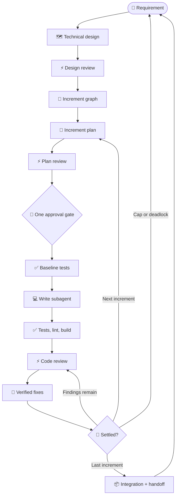

# dispatch-skills

[](package.json)
[](LICENSE)
[](package.json)

Build with more confidence by catching flawed assumptions before they become code. `dispatch-skills` brings independent agents into one development workflow for planning, implementation, and review — without leaving the agent IDE or CLI you prefer. Agents work through their native harnesses, while your host verifies their findings against the real code and carries the work forward.

## Contents

- [Why dispatch-skills?](#why-dispatch-skills)
- [Key differentiators](#key-differentiators)
- [Install](#install)
- [Skills](#skills)
- [Quick start](#quick-start)
- [License](#license)

## Why dispatch-skills?

Most agent workflows ask one model to make the assumptions, do the work, and judge the result. `dispatch-skills` brings other agent platforms into the process. Your host agent keeps control of the working tree, while independent models help plan, review, and cross-check the work. Start with the agent you already use, then add other CLIs when you want another perspective.

For a large change, dispatch breaks the design into smaller increments. Each increment is planned, reviewed, implemented, and verified before the next begins:



Smaller tasks can start later in the same workflow: `/dispatch implement:` begins with a plan, while a standalone review runs only the review step.

## Key differentiators

### Collaborate across agent platforms

| What dispatch does | Why it matters |
|---|---|
| **🔌 Works across native agent platforms** | Keep working in whichever supported agent IDE or CLI you prefer while drawing on models from other platforms. Each delegate uses its native harness and allowed tools. |
| **🎲 Prioritizes independent model families** | Shared blind spots are less likely to survive review. Dispatch asks cross-platform reviewers first and leaves your host platform and active model until last. |

### Improve review quality

| What dispatch does | Why it matters |
|---|---|
| **💡 Reviews designs and plans before implementation** | Catch a missing migration in the plan instead of after hundreds of lines of code, making implementation more likely to succeed on the first pass. |
| **⚖️ Verifies evidence instead of counting votes** | Reviewers cite `file:L<line>` or `§ plan section`, and your host checks each finding against the code and repository instructions. Unsupported or contradicted findings are rejected, while one well-supported defect is enough to act on. |

### Keep operations safe and efficient

| What dispatch does | Why it matters |
|---|---|
| **🛡️ Keeps delegates read-only** | Delegates run without credentials or access to sensitive files. Supported platforms add an OS sandbox for another layer of protection. Only your host agent can edit, and only after you approve the plan. |
| **🧾 Passes focused context between agents** | Scripts handle routing, retries, data formats, artifacts, and logs. Noisy output stays in OS temp, while structured handoffs preserve cited findings and progress for the next phase. |
| **⚡ Reviews changes before the PR** | Review uncommitted work directly in your terminal while its context is still fresh. An automated loop can apply verified fixes and run the checks again. |
| **💰 Spreads work across providers** | Use the CLIs you already pay for, reduce your dependence on any one provider's rate limits, and keep working in your preferred IDE while other models do the reading. |

## Install

```bash
npx skills add Gyunikuchan/dispatch-skills -s '*'
```

Requires Node.js `>=22` and at least one supported agent CLI on your `PATH`:

- Claude Code
- Antigravity
- GitHub Copilot
- OpenCode

Nothing is enabled until you create a config. Copy `skills/dispatch/config.sample.jsonc` to `config.jsonc` (or `config.local.jsonc`) beside it, then keep only the models you actually want to use. Check the resulting configuration with:

```bash
node skills/dispatch/scripts/dispatch.mjs --doctor --level high
```

> [!NOTE]
> Install every skill into the same scope — all project-local or all global (`-g`). The aliases resolve `dispatch` as a sibling, so a mixed install breaks them.

> [!NOTE]
> OS sandboxing degrades rather than fails. Where it is unavailable — native Windows, Linux without Bubblewrap, a provider that rejects the flag — the delegate still runs, read-only but unsandboxed, and says so with a `[dispatch] WARNING:` line and `sandboxDowngraded` in its structured output. Use WSL2 on Windows if you need the sandbox enforced. Antigravity has no sandbox; plan mode is its only write boundary.

See [`skills/dispatch/README.md`](skills/dispatch/README.md) for the config tables, levels, sandboxing, and CLI flags.

## Skills

| Skill | Use it for |
|---|---|
| [`dispatch`](skills/dispatch/README.md) | Everything below, plus one-off delegation. Model- and user-invoked. |
| [`dispatch-plan-review`](skills/dispatch-plan-review/README.md) | Alias for `/dispatch review plan:` |
| [`dispatch-design-review`](skills/dispatch-design-review/README.md) | Alias for `/dispatch review design:` |
| [`dispatch-code-review`](skills/dispatch-code-review/README.md) | Alias for `/dispatch review code:` |
| [`implement-dispatch`](skills/implement-dispatch/README.md) | Alias for `/dispatch implement:` |

The four aliases exist for familiar slash commands only; `dispatch` alone does the work.

## Quick start

```text
/dispatch [level] [(pins)] [ask|plan|design|review|implement]: <argument>
```

Levels `low` … `max` use progressively more targets, review rounds, and capable models. Pins such as `(claude,agy)` or `(all)` choose which configured providers answer.

Ask another model a bounded question:

```text
/dispatch: Trace discount stacking in src/domain/pricing.ts
/dispatch (all): Does the cache invalidation flow have a race?
```

Write a plan, then have other models attack it before you spend tokens on code:

```text
/dispatch high (claude,agy) plan: Add webhook idempotency
/dispatch review plan: .scratch/plan/2026-09-22-webhooks.md
```

Review your working tree or a branch range:

```text
/dispatch review code
/dispatch review code --fix
/dispatch review code: main..HEAD
```

> [!NOTE]
> With no range, a dirty tree is reviewed as its uncommitted changes alone — staged, unstaged, and untracked — and your committed branch work is left out. A clean tree falls back to a branch comparison against `origin/HEAD`, else `main` or `master`. Name a range explicitly when you want commits and uncommitted edits reviewed together.

> [!NOTE]
> Reviews are report-only. Add `--fix` to let verified findings be applied.

Run the whole loop — plan, review, approval gate, implementation, code review to consensus:

```text
/dispatch implement: Add CSV export
/dispatch implement --phases from:code-review: .scratch/plan/2026-09-22-csv.md
```

For work too big for one pass, `design:` splits it into increments and implements them one at a time:

```text
/dispatch design: Migrate the billing state machine
```

> [!NOTE]
> Nothing is ever committed, pushed, or opened as a PR. Interrupted runs resume from their artifacts in `.scratch/plan/`; logs and traces stay out of your context in OS temp.

## License

MIT © [Gyunikuchan](https://github.com/Gyunikuchan). See [LICENSE](LICENSE).
