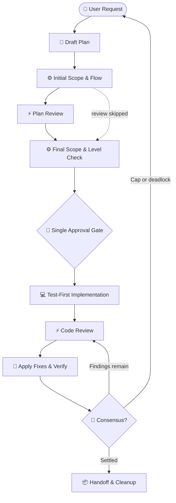

# dispatch-skills

[](package.json)
[](LICENSE)
[](package.json)
[](https://github.com/Gyunikuchan/dispatch-skills)

Composable agent skills for **cross-agent delegation, adversarial review, and autonomous
implementation** across Claude Code, Antigravity, GitHub Copilot, and OpenCode.

Delegates launched through `dispatch` are read-only. The host orchestrator verifies their claims
against the active repository before accepting findings or applying changes; `implement-dispatch`
uses a separate native write subagent for the implementation phase.

---

## Table of Contents

- [Why Dispatch Skills?](#why-dispatch-skills)
  - [Key Differentiators & Unique Strengths](#key-differentiators--unique-strengths)
- [Choose a skill](#choose-a-skill)
- [Installation](#installation)
- [Quick start](#quick-start)
  - [Delegate a bounded task](#delegate-a-bounded-task)
  - [Review a plan before coding](#review-a-plan-before-coding)
  - [Review code changes](#review-code-changes)
  - [Run the full implementation loop](#run-the-full-implementation-loop)
- [Review coverage](#review-coverage)
- [Requirements and provider routing](#requirements-and-provider-routing)
- [License](#license)

---

## Why Dispatch Skills?

Single-agent workflows can miss context, repeat the same assumptions, or discover a design flaw
only after implementation. `dispatch-skills` separates planning, implementation, and review so
each stage can be checked by independent agents while the host retains control of the working
tree.



The design emphasizes:

- **Evidence over votes:** reviewers return claims with plan-section or code-line citations, and
  the orchestrator verifies each claim before accepting it.
- **Early feedback:** plan review catches missing requirements, unsafe assumptions, and migration
  risks before code is written.
- **Bounded context:** delegated traces and tool logs stay out of the host context; only the
  synthesized result is returned.

### Key Differentiators & Unique Strengths

| Differentiator | How Dispatch Skills Solves It |
|---|---|
| **🎲 Roll the Dice a Few More Times** | Don't let a single model grade its own homework. Route tasks across fundamentally different model architectures (e.g. Claude Opus/Fable, Gemini 3.8 Flash, GPT-5.6 Luna, GLM, Qwen) to eliminate blind spots, invariant breaks, and edge cases. |
| **⚖️ Claims, Not Blind Verdicts** | Unlike simplistic voting systems where hallucinating models outvote correct ones, `dispatch-skills` enforces **evidence over votes**. Reviewers must cite exact lines (`<file>:L<line>`) or plan sections (`§ Section`). The orchestrator verifies every claim against code lines and repository rules (`AGENTS.md` / `CLAUDE.md`). If the code refutes it, it is rejected. |
| **💡 Catch Bugs Upfront (1-Shot Economics)** | Catching a premise flaw or missing migration in a plan markdown file costs pennies. Debugging 500 lines of regression-laden code burns thousands of tokens. Plan review before implementation dramatically increases one-shot completion rates. |
| **🛡️ Structural Least Privilege** | Delegate CLIs run in read-only harnesses (`--mode plan` / tool whitelists), guarded against mutating workspace files, touching git history, or leaking credentials. |
| **🧼 Context Window Hygiene** | Subprocess logs, AST search dumps, and raw execution traces stream out-of-context to OS temp (`os.tmpdir()`). Only dense syntheses and actionable findings enter your active context window, keeping sessions fast and unpoisoned. |
| **💰 Model Arbitrage & Subscription Scaling** | Maximize the value of all your existing AI subscriptions (Claude, Antigravity, Copilot, local LM Studio/Ollama) instead of hitting rate limits on a single provider or overpaying for redundant ultra-high tiers. Work from your favorite IDE while leveraging external models. |
| **⚡ In-Session Real-Time Verification (vs. Lagging CI Bots)** | Review uncommitted working-tree diffs, plans, and walkthroughs live in your active terminal with instant automated fix-and-verify loops—long before code is pushed to a remote PR where much of the context has already been lost. |

---

## Choose a skill

| Skill | Use it for | Dependencies |
|---|---|---|
| [`dispatch`](skills/dispatch/README.md) | Delegate a bounded investigation, code trace, or architecture question to another agent CLI. | None |
| [`dispatch-design-review`](skills/dispatch-design-review/README.md) | Author and review technical designs and increment dependency graphs before implementation. | `dispatch` required |
| [`dispatch-plan-review`](skills/dispatch-plan-review/README.md) | Review or author a plan before implementation, then fold verified findings back into the plan. | `dispatch` required |
| [`dispatch-code-review`](skills/dispatch-code-review/README.md) | Review staged, unstaged, untracked, or branch changes, then apply verified fixes. | `dispatch` required |
| [`implement-dispatch`](skills/implement-dispatch/README.md) | Run scope evaluation, plan review, one approval gate, implementation, code review, and consensus. | `dispatch` required; review skills optional |

If an optional review companion is not installed, `implement-dispatch` skips that phase and reports
the reduced workflow.

---

## Installation

Install the complete suite:

```bash
npx skills add Gyunikuchan/dispatch-skills -s '*'
```

Install only the skills you need:

```bash
# Delegation
npx skills add Gyunikuchan/dispatch-skills --skill dispatch

# Plan review
npx skills add Gyunikuchan/dispatch-skills --skill dispatch --skill dispatch-plan-review

# Design review
npx skills add Gyunikuchan/dispatch-skills --skill dispatch --skill dispatch-design-review

# Code review
npx skills add Gyunikuchan/dispatch-skills --skill dispatch --skill dispatch-code-review

# End-to-end implementation
npx skills add Gyunikuchan/dispatch-skills --skill dispatch --skill implement-dispatch
```

Add `-g` to install globally. Keep companion skills in the same scope: install all of them
project-local or all of them globally so sibling scripts can resolve one another.

---

## Quick start

### Delegate a bounded task

```text
/dispatch Trace how discount stacking is calculated in src/domain/pricing.ts
/dispatch --provider claude Review the GraphQL schema for N+1 query risks
```

Use `-f <path>` to attach a file, `-m <model>` to override the model, `-e <level>` to override
reasoning effort, and `-t <seconds>` to override the timeout. Use `(<pins>)` or
`--provider <key>` when a specific configured platform should be used.

### Review a plan before coding

```text
/dispatch-plan-review .scratch/plan/2026-09-08-billing-engine.md
/dispatch-plan-review (all) focus on backward compatibility and data migrations
```

If no plan exists, pass the requirement and the skill authors a scratch plan before reviewing it.
Run the command again after edits for a targeted subsequent round.

### Review code changes

```text
/dispatch-code-review
/dispatch-code-review focus on auth boundaries, token lifecycle, and error handling
/dispatch-code-review .scratch/plan/2026-09-08-auth-v2-walkthrough.md
```

Dirty trees review staged, unstaged, and untracked changes. A clean tree is reviewed against the
branch base. Accepted fixes are verified and recorded in the walkthrough.

### Run the full implementation loop

```text
/implement-dispatch Add a CSV export button to the transactions table
/implement-dispatch high (claude,copilot): Refactor payment webhook idempotency
/implement-dispatch max (all): Migrate the database schema and state machine to v4
```

Levels are `low`, `medium`, `high`, `xhigh`, and `max`. The scope gate selects `low` through
`high` automatically; `xhigh` and `max` are explicit. The workflow never commits, pushes, creates
branches, or opens pull requests.

---

## Review coverage

`dispatch-plan-review` evaluates eight axes: requirement and intent fidelity, domain logic, plan
coherence and architecture, security and permissions, blast radius and reversibility, robustness
and failure modes, testability and success criteria, and simplicity. Reviewers also report
adjacent defects they meet in existing code.

`dispatch-code-review` evaluates nine axes: requirement and intent fidelity, architecture and
module design, domain logic, robustness and failure modes, security and resource safety,
simplicity and anti-bloat, blast radius and compatibility, test quality and UI/UX, and host
standards, plus adjacent defects outside the diff.

Both review skills require evidence for actionable findings and classify claims as accepted,
rejected, downgraded, or disputed. See the individual manuals for their finding grammar,
adjudication rules, and artifact lifecycle.

---

## Requirements and provider routing

- Node.js `>=22`, as declared by [`package.json`](package.json).
- A Git repository working tree.
- At least one available provider CLI, unless the host uses the documented in-process fallback.

| Platform key | Provider CLI |
|---|---|
| `claude` | Claude Code (`claude`) |
| `agy` | Antigravity (`agy`) |
| `copilot` | GitHub Copilot (`copilot`) |
| `opencode` | OpenCode (`opencode`) |

Provider availability is environment and configuration dependent. No default configuration ships,
so from a fresh checkout nothing is enabled until you create a config — copy the skill's
`config.sample.jsonc` to `config.jsonc` (or `config.local.jsonc`) beside it (`dispatch` owns
provider routing; `implement-dispatch` ships a sample for its review policy; the two review
skills have no configuration file). Then inspect the effective dispatch keys with:

```bash
node skills/dispatch/scripts/dispatch.mjs --list-platforms
```

Configuration is loaded per skill with first-match
precedence: `config.local.jsonc`, then `config.jsonc`; the selected file replaces the
lower-priority file rather than merging with it.

---

## License

MIT © [Gyunikuchan](https://github.com/Gyunikuchan) — see [LICENSE](LICENSE) for details.
