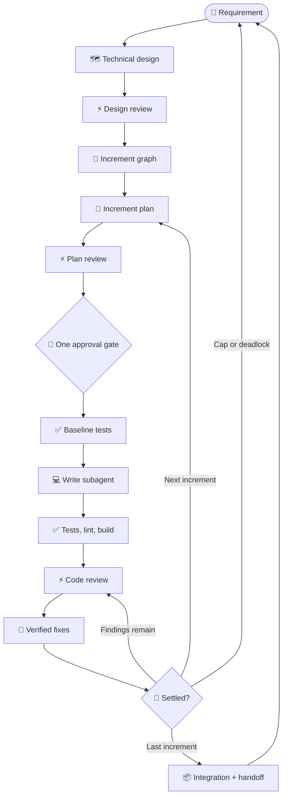

# dispatch-skills

[](package.json)
[](LICENSE)
[](package.json)

Build with more confidence by catching flawed assumptions before they become code. `dispatch-skills` brings independent agents into one development workflow for planning, implementation, and review — without leaving the agent IDE or CLI you prefer. Agents work through their native harnesses, while your host agent verifies their findings against the real code and carries the work forward.

## Contents

- [Why dispatch-skills?](#why-dispatch-skills)
- [Key differentiators](#key-differentiators)
- [Install](#install)
- [Skills](#skills)
- [Quick start](#quick-start)
- [License](#license)

## Why dispatch-skills?

Most agent workflows ask one model to make the assumptions, do the work, and judge the result. `dispatch-skills` brings other agent platforms into the process. Your host agent keeps control of the working tree, while independent models help plan, review, and cross-check the work. Start with the agent you already use, then add other CLIs when you want another perspective.

For a large change, dispatch breaks the design into smaller increments. Each increment is planned, reviewed, implemented, and verified before the next begins:


```mermaid
flowchart TD
    User(["👤 Requirement"]) --> Design["🗺️ Technical design"]
    Design --> DesignReview["⚡ Design review"]
    DesignReview --> Increments["🧩 Increment graph"]
    Increments --> Plan["📝 Increment plan"]
    Plan --> PlanReview["⚡ Plan review"]
    PlanReview --> Gate{"🛑 One approval gate"}
    Gate --> Baseline["✅ Baseline tests"]
    Baseline --> Implement["💻 Write subagent"]
    Implement --> Verify["✅ Tests, lint, build"]
    Verify --> CodeReview["⚡ Code review"]
    CodeReview --> Fix["🔧 Verified fixes"]
    Fix --> Consensus{"🔄 Settled?"}
    Consensus -->|Findings remain| CodeReview
    Consensus -->|Next increment| Plan
    Consensus -->|Last increment| Integration["📦 Integration + handoff"]
    Consensus -->|Cap or deadlock| User
    Integration --> User
```

Smaller tasks can start later in the same workflow: `/dispatch implement:` begins with a plan, while a standalone review runs only the review step.

## Key differentiators

### Collaborate across agent platforms

| What dispatch does | Why it matters |
|---|---|
| **🔌 Works across native agent platforms** | Keep working in whichever supported agent IDE or CLI you prefer while drawing on models from other platforms. Each delegate uses its native harness and allowed tools. |
| **🎲 Prioritizes independent model families** | Shared blind spots are less likely to survive review. Dispatch asks cross-platform reviewers first and leaves your host platform and active model until last. |

### Improve review quality

| What dispatch does | Why it matters |
|---|---|
| **💡 Reviews designs and plans before implementation** | Catch a missing migration in the plan instead of after hundreds of lines of code, making implementation more likely to succeed on the first pass. |
| **⚖️ Verifies evidence instead of counting votes** | Reviewers cite `file:L<line>` or `§ plan section`, and your host agent checks each finding against the code and repository instructions. Unsupported or contradicted findings are rejected, while one well-supported defect is enough to act on. |

### Keep operations safe and efficient

| What dispatch does | Why it matters |
|---|---|
| **🛡️ Keeps read delegates read-only** | Ambient credential variables are stripped; sensitive attachments are rejected. Native authenticated state remains available, and prompt guardrails guide file reads. Supported platforms add an OS sandbox for another layer of protection. After plan approval, a writer on the host platform makes production changes. |
| **🧾 Passes focused context between agents** | Scripts handle routing, retries, data formats, artifacts, and logs. Noisy output stays in session files, while structured handoffs preserve cited findings and progress for the next phase. |
| **⚡ Reviews changes before the PR** | Review uncommitted work directly in your terminal while its context is still fresh. An automated loop can apply verified fixes and run the checks again. |
| **💰 Spreads work across providers** | Use the CLIs you already pay for, reduce your dependence on any one provider's rate limits, and keep working in your preferred IDE while other models do the reading. |

## Install

```bash
# Latest from main
npx skills add Gyunikuchan/dispatch-skills -s '*'

# Specific branch or tag
npx skills add Gyunikuchan/dispatch-skills#<branch-or-tag> -s '*'
```

Requires Node.js `^22.18 || >=23.6` with native TypeScript stripping and at least one supported agent CLI on your `PATH`:

- Claude Code
- Antigravity
- GitHub Copilot
- OpenCode
- Codex

Nothing is enabled until you create a config. Copy `skills/dispatch/config.sample.jsonc` to `config.jsonc` (or `config.local.jsonc`) beside it, then keep only the models you actually want to use. Check the resulting configuration with:

```bash
node skills/dispatch/scripts/dispatch.ts doctor --level high
```

> [!NOTE]
> Install every skill into the same scope — all project-local or all global (`-g`). The aliases resolve `dispatch` as a sibling, so a mixed install breaks them.

> [!NOTE]
> Dispatch requests OS sandboxing by default where a provider and execution mode support it. Doctor reports when sandboxing is unsupported. Setting `sandbox: false` opts that provider out of OS isolation; provider-specific read-only controls may still apply, but they are not the same boundary. Antigravity uses plan mode as its write boundary.

See [`skills/dispatch/README.md`](skills/dispatch/README.md) for the Dispatch user guide, workflow choices, configuration, and troubleshooting.

## Skills

| Skill | Use it for |
|---|---|
| [`dispatch`](skills/dispatch/README.md) | Everything below, plus one-off delegation. User-invoked. |
| [`dispatch-plan-review`](skills/dispatch/references/readme/review.md) | Alias for `/dispatch review plan:` |
| [`dispatch-design-review`](skills/dispatch/references/readme/review.md) | Alias for `/dispatch review design:` |
| [`dispatch-code-review`](skills/dispatch/references/readme/review.md) | Alias for `/dispatch review code:` |
| [`dispatch-implement`](skills/dispatch/references/readme/implement.md) | Alias for `/dispatch implement:` |

The four aliases exist for familiar slash commands only; `dispatch` alone does the work.

## Quick start

```text
/dispatch [level] [(pins)] [ask|design|plan|review|implement]: <argument>
```

Levels `low` … `max` select configured model and review-policy presets; the sample configuration increases review breadth at higher levels. Pins such as `(claude,agy)` or `(all)` choose which configured providers answer.

Ask another model a bounded question:

```text
/dispatch: Trace discount stacking in src/domain/pricing.ts
/dispatch (all): Does the cache invalidation flow have a race?
```

Write a plan, then optionally run an additional review pass:

```text
/dispatch high (claude,agy) plan: Add webhook idempotency
/dispatch review: .scratch/dispatch-skills/<folder>/webhooks.plan.md
```

The plan runs the review and fix rounds enabled by its level's `plan-review` policy. The second command is another pass; Dispatch infers that a `.plan.md` file is a plan.

Review your working tree or a branch range:

```text
/dispatch review code
/dispatch review code --fix
/dispatch review code: main..HEAD
```

> [!NOTE]
> With no range, a dirty tree is reviewed as its uncommitted changes alone — staged, unstaged, and untracked — and your committed branch work is left out. A clean tree has no reviewable changes. Name a range explicitly to review committed changes.

> [!NOTE]
> Reviews are report-only. Add `--fix` to let verified findings be applied.

With `--fix`, your host agent rules on findings, applies accepted safe fixes, and verifies and reviews the changes again within the configured round limit. Disputed or intent-dependent findings can still be escalated to you.

Run the whole loop — plan, review, approval gate, implementation, code review to settlement:

```text
/dispatch implement: Add CSV export
/dispatch implement: .scratch/dispatch-skills/<folder>/csv.plan.md
```

For work too big for one pass, `design:` creates and reviews an increment graph. Approve the design, then invoke `implement:` on its artifact to deliver the increments:

```text
/dispatch design: Migrate the billing state machine
```

> [!NOTE]
> Nothing is ever committed, pushed, or opened as a PR. Interrupted runs resume from their session artifacts; logs and traces stay out of your context. The handoff reports the full session folder path.

## License

MIT © [Gyunikuchan](https://github.com/Gyunikuchan). See [LICENSE](LICENSE).
