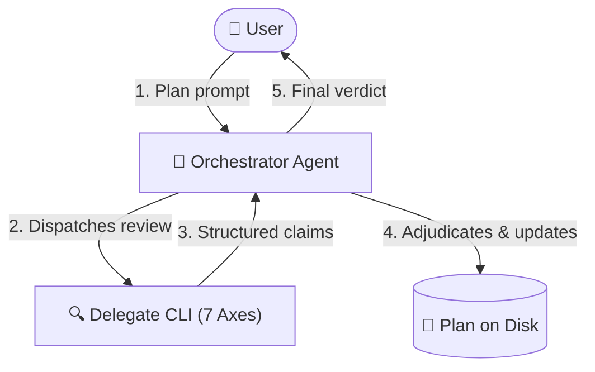

# dispatch-plan-review

Get a rigorous second opinion on an implementation plan **before** any code is written, then adjudicate findings against project truth.

---

## What It Does

Writing code against an untested or flawed plan leads to wasted cycles, rework, and subtle regressions. `dispatch-plan-review` automates cross-agent plan evaluation by delegating the review of implementation plans to an external coding-agent CLI (e.g. Claude Code, Antigravity, GitHub Copilot, or Local OpenCode).

The core philosophy is **claim vs. verdict**:
1. **Delegate produces claims**: An external delegate CLI inspects the plan and targeted codebase context, returning structured claims across seven architectural and domain axes.
2. **Orchestrator adjudicates**: Your primary orchestrator agent (who holds the conversation history and full context) verifies every claim against the original requirement, repository rules (`AGENTS.md` / `CLAUDE.md`), and actual code lines.
3. **Plan updated in place**: Accepted findings are directly folded into the implementation plan file on disk, logging resolutions and escalating true ambiguities to the user.



---

## Prerequisites & Installation

### Prerequisites
- **Node.js**: `v18.0.0` or higher.
- **`dispatch` skill installed**: Required for the cross-agent CLI runner.
- **At least one agent CLI** installed or reachable on your system:
  - **Claude Code**: Claude Desktop, VS Code extension, or standalone CLI (`claude`).
  - **Antigravity 2.0**: Antigravity Desktop app, VS Code extension, or CLI (`agy`).
  - **GitHub Copilot**: Copilot CLI or VS Code extension CLI (`copilot`).
  - **Local OpenCode**: `opencode` binary with a local LM Studio server at `http://127.0.0.1:1234/v1`.

### Installation

Install `dispatch-plan-review` and its core runner into your project workspace:

```bash
# Install both skills
npx skills add Gyunikuchan/dispatch-skills --skill dispatch
npx skills add Gyunikuchan/dispatch-skills --skill dispatch-plan-review
```

To install globally for all projects:

```bash
npx skills add -g Gyunikuchan/dispatch-skills --skill dispatch dispatch-plan-review
```

To install the entire suite (`dispatch`, `dispatch-plan-review`, `dispatch-code-review`, `implement-dispatch`):

```bash
npx skills add Gyunikuchan/dispatch-skills --all
```

---

## How to Use

Trigger `dispatch-plan-review` directly via the slash command `/dispatch-plan-review` (or natural language) in your agent chat session. You do not need to call any scripts manually—the agent will assemble context, dispatch the task, adjudicate the findings, and update the plan.

### 1. Basic Plan Review

Review the current active plan or an existing plan file:

```markdown
/dispatch-plan-review
```

```markdown
/dispatch-plan-review .scratch/plan/2026-09-08-billing-engine.md
```

### 2. Targeting Specific Review Focus Areas

Pass focus areas directly after the command:

```markdown
/dispatch-plan-review focus on backward compatibility and data migrations
```

```markdown
/dispatch-plan-review .scratch/plan/2026-09-08-auth-v2.md focus on trust boundaries and session revocation
```

### 3. Pinning a Reviewer Provider

Guide the orchestrator to route the plan review to a specific external CLI:

```markdown
/dispatch-plan-review --provider claude
```

```markdown
/dispatch-plan-review --provider agy focus on state-machine lifecycles
```

### 4. Reviewing Without a Pre-Existing Plan File

If no plan file exists yet, simply describe the feature and request a plan review. The orchestrator will automatically author a structured plan under `.scratch/plan/<yyyy-mm-dd>-<slug>.md` before dispatching it:

```markdown
/dispatch-plan-review Create a plan for replacing redis-pubsub with Postgres LISTEN/NOTIFY
```

---

## High-Level Behavior & Invariants

- **Claim vs. Verdict Separation**: The external delegate's output is strictly a set of *claims*, not an authoritative verdict. The orchestrator independently verifies every defect citation against lines of code and requirements before accepting it.
- **Evidence Over Votes**: Provider agreement is context, not evidence. If two delegates flag a non-existent issue, the orchestrator rejects it. If one delegate discovers a valid subtle boundary bug, the orchestrator accepts it.
- **Plan File Updated on Disk**: Accepted changes are not just printed in the chat; they are actively written back to the target plan file (`Proposed Changes`, `Verification Plan`, `Rollback & Blast Radius`), keeping the on-disk plan as the single source of truth for the implementation phase.
- **Interactive Dispute Escalation**: When a claim touches ambiguous domain intent, trade-offs, or unverified external figures, the orchestrator will pause and ask you via interactive questions (`ask_question`) before modifying the plan.
- **Structured Plan Resolution Order**:
  1. *Explicit user-provided path* (e.g. `.scratch/plan/2026-09-08-feature.md`).
  2. *Platform-native plan* (e.g. Antigravity's `implementation_plan.md` artifact).
  3. *Auto-authored plan* under `.scratch/plan/<yyyy-mm-dd>-<slug>.md`.
- **Targeted Grounding**: Delegate CLIs perform fast, targeted inspection (checking only files named in proposed changes and immediate call sites) rather than unbounded codebase scans, keeping turnaround quick and tokens focused.

---

## The Seven Evaluation Axes

Every plan is evaluated across seven rigorous dimensions:

| Axis | Focus Tags | What Is Evaluated |
|---|---|---|
| **Requirement & Intent Fidelity** | `traceability`, `user-gap`, `scope-creep` | Bidirectional mapping between requirements and proposed changes; catches premise flaws, XY problems, and unrequested scope creep. |
| **Domain & Business Logic** | `domain-logic`, `invariant`, `state-machine` | Business rule adherence, sign/unit discrepancies, domain invariant preservation across multi-step mutations, and valid lifecycle states. |
| **Plan Coherence & Architecture** | `coherence`, `approach`, `standards` | Producer-consumer contract alignment, correct sequencing, modular layering boundaries, and repository conventions (`AGENTS.md` / `CLAUDE.md`). |
| **Security & Permissions** | `security`, `auth`, `validation` | Trust boundaries, tenant isolation, authentication/authorization flows, role checks, and input sanitization boundaries. |
| **Blast Radius & Reversibility** | `blast-radius`, `migration`, `compat` | Downstream caller impact, persisted schema migrations, serialization compatibility, and concrete rollback/reversibility strategies. |
| **Testability & Success Criteria** | `testability`, `spec-gap` | Checkable acceptance criteria, named automated tests (unit/integration/e2e), and clear pass/fail definitions. |
| **Simplicity & Failure Modes** | `simplicity`, `yagni`, `edge-case` | Simplicity ladder (delete requirement → reuse existing helpers → standard library → new code), YAGNI violations, and boundary/error failure modes. |

---

## Finding Grammar & Adjudication Table

### Standard Finding Grammar

Every finding returned by the reviewer follows a strict single-line grammar:

```
## <Section> — <tag>: <defect> → <required change>
```

Example report:
```markdown
## Verdict
Safe to implement once the two MUST-FIX items land.

## Axis Coverage
Requirement & Intent Fidelity: clean
Domain & Business Logic: clean
Plan Coherence & Architecture: clean
Security & Permissions: clean
Blast Radius & Reversibility: 1 finding
Testability & Success Criteria: 1 finding
Simplicity & Failure Modes: 1 finding

## MUST-FIX
## Proposed Changes — blast-radius: bumps PERSISTED_FORMAT_VERSION with no decoder for v3 payloads → add a v3→v4 migration path before the bump.

## SHOULD-FIX
## Verification Plan — testability: "allocation looks right" is not checkable → specify exact test fixture and balance assertion in src/tests/allocation.test.ts.

## CONSIDER
## Proposed Changes — simplicity: new `AllocationVisitor` has only one implementation → inline it until a second strategy is needed.

## Shorter Path
None — the plan is already minimal.
```

### Adjudication Decision Table

The orchestrator maps each claim to an adjudication action:

| Verdict | Criterion | Orchestrator Action |
|---|---|---|
| **Accept** | Requirement or repository rule confirms the defect. | Apply changes directly into plan sections; log under `## Review Findings & Resolutions`. |
| **Reject** | Contradicted by plan/code, target section missing, already planned, or unverifiable. | Drop from plan; record rejection rationale in resolutions log. |
| **Downgrade** | Real but trivial (style, cosmetic, or speculative). | Fold into *Out of Scope* or drop; log in resolutions log. |
| **Disputed** | Unsettleable from plan alone (intent, deliberate trade-off). | Escalate to user via interactive prompt; apply user decision verbatim. |

---

## Nuances, Quirks & Troubleshooting

### Self-Skipping Runner Behavior
By default, the underlying `dispatch` runner will avoid delegating to the orchestrator's own platform (e.g. Claude Code will not dispatch to Claude Code) in order to obtain a truly differentiated second opinion. If only one CLI is installed, request `--allow-same-agent` or let it degrade to native subagents.

### Host Convention Reading
Delegates do not require manual rule configuration. They automatically inspect the workspace's `AGENTS.md` or `.claude/CLAUDE.md` to evaluate your repository-specific idioms, architectural constraints, and coding standards.

### Reviewing Transient Antigravity Plans
When running inside Antigravity, the orchestrator automatically detects the active `implementation_plan.md` artifact from the current session brain directory. You do not need to copy or export it manually.

### False Claims on Uncommitted Code
Delegates inspect the files present on disk. If your plan refers to code changes from an uncommitted draft branch or unstaged stash that is not present in the workspace, the delegate may flag them as missing symbols. Ensure workspace dependencies and referenced files exist before running review.

---

## Pairs With

- **`dispatch`**: The core cross-agent execution bridge and CLI provider cascade (required).
- **`dispatch-code-review`**: The companion skill for cross-agent code reviews once implementation is complete.
- **`implement-dispatch`**: Full automated workflow combining planning, plan review, execution, and code review into a single pipeline.

