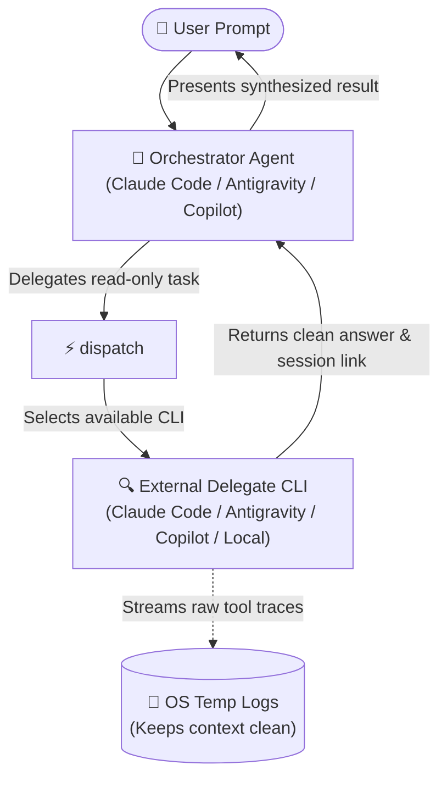

# dispatch

Hand bounded, read-only tasks to external coding-agent CLIs and receive clean, synthesized results without polluting your primary agent's context window.

---

## What It Does

When working with an AI coding assistant (the **orchestrator**—like Claude Code, Antigravity, or GitHub Copilot), complex investigations, code trace requests, or plan reviews can flood the context window with hundreds of lines of raw search outputs and intermediate tool calls.

`dispatch` solves this by acting as a **cross-agent delegation bridge**:
1. **Delegates bounded read-only work** to an external agent CLI (Claude Code, Antigravity 2.0, Copilot, or Local OpenCode).
2. **Runs in isolation** in the background, redirecting verbose execution traces to OS temp logs.
3. **Returns only the synthesized answer** along with a persistent session handle or canvas deep-link.
4. **Preserves the orchestrator's role**: The orchestrator keeps the user brief, judgment, workspace file edits, and git commits.



---

## Prerequisites & Installation

### Prerequisites
- **Node.js**: `v18.0.0` or higher.
- **At least one agent CLI** installed or reachable on your system:
  - **Claude Code**: Claude Desktop, Claude VS Code Extension, or standalone CLI (`claude`).
  - **Antigravity 2.0**: Antigravity Desktop app, VS Code extension, or CLI (`agy`).
  - **GitHub Copilot**: GitHub Copilot Desktop, Copilot CLI, or VS Code Extension CLI (`copilot`).
  - **OpenCode**: `opencode` binary with a running LM Studio server at `http://127.0.0.1:1234/v1`.

### Installation

Install `dispatch` into your current project workspace:

```bash
npx skills add Gyunikuchan/dispatch-skills --skill dispatch
```

To install globally for all projects:

```bash
npx skills add -g Gyunikuchan/dispatch-skills --skill dispatch
```

To install all skills in the suite (`dispatch`, `dispatch-plan-review`, `dispatch-code-review`, `implement-dispatch`):

```bash
npx skills add Gyunikuchan/dispatch-skills --all
```

---

## How to Use

Trigger `dispatch` directly via the slash command `/dispatch` (or natural language) in your agent chat session. You do not need to invoke lower-level scripts manually.

### 1. Basic Invocations

Delegate an investigation or trace task:

```markdown
/dispatch Investigate why token refreshes fail silently in src/auth/session.ts
```

```markdown
/dispatch Trace how discount stacking is calculated in src/domain/pricing.ts
```

### 2. Attaching Files & Context (`-f`)

Include specific files as bounded attachments:

```markdown
/dispatch -f src/services/payment.ts -f src/types/billing.ts Check for race conditions in charge capture
```

### 3. Pinning a Specific Provider (`--provider`)

Force delegation to a specific provider and bypass the automatic fallback cascade:

```markdown
/dispatch --provider agy Analyze the state transitions in src/workflow/engine.ts
```

```markdown
/dispatch --provider claude Review our GraphQL schema definition for N+1 vulnerabilities
```

### 4. Overriding Model & Reasoning Effort (`-m`, `-e`)

Specify custom models or higher reasoning effort when needed:

```markdown
/dispatch --provider copilot -m gpt-5.6-luna -e max Audit src/crypto/tokens.ts for timing attacks
```

---

## Options & Flags Reference

When invoking `/dispatch` (or reviewing execution plans), the following flags are supported:

| Option / Flag | Description | Example Slash Command / Usage |
|---|---|---|
| `-f <path>` | Attach context files (repeatable; capped at 128 KB/file, 512 KB total). | `/dispatch -f src/api.ts Audit error handling` |
| `--provider <name>` | Pin provider (`claude`, `agy`, `copilot`, `opencode`); disables cascading. | `/dispatch --provider agy Trace workflow state` |
| `-m <model>` | Override the default delegate model. | `/dispatch -m claude-opus-5 Review core types` |
| `-e <level>` | Override reasoning effort (`low`, `medium`, `high`, `max`). | `/dispatch -e max Verify crypto primitives` |
| `-t <sec>` | Override execution timeout (default: `1800` seconds / 30 mins). | `/dispatch -t 300 Quick dependency check` |
| `--allow-same-agent` | Allow cascading back to the orchestrator's own CLI as a last resort. | `/dispatch --allow-same-agent Analyze query plan` |
| `--orchestrator <name>` | Override auto-detected host platform (`claude`, `agy`, `copilot`, `opencode`). | `/dispatch --orchestrator claude ...` |
| `--json` | Request structured JSON output (OpenCode provider only). | `/dispatch --provider opencode --json Parse AST` |
| `-v` | Stream live verbose execution traces to the active terminal. | `/dispatch -v Run complex benchmark trace` |

---

## High-Level Behavior & Invariants

- **Automatic Self-Skipping**: The dispatcher inspects environment markers to identify the host platform (e.g., detecting if it is being run from Claude Code or Antigravity). It skips delegating to the host platform by default to engage a differentiated platform/model for a different opinion and behavior, unless explicitly permitted via `--allow-same-agent`.
- **Strictly Read-Only by Design**: Delegates operate in structurally enforced read-only modes (`--mode plan` on Antigravity and Copilot; read-only tool whitelists on Claude Code; dead-end WAN proxies and credential stripping on Local OpenCode). Delegates **cannot** modify project files or make git commits.
- **Context Window Protection**: Raw terminal logs, tool iterations, and search sweeps are piped to temporary OS log files (`.system_generated/logs` / OS temp). The orchestrating agent receives only the final synthesized summary and session link.
- **Session Continuity & Deep-Links**: When supported, `dispatch` captures and returns session identifiers:
  - **Antigravity 2.0**: `conversation://<id>` deep-links that open directly in the Antigravity desktop canvas.
  - **Claude Code**: `claude --resume <session_id>` command handles.
  - **GitHub Copilot**: `copilot --resume <session_id>` command handles.
- **Pre/Post Git Integrity Checks**: A `git status --porcelain` snapshot is taken before and after every dispatch. Any file modifications created during the run are immediately flagged as integrity warnings.
- **Graceful Degradation**: If every external CLI candidate is missing, unauthenticated, or rate-limited, the runner falls back seamlessly to an in-process native subagent (`research` in Antigravity, `Explore` in Claude Code) or local direct execution without crashing the workflow.

---

## Nuances, Quirks & Troubleshooting

### Binary Auto-Discovery
`dispatch` automatically searches known standard locations across macOS, Linux, and Windows for Desktop applications, VS Code extension bundles, and standalone CLI binaries. You do not need to configure explicit binary paths in your environment.

### Claude Code Sandbox Behavior
When Claude Code dispatches a task to Antigravity, it executes the runner with `dangerouslyDisableSandbox: true`. This is required because Antigravity's local language server binds to a local TCP socket, which is blocked by Claude Code's restricted bash sandbox (`bind: operation not permitted`). Safety remains guaranteed through Antigravity's structural `--mode plan` flag.

### Inspecting In-Flight Progress
If a complex dispatch is taking several minutes, you can inspect the real-time activity log emitted in the launch banner:
```bash
tail -n 30 "<logFilePath>"
```

### Git Integrity False Positives
`dispatch` verifies that the delegate made no file changes. However, concurrent background tasks—such as IDE auto-saves, active file watchers, or background builds running in parallel—can trigger git integrity warnings. Always check which files were touched before assuming a violation.

### OpenCode / LM Studio Setup
To use the `opencode` provider:
1. Start LM Studio and launch the local server at `http://127.0.0.1:1234/v1`.
2. Ensure the `opencode` CLI binary is present on your `PATH`.
3. Dispatch with `--provider opencode` (or `--provider local` for back-compat) or allow the cascade to reach it.
