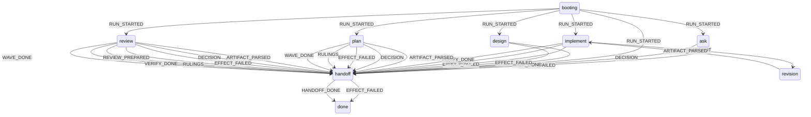
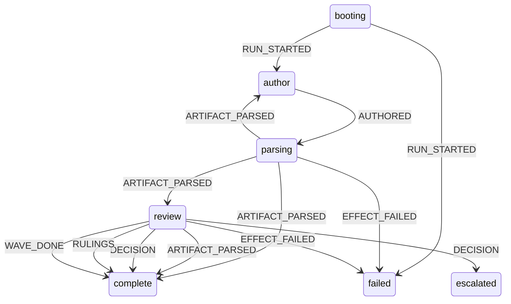

# Dispatch maintainer notes

Generated by `node scripts/diagram.ts --root <root>` from declared transitions.

## root



## design

```mermaid
stateDiagram-v2
  approval --> baseline: DECISION
  approval --> complete: DECISION
  approval --> failed: DECISION
  approval --> revision: REVISE
  author --> parse: AUTHORED
  author --> revision: REVISE
  baseline --> failed: EFFECT_FAILED
  baseline --> failed: SNAPSHOT
  baseline --> increment: SNAPSHOT
  increment --> failed: SNAPSHOT
  increment --> integration: VERIFY_DONE
  increment --> plan-revision: SNAPSHOT
  increment --> revision: REVISE
  integration --> complete: DECISION
  integration --> complete: REVIEW_PREPARED
  integration --> complete: RULINGS
  integration --> complete: WAVE_DONE
  integration --> failed: DECISION
  integration --> failed: EFFECT_FAILED
  integration --> failed: REVIEW_PREPARED
  integration --> failed: RULINGS
  integration --> increment: RULINGS
  integration --> revision: REVISE
  integration --> revision: RULINGS
  parse --> approval: ARTIFACT_PARSED
  parse --> author: ARTIFACT_PARSED
  parse --> baseline: ARTIFACT_PARSED
  parse --> failed: EFFECT_FAILED
  parse --> review: ARTIFACT_PARSED
  plan-revision --> increment: ARTIFACT_PARSED
  plan-revision --> increment: DECISION
  review --> failed: DECISION
  review --> failed: EFFECT_FAILED
  review --> failed: REVIEW_PREPARED
  review --> parse: ARTIFACT_PARSED
  review --> parse: DECISION
  review --> parse: RULINGS
  review --> parse: WAVE_DONE
  review --> revision: REVISE
  revision --> approval: ARTIFACT_PARSED
  revision --> author: ARTIFACT_PARSED
  revision --> failed: ARTIFACT_PARSED
  revision --> failed: EFFECT_FAILED
  revision --> increment: ARTIFACT_PARSED
  revision --> integration: ARTIFACT_PARSED
  revision --> review: ARTIFACT_PARSED
```

## plan



## review

```mermaid
stateDiagram-v2
  booting --> failed: RUN_STARTED
  booting --> prepare: RUN_STARTED
  booting --> skipped: RUN_STARTED
  decide-escalation --> escalated: DECISION
  decide-needs-user --> decide-opt-in: DECISION
  decide-needs-user --> fix: DECISION
  decide-needs-user --> prepare: DECISION
  decide-needs-user --> settled: DECISION
  decide-opt-in --> fix: DECISION
  decide-opt-in --> settled: DECISION
  fix --> fix-verify: FIXES_APPLIED
  fix-verify --> decide-opt-in: ARTIFACT_PARSED
  fix-verify --> decide-opt-in: VERIFY_DONE
  fix-verify --> failed: EFFECT_FAILED
  fix-verify --> fix: ARTIFACT_PARSED
  fix-verify --> fix: VERIFY_DONE
  fix-verify --> prepare: ARTIFACT_PARSED
  fix-verify --> prepare: VERIFY_DONE
  fix-verify --> settled: ARTIFACT_PARSED
  fix-verify --> settled: VERIFY_DONE
  native --> wave: NATIVE_RESULTS
  prepare --> empty: REVIEW_PREPARED
  prepare --> failed: EFFECT_FAILED
  prepare --> wave: REVIEW_PREPARED
  rule --> decide-needs-user: RULINGS
  rule --> decide-opt-in: RULINGS
  rule --> fix: RULINGS
  rule --> prepare: RULINGS
  rule --> settled: RULINGS
  wave --> decide-escalation: WAVE_DONE
  wave --> decide-opt-in: WAVE_DONE
  wave --> failed: EFFECT_FAILED
  wave --> native: WAVE_DONE
  wave --> rule: WAVE_DONE
  wave --> settled: WAVE_DONE
```

## implement

```mermaid
stateDiagram-v2
  approval --> checking-host-event: AUTHORED
  approval --> checking-host-event: DECISION
  approval --> checking-host-event: EVIDENCE
  approval --> checking-host-event: FIXES_APPLIED
  approval --> checking-host-event: NATIVE_RESULTS
  approval --> checking-host-event: REVISE
  approval --> checking-host-event: RULINGS
  approval --> checking-host-event: WRITE_ENVELOPE
  approval --> checking-host-event: WRITE_FAILED
  approval --> needs-user: DECISION
  approval --> stopped: DECISION
  approval --> writing-brief: DECISION
  author --> checking-host-event: AUTHORED
  author --> checking-host-event: DECISION
  author --> checking-host-event: EVIDENCE
  author --> checking-host-event: FIXES_APPLIED
  author --> checking-host-event: NATIVE_RESULTS
  author --> checking-host-event: REVISE
  author --> checking-host-event: RULINGS
  author --> checking-host-event: WRITE_ENVELOPE
  author --> checking-host-event: WRITE_FAILED
  author --> parsing: AUTHORED
  baseline --> baseline-snapshot: VERIFY_DONE
  baseline --> failure-snapshot: EFFECT_FAILED
  baseline-decision --> approval: DECISION
  baseline-decision --> checking-host-event: AUTHORED
  baseline-decision --> checking-host-event: DECISION
  baseline-decision --> checking-host-event: EVIDENCE
  baseline-decision --> checking-host-event: FIXES_APPLIED
  baseline-decision --> checking-host-event: NATIVE_RESULTS
  baseline-decision --> checking-host-event: REVISE
  baseline-decision --> checking-host-event: RULINGS
  baseline-decision --> checking-host-event: WRITE_ENVELOPE
  baseline-decision --> checking-host-event: WRITE_FAILED
  baseline-decision --> stopped: DECISION
  baseline-preflight --> baseline: SNAPSHOT
  baseline-preflight --> failure-snapshot: EFFECT_FAILED
  baseline-snapshot --> approval: SNAPSHOT
  baseline-snapshot --> baseline-decision: SNAPSHOT
  baseline-snapshot --> failed: EFFECT_FAILED
  booting --> starting: RUN_STARTED
  cascade-snapshot --> failure-snapshot: EFFECT_FAILED
  cascade-snapshot --> failure-snapshot: SNAPSHOT
  cascade-snapshot --> restoring: SNAPSHOT
  cascade-snapshot --> write: SNAPSHOT
  checking-envelope --> drift: ENVELOPE_CHECKED
  checking-envelope --> failure-snapshot: EFFECT_FAILED
  checking-envelope --> failure-snapshot: ENVELOPE_CHECKED
  checking-envelope --> snapshot-after-write: ENVELOPE_CHECKED
  checking-host-event --> approval: SNAPSHOT
  checking-host-event --> cascade-snapshot: SNAPSHOT
  checking-host-event --> checking-envelope: SNAPSHOT
  checking-host-event --> code-review: SNAPSHOT
  checking-host-event --> complete: SNAPSHOT
  checking-host-event --> concerns: SNAPSHOT
  checking-host-event --> drift: SNAPSHOT
  checking-host-event --> evidence: SNAPSHOT
  checking-host-event --> failure-snapshot: EFFECT_FAILED
  checking-host-event --> failure-snapshot: SNAPSHOT
  checking-host-event --> failure: SNAPSHOT
  checking-host-event --> hotfix-brief: SNAPSHOT
  checking-host-event --> hotfix-envelope: SNAPSHOT
  checking-host-event --> hotfix-snapshot: SNAPSHOT
  checking-host-event --> needs-user: SNAPSHOT
  checking-host-event --> parsing: SNAPSHOT
  checking-host-event --> plan-review: SNAPSHOT
  checking-host-event --> revision-request: SNAPSHOT
  checking-host-event --> stopped: SNAPSHOT
  checking-host-event --> writing-brief: SNAPSHOT
  code-review --> checking-host-event: AUTHORED
  code-review --> checking-host-event: DECISION
  code-review --> checking-host-event: EVIDENCE
  code-review --> checking-host-event: FIXES_APPLIED
  code-review --> checking-host-event: NATIVE_RESULTS
  code-review --> checking-host-event: REVISE
  code-review --> checking-host-event: RULINGS
  code-review --> checking-host-event: WRITE_ENVELOPE
  code-review --> checking-host-event: WRITE_FAILED
  code-review --> code-review: FIXES_APPLIED
  code-review --> failure-snapshot: DECISION
  code-review --> failure-snapshot: EFFECT_FAILED
  code-review --> post-review-snapshot: DECISION
  code-review --> post-review-snapshot: REVIEW_PREPARED
  code-review --> post-review-snapshot: RULINGS
  code-review --> post-review-snapshot: VERIFY_DONE
  code-review --> post-review-snapshot: WAVE_DONE
  concerns --> checking-host-event: AUTHORED
  concerns --> checking-host-event: DECISION
  concerns --> checking-host-event: EVIDENCE
  concerns --> checking-host-event: FIXES_APPLIED
  concerns --> checking-host-event: NATIVE_RESULTS
  concerns --> checking-host-event: REVISE
  concerns --> checking-host-event: RULINGS
  concerns --> checking-host-event: WRITE_ENVELOPE
  concerns --> checking-host-event: WRITE_FAILED
  concerns --> code-review: DECISION
  concerns --> stopped: DECISION
  drift --> approval: DECISION
  drift --> cascade-snapshot: DECISION
  drift --> checking-envelope: DECISION
  drift --> code-review: DECISION
  drift --> concerns: DECISION
  drift --> evidence: DECISION
  drift --> failure: DECISION
  drift --> parsing: DECISION
  drift --> plan-review: DECISION
  drift --> revision-request: DECISION
  drift --> stopped: DECISION
  drift --> writing-brief: DECISION
  evidence --> checking-host-event: AUTHORED
  evidence --> checking-host-event: DECISION
  evidence --> checking-host-event: EVIDENCE
  evidence --> checking-host-event: FIXES_APPLIED
  evidence --> checking-host-event: NATIVE_RESULTS
  evidence --> checking-host-event: REVISE
  evidence --> checking-host-event: RULINGS
  evidence --> checking-host-event: WRITE_ENVELOPE
  evidence --> checking-host-event: WRITE_FAILED
  evidence --> code-review: EVIDENCE
  evidence --> complete: EVIDENCE
  evidence --> concerns: EVIDENCE
  evidence --> evidence: EVIDENCE
  failure --> checking-host-event: AUTHORED
  failure --> checking-host-event: DECISION
  failure --> checking-host-event: EVIDENCE
  failure --> checking-host-event: FIXES_APPLIED
  failure --> checking-host-event: NATIVE_RESULTS
  failure --> checking-host-event: REVISE
  failure --> checking-host-event: RULINGS
  failure --> checking-host-event: WRITE_ENVELOPE
  failure --> checking-host-event: WRITE_FAILED
  failure --> stopped: DECISION
  failure-snapshot --> failed: EFFECT_FAILED
  failure-snapshot --> failed: SNAPSHOT
  failure-snapshot --> failure: SNAPSHOT
  final-verify --> evidence: VERIFY_DONE
  final-verify --> failure-snapshot: EFFECT_FAILED
  final-verify --> failure-snapshot: VERIFY_DONE
  generated-snapshot --> failure-snapshot: EFFECT_FAILED
  generated-snapshot --> failure-snapshot: SNAPSHOT
  generated-snapshot --> final-verify: SNAPSHOT
  generated-verify --> failure-snapshot: EFFECT_FAILED
  generated-verify --> failure-snapshot: VERIFY_DONE
  generated-verify --> generated-snapshot: VERIFY_DONE
  hotfix-brief --> failure: EFFECT_FAILED
  hotfix-brief --> hotfix-write: BRIEF_READY
  hotfix-envelope --> failure: EFFECT_FAILED
  hotfix-envelope --> failure: ENVELOPE_CHECKED
  hotfix-envelope --> hotfix-snapshot: ENVELOPE_CHECKED
  hotfix-snapshot --> baseline-decision: SNAPSHOT
  hotfix-snapshot --> failure-snapshot: EFFECT_FAILED
  hotfix-snapshot --> failure-snapshot: SNAPSHOT
  hotfix-snapshot --> failure: SNAPSHOT
  hotfix-snapshot --> hotfix-verify: SNAPSHOT
  hotfix-verify --> approval: VERIFY_DONE
  hotfix-verify --> baseline-decision: EFFECT_FAILED
  hotfix-verify --> baseline-decision: VERIFY_DONE
  hotfix-verify --> evidence: VERIFY_DONE
  hotfix-verify --> failure-snapshot: VERIFY_DONE
  hotfix-verify --> failure: EFFECT_FAILED
  hotfix-verify --> failure: VERIFY_DONE
  hotfix-verify --> final-verify: VERIFY_DONE
  hotfix-verify --> scoped-snapshot: VERIFY_DONE
  hotfix-write --> checking-host-event: AUTHORED
  hotfix-write --> checking-host-event: DECISION
  hotfix-write --> checking-host-event: EVIDENCE
  hotfix-write --> checking-host-event: FIXES_APPLIED
  hotfix-write --> checking-host-event: NATIVE_RESULTS
  hotfix-write --> checking-host-event: REVISE
  hotfix-write --> checking-host-event: RULINGS
  hotfix-write --> checking-host-event: WRITE_ENVELOPE
  hotfix-write --> checking-host-event: WRITE_FAILED
  needs-user --> checking-host-event: AUTHORED
  needs-user --> checking-host-event: DECISION
  needs-user --> checking-host-event: EVIDENCE
  needs-user --> checking-host-event: FIXES_APPLIED
  needs-user --> checking-host-event: NATIVE_RESULTS
  needs-user --> checking-host-event: REVISE
  needs-user --> checking-host-event: RULINGS
  needs-user --> checking-host-event: WRITE_ENVELOPE
  needs-user --> checking-host-event: WRITE_FAILED
  needs-user --> stopped: DECISION
  needs-user --> writing-brief: DECISION
  parsing --> author: ARTIFACT_PARSED
  parsing --> author: EFFECT_FAILED
  parsing --> baseline-preflight: ARTIFACT_PARSED
  parsing --> failure-snapshot: ARTIFACT_PARSED
  parsing --> failure-snapshot: EFFECT_FAILED
  parsing --> plan-review: ARTIFACT_PARSED
  plan-review --> checking-host-event: AUTHORED
  plan-review --> checking-host-event: DECISION
  plan-review --> checking-host-event: EVIDENCE
  plan-review --> checking-host-event: FIXES_APPLIED
  plan-review --> checking-host-event: NATIVE_RESULTS
  plan-review --> checking-host-event: REVISE
  plan-review --> checking-host-event: RULINGS
  plan-review --> checking-host-event: WRITE_ENVELOPE
  plan-review --> checking-host-event: WRITE_FAILED
  plan-review --> failure-snapshot: DECISION
  plan-review --> failure-snapshot: EFFECT_FAILED
  plan-review --> parsing: DECISION
  plan-review --> parsing: REVIEW_PREPARED
  plan-review --> parsing: RULINGS
  plan-review --> parsing: VERIFY_DONE
  plan-review --> parsing: WAVE_DONE
  plan-review --> plan-review: FIXES_APPLIED
  post-review-snapshot --> failure-snapshot: EFFECT_FAILED
  post-review-snapshot --> final-verify: SNAPSHOT
  post-review-snapshot --> generated-verify: SNAPSHOT
  red-verify --> failure-snapshot: EFFECT_FAILED
  red-verify --> failure-snapshot: VERIFY_DONE
  red-verify --> writing-brief: VERIFY_DONE
  restoring --> failure-snapshot: EFFECT_FAILED
  restoring --> failure-snapshot: RESTORED
  restoring --> write: RESTORED
  scoped-snapshot --> evidence: SNAPSHOT
  scoped-snapshot --> failure-snapshot: EFFECT_FAILED
  scoped-snapshot --> failure-snapshot: SNAPSHOT
  scoped-snapshot --> scoped-verify: SNAPSHOT
  scoped-verify --> evidence: VERIFY_DONE
  scoped-verify --> failure-snapshot: EFFECT_FAILED
  scoped-verify --> failure-snapshot: VERIFY_DONE
  snapshot-after-write --> failure-snapshot: EFFECT_FAILED
  snapshot-after-write --> failure-snapshot: SNAPSHOT
  snapshot-after-write --> red-verify: SNAPSHOT
  snapshot-after-write --> scoped-snapshot: SNAPSHOT
  snapshot-before-write --> failure-snapshot: EFFECT_FAILED
  snapshot-before-write --> write: SNAPSHOT
  starting --> author: SNAPSHOT
  starting --> failed: EFFECT_FAILED
  starting --> parsing: SNAPSHOT
  write --> cascade-snapshot: WRITE_FAILED
  write --> checking-envelope: WRITE_ENVELOPE
  write --> checking-host-event: AUTHORED
  write --> checking-host-event: DECISION
  write --> checking-host-event: EVIDENCE
  write --> checking-host-event: FIXES_APPLIED
  write --> checking-host-event: NATIVE_RESULTS
  write --> checking-host-event: REVISE
  write --> checking-host-event: RULINGS
  write --> checking-host-event: WRITE_ENVELOPE
  write --> checking-host-event: WRITE_FAILED
  writing-brief --> failure-snapshot: EFFECT_FAILED
  writing-brief --> snapshot-before-write: BRIEF_READY
```


## Diagnostic usage fixture provenance

Extracted from existing dispatch review logs recorded on 2026-10-01. No new provider invocation was made. Each JSON fixture records the full source log's SHA-256 and the CLI version found in that log; response text, tool output, session IDs, paths, prices and account metadata were removed.

- Codex 0.156.1: final `turn.completed.usage` counters. Input includes cache-read tokens; reasoning is a subset of output. Only one completed turn is supported. Repeated identical summaries are deduplicated; distinct multi-turn scopes are unavailable.
- Claude Code 2.1.268: a failed model launch with a recorded auxiliary Haiku call. `usage` is zero for the main loop; `modelUsage` records whole-tree usage by model. Input/cache fields are disjoint. Whole-tree counters take precedence and are never added to main-loop counters. Resumed calls are unavailable because counters may include prior spend.

The [Claude usage contract](https://code.claude.com/docs/en/agent-sdk/cost-tracking) describes main-loop versus whole-tree scope and cumulative resumed results. Fixtures preserve failures deliberately: a failed requested model is not evidence of zero token consumption.
