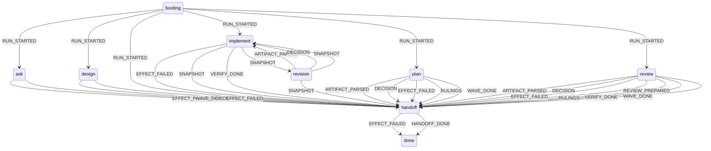
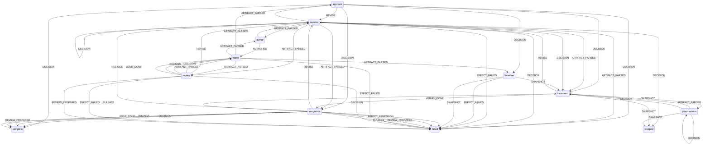
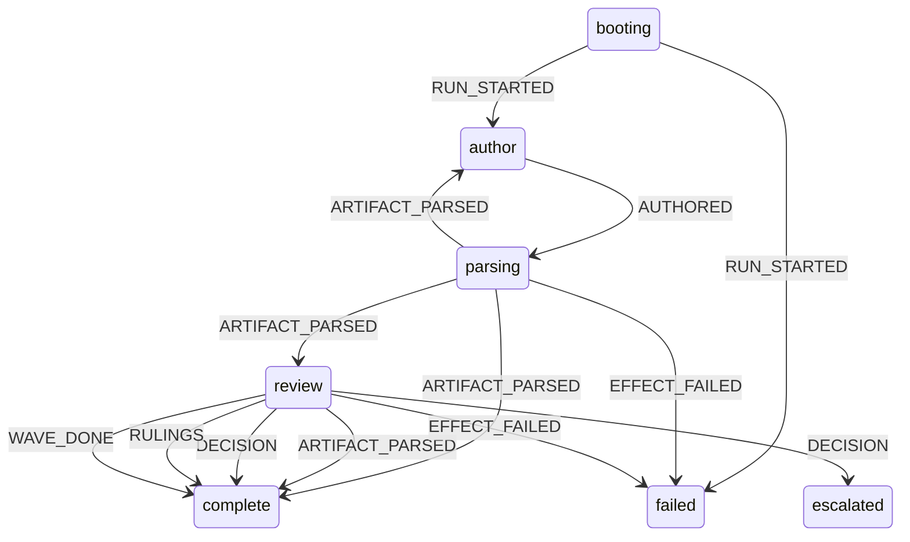
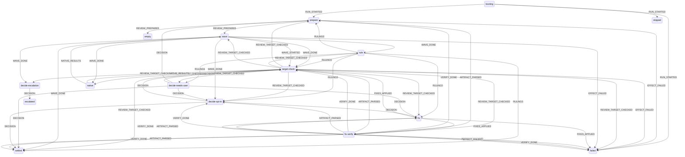

# Dispatch state diagrams

Generated by `node scripts/diagram.ts --root <root>` from declared transitions.

## root

```mermaid
stateDiagram-v2
  state "ask" as S0
  state "booting" as S1
  state "design" as S2
  state "done" as S3
  state "handoff" as S4
  state "implement" as S5
  state "plan" as S6
  state "review" as S7
  state "revision" as S8
  S0 --> S4: EFFECT_FAILED
  S0 --> S4: WAVE_DONE
  S1 --> S0: RUN_STARTED
  S1 --> S2: RUN_STARTED
  S1 --> S4: RUN_STARTED
  S1 --> S5: RUN_STARTED
  S1 --> S6: RUN_STARTED
  S1 --> S7: RUN_STARTED
  S2 --> S4: DECISION
  S2 --> S4: EFFECT_FAILED
  S4 --> S3: EFFECT_FAILED
  S4 --> S3: HANDOFF_DONE
  S5 --> S4: EFFECT_FAILED
  S5 --> S4: SNAPSHOT
  S5 --> S4: VERIFY_DONE
  S5 --> S8: SNAPSHOT
  S6 --> S4: ARTIFACT_PARSED
  S6 --> S4: DECISION
  S6 --> S4: EFFECT_FAILED
  S6 --> S4: RULINGS
  S6 --> S4: WAVE_DONE
  S7 --> S4: ARTIFACT_PARSED
  S7 --> S4: DECISION
  S7 --> S4: EFFECT_FAILED
  S7 --> S4: REVIEW_PREPARED
  S7 --> S4: RULINGS
  S7 --> S4: VERIFY_DONE
  S7 --> S4: WAVE_DONE
  S8 --> S4: SNAPSHOT
  S8 --> S5: ARTIFACT_PARSED
  S8 --> S5: DECISION
  S8 --> S5: SNAPSHOT
```

## design

```mermaid
stateDiagram-v2
  state "approval" as S0
  state "author" as S1
  state "baseline" as S2
  state "complete" as S3
  state "failed" as S4
  state "increment" as S5
  state "integration" as S6
  state "parse" as S7
  state "plan-revision" as S8
  state "review" as S9
  state "revision" as S10
  state "stopped" as S11
  S0 --> S10: REVISE
  S0 --> S2: DECISION
  S0 --> S3: DECISION
  S0 --> S4: DECISION
  S0 --> S5: DECISION
  S0 --> S6: DECISION
  S1 --> S10: REVISE
  S1 --> S7: AUTHORED
  S10 --> S0: ARTIFACT_PARSED
  S10 --> S10: ARTIFACT_PARSED
  S10 --> S10: DECISION
  S10 --> S11: DECISION
  S10 --> S1: ARTIFACT_PARSED
  S10 --> S4: ARTIFACT_PARSED
  S10 --> S4: DECISION
  S10 --> S4: EFFECT_FAILED
  S10 --> S5: ARTIFACT_PARSED
  S10 --> S5: DECISION
  S10 --> S6: ARTIFACT_PARSED
  S10 --> S9: ARTIFACT_PARSED
  S2 --> S4: EFFECT_FAILED
  S2 --> S4: SNAPSHOT
  S2 --> S5: SNAPSHOT
  S5 --> S10: REVISE
  S5 --> S11: SNAPSHOT
  S5 --> S6: VERIFY_DONE
  S5 --> S8: SNAPSHOT
  S6 --> S10: REVISE
  S6 --> S10: RULINGS
  S6 --> S3: DECISION
  S6 --> S3: REVIEW_PREPARED
  S6 --> S3: RULINGS
  S6 --> S3: WAVE_DONE
  S6 --> S4: DECISION
  S6 --> S4: EFFECT_FAILED
  S6 --> S4: REVIEW_PREPARED
  S6 --> S4: RULINGS
  S6 --> S5: RULINGS
  S7 --> S0: ARTIFACT_PARSED
  S7 --> S1: ARTIFACT_PARSED
  S7 --> S2: ARTIFACT_PARSED
  S7 --> S4: EFFECT_FAILED
  S7 --> S9: ARTIFACT_PARSED
  S8 --> S11: SNAPSHOT
  S8 --> S5: ARTIFACT_PARSED
  S8 --> S5: DECISION
  S8 --> S8: ARTIFACT_PARSED
  S8 --> S8: DECISION
  S9 --> S10: REVISE
  S9 --> S4: DECISION
  S9 --> S4: EFFECT_FAILED
  S9 --> S4: REVIEW_PREPARED
  S9 --> S7: ARTIFACT_PARSED
  S9 --> S7: DECISION
  S9 --> S7: RULINGS
  S9 --> S7: WAVE_DONE
```

## plan

```mermaid
stateDiagram-v2
  state "author" as S0
  state "booting" as S1
  state "complete" as S2
  state "escalated" as S3
  state "failed" as S4
  state "parsing" as S5
  state "review" as S6
  S0 --> S5: AUTHORED
  S1 --> S0: RUN_STARTED
  S1 --> S4: RUN_STARTED
  S5 --> S0: ARTIFACT_PARSED
  S5 --> S2: ARTIFACT_PARSED
  S5 --> S4: EFFECT_FAILED
  S5 --> S6: ARTIFACT_PARSED
  S6 --> S2: ARTIFACT_PARSED
  S6 --> S2: DECISION
  S6 --> S2: RULINGS
  S6 --> S2: WAVE_DONE
  S6 --> S3: DECISION
  S6 --> S4: EFFECT_FAILED
```

## review

```mermaid
stateDiagram-v2
  state "booting" as S0
  state "decide-escalation" as S1
  state "decide-needs-user" as S2
  state "decide-opt-in" as S3
  state "empty" as S4
  state "escalated" as S5
  state "failed" as S6
  state "fix" as S7
  state "fix-verify" as S8
  state "native" as S9
  state "prepare" as S10
  state "rule" as S11
  state "settled" as S12
  state "skipped" as S13
  state "target-check" as S14
  state "wave" as S15
  S0 --> S10: RUN_STARTED
  S0 --> S13: RUN_STARTED
  S0 --> S6: RUN_STARTED
  S1 --> S5: DECISION
  S10 --> S15: REVIEW_PREPARED
  S10 --> S4: REVIEW_PREPARED
  S10 --> S6: EFFECT_FAILED
  S11 --> S10: RULINGS
  S11 --> S12: RULINGS
  S11 --> S14: RULINGS
  S11 --> S2: RULINGS
  S11 --> S3: RULINGS
  S11 --> S7: RULINGS
  S14 --> S10: REVIEW_TARGET_CHECKED
  S14 --> S11: REVIEW_TARGET_CHECKED
  S14 --> S12: REVIEW_TARGET_CHECKED
  S14 --> S15: REVIEW_TARGET_CHECKED
  S14 --> S1: REVIEW_TARGET_CHECKED
  S14 --> S2: REVIEW_TARGET_CHECKED
  S14 --> S3: REVIEW_TARGET_CHECKED
  S14 --> S6: EFFECT_FAILED
  S14 --> S6: REVIEW_TARGET_CHECKED
  S14 --> S7: REVIEW_TARGET_CHECKED
  S14 --> S8: REVIEW_TARGET_CHECKED
  S14 --> S9: REVIEW_TARGET_CHECKED
  S15 --> S11: WAVE_DONE
  S15 --> S12: WAVE_DONE
  S15 --> S14: WAVE_DONE
  S15 --> S14: WAVE_STARTED
  S15 --> S1: WAVE_DONE
  S15 --> S3: WAVE_DONE
  S15 --> S6: EFFECT_FAILED
  S15 --> S9: WAVE_DONE
  S2 --> S10: DECISION
  S2 --> S12: DECISION
  S2 --> S14: DECISION
  S2 --> S3: DECISION
  S2 --> S7: DECISION
  S3 --> S12: DECISION
  S3 --> S14: DECISION
  S3 --> S7: DECISION
  S7 --> S14: FIXES_APPLIED
  S7 --> S6: FIXES_APPLIED
  S7 --> S8: FIXES_APPLIED
  S8 --> S10: ARTIFACT_PARSED
  S8 --> S10: VERIFY_DONE
  S8 --> S12: ARTIFACT_PARSED
  S8 --> S12: VERIFY_DONE
  S8 --> S14: ARTIFACT_PARSED
  S8 --> S14: VERIFY_DONE
  S8 --> S3: ARTIFACT_PARSED
  S8 --> S3: VERIFY_DONE
  S8 --> S6: ARTIFACT_PARSED
  S8 --> S6: EFFECT_FAILED
  S8 --> S6: VERIFY_DONE
  S8 --> S7: ARTIFACT_PARSED
  S8 --> S7: VERIFY_DONE
  S9 --> S14: NATIVE_RESULTS
  S9 --> S15: NATIVE_RESULTS
```

## implement

```mermaid
stateDiagram-v2
  state "approval" as S0
  state "author" as S1
  state "baseline" as S2
  state "baseline-decision" as S3
  state "baseline-preflight" as S4
  state "baseline-snapshot" as S5
  state "booting" as S6
  state "checking-host-event" as S7
  state "code-review" as S8
  state "complete" as S9
  state "concerns" as S10
  state "delivered-snapshot" as S11
  state "drift" as S12
  state "evidence" as S13
  state "failed" as S14
  state "failure" as S15
  state "failure-snapshot" as S16
  state "final-verify" as S17
  state "generated-snapshot" as S18
  state "generated-verify" as S19
  state "hotfix-brief" as S20
  state "hotfix-envelope" as S21
  state "hotfix-snapshot" as S22
  state "hotfix-verify" as S23
  state "hotfix-write" as S24
  state "level-classification" as S25
  state "level-recommendation" as S26
  state "needs-user" as S27
  state "parsing" as S28
  state "plan-review" as S29
  state "post-review-snapshot" as S30
  state "revision-request" as S31
  state "scope-adjudication" as S32
  state "scope-drain-envelope" as S33
  state "scope-draining" as S34
  state "scope-user-decision" as S35
  state "starting" as S36
  state "stopped" as S37
  state "task-brief" as S38
  state "task-checkout" as S39
  state "task-envelope" as S40
  state "task-verify" as S41
  state "tasks" as S42
  S0 --> S25: DECISION
  S0 --> S27: DECISION
  S0 --> S37: DECISION
  S0 --> S39: DECISION
  S0 --> S7: AUTHORED
  S0 --> S7: DECISION
  S0 --> S7: EVIDENCE
  S0 --> S7: FIXES_APPLIED
  S0 --> S7: NATIVE_RESULTS
  S0 --> S7: REVISE
  S0 --> S7: RULINGS
  S0 --> S7: WRITE_ENVELOPE
  S0 --> S7: WRITE_FAILED
  S0 --> S7: WRITE_LAUNCHED
  S1 --> S28: AUTHORED
  S1 --> S7: AUTHORED
  S1 --> S7: DECISION
  S1 --> S7: EVIDENCE
  S1 --> S7: FIXES_APPLIED
  S1 --> S7: NATIVE_RESULTS
  S1 --> S7: REVISE
  S1 --> S7: RULINGS
  S1 --> S7: WRITE_ENVELOPE
  S1 --> S7: WRITE_FAILED
  S1 --> S7: WRITE_LAUNCHED
  S10 --> S37: DECISION
  S10 --> S7: AUTHORED
  S10 --> S7: DECISION
  S10 --> S7: EVIDENCE
  S10 --> S7: FIXES_APPLIED
  S10 --> S7: NATIVE_RESULTS
  S10 --> S7: REVISE
  S10 --> S7: RULINGS
  S10 --> S7: WRITE_ENVELOPE
  S10 --> S7: WRITE_FAILED
  S10 --> S7: WRITE_LAUNCHED
  S10 --> S8: DECISION
  S11 --> S10: SNAPSHOT
  S11 --> S16: EFFECT_FAILED
  S11 --> S16: SNAPSHOT
  S11 --> S30: SNAPSHOT
  S11 --> S8: SNAPSHOT
  S12 --> S0: DECISION
  S12 --> S10: DECISION
  S12 --> S13: DECISION
  S12 --> S15: DECISION
  S12 --> S28: DECISION
  S12 --> S29: DECISION
  S12 --> S30: DECISION
  S12 --> S31: DECISION
  S12 --> S37: DECISION
  S12 --> S39: DECISION
  S12 --> S8: DECISION
  S13 --> S13: EVIDENCE
  S13 --> S7: AUTHORED
  S13 --> S7: DECISION
  S13 --> S7: EVIDENCE
  S13 --> S7: FIXES_APPLIED
  S13 --> S7: NATIVE_RESULTS
  S13 --> S7: REVISE
  S13 --> S7: RULINGS
  S13 --> S7: WRITE_ENVELOPE
  S13 --> S7: WRITE_FAILED
  S13 --> S7: WRITE_LAUNCHED
  S13 --> S9: EVIDENCE
  S15 --> S16: DECISION
  S15 --> S30: DECISION
  S15 --> S37: DECISION
  S15 --> S39: DECISION
  S15 --> S42: DECISION
  S15 --> S7: AUTHORED
  S15 --> S7: DECISION
  S15 --> S7: EVIDENCE
  S15 --> S7: FIXES_APPLIED
  S15 --> S7: NATIVE_RESULTS
  S15 --> S7: REVISE
  S15 --> S7: RULINGS
  S15 --> S7: WRITE_ENVELOPE
  S15 --> S7: WRITE_FAILED
  S15 --> S7: WRITE_LAUNCHED
  S16 --> S14: EFFECT_FAILED
  S16 --> S14: SNAPSHOT
  S16 --> S15: SNAPSHOT
  S17 --> S13: VERIFY_DONE
  S17 --> S16: EFFECT_FAILED
  S17 --> S16: VERIFY_DONE
  S18 --> S16: EFFECT_FAILED
  S18 --> S16: SNAPSHOT
  S18 --> S17: SNAPSHOT
  S19 --> S16: EFFECT_FAILED
  S19 --> S16: VERIFY_DONE
  S19 --> S18: VERIFY_DONE
  S2 --> S16: EFFECT_FAILED
  S2 --> S5: VERIFY_DONE
  S20 --> S15: EFFECT_FAILED
  S20 --> S24: BRIEF_READY
  S21 --> S15: EFFECT_FAILED
  S21 --> S15: ENVELOPE_CHECKED
  S21 --> S22: ENVELOPE_CHECKED
  S22 --> S15: SNAPSHOT
  S22 --> S16: EFFECT_FAILED
  S22 --> S16: SNAPSHOT
  S22 --> S23: SNAPSHOT
  S22 --> S3: SNAPSHOT
  S23 --> S15: EFFECT_FAILED
  S23 --> S3: EFFECT_FAILED
  S24 --> S7: AUTHORED
  S24 --> S7: DECISION
  S24 --> S7: EVIDENCE
  S24 --> S7: FIXES_APPLIED
  S24 --> S7: NATIVE_RESULTS
  S24 --> S7: REVISE
  S24 --> S7: RULINGS
  S24 --> S7: WRITE_ENVELOPE
  S24 --> S7: WRITE_FAILED
  S24 --> S7: WRITE_LAUNCHED
  S25 --> S7: AUTHORED
  S25 --> S7: DECISION
  S25 --> S7: EVIDENCE
  S25 --> S7: FIXES_APPLIED
  S25 --> S7: NATIVE_RESULTS
  S25 --> S7: REVISE
  S25 --> S7: RULINGS
  S25 --> S7: WRITE_ENVELOPE
  S25 --> S7: WRITE_FAILED
  S25 --> S7: WRITE_LAUNCHED
  S26 --> S7: AUTHORED
  S26 --> S7: DECISION
  S26 --> S7: EVIDENCE
  S26 --> S7: FIXES_APPLIED
  S26 --> S7: NATIVE_RESULTS
  S26 --> S7: REVISE
  S26 --> S7: RULINGS
  S26 --> S7: WRITE_ENVELOPE
  S26 --> S7: WRITE_FAILED
  S26 --> S7: WRITE_LAUNCHED
  S27 --> S25: DECISION
  S27 --> S37: DECISION
  S27 --> S39: DECISION
  S27 --> S7: AUTHORED
  S27 --> S7: DECISION
  S27 --> S7: EVIDENCE
  S27 --> S7: FIXES_APPLIED
  S27 --> S7: NATIVE_RESULTS
  S27 --> S7: REVISE
  S27 --> S7: RULINGS
  S27 --> S7: WRITE_ENVELOPE
  S27 --> S7: WRITE_FAILED
  S27 --> S7: WRITE_LAUNCHED
  S28 --> S16: ARTIFACT_PARSED
  S28 --> S16: EFFECT_FAILED
  S28 --> S1: ARTIFACT_PARSED
  S28 --> S1: EFFECT_FAILED
  S28 --> S29: ARTIFACT_PARSED
  S28 --> S4: ARTIFACT_PARSED
  S29 --> S16: DECISION
  S29 --> S16: EFFECT_FAILED
  S29 --> S28: DECISION
  S29 --> S28: REVIEW_PREPARED
  S29 --> S28: RULINGS
  S29 --> S28: VERIFY_DONE
  S29 --> S28: WAVE_DONE
  S29 --> S29: FIXES_APPLIED
  S29 --> S7: AUTHORED
  S29 --> S7: DECISION
  S29 --> S7: EVIDENCE
  S29 --> S7: FIXES_APPLIED
  S29 --> S7: NATIVE_RESULTS
  S29 --> S7: REVISE
  S29 --> S7: RULINGS
  S29 --> S7: WRITE_ENVELOPE
  S29 --> S7: WRITE_FAILED
  S29 --> S7: WRITE_LAUNCHED
  S3 --> S0: DECISION
  S3 --> S25: DECISION
  S3 --> S37: DECISION
  S3 --> S7: AUTHORED
  S3 --> S7: DECISION
  S3 --> S7: EVIDENCE
  S3 --> S7: FIXES_APPLIED
  S3 --> S7: NATIVE_RESULTS
  S3 --> S7: REVISE
  S3 --> S7: RULINGS
  S3 --> S7: WRITE_ENVELOPE
  S3 --> S7: WRITE_FAILED
  S3 --> S7: WRITE_LAUNCHED
  S30 --> S16: EFFECT_FAILED
  S30 --> S17: SNAPSHOT
  S30 --> S19: SNAPSHOT
  S32 --> S15: DECISION
  S32 --> S20: DECISION
  S32 --> S22: DECISION
  S32 --> S34: DECISION
  S32 --> S35: DECISION
  S32 --> S37: DECISION
  S32 --> S39: DECISION
  S32 --> S42: DECISION
  S32 --> S7: DECISION
  S33 --> S15: EFFECT_FAILED
  S33 --> S15: ENVELOPE_CHECKED
  S33 --> S20: EFFECT_FAILED
  S33 --> S20: ENVELOPE_CHECKED
  S33 --> S22: EFFECT_FAILED
  S33 --> S22: ENVELOPE_CHECKED
  S33 --> S34: EFFECT_FAILED
  S33 --> S34: ENVELOPE_CHECKED
  S33 --> S37: EFFECT_FAILED
  S33 --> S37: ENVELOPE_CHECKED
  S33 --> S39: EFFECT_FAILED
  S33 --> S39: ENVELOPE_CHECKED
  S33 --> S42: EFFECT_FAILED
  S33 --> S42: ENVELOPE_CHECKED
  S34 --> S15: WRITE_CANCELLED
  S34 --> S15: WRITE_FAILED
  S34 --> S20: WRITE_CANCELLED
  S34 --> S20: WRITE_FAILED
  S34 --> S22: WRITE_CANCELLED
  S34 --> S22: WRITE_FAILED
  S34 --> S33: WRITE_ENVELOPE
  S34 --> S34: WRITE_CANCELLED
  S34 --> S34: WRITE_FAILED
  S34 --> S37: WRITE_CANCELLED
  S34 --> S37: WRITE_FAILED
  S34 --> S39: WRITE_CANCELLED
  S34 --> S39: WRITE_FAILED
  S34 --> S42: WRITE_CANCELLED
  S34 --> S42: WRITE_FAILED
  S35 --> S15: DECISION
  S35 --> S20: DECISION
  S35 --> S22: DECISION
  S35 --> S34: DECISION
  S35 --> S37: DECISION
  S35 --> S39: DECISION
  S35 --> S42: DECISION
  S35 --> S7: DECISION
  S36 --> S14: EFFECT_FAILED
  S36 --> S1: SNAPSHOT
  S36 --> S28: SNAPSHOT
  S38 --> S16: BRIEF_READY
  S38 --> S16: EFFECT_FAILED
  S38 --> S39: BRIEF_READY
  S38 --> S39: EFFECT_FAILED
  S38 --> S42: BRIEF_READY
  S38 --> S42: EFFECT_FAILED
  S39 --> S11: CHECKOUT_DONE
  S39 --> S16: CHECKOUT_DONE
  S39 --> S16: EFFECT_FAILED
  S39 --> S38: CHECKOUT_DONE
  S39 --> S39: CHECKOUT_DONE
  S39 --> S39: EFFECT_FAILED
  S39 --> S41: CHECKOUT_DONE
  S39 --> S42: CHECKOUT_DONE
  S39 --> S42: EFFECT_FAILED
  S4 --> S16: EFFECT_FAILED
  S4 --> S2: SNAPSHOT
  S40 --> S16: EFFECT_FAILED
  S40 --> S16: ENVELOPE_CHECKED
  S40 --> S32: EFFECT_FAILED
  S40 --> S32: ENVELOPE_CHECKED
  S40 --> S39: EFFECT_FAILED
  S40 --> S39: ENVELOPE_CHECKED
  S40 --> S42: EFFECT_FAILED
  S40 --> S42: ENVELOPE_CHECKED
  S41 --> S16: EFFECT_FAILED
  S41 --> S16: VERIFY_DONE
  S41 --> S39: EFFECT_FAILED
  S41 --> S39: VERIFY_DONE
  S41 --> S41: EFFECT_FAILED
  S41 --> S41: VERIFY_DONE
  S41 --> S42: EFFECT_FAILED
  S41 --> S42: VERIFY_DONE
  S42 --> S16: WRITE_FAILED
  S42 --> S39: WRITE_FAILED
  S42 --> S40: WRITE_ENVELOPE
  S42 --> S42: WRITE_FAILED
  S42 --> S42: WRITE_LAUNCHED
  S42 --> S7: AUTHORED
  S42 --> S7: DECISION
  S42 --> S7: EVIDENCE
  S42 --> S7: FIXES_APPLIED
  S42 --> S7: NATIVE_RESULTS
  S42 --> S7: REVISE
  S42 --> S7: RULINGS
  S42 --> S7: WRITE_ENVELOPE
  S42 --> S7: WRITE_FAILED
  S42 --> S7: WRITE_LAUNCHED
  S5 --> S0: SNAPSHOT
  S5 --> S14: EFFECT_FAILED
  S5 --> S3: SNAPSHOT
  S6 --> S36: RUN_STARTED
  S7 --> S0: SNAPSHOT
  S7 --> S10: SNAPSHOT
  S7 --> S12: SNAPSHOT
  S7 --> S13: SNAPSHOT
  S7 --> S15: SNAPSHOT
  S7 --> S16: EFFECT_FAILED
  S7 --> S16: SNAPSHOT
  S7 --> S20: SNAPSHOT
  S7 --> S21: SNAPSHOT
  S7 --> S22: SNAPSHOT
  S7 --> S25: SNAPSHOT
  S7 --> S26: SNAPSHOT
  S7 --> S27: SNAPSHOT
  S7 --> S28: SNAPSHOT
  S7 --> S29: SNAPSHOT
  S7 --> S30: SNAPSHOT
  S7 --> S31: SNAPSHOT
  S7 --> S32: SNAPSHOT
  S7 --> S34: SNAPSHOT
  S7 --> S35: SNAPSHOT
  S7 --> S37: SNAPSHOT
  S7 --> S39: SNAPSHOT
  S7 --> S3: SNAPSHOT
  S7 --> S42: SNAPSHOT
  S7 --> S8: SNAPSHOT
  S7 --> S9: SNAPSHOT
  S8 --> S16: DECISION
  S8 --> S16: EFFECT_FAILED
  S8 --> S30: DECISION
  S8 --> S30: REVIEW_PREPARED
  S8 --> S30: RULINGS
  S8 --> S30: VERIFY_DONE
  S8 --> S30: WAVE_DONE
  S8 --> S7: AUTHORED
  S8 --> S7: DECISION
  S8 --> S7: EVIDENCE
  S8 --> S7: FIXES_APPLIED
  S8 --> S7: NATIVE_RESULTS
  S8 --> S7: REVISE
  S8 --> S7: RULINGS
  S8 --> S7: WRITE_ENVELOPE
  S8 --> S7: WRITE_FAILED
  S8 --> S7: WRITE_LAUNCHED
  S8 --> S8: FIXES_APPLIED
```
