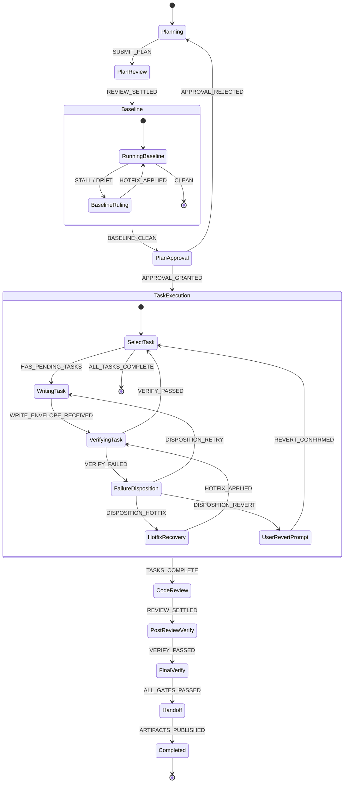
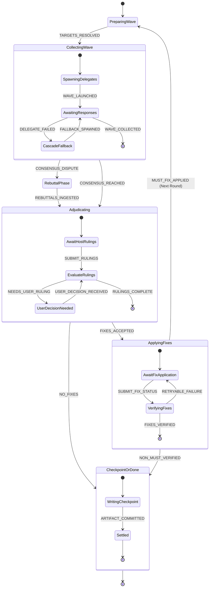

# Dispatch State Machine Architecture Specification

- **Date**: 2026-09-29
- **Status**: Draft (Approved for Implementation Planning)
- **Author**: Antigravity & User

---

## 1. Problem Statement & Motivation

The `dispatch` skill currently powers cross-agent delegation, review, and governed implementation across multiple native harnesses (Antigravity, Claude Code, Copilot, OpenCode). Over successive releases, workflow complexity has expanded to include multi-round reviews, rebuttal consensus, fast-forward hotfix recovery (ADR 0004), and multi-tier verification gates.

This organic growth has resulted in acute architectural strain in `skills/dispatch/scripts/driver/`:
1. **Monolithic Code Complexity**: `review-phase.mjs` exceeds 1,650 lines (90 KB), and `task-phase.mjs` exceeds 44 KB. Business logic, disk I/O, subprocess spawns, Markdown parsing, and state caching are deeply intertwined.
2. **Implicit, Scattered State**: Workflow state is fragmented across ad-hoc properties (`state.ordinary.phase`, `state.ordinary.step`, `state.reviewState`, `state.ordinary.failure`, `state.pending.action`). State transitions are buried inside nested callback cascades and large `if/else` ladders.
3. **Execution Latency & Disk Thrashing**: Under `--drive`, the execution loop continuously re-reads `state.json`, acquires file locks (`.advance.lock`), parses large Markdown documents, and rewrites state on every micro-transition.
4. **Token Overhead in Agent Turns**: Emitted action envelopes (`adjudicate`, `ask-user`, `launch`) carry large arrays of static guidance strings and redundant metadata, consuming hundreds of unnecessary tokens on every turn.

This specification defines a **Clean-Break Full-Stack State Machine Architecture** to replace the legacy driver and action protocol.

---

## 2. Design Goals & Invariants

### Core Goals
- **Readability & Clarity**: Decompose the driver into modular, declarative Statechart definitions. Replace implicit state mutations with explicit transitions and visualizable state graphs.
- **Maintainability & Extensibility**: Decouple pure state transition logic from side-effect execution. Adding new phases, recovery paths, or review kinds must require only defining states and transitions.
- **Speed & Execution Latency**: Run all automated internal transitions synchronously in memory in a single process invocation. Eliminate disk writes between non-blocking micro-steps.
- **Token Efficiency**: Strip all static guidance from runtime outputs. Project minimal, state-specific Protocol Frames to achieve a **75–80% reduction in per-turn prompt tokens**.
- **Deterministic Testability**: Enable sub-millisecond, pure in-memory unit testing for all state transitions with zero filesystem or subprocess mocks.

### Strict Invariants
1. **Zero External Dependencies**: Must run entirely on native Node.js (>= 22) ESM standard libraries. No third-party state machine libraries (e.g., XState, Robot) are permitted.
2. **Type Checking & Documentation**: All modules must begin with `// @ts-check` and provide rigorous TypeScript JSDoc definitions.
3. **Recovery Authority**: *"Artifacts, resolution logs, ledger events, checkpoints, and Git state are recovery authorities. Run state is a cache."* The engine must be fully reconstructible from canonical artifacts if `state.json` is missing or corrupted.
4. **Product Pillars ([AGENTS.md](file:///c:/Users/fchei/Projects/dispatch-skills/AGENTS.md))**:
   - Correctness > Token Efficiency > Speed.
   - Native Harness Collaboration (support Windows, Linux, macOS; Antigravity, Claude Code, Copilot, OpenCode).
   - Structural Least Privilege (read-only delegates, approval-gated writes).
   - Claims, Not Verdicts.

---

## 3. Architecture: Pure Statechart & Effect Interpreter

The system architecture is strictly split into two layers: the **Pure Statechart Core** and the **Effect Interpreter**.

```
                 ┌────────────────────────────────────────────────────────┐
                 │                Pure Statechart Core                    │
                 │      (Deterministic, Zero I/O, Zero Subprocesses)       │
                 │                                                        │
Incoming Event ──┼──► transition(Machine, StatePath, Context, Event)     │
                 │            │                                           │
                 │            ▼                                           │
                 │     { nextState, nextContext, effects[] } ─────────────┼──┐
                 └────────────────────────────────────────────────────────┘  │
                                                                             │ Declarative Effects
                                                                             ▼
                 ┌────────────────────────────────────────────────────────┐
                 │                 Effect Interpreter                     │
                 │                                                        │
                 │    • RUN_COMMAND      ──► Executes spawnSync           │
                 │    • SPAWN_WAVE       ──► Spawns delegate batch        │
                 │    • WRITE_ARTIFACT   ──► Modifies Markdown document   │
                 │    • PERSIST_STATE    ──► Flushes state.json           │
                 │    • AWAIT_HOST       ──► Emits frame to stdout & exits│
                 └────────────────────────────────────────────────────────┘
```

### 3.1 Statechart Primitives (`scripts/fsm/core.mjs`)

The core engine requires ~300 lines of vanilla ESM implementing hierarchical statecharts:

```javascript
// @ts-check

/**
 * @typedef {string} StatePath Hierarchical state identifier (e.g. "implement.task.verifying")
 *
 * @typedef {{
 *   type: string,
 *   payload?: any
 * }} Event
 *
 * @typedef {{
 *   type: 'RUN_COMMAND' | 'SPAWN_WAVE' | 'READ_ARTIFACT' | 'WRITE_ARTIFACT' | 'PERSIST_STATE' | 'AWAIT_HOST',
 *   [key: string]: any
 * }} Effect
 *
 * @typedef {{
 *   target?: StatePath,
 *   guard?: (context: any, event: Event) => boolean,
 *   actions?: Array<(context: any, event: Event) => void>,
 *   effects?: Array<(context: any, event: Event) => Effect>
 * }} TransitionDefinition
 *
 * @typedef {{
 *   id: string,
 *   initial?: string,
 *   states?: Record<string, StateNode>,
 *   on?: Record<string, TransitionDefinition | TransitionDefinition[]>
 * }} StateNode
 */
```

### 3.2 Pure Transition Function
The transition function evaluates the current hierarchical state node, checks guards, executes in-memory context actions, generates declarative effects, and calculates the target state path:

```javascript
/**
 * @param {StateNode} machine
 * @param {StatePath} currentState
 * @param {Record<string, any>} context
 * @param {Event} event
 * @returns {{ nextState: StatePath, nextContext: Record<string, any>, effects: Effect[] }}
 */
export function transition(machine, currentState, context, event) {
  const node = resolveStateNode(machine, currentState);
  const transitionDef = findMatchingTransition(node, event, context);

  if (!transitionDef) {
    throw new TransitionError(`Invalid event "${event.type}" for state "${currentState}"`);
  }

  const nextContext = structuredClone(context);
  const effects = [];

  for (const action of transitionDef.actions ?? []) {
    action(nextContext, event);
  }

  for (const effectFactory of transitionDef.effects ?? []) {
    effects.push(effectFactory(nextContext, event));
  }

  const nextState = transitionDef.target
    ? resolveRelativePath(currentState, transitionDef.target)
    : currentState;

  return { nextState, nextContext, effects };
}
```

### 3.3 The In-Memory Execution Loop (`scripts/fsm/interpreter.mjs`)
1. **Hydrate**: Loads the current `state.json` (active state path and context).
2. **Transition**: Calls `transition(...)` with the incoming event.
3. **Execute Internal Effects**:
   - Automated side effects (`RUN_COMMAND`, `WRITE_ARTIFACT`, `READ_ARTIFACT`) execute sequentially.
   - If an effect completes with an internal outcome (e.g. `TESTS_PASSED`, `DELEGATES_FINISHED`), the interpreter immediately re-enters `transition()` in-memory.
   - No disk reads or lock re-acquisitions occur during automated sequences.
4. **Pause at Host Boundary (`AWAIT_HOST`)**:
   - When a state requires orchestrator judgment (`APPROVE_PLAN`, `SUBMIT_RULINGS`, `CONFIRM_FIXES`), the transition yields an `AWAIT_HOST` effect.
   - The interpreter writes the updated `state.json` snapshot, writes a clean Protocol Frame to `stdout`, and exits `0`.

---

## 4. State Hierarchy & Domain Statecharts

Execution is organized into a Root Supervisor and domain-specific child machines.

```
RootWorkflowMachine
├── AskMachine
├── DesignMachine
├── PlanMachine
├── ReviewMachine (Reusable: Plan Review & Code Review)
└── ImplementMachine
    ├── Planning
    ├── PlanReview (invokes ReviewMachine)
    ├── Baseline
    ├── Approval
    ├── TaskExecution (Write -> Verify -> Failure Disposition / Hotfix)
    ├── CodeReview (invokes ReviewMachine)
    ├── FinalVerify
    └── Handoff
```

### 4.1 Implement Statechart (`scripts/machines/implement.mjs`)



### 4.2 Reusable Review Statechart (`scripts/machines/review.mjs`)

The legacy 90 KB `review-phase.mjs` is completely replaced by this reusable statechart.



---

## 5. Token-Efficient Protocol & CLI Specification

### 5.1 Protocol Frame (Driver $\to$ Orchestrator)
When pausing for host judgment (`AWAIT_HOST`), `stdout` emits exactly one compact JSON frame:

```json
{
  "v": 2,
  "state": "implement.review.adjudicating",
  "stateFile": ".scratch/dispatch-skills/run-1/state.json",
  "awaitEvent": "SUBMIT_RULINGS",
  "data": {
    "round": 1,
    "unsettled": [
      {
        "id": "F1",
        "severity": "MUST",
        "tag": "security",
        "locus": "src/auth/jwt.mjs:42",
        "defect": "JWT secret is loaded with fallback to empty string, allowing forgery."
      }
    ]
  }
}
```

**Token Rules**:
- No in-band static guidance arrays.
- Explicit `awaitEvent` tells the agent the exact command required.
- Context data is projected: only fields relevant to the active decision are included.

### 5.2 Event Dispatch CLI (Orchestrator $\to$ Driver)
Starting a workflow:
```bash
node scripts/dispatch.mjs start <verb> [flags] [-- <arg>]
```

Resuming with an event:
```bash
node scripts/dispatch.mjs event <EVENT_TYPE> --state <file> [--data '<json>' | --data @<file>]
```

### 5.3 Canonical Event Catalog

| State | Await Event | Data Payload Schema |
| :--- | :--- | :--- |
| `implement.planning` | `SUBMIT_PLAN` | `{"planPath": string}` |
| `implement.baseline.ruling` | `SUBMIT_BASELINE_RULING` | `{"decision": "fix-first" \| "accept" \| "hotfix", "resolution"?: string, "hotfix"?: {"affectedPaths": string[]}}` |
| `implement.approval` | `SUBMIT_APPROVAL` | `{"decision": "approved" \| "rejected", "reason"?: string}` |
| `implement.task.writing` | `SUBMIT_WRITE_ENVELOPE` | `{"envelopePath": string}` |
| `implement.task.failure` | `SUBMIT_FAILURE_DISPOSITION`| `{"decision": "retry" \| "hotfix" \| "revert", "userApproved"?: {"by": string, "quote": string}, "note"?: string}` |
| `*.review.adjudicating` | `SUBMIT_RULINGS` | `{"rulings": Record<string, {status: "accepted"\|"rejected", resolution?: string}>}` |
| `*.review.applying_fixes`| `SUBMIT_FIX_STATUS` | `{"clusters": Array<{clusterId: string, status: "applied"\|"failed", note?: string}>}` |

---

## 6. Error Handling & Recovery Invariant

### 6.1 Artifact-First State Hydrator (`scripts/fsm/hydrator.mjs`)
If `state.json` is lost or deleted:
1. Scan the canonical plan/design file for frontmatter and task completion headers (`- [x] Task N`).
2. Scan the resolution log in Markdown for round headers, `<!-- dispatch-sources -->`, `<!-- dispatch-budget -->`, and finding checkboxes.
3. Read the append-only `ledger.jsonl` events.
4. Verify Git repository state (HEAD hash and dirty tree diff).
5. Reconstruct the exact `StatePath` and `Context`, resuming seamlessly.

### 6.2 Error Classification

```
┌─────────────────────────┬──────────────────────────┬──────────────────────────┐
│ 1. Event Rejection      │ 2. Task Failure / Stall  │ 3. Engine Fault          │
│    (Host sends bad data)│    (Tests fail / drift)  │    (Unhandled exception) │
├─────────────────────────┼──────────────────────────┼──────────────────────────┤
│ Frame re-emitted with   │ State machine transitions│ Exits code 2 with error  │
│ explanation. State does │ to FAILURE_DISPOSITION.  │ details and state path.  │
│ not advance.            │ Offers retry/hotfix/revert│                          │
└─────────────────────────┴──────────────────────────┴──────────────────────────┘
```

### 6.3 Fast-Forward Hotfix Recovery (ADR 0004 Compliance)
- When a task verification fails or stalls, the statechart transitions to `implement.task.failure`.
- If hotfix is chosen, transitions to `implement.task.hotfix`.
- Evaluates the ADR 0004 budget: $\le 10$ files and $\le 150$ modified lines.
- Verifies hard limits: no edits outside repo, no `.git/` changes, no secret paths.
- If verified clean, re-runs the stalled verification command directly without re-entering a full review round.

---

## 7. Directory Structure & File Layout

Replaces the 22 scattered files in `skills/dispatch/scripts/driver/`:

```text
skills/dispatch/scripts/
├── dispatch.mjs               # Unified CLI: start, event, doctor, inspect
│
├── fsm/                       # Zero-Dependency Statechart Core (~600 lines)
│   ├── core.mjs               # Transition reducer, guards, path resolution
│   ├── interpreter.mjs        # Effect execution loop & persistence
│   ├── effects.mjs            # Declarative effect types & factory functions
│   ├── hydrator.mjs           # State reconstruction from artifacts & ledger
│   └── protocol.mjs           # Protocol Frame serializer & event parser
│
├── machines/                  # Declarative Domain Statecharts
│   ├── root.mjs               # Top-level supervisor router
│   ├── implement.mjs          # Macro implementation workflow statechart
│   ├── review.mjs             # Reusable review statechart
│   ├── task.mjs               # Task execution & hotfix recovery statechart
│   ├── baseline.mjs           # Baseline reconciliation statechart
│   ├── design.mjs             # Design authoring & increment statechart
│   └── ask.mjs                # Single & cascade ask statechart
│
├── effects/                   # Concrete Side-Effect Handlers (I/O only)
│   ├── commands.mjs           # Child process execution & timeouts
│   ├── delegates.mjs          # Delegate wave execution & cascade fallback
│   ├── artifacts.mjs          # Markdown resolution logs & frontmatter
│   └── ledger.mjs             # Append-only ledger logger
│
└── lib/                       # Unchanged utilities (config, session, git-root)
```

---

## 8. Multi-Tier Testing Strategy

1. **Tier 1: Pure Transition Unit Tests (`tests/unit/fsm/`)**:
   - Tests pure `transition()` calls in memory.
   - Zero disk I/O, zero Git operations, zero child processes.
   - 500+ transition tests execute in <200ms.
   - Covers all edge cases, guards, consensus branches, and failure dispositions.
2. **Tier 2: Effect Interpreter Tests (`tests/unit/effects/`)**:
   - Tests `interpreter.mjs` against mock effect handlers.
   - Verifies the execution loop halts cleanly on `AWAIT_HOST` and serializes state correctly.
3. **Tier 3: CLI Integration Tests (`tests/integration/`)**:
   - End-to-end smoke tests running real `dispatch start` and `dispatch event` CLI commands against temporary isolated fixtures.

---

## 9. Implementation Phases

- **Phase 1: FSM Engine Core**: Implement `scripts/fsm/core.mjs`, `interpreter.mjs`, and `effects.mjs`. Add pure unit tests.
- **Phase 2: Review Sub-Machine**: Port review logic into `machines/review.mjs` and `effects/delegates.mjs`. Retire `review-phase.mjs`.
- **Phase 3: Task & Implementation Machine**: Implement `machines/implement.mjs`, `task.mjs`, and `baseline.mjs`. Integrate ADR 0004 hotfixes.
- **Phase 4: CLI & Protocol Integration**: Update `dispatch.mjs` with `start` and `event` verbs.
- **Phase 5: Contract & Test Suite Migration**: Update `skills/dispatch/SKILL.md`, companion aliases, and migrate integration tests.
