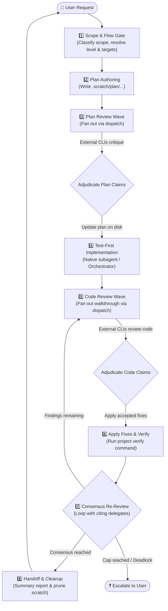

# implement-dispatch

Implement features or fixes with multi-agent review loops across external coding-agent CLIs—plan review before code is written, code review after, and re-review to consensus.

---

## What It Does

When working with an AI coding assistant (the **orchestrator**—like Claude Code, Antigravity, or GitHub Copilot), complex features and fixes benefit immensely from second opinions. However, manually coordinating multiple agent CLIs, managing review templates, resolving contradictory feedback, and tracking re-reviews across iterations is tedious and error-prone.

`implement-dispatch` acts as the **orchestrator and control loop** for end-to-end multi-agent development:
1. **Plans & Reviews First**: Drafts a structured implementation plan, then fans out to external agent CLIs (Claude Code, Antigravity 2.0, Copilot, or Local OpenCode) for pre-implementation critique.
2. **Adjudicates & Implements**: Evaluates reviewer claims against repository ground truth, folds accepted changes into the plan, and implements code test-first via native subagents.
3. **Reviews Code & Re-Reviews**: Generates a detailed walkthrough, collects multi-agent code reviews, applies accepted fixes, and loops with reviewers until reaching consensus.
4. **Maintains Strict Boundaries**: External delegates act strictly as read-only reviewers; the orchestrating agent alone owns decision-making, code edits, verification, and git operations.



---

## Prerequisites & Installation

### Prerequisites
- **Node.js**: `v18.0.0` or higher.
- **At least one agent CLI** installed or reachable (`claude`, `agy`, `copilot`, `local`).
- **`dispatch` skill**: Required runner and provider cascade.

### Companion Skills
`implement-dispatch` coordinates review criteria defined by its companion skills:

| Skill | Role | Status |
|---|---|---|
| [`dispatch`](../dispatch) | Runner execution, CLI flags, sandboxing, and provider cascade | **Required** |
| [`dispatch-plan-review`](../dispatch-plan-review) | Plan template, 7 review axes, adjudication grammar | **Optional** *(skips plan review if absent)* |
| [`dispatch-code-review`](../dispatch-code-review) | Walkthrough template, 6 review axes, adjudication grammar | **Optional** *(skips code review if absent)* |

### Installation

Install `implement-dispatch` into your current project workspace:

```bash
npx skills add Gyunikuchan/dispatch-skills --skill implement-dispatch
```

To install the complete multi-agent suite (`dispatch`, `dispatch-plan-review`, `dispatch-code-review`, `implement-dispatch`):

```bash
npx skills add Gyunikuchan/dispatch-skills --all
```

To install globally for all projects:

```bash
npx skills add -g Gyunikuchan/dispatch-skills --all
```

---

## How to Use

Trigger `implement-dispatch` directly via the slash command `/implement-dispatch` (or natural language) in your agent chat session:

```
/implement-dispatch [<level>] [(<pins>)]: <feature | fix | task description>
```

Both `<level>` and `(<pins>)` are optional (defaults to `medium` depth with automatic cascade selection; the colon is optional).

### 1. Basic Invocations

Run a balanced implementation with default settings (`medium` depth, automatic single-agent review):

```markdown
/implement-dispatch Add a CSV export button to the transactions table
```

```markdown
/implement-dispatch Fix off-by-one error in cursor pagination
```

### 2. Controlling Depth with Levels (`low`, `medium`, `high`, `max`)

Tune review rigor, round budgets, and consensus requirements to match the scope and risk of your change:

```markdown
/implement-dispatch low: Rename Household.owner field to primaryHolder
```

```markdown
/implement-dispatch high: Refactor payment webhook idempotency handler
```

```markdown
/implement-dispatch max: Migrate database schema and state machine to v4
```

### 3. Pinning Specific Reviewers (`(<pins>)`)

Force the review fan-out wave to target specific external providers (`claude`, `agy`, `copilot`, `local`):

```markdown
/implement-dispatch (claude,agy): Implement OAuth2 PKCE authorization flow
```

```markdown
/implement-dispatch high (copilot,local): Optimize bulk ingestion SQL queries
```

```markdown
/implement-dispatch max (claude): Audit and rewrite token refresh rotation
```

---

## Review Levels & Consensus Matrix

`implement-dispatch` scales review breadth (number of agents) and review depth (re-review rounds and consensus requirements) according to the chosen level:

| Level | Plan Review | Code Review | Re-Review Rounds | Consensus Required? | Default Target Breadth |
|---|---|---|---|---|---|
| `low` | *Skipped* | 1 agent, 1 round | *Skipped* | No | 1 external agent |
| `medium` | 1 agent, 1 round | 1 agent, 3 rounds | Up to 2 re-reviews | No | 1 external agent |
| `high` | 1 agent, 1 round | All agents, 3 rounds | Up to 2 re-reviews | **Yes** (strict) | All available external agents |
| `max` | All agents + self, 3 rounds | All agents + self, 5 rounds | Up to 4 re-reviews | **Yes** (strict) | All external agents + host CLI (`--allow-same-agent`) |

### Key Execution Mechanics
- **Waves, Not Individual Dispatches**: A round represents a single parallel wave across all target agents. Plan review and code review maintain separate, independent round counters.
- **Target Affinity in Re-Reviews**: Re-reviews are sent back specifically to the delegate handle that raised the finding, providing the resolution log and exact code delta to verify fixes efficiently.
- **Consensus Rules**:
  - Under `medium` and `low` (`consensus: false`), the orchestrator can reject claims directly if counter-evidence exists.
  - Under `high` and `max` (`consensus: true`), the orchestrator cannot unilaterally dismiss a finding. Every dispute must be accepted, escalated to the user, or rebutted with verified evidence in re-dispatch.
- **Automatic Scope Downshifting**: Trivial changes (single-file mechanical edits, typo/comment fixes, simple constant changes) are automatically downshifted to `low` to avoid unnecessary review overhead. Explicitly requested levels are never overridden upward.

---

## Configuration & Model Routing

Agent models and reasoning effort levels can be customized across phases (`plan-review`, `implementation`, `code-review`) in `config.default.jsonc` or by creating a local `config.jsonc` file.

```jsonc
{
  "plan-review": {
    "claude": {
      "low": { "model": "claude-opus-5", "effort": "low" },
      "medium": { "model": "claude-opus-5", "effort": "medium" },
      "high": { "model": "claude-opus-5", "effort": "high" },
      "max": { "model": "claude-opus-5", "effort": "xhigh" }
    },
    "agy": {
      "model": "gemini-3.8-flash",
      "effort": "high"
    }
  },
  "implementation": {
    "claude": {
      "low": { "model": "claude-sonnet-5", "effort": "medium" },
      "high": { "model": "claude-opus-5", "effort": "low" }
    }
  }
}
```

### Level Matching & Fallback Rules
- **Exact Match First**: Matches the requested level directly.
- **Round Down Floor**: If an exact level is missing, it rounds down to the nearest configured level below it.
- **Round Up Ceiling**: If nothing is configured below, it matches the lowest level above it.
- **Top-Heavy Reasoning**: Default configurations intentionally invest reasoning budget (`high` / `max` effort) into review phases to catch subtle flaws, keeping implementation lean.

---

## High-Level Behavior & Invariants

- **Delegates Propose Claims; Orchestrator Decides**: Reviewers return structured findings (`<locus> — <tag>: <defect> → <required change>`). The orchestrating agent independently verifies each claim against repository code and tests before accepting or rejecting.
- **Strict Read-Only Delegate Isolation**: All external reviews run under read-only sandboxes (`--mode plan` or restricted tool whitelists). Implementation is executed exclusively by native write-capable subagents or the orchestrator.
- **Evidence Over Votes**: If two reviewers disagree, ground truth is determined by actual execution, project requirements, and test suites—not sheer headcount.
- **Host Repository Conventions**: The orchestrator reads your project's `AGENTS.md` or `CLAUDE.md` to discover:
  - **Verify command**: The test/lint command that must remain green across all iterations.
  - **Escalation triggers**: Domain-specific decisions that require immediate user input.
- **Scratch Space Lifecycle**: Temporary plans and review logs are stored in `.scratch/plan/`. On successful consensus, temporary artifacts are automatically cleaned up. If a run terminates in deadlock or requires user intervention, artifacts are preserved for easy resumption.
- **Git Boundaries**: The skill strictly leaves git operations (`git commit`, `git push`, branch creation, and PRs) to the user.

---

## Nuances, Quirks & Troubleshooting

### Graceful Degradation Without Companion Skills
If `dispatch-plan-review` or `dispatch-code-review` are not installed, `implement-dispatch` continues running seamlessly:
- Missing `dispatch-plan-review`: Skips Step 3 (Plan Review) and proceeds directly to implementation.
- Missing `dispatch-code-review`: Skips Steps 5–7 (Code Review & Re-review) and completes after implementation verification.
- The handoff report explicitly lists any omitted review phases.

### Round Cap Escalation & Resumption
When a review phase exhausts its allotted round budget before reaching full consensus:
1. The orchestrator halts and presents the remaining disputed findings to you.
2. Answering the escalation resets the round counter for that phase, allowing additional review iterations if needed.

### Fast Direct Execution for Trivial Tasks
For mechanical one-line changes or renames classified as `trivial`, the orchestrator skips spawning background subagents and applies the edit directly, saving round-trip latency.

### Inspecting Delegate Review Progress
External reviews run asynchronously in the background. If you want to check what a reviewer is currently doing, you can monitor the temp logs emitted during launch:
```bash
tail -f "<logFilePath>"
```
