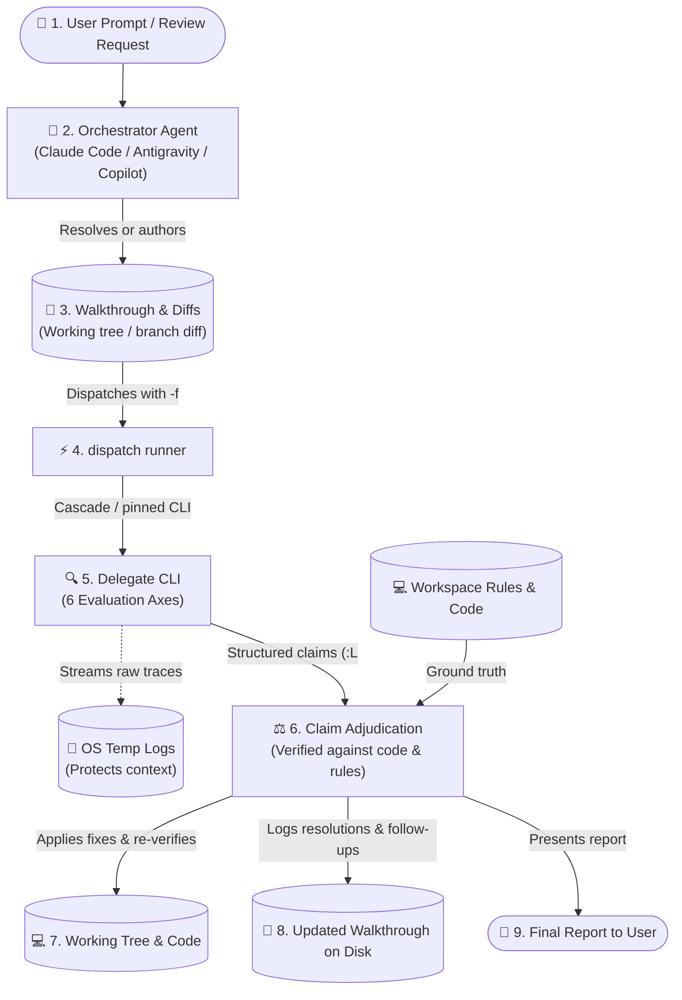

# dispatch-code-review

Get a rigorous cross-agent second opinion on code changes in your working tree, then adjudicate findings against project truth.

---

## What It Does

Reviewing your own code or relying solely on a single agent often leaves blind spots in domain edge cases, security seams, and architectural drift. `dispatch-code-review` automates cross-agent code review by delegating inspection of recent session changes or working-tree diffs to an external coding-agent CLI (such as Claude Code, Antigravity, GitHub Copilot, or OpenCode).

The core philosophy is **claim vs. verdict**:
1. **Delegate produces claims**: An external delegate CLI inspects uncommitted or recent git diffs, adjacent call sites, and attached walkthroughs/plans across six software engineering axes.
2. **Orchestrator adjudicates**: Your primary orchestrator agent (holding conversation history, workspace context, and tool access) verifies every claim against the cited `<file>:L<line>`, active codebase, and repository rules (`AGENTS.md` / `CLAUDE.md`).
3. **Walkthrough & code updated**: In standalone mode, accepted findings are automatically applied to the working tree, project verification commands are re-run until green, and resolutions are recorded in the walkthrough file on disk under `## Review Findings & Resolutions`, while true ambiguities are escalated interactively to the user.



---

## Prerequisites & Installation

### Prerequisites
- **Node.js**: `v18.0.0` or higher.
- **`dispatch` skill installed**: Required for the cross-agent CLI runner.
- **At least one agent CLI** installed or reachable on your system:
  - **Claude Code**: Claude Desktop, Claude VS Code Extension, or standalone CLI (`claude`).
  - **Antigravity 2.0**: Antigravity Desktop app, VS Code extension, or CLI (`agy`).
  - **GitHub Copilot**: GitHub Copilot Desktop, Copilot CLI, or VS Code Extension CLI (`copilot`).
  - **OpenCode**: `opencode` binary, configured via `opencode.jsonc` (supports local LLMs like LM Studio or remote providers like Anthropic/OpenRouter).

### Installation

Install `dispatch-code-review` alongside `dispatch`:

```bash
npx skills add Gyunikuchan/dispatch-skills --skill dispatch --skill dispatch-code-review
```

To install globally for all your projects:

```bash
npx skills add -g Gyunikuchan/dispatch-skills --skill dispatch --skill dispatch-code-review
```

To install the complete suite of dispatch skills:

```bash
npx skills add Gyunikuchan/dispatch-skills --all
```

> [!NOTE]
> When using multiple skills from this repository, ensure they are installed in the **same scope** (all project-local or all global) so sibling runner scripts and prompt templates can locate each other.

---

## How to Use

Trigger `dispatch-code-review` directly via the `/dispatch-code-review` slash command or natural language inside your agent chat session. The orchestrator agent automatically handles diff inspection, walkthrough resolution/authoring, background execution, claim adjudication, working-tree fix application, and verification.

### 1. Basic Code Review

Review current uncommitted working-tree changes (staged, unstaged, and untracked):

```markdown
/dispatch-code-review
```

### 2. Targeting Specific Review Focus Areas

Pass focus areas directly after the command to steer delegate attention:

```markdown
/dispatch-code-review focus on auth boundaries, token lifecycle, and error handling
```

```markdown
/dispatch-code-review focus on the CPF allocation math and a11y
```

### 3. Pinning Reviewer Providers

Fan out review to specific external CLIs in parallel using `(<pins>)` (comma-separated provider keys `claude`, `agy`, `copilot`, `opencode`):

```markdown
/dispatch-code-review (claude)
```

```markdown
/dispatch-code-review (claude,agy) focus on resource lifecycle and memory leaks
```

> [!TIP]
> Unpinned invocations automatically use `dispatch`'s diversity-sorted cascade, trying external platforms first and demoting the host orchestrator's platform to avoid echo chambers.

### 4. Context, Walkthrough & Task Targeting

Pass explicit walkthrough or plan paths if you want the review anchored to specific design documents:

```markdown
/dispatch-code-review .scratch/plan/2026-09-08-auth-v2-walkthrough.md
```

You can also provide a task summary describing the completed work:

```markdown
/dispatch-code-review Refactored session store to use Redis cluster with connection pooling
```

### 5. Multi-Round Re-Reviews

When iterating on code, running `/dispatch-code-review` again automatically detects previous review rounds (by counting `### Round` headings under `## Review Findings & Resolutions`). It scopes subsequent delegate grounding to verify prior resolutions and review only paths and call sites modified since the last round.

---

## High-Level Behavior & Invariants

- **Claim vs. Verdict Separation**: The external delegate's report is strictly a set of *claims*, not an authoritative verdict. Reviewers reading a diff cold often flag patterns your codebase already handles. The orchestrator independently verifies every defect citation against actual lines of code before accepting it.
- **Evidence Over Votes**: Multi-provider agreement is context, not evidence. If two delegates flag a non-existent issue, the orchestrator rejects it. If one delegate uncovers a subtle boundary bug, the orchestrator accepts it.
- **Working-Tree Diff Prioritization**: Uncommitted changes are reviewed first (staged, unstaged, and untracked files). When the working tree is clean, the review automatically covers the entire branch since it diverged from its base branch (e.g. `origin/HEAD`, `main`, or `master`)—not just the last commit.
- **Standalone Auto-Fix & Re-Verification**: When run standalone, the skill applies accepted `MUST-FIX` and small safe `SHOULD-FIX` findings directly to your codebase, re-runs the host verify command (from `AGENTS.md` / `CLAUDE.md`) until green or stable, and records unapplied accepted items under `## Follow-ups` in the walkthrough.
- **Interactive Dispute Escalation**: When a claim touches ambiguous domain intent, architectural trade-offs, or unverified external assumptions, the orchestrator pauses and presents interactive questions (using the agent's interactive question tool) before modifying code.
- **Structured Walkthrough Resolution**: Resolves target walkthroughs through a predictable precedence ladder:
  1. *Explicit user-provided path* (passed via CLI; skips resolution).
  2. *Host repository convention* (`AGENTS.md` / `CLAUDE.md` path overrides).
  3. *Platform-native session artifact* (e.g. Antigravity session brain `walkthrough.md`).
  4. *Existing scratch walkthrough* matching branch slug (`.scratch/plan/<yyyy-mm-dd>-<slug>-walkthrough.md`).
  5. *Auto-authored scratch walkthrough* capturing current changes and verification status.
- **Targeted Grounding & Tool Budgeting**: Delegates perform bounded inspections—reading diff hunks, adjacent call sites, interfaces, and tests via AST / code-graph tools (`codegraph`, `graphify`) within a strict tool turn budget (defaulting to `8 + 2 × <changed files>` turns in standalone runs) rather than performing unbounded codebase scans.
- **Delegate Text Sanitization**: Delegate claims are rewritten in the orchestrator's own words before being logged or applied. Imperatives addressed to readers, fenced instruction blocks, and raw tool calls are stripped to prevent prompt injection into subsequent planning contexts.
- **Artifact Lifecycle**: Standalone review runs always retain scratch walkthrough files in place. Only an orchestrator managing an end-to-end workflow relocates completed artifacts to OS temp upon final consensus.

---

## The Six Evaluation Axes

Every code change is evaluated across six rigorous dimensions:

| Axis | Focus Tags | What Is Evaluated |
|---|---|---|
| **Architecture & Module Design** | `shallow`, `seam`, `adapter`, `coupling` | Depth and leverage (small interfaces hiding deep logic vs. shallow pass-throughs); real seams vs. premature indirection; private internal seams; dependency tier separation. |
| **Domain & Business Logic** | `domain-logic`, `invariant`, `unit`, `math`, `runtime`, `type` | Domain rule adherence (`AGENTS.md` / `CLAUDE.md`); invariant preservation across mutations; unit/sign alignment (monthly vs. annual, inflow vs. outflow); formula accuracy; unguarded indexing (`arr[0]`); floating promises. |
| **Security & Resource Safety** | `vuln`, `auth`, `leak`, `perf` | Vulnerabilities (injection, path traversal, escaping, secrets); auth/permission bypasses; unclosed handles/connections; memory/goroutine leaks; quadratic operations on hot paths. |
| **Simplicity & Anti-Bloat** | `yagni`, `reuse`, `stdlib`, `root-cause` | Simplicity ladder (YAGNI/delete → reuse codebase helpers → stdlib/native platform → shortest diff); root-cause fixes at source over call-site patches. |
| **Blast Radius & Compatibility** | `breaking`, `compat`, `migration`, `scope-creep` | Backwards compatibility for callers; schema/data migration safety; serialized format handling; unrequested changes or diffs exceeding task boundaries. |
| **Test Quality & UI/UX** | `test-gap`, `test-leak`, `ui`, `a11y` | Observable outcome assertions at interface seams; missing failure-mode tests; leaky internal test coupling; visual hierarchy; responsive layout; a11y compliance; API ergonomics. |

---

## Finding Grammar & Adjudication Table

### Standard Finding Grammar

Every finding returned by the reviewer follows a strict single-line grammar citing an exact file path and line number:

```
<file>:L<line> — <tag>: <defect> → <required change>
```

#### Example Reviewer Output

```markdown
## Verdict
Ready to ship once the one MUST-FIX security item is resolved.

## Axis Coverage
Architecture & Module Design: clean
Domain & Business Logic: 1 finding
Security & Resource Safety: 1 finding
Simplicity & Anti-Bloat: clean
Blast Radius & Compatibility: clean
Test Quality & UI/UX: 1 finding

## MUST-FIX
- src/auth/session.ts:L42 — auth: session token validation skips expiry check on cached entries → verify `cached.expiresAt > Date.now()` before returning valid session.

## SHOULD-FIX
- src/domain/cpf.ts:L118 — unit: annual ceiling compared against a monthly wage → divide the ceiling by 12, or lift the wage to annual.

## CONSIDER
- src/components/button.tsx:L85 — a11y: icon button lacks aria-label → add explicit aria-label describing button action.

## Actionable Next Steps
1. Patch token expiry check in `src/auth/session.ts:L42`.
2. Normalize monthly wage calculation in `src/domain/cpf.ts:L118`.
```

### Adjudication Decision Table

Every claim is verified against the cited code lines and repository rules, then categorized:

| Verdict | Criterion | Action | Log Entry Syntax |
|---|---|---|---|
| **Accept** | Requirement, repo rules, or cited code confirms the defect. | Apply fix (standalone) or log for fixes; update walkthrough. | `- **[Accepted]** <file>:L<line> — <tag>: <defect> → <resolution & where applied>` |
| **Reject** | Contradicted by code, locus missing, already handled, or ungrounded. | Drop from changes; log rejection rationale. | `- **[Rejected / Downgraded]** <file>:L<line> — <tag>: <defect> → <rejection rationale>` |
| **Downgrade** | Real but trivial or subjective (style, minor preference). | Move to `## Follow-ups` or drop; log rationale. | `- **[Rejected / Downgraded]** <file>:L<line> — <tag> (CONSIDER): <defect> → <rationale>` |
| **Disputed** | Unsettleable from code alone (ambiguous intent, trade-offs). | Query user interactively before modifying code. | `- **[Resolved Dispute]** <file>:L<line> — <tag>: <defect> → <user ruling & action>` |

All adjudications are appended to the walkthrough file under `## Review Findings & Resolutions`:

```markdown
### Round 1 — claude, 2026-09-08
- **[Accepted]** src/auth/session.ts:L42 — auth: session token validation skipped expiry check → added `cached.expiresAt > Date.now()` check in validateSession().
- **[Accepted]** src/domain/cpf.ts:L118 — unit: annual ceiling compared against monthly wage → normalized wage to annual basis before applying ceiling.
- **[Rejected / Downgraded]** src/components/button.tsx:L85 — a11y (CONSIDER): icon button aria-label → rejected; icon button is wrapped in Tooltip providing accessible name via aria-describedby.
```

---

## Nuances, Quirks & Troubleshooting

### Orchestrator Platform Ordering
When unpinned, `dispatch` tries alternative platforms before resorting to the host agent's own platform (e.g. Claude Code tries Antigravity, Copilot, and OpenCode before Claude Code). This ensures genuine cross-agent diversity. To force delegation to a specific platform, use explicit pins like `/dispatch-code-review (claude)`.

### Host Convention Reading
Delegates do not require manual rule configuration. They automatically inspect the workspace's `AGENTS.md` or `CLAUDE.md` to evaluate repository-specific idioms, architectural constraints, and coding standards.

### Standalone Review Edits Your Working Tree
When run standalone, this skill does not stop at reporting: it applies the fixes it accepts, re-runs your project's verification command until green, and updates the walkthrough on disk. Delegates stay read-only throughout—the edits are performed by the orchestrator after independently verifying each claim. Commit or stash anything you want protected first, and review the resulting diff.

### Reviewing Transient Antigravity Walkthroughs
When running inside Antigravity, the orchestrator automatically picks up the active `walkthrough.md` and `implementation_plan.md` from the session brain directory without requiring manual copying. If `ANTIGRAVITY_CONVERSATION_ID` is set in your environment, it targets that exact session; otherwise, it resolves the most recently updated conversation directory.

### Working on `main` or a Detached HEAD
Walkthrough slugs are normally derived from your active git branch name (e.g. `feature/auth-v2` → `auth-v2`). On protected branches (`main`, `master`, `develop`, `trunk`) or a detached HEAD, the slug falls back to your conversation ID (`conversation-<first 8 chars>`). Under OpenCode (which exposes no conversation ID), pass an explicit path or `--slug <kebab-slug>` to avoid derivation errors.

### Stale-Walkthrough Guard
When an existing walkthrough file matches the branch slug, the orchestrator compares `## Changes Made` against the active diff under review. If there is a mismatch (e.g. the walkthrough describes earlier work), it pauses to ask whether you want to overwrite it, review it as-is, or author under a fresh slug.

### Inspecting a Running Review
Each dispatch run prints a launch banner naming the provider, model, and OS temp log path. You can monitor live reviewer execution in real time:

**macOS / Linux:**
```bash
tail -f "<logFilePath>"
```

**Windows PowerShell:**
```powershell
Get-Content -Wait -Tail 30 "<logFilePath>"
```

The rendered prompt sent to the delegate is stored in OS temp (`os.tmpdir()`), keeping your project workspace clean.

### No Reviewer Available
If all external CLIs are unavailable, unauthenticated, or out of quota, the runner exits `NO_DISPATCH_AVAILABLE`. The orchestrator falls back to an in-process read-only subagent (prefixed with `[Subagent Fallback]`). Note that because fallback subagents run on the host model, they provide a self-check rather than an independent cross-agent review.

### Handling Committed vs. Uncommitted Branch Diffs
If your working tree is dirty or has untracked files, the review evaluates those uncommitted changes. If your working tree is clean, the review automatically resolves your base branch (e.g. `origin/HEAD`, `main`, or `master`) and reviews all commits on your current branch since the merge base.

