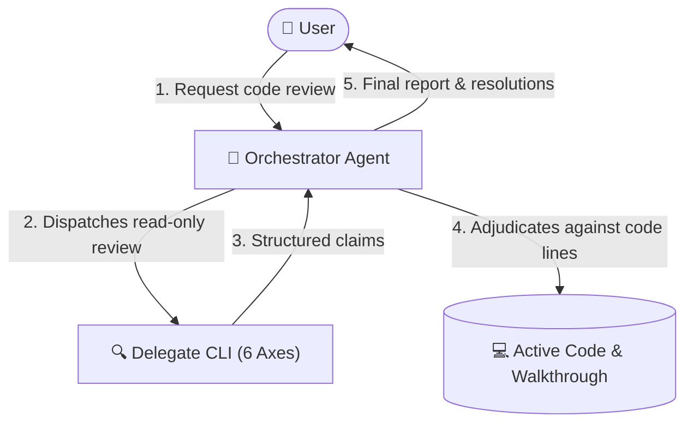

# dispatch-code-review

Get a rigorous cross-agent second opinion on code changes in your working tree, then adjudicate findings against project truth.

---

## What It Does

Reviewing your own code or relying solely on a single agent often leaves blind spots in domain edge cases, security seams, and architectural drift. `dispatch-code-review` automates cross-agent code review by delegating inspection of recent session changes or working-tree diffs to an external coding-agent CLI (e.g. Claude Code, Antigravity, GitHub Copilot, or Local OpenCode).

The core philosophy is **claim vs. verdict**:
1. **Delegate produces claims**: An external delegate CLI inspects uncommitted or recent git diffs, adjacent call sites, and attached walkthroughs/plans across six software engineering axes.
2. **Orchestrator adjudicates**: Your primary orchestrator agent (who holds the full conversation context and tool access) verifies every claim against the cited `<file>:L<line>`, active codebase, and repository rules (`AGENTS.md` / `CLAUDE.md`).
3. **Walkthrough & code updated**: Accepted findings are fixed or logged in the walkthrough file on disk under `## Review Findings & Resolutions`, while true ambiguities are escalated interactively to the user.



---

## Prerequisites & Installation

### Prerequisites
- **Node.js**: `v18.0.0` or higher.
- **`dispatch` skill installed**: Required for the cross-agent CLI runner.
- **At least one agent CLI** installed or reachable on your system:
  - **Claude Code**: Claude Desktop, VS Code extension, or standalone CLI (`claude`).
  - **Antigravity 2.0**: Antigravity Desktop app, VS Code extension, or CLI (`agy`).
  - **GitHub Copilot**: Copilot CLI or VS Code extension CLI (`copilot`).
  - **Local OpenCode**: `opencode` binary with a local LM Studio server at `http://127.0.0.1:1234/v1`.

### Installation

Install `dispatch-code-review` and its core runner into your project workspace:

```bash
# Install both skills
npx skills add Gyunikuchan/dispatch-skills --skill dispatch
npx skills add Gyunikuchan/dispatch-skills --skill dispatch-code-review
```

To install globally for all projects:

```bash
npx skills add -g Gyunikuchan/dispatch-skills --skill dispatch dispatch-code-review
```

To install the entire suite (`dispatch`, `dispatch-plan-review`, `dispatch-code-review`, `implement-dispatch`):

```bash
npx skills add Gyunikuchan/dispatch-skills --all
```

---

## How to Use

Trigger `dispatch-code-review` directly via the slash command `/dispatch-code-review` (or natural language) in your agent chat session. You do not need to call any scripts manually—the agent will assemble context, inspect diffs, dispatch the task, adjudicate the findings, and update the walkthrough.

### 1. Basic Code Review

Review current uncommitted working-tree changes (staged and unstaged):

```markdown
/dispatch-code-review
```

```markdown
/dispatch-code-review review recent changes
```

### 2. Targeting Specific Review Focus Areas

Pass focus areas directly after the command to steer delegate attention:

```markdown
/dispatch-code-review focus on the CPF allocation math and a11y
```

```markdown
/dispatch-code-review focus on auth boundaries, token lifecycle, and error handling
```

### 3. Pinning Reviewer Providers

Fan out to specific external CLIs in parallel with `(<pins>)` — comma-separated provider keys, no level (standalone reviews run a single round):

```markdown
/dispatch-code-review (claude)
```

```markdown
/dispatch-code-review (claude,agy) focus on resource lifecycle and memory leaks
```

### 4. Explicit Context or Walkthrough Targeting

Pass explicit plan or walkthrough paths if you want the review anchored to specific design docs:

```markdown
/dispatch-code-review .scratch/plan/2026-09-08-auth-v2-walkthrough.md
```

---

## High-Level Behavior & Invariants

- **Claim vs. Verdict Separation**: The external delegate's output is strictly a set of *claims*, not an authoritative verdict. Reviewers reading a diff cold often flag things your codebase already handles. The orchestrator independently verifies every defect citation against lines of code before accepting it.
- **Evidence Over Votes**: Multi-provider agreement is context, not evidence. If two delegates flag a non-existent issue, the orchestrator rejects it. If one delegate discovers a valid subtle boundary bug, the orchestrator accepts it.
- **Working-Tree Diff Prioritization**: Inspects uncommitted changes first (`git diff` and `git diff --staged`), falling back to `git diff HEAD~1` only when the working tree is clean.
- **Walkthrough Resolution & Authoring** (see `dispatch`'s `references/alignment.md` § Plan/Walkthrough Artifact Resolution): *explicit user-provided walkthrough* → *platform-native walkthrough* (e.g. Antigravity's `walkthrough.md`) → *existing scratch walkthrough* matching the branch-derived slug (reused, not re-authored) → *auto-authored* under `.scratch/plan/<yyyy-mm-dd>-<slug>-walkthrough.md`.
- **Walkthrough Updated on Disk**: Accepted fixes and adjudication outcomes are recorded directly under `## Review Findings & Resolutions` in the target walkthrough file.
- **Interactive Dispute Escalation**: When a claim touches ambiguous domain intent, trade-offs, or unverified external figures, the orchestrator will pause and ask you via interactive questions (`ask_question`) before modifying code.
- **Targeted Grounding**: Delegate CLIs perform fast, targeted inspection (checking only modified files, adjacent call sites, and contracts via code graphs) rather than unbounded codebase scans.
- **Artifact Lifecycle**: standalone runs always retain the walkthrough file in place; only an orchestrator owning the full implement-through-review lifecycle relocates scratch artifacts, and only on consensus/completion.

---

## The Six Evaluation Axes

Every code change is evaluated across six rigorous dimensions:

| Axis | Focus Tags | What Is Evaluated |
|---|---|---|
| **Architecture & Module Design** | `shallow`, `seam`, `adapter`, `coupling` | Depth and leverage (small interfaces hiding deep logic vs. shallow pass-throughs); real seams vs. premature indirection; private internal seams; dependency tier separation. |
| **Domain & Business Logic** | `domain-logic`, `invariant`, `unit`, `math`, `runtime`, `type` | Domain rule adherence (`AGENTS.md` / `CLAUDE.md`); invariant preservation across mutations; unit/sign alignment (monthly vs. annual, inflow vs. outflow); formula accuracy; unguarded indexing (`arr[0]`); floating promises. |
| **Security & Resource Safety** | `vuln`, `auth`, `leak`, `perf` | Vulnerabilities (injection, path traversal, escaping, secrets); auth/permission bypasses; unclosed handles/connections; memory/goroutine leaks; quadratic operations on hot paths. |
| **Simplicity & Anti-Bloat** | `yagni`, `reuse`, `stdlib`, `root-cause` | Simplicity ladder (YAGNI/delete → reuse codebase helpers → stdlib/native platform → shortest diff); root-cause fixes at source over call-site patches. |
| **Blast Radius & Compatibility** | `breaking`, `compat`, `migration`, `scope-creep` | Backwards compatibility for callers; schema/data migration safety; serialized format handling; unrequested changes or diffs exceeding task boundaries. |
| **Test Quality & UI/UX** | `test-gap`, `test-leak`, `ui`, `a11y` | Observable outcome assertions at interface seams; missing failure-mode tests; leaky internal test coupling; visual hierarchy; responsive layout; a11y compliance; API ergonomics. |

---

## Finding Grammar & Adjudication Table

### Standard Finding Grammar

Every finding returned by the reviewer follows a strict single-line grammar citing an exact path and line number:

```
<file>:L<line> — <tag>: <defect> → <required change>
```

Example report:
```markdown
## Verdict
Two blocking defects in the allocation path; the rest is sound.

## Axis Coverage
Architecture & Module Design: clean
Domain & Business Logic: 2 findings
Security & Resource Safety: clean
Simplicity & Anti-Bloat: 1 finding
Blast Radius & Compatibility: clean
Test Quality & UI/UX: n/a

## MUST-FIX
src/domain/cpf.ts:L118 — unit: annual ceiling compared against a monthly wage → divide the ceiling by 12, or lift the wage to annual.
src/domain/cpf.ts:L204 — runtime: `tiers[0]` unguarded when age falls below lowest tier → return floor tier explicitly.

## SHOULD-FIX
None.

## CONSIDER
src/features/plan/allocation-panel.tsx:L62 — reuse: reimplements `formatSgd` from shared/format → import it.

## Actionable Next Steps
1. Fix the unit mismatch at src/domain/cpf.ts:L118 and add a regression test.
2. Guard the tier lookup at src/domain/cpf.ts:L204.
```

### Adjudication Decision Table

The orchestrator maps each claim to an adjudication action by inspecting the cited code:

| Verdict | Criterion | Orchestrator Action |
|---|---|---|
| **Accept** | Code confirms the defect and its stated impact. | Apply fix or report to user; log under `## Review Findings & Resolutions`. |
| **Reject** | Cited code contradicts claim, line does not exist, or fix is already present. | Drop from changes; record rejection rationale in walkthrough resolutions log. |
| **Downgrade** | Real but trivial (style, taste, or speculative). | Fold into next steps or drop; record in walkthrough resolutions log. |
| **Disputed** | Unsettleable from code alone (intent, trade-offs, unverified figures). | Escalate to user via interactive prompt; apply user decision verbatim. |

---

## Nuances, Quirks & Troubleshooting

### Self-Skipping Runner Behavior
By default, the underlying `dispatch` runner avoids delegating to the orchestrator's own platform (e.g. Claude Code will not dispatch to Claude Code) to ensure a genuinely independent second opinion. If only one CLI is installed, request `--allow-same-agent` or allow fallback to native subagents.

### Inspecting Uncommitted Diffs
Delegates run in a structurally read-only mode and inspect the current working tree (`git diff` and `git diff --staged`). Ensure your changes are saved to disk before triggering review.

### Host Convention Reading
Delegates do not require manual rule configuration. They automatically inspect the workspace's `AGENTS.md` or `CLAUDE.md` to evaluate repository-specific idioms, architectural constraints, and coding standards.

### Reviewing Transient Antigravity Walkthroughs
When running inside Antigravity, the orchestrator automatically detects the active `walkthrough.md` and `implementation_plan.md` artifacts from the session brain directory. You do not need to copy or export them manually.

---

## Pairs With

- **`dispatch`**: The core cross-agent execution bridge and CLI provider cascade (required).
- **`dispatch-plan-review`**: The companion skill for cross-agent plan reviews before code is written.
- **`implement-dispatch`**: Full automated workflow combining planning, plan review, execution, and code review into a single pipeline.
