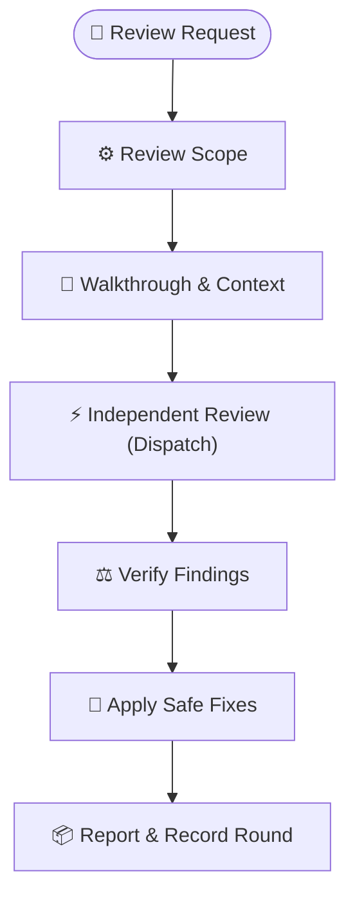

# dispatch-code-review

Get an independent second opinion on code changes, verify each finding against the active
codebase, and resolve the changes that are worth acting on.



## Prerequisites & Installation

### Requirements

`dispatch` is required. It provides the provider setup, runner behavior, fallback, and shared
command syntax. See [`dispatch`'s prerequisites and installation guide](../dispatch/README.md#prerequisites--installation)
for Node.js, provider, and installation details.

### Install

Install both skills together:

```bash
npx skills add Gyunikuchan/dispatch-skills --skill dispatch --skill dispatch-code-review
```

Add `-g` to install globally, or use `--all` to install the complete suite:

```bash
npx skills add -g Gyunikuchan/dispatch-skills --skill dispatch --skill dispatch-code-review
npx skills add Gyunikuchan/dispatch-skills -s '*'
```

> [!NOTE]
> Install `dispatch` and its companion skills in the same installation scope: keep them all project-local or
> all global so sibling scripts and templates can resolve one another.

## How to Use

Run `/dispatch-code-review` in your agent session. Review the current changes as-is, or add a
focus area, provider pin, task summary, or walkthrough path.

### Basic review

Review the current staged, unstaged, and untracked changes:

```text
/dispatch-code-review
```

Focus the review on a risk area:

```text
/dispatch-code-review Focus on auth boundaries, token lifecycle, and error handling
/dispatch-code-review Check the CPF allocation math and accessibility
```

### Choose reviewers

Use the shared provider-pin syntax from [`dispatch`](../dispatch/README.md#choose-a-provider) when
you need a particular provider or independent perspectives:

```text
/dispatch-code-review (claude) Review the GraphQL authorization changes
/dispatch-code-review (claude,copilot) Focus on resource lifecycle and memory leaks
/dispatch-code-review (all) Audit the authentication flow from independent perspectives
```

Unpinned runs use `dispatch`'s configured provider cascade. Provider configuration, model
selection, fallback, and command-line options are documented in [`dispatch`](../dispatch/README.md).

### Supply context

Pass a walkthrough or plan when one already describes the intended change:

```text
/dispatch-code-review .scratch/plan/2026-09-08-auth-v2-walkthrough.md
```

For a change without an artifact, provide a short task summary:

```text
/dispatch-code-review Refactored the session store to use Redis clustering and connection pooling
```

### Run another round

Run the command again after applying changes:

```text
/dispatch-code-review
```

The skill uses the walkthrough's review history to check resolutions and focus subsequent rounds
on paths changed since the previous round.

> [!NOTE]
> A clean feature branch reviews its merge-base-to-`HEAD` diff. A clean base branch reports
> `No reviewable changes`; explicitly name a commit or `a..b` / `a...b` range to review committed
> work.

## Detailed review rubric

Use this disclosed rubric for focused or high-risk reviews.

| Area | Focus tags | What is evaluated |
|---|---|---|
| **Architecture & Module Design** | `shallow`, `seam`, `adapter`, `coupling` | Deep interfaces, real rather than speculative seams, private internal boundaries, dependency tiers, and unnecessary indirection. |
| **Domain & Business Logic** | `correctness`, `domain-logic`, `invariant`, `unit`, `math`, `runtime`, `type` | Project rules, valid state, units and signs, formula and boundary accuracy, promise handling, indexing, and exhaustive branches. |
| **Security & Resource Safety** | `security`, `vuln`, `auth`, `leak`, `perf` | Injection, traversal, escaping, secrets, permissions, lifecycle cleanup, bounded concurrency/memory, event-loop blocking, and hot-path cost. |
| **Simplicity & Anti-Bloat** | `yagni`, `reuse`, `stdlib`, `root-cause` | Delete/reuse/stdlib before new code, shortest working diff, and fixes at the shared source rather than scattered call sites. |
| **Blast Radius & Compatibility** | `compatibility`, `breaking`, `compat`, `migration`, `scope-creep` | Caller and client compatibility, persisted and serialized formats, migrations, and changes outside the requested boundary. |
| **Test Quality & UI/UX** | `tests`, `test-gap`, `test-leak`, `ui`, `a11y` | Observable interface and failure coverage, coupling to private internals, CLI/API ergonomics, responsive behavior, and accessibility. |

## What to Expect

1. The owner preparation script resolves or deterministically authors a walkthrough, fingerprints
   the selected diff, and attaches any supplied plan or context.
2. It inspects the relevant diff and checks the repository's verification guidance.
3. It sends the review to read-only delegates through `dispatch`.
4. It verifies each actionable finding against the cited code before accepting it.
5. When run directly, it applies accepted fixes that are safe to make automatically, reruns
   verification, and records unresolved items as follow-ups.
6. It records the review round, checkpoints settled freshness metadata, and reports the result.

> [!NOTE]
> A delegate's report is a claim, not a verdict. The skill checks the cited lines and surrounding
> code before applying a finding.

When an orchestrating workflow invokes this skill, that workflow owns plan approval, fix
application, verification, and the final handoff.

The skill changes the working tree but does not commit, push, create branches, or open pull
requests.

## Configuration

There is no separate provider configuration for `dispatch-code-review`. Configure provider
membership, models, reasoning effort, fallback, and runner options in [`dispatch`](../dispatch/README.md#configuration).

When using an orchestrating workflow, configure review breadth and rounds in its configuration.

## Nuances & Troubleshooting

- **A walkthrough does not match the current diff:** the skill pauses and asks whether to reuse it,
  overwrite it, or create a fresh one.
- **Preparation fails:** `scripts/prepare-review.mjs --request <json-file|->` validates both skill
  manifests, explicit ranges, artifact freshness, and temporary dispatch inputs before launch.
- **You want a narrower review:** add a concrete focus area to the command, such as
  `Focus on authorization and tenant isolation`.
- **You want another perspective:** pin multiple providers with `(claude,copilot)` or use `(all)`.
- **A provider is unavailable:** configure or authenticate it through `dispatch`; see its
  [troubleshooting guide](../dispatch/README.md#nuances-quirks--troubleshooting).
