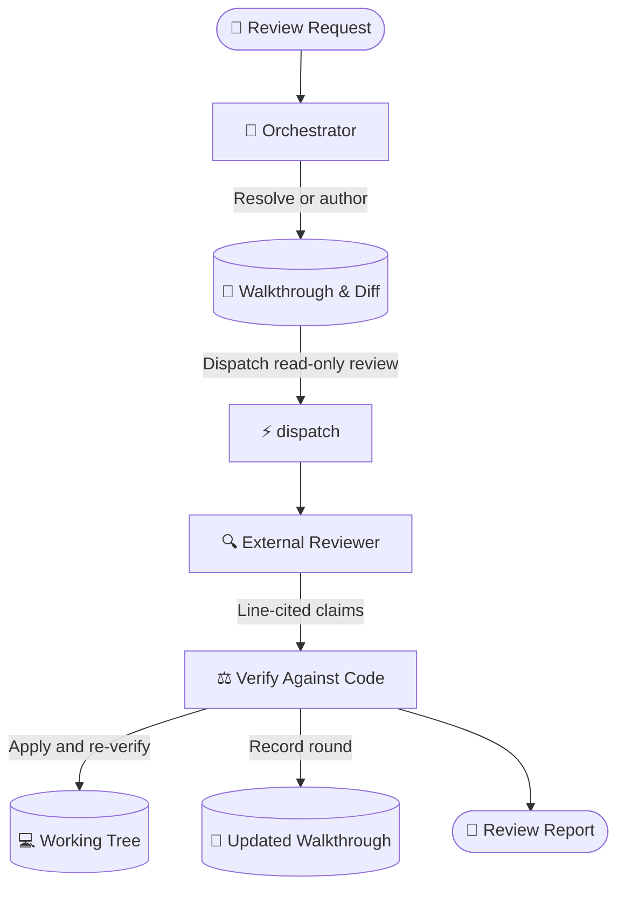

# dispatch-code-review

Get a rigorous cross-agent second opinion on code changes, then adjudicate every claim against the
active codebase before updating the walkthrough or reporting the result.

---

## What It Does

`dispatch-code-review` delegates inspection of working-tree or branch changes to external agent
CLIs. It keeps delegates read-only, asks for exact line citations, and lets the orchestrator apply
only verified fixes.



## Prerequisites & Installation

`dispatch` is the source of truth for runtime requirements, provider CLIs, installation scopes,
runner flags, and shared fallback behavior. See its
[prerequisites and installation guide](../dispatch/README.md#prerequisites--installation) first.

Install both skills together:

```bash
npx skills add Gyunikuchan/dispatch-skills --skill dispatch --skill dispatch-code-review
```

Add `-g` to install globally, or use `--all` for the complete suite. Keep companion skills in the
same scope so sibling scripts and prompt templates can resolve one another.

---

## How to Use

Trigger `/dispatch-code-review` directly or describe the review in natural language.

### 1. Basic Code Review

Review staged, unstaged, and untracked changes:

```markdown
/dispatch-code-review
```

### 2. Focused Review

Pass focus areas after the command:

```markdown
/dispatch-code-review focus on auth boundaries, token lifecycle, and error handling
```

```markdown
/dispatch-code-review focus on the CPF allocation math and a11y
```

### 3. Pinning Reviewer Providers

Use the shared `(<pins>)` grammar from [`dispatch`](../dispatch/SKILL.md#invocation). Pins are
effective configured platform keys, supported aliases, or `all`; inspect the effective keys with
`node <dispatch-skill>/scripts/dispatch.mjs --list-platforms`.

```markdown
/dispatch-code-review (all)
/dispatch-code-review (claude,copilot) focus on resource lifecycle and memory leaks
```

Unpinned runs use `dispatch`'s diversity-sorted cascade. Every pinned key, including keys expanded
from `all`, must be present in the effective configuration.

### 4. Context and Task Targeting

Pass a walkthrough or plan to anchor the review:

```markdown
/dispatch-code-review .scratch/plan/2026-09-08-auth-v2-walkthrough.md
```

Or provide a task summary:

```markdown
/dispatch-code-review Refactored session store to use Redis cluster with connection pooling
```

### 5. Multi-Round Re-Reviews

Run the command again after changes. The skill counts `### Round` headings under
`## Review Findings & Resolutions` and reviews only paths changed since the previous round.

---

## Review Behavior

- **Working-tree first**: Dirty trees review staged, unstaged, and untracked changes. A clean tree
  expands the review to the branch diff from its base.
- **Standalone fixes**: Accepted `MUST-FIX` and safe `SHOULD-FIX` findings are applied, the host
  verify command is rerun, and deferred items are recorded under `## Follow-ups`.
- **Walkthrough lifecycle**: The skill resolves or authors a walkthrough, records each round, and
  checks for stale descriptions before dispatching.
- **Orchestrated handoff**: `implement-dispatch` owns artifact resolution, fix application,
  verification, and final reporting when it invokes this skill.

Claim verification, provider fallback, read-only enforcement, and shared artifact conventions are
defined by [`dispatch`](../dispatch/README.md) and its
[alignment reference](../dispatch/references/alignment.md).

---

## The Six Evaluation Axes

Every code change is evaluated across six dimensions:

| Axis | Focus Tags | What Is Evaluated |
|---|---|---|
| **Architecture & Module Design** | `shallow`, `seam`, `adapter`, `coupling` | Depth and leverage; real seams; dependency boundaries. |
| **Domain & Business Logic** | `domain-logic`, `invariant`, `unit`, `math`, `runtime`, `type` | Domain rules, invariants, units, formulas, indexing, and type/runtime behavior. |
| **Security & Resource Safety** | `vuln`, `auth`, `leak`, `perf` | Injection, traversal, secrets, authorization, resource leaks, and hot-path cost. |
| **Simplicity & Anti-Bloat** | `yagni`, `reuse`, `stdlib`, `root-cause` | Deletion, reuse, standard-library choices, and root-cause fixes. |
| **Blast Radius & Compatibility** | `breaking`, `compat`, `migration`, `scope-creep` | Caller compatibility, migrations, serialization, and scope boundaries. |
| **Test Quality & UI/UX** | `test-gap`, `test-leak`, `ui`, `a11y` | Observable failure coverage, test coupling, visual hierarchy, responsiveness, and accessibility. |

---

## Finding Grammar & Adjudication

Every actionable finding cites an exact file path and line:

```text
<file>:L<line> — <tag>: <defect> → <required change>
```

Verify each claim against the cited code and repository rules:

| Verdict | Criterion | Action |
|---|---|---|
| **Accept** | The requirement, rules, or cited code confirms the defect. | Apply the fix or record it for the orchestrator; update the walkthrough. |
| **Reject** | The claim is contradicted, already handled, uncited, or unverifiable. | Drop it and record the rationale. |
| **Downgrade** | The issue is real but subjective or minor. | Move it to `## Follow-ups` or drop it. |
| **Disputed** | Intent or trade-offs cannot be settled from code alone. | Ask the user in standalone mode; return it to the consensus loop when orchestrated. |

Append every round under `## Review Findings & Resolutions`. In orchestrated `consensus: true`
runs, rejections of delegate-reported MUST-FIX / SHOULD-FIX findings remain
`[Rejected — pending confirmation]` until the citing reviewer confirms the counter-evidence.

---

## Troubleshooting & Artifacts

- A stale walkthrough is compared with the active diff; the run asks whether to reuse it, overwrite
  it, or create a fresh slug.
- On protected branches or detached HEADs, pass an explicit walkthrough path or slug when automatic
  resolution cannot derive one.
- For provider discovery, authentication, fallback, live logs, and platform-specific behavior, use
  the [`dispatch` troubleshooting guide](../dispatch/README.md#nuances-quirks--troubleshooting).
