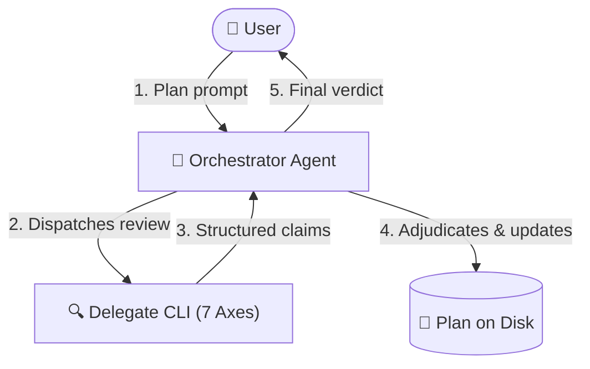

# dispatch-plan-review

Get a rigorous second opinion on an implementation plan **before** any code is written, then adjudicate findings against project truth.

---

## What It Does

Writing code against an untested or flawed plan leads to wasted cycles, rework, and subtle regressions. `dispatch-plan-review` automates cross-agent plan evaluation by delegating the review of implementation plans to an external coding-agent CLI (e.g. Claude Code, Antigravity, GitHub Copilot, or OpenCode).

The core philosophy is **claim vs. verdict**:
1. **Delegate produces claims**: An external delegate CLI inspects the plan and targeted codebase context, returning structured claims across seven architectural and domain axes.
2. **Orchestrator adjudicates**: Your primary orchestrator agent (who holds the conversation history and full context) verifies every claim against the original requirement, repository rules (`AGENTS.md` / `CLAUDE.md`), and actual code lines.
3. **Plan updated in place**: Accepted findings are directly folded into the implementation plan file on disk, logging resolutions and escalating true ambiguities to the user.



---

## Prerequisites & Installation

### Prerequisites
- **Node.js**: `v18.0.0` or higher.
- **`dispatch` skill installed**: Required for the cross-agent CLI runner.
- **At least one agent CLI** installed or reachable on your system:
  - **Claude Code**: Claude Desktop, VS Code extension, or standalone CLI (`claude`).
  - **Antigravity 2.0**: Antigravity Desktop app, VS Code extension, or CLI (`agy`).
  - **GitHub Copilot**: Copilot CLI or VS Code extension CLI (`copilot`).
  - **OpenCode**: `opencode` binary, configured via `opencode.jsonc` (any provider/model; see `dispatch`).

### Installation

Install `dispatch-plan-review` and its core runner into your project workspace:

```bash
# Install both skills
npx skills add Gyunikuchan/dispatch-skills --skill dispatch
npx skills add Gyunikuchan/dispatch-skills --skill dispatch-plan-review
```

To install globally for all projects:

```bash
npx skills add -g Gyunikuchan/dispatch-skills --all
```

To install every skill in this repository:

```bash
npx skills add Gyunikuchan/dispatch-skills --all
```

---

## How to Use

Trigger `dispatch-plan-review` directly via the slash command `/dispatch-plan-review` (or natural language) in your agent chat session. You do not need to call any scripts manually—the agent will assemble context, dispatch the task, adjudicate the findings, and update the plan.

### 1. Basic Plan Review

Review the current active plan or an existing plan file:

```markdown
/dispatch-plan-review
```

```markdown
/dispatch-plan-review .scratch/plan/2026-09-08-billing-engine.md
```

### 2. Targeting Specific Review Focus Areas

Pass focus areas directly after the command:

```markdown
/dispatch-plan-review focus on backward compatibility and data migrations
```

```markdown
/dispatch-plan-review .scratch/plan/2026-09-08-auth-v2.md focus on trust boundaries and session revocation
```

### 3. Pinning Reviewer Providers

Fan out to specific external CLIs in parallel with `(<pins>)` — comma-separated provider keys, no level (standalone reviews run a single round):

```markdown
/dispatch-plan-review (claude)
```

```markdown
/dispatch-plan-review (claude,agy) focus on state-machine lifecycles
```

### 4. Reviewing Without a Pre-Existing Plan File

If no plan file exists yet, simply describe the feature and request a plan review. The orchestrator will automatically author a structured plan under `.scratch/plan/<yyyy-mm-dd>-<slug>.md` before dispatching it:

```markdown
/dispatch-plan-review Create a plan for replacing redis-pubsub with Postgres LISTEN/NOTIFY
```

---

## High-Level Behavior & Invariants

- **Claim vs. Verdict Separation**: The external delegate's output is strictly a set of *claims*, not an authoritative verdict. The orchestrator independently verifies every defect citation against lines of code and requirements before accepting it.
- **Evidence Over Votes**: Provider agreement is context, not evidence. If two delegates flag a non-existent issue, the orchestrator rejects it. If one delegate discovers a valid subtle boundary bug, the orchestrator accepts it.
- **Plan File Updated on Disk**: Accepted changes are not just printed in the chat; they are actively written back to the target plan file (`Proposed Changes`, `Verification Plan`, `Rollback & Blast Radius`), keeping the on-disk plan as the single source of truth for the implementation phase.
- **Interactive Dispute Escalation**: When a claim touches ambiguous domain intent, trade-offs, or unverified external figures, the orchestrator will pause and ask you via interactive questions (your agent's interactive question tool) before modifying the plan.
- **Structured Plan Resolution Order** (see `dispatch`'s `references/alignment.md` § Plan/Walkthrough Artifact Resolution): *host convention* — a repo `AGENTS.md` / `CLAUDE.md` naming a plan path or directory wins outright and the tiers below never run — → *explicit user-provided path* → *platform-native plan* (e.g. Antigravity's `implementation_plan.md`) → *existing scratch plan* matching the branch-derived slug (reused, not re-authored) → *auto-authored* under `.scratch/plan/<yyyy-mm-dd>-<slug>.md`.
- **Targeted Grounding**: Delegate CLIs perform fast, targeted inspection (checking only files named in proposed changes and immediate call sites) rather than unbounded codebase scans, keeping turnaround quick and tokens focused.
- **Artifact Lifecycle**: standalone runs always retain the plan file in place; only an orchestrator owning the full plan-through-review lifecycle relocates scratch artifacts, and only on consensus/completion.

---

## The Seven Evaluation Axes

Every plan is evaluated across seven rigorous dimensions:

| Axis | Focus Tags | What Is Evaluated |
|---|---|---|
| **Requirement & Intent Fidelity** | `traceability`, `user-gap`, `scope-creep` | Bidirectional mapping between requirements and proposed changes; catches premise flaws, XY problems, and unrequested scope creep. |
| **Domain & Business Logic** | `domain-logic`, `invariant`, `state-machine` | Business rule adherence, sign/unit discrepancies, domain invariant preservation across multi-step mutations, and valid lifecycle states. |
| **Plan Coherence & Architecture** | `coherence`, `approach`, `standards` | Producer-consumer contract alignment, correct sequencing, modular layering boundaries, and repository conventions (`AGENTS.md` / `CLAUDE.md`). |
| **Security & Permissions** | `security`, `auth`, `validation` | Trust boundaries, tenant isolation, authentication/authorization flows, role checks, and input sanitization boundaries. |
| **Blast Radius & Reversibility** | `blast-radius`, `migration`, `compat` | Downstream caller impact, persisted schema migrations, serialization compatibility, and concrete rollback/reversibility strategies. |
| **Testability & Success Criteria** | `testability`, `spec-gap` | Checkable acceptance criteria, named automated tests (unit/integration/e2e), and clear pass/fail definitions. |
| **Simplicity & Failure Modes** | `simplicity`, `yagni`, `edge-case` | Simplicity ladder (delete requirement → reuse existing helpers → standard library → new code), YAGNI violations, and boundary/error failure modes. |

---

## Finding Grammar & Adjudication Table

### Standard Finding Grammar

Every finding returned by the reviewer follows a strict single-line grammar, where `<Section>` is the target plan heading:

```
§ <Section> — <tag>: <defect> → <required change>
```

The full delegate prompt lives in [references/prompt-template.md](references/prompt-template.md), and the structure used when a plan is auto-authored in [references/plan-template.md](references/plan-template.md); edit those files to customize either.

Example report:
```markdown
## Verdict
Safe to implement once the two MUST-FIX items land.

## Axis Coverage
Requirement & Intent Fidelity: clean
Domain & Business Logic: clean
Plan Coherence & Architecture: clean
Security & Permissions: clean
Blast Radius & Reversibility: 1 finding
Testability & Success Criteria: 1 finding
Simplicity & Failure Modes: 1 finding

## MUST-FIX
- § Proposed Changes — blast-radius: bumps PERSISTED_FORMAT_VERSION with no decoder for v3 payloads → add a v3→v4 migration path before the bump.

## SHOULD-FIX
- § Verification Plan — testability: "allocation looks right" is not checkable → specify exact test fixture and balance assertion in src/tests/allocation.test.ts.

## CONSIDER
- § Proposed Changes — simplicity: new `AllocationVisitor` has only one implementation → inline it until a second strategy is needed.

## Shorter Path
None — the plan is already minimal.
```

### Adjudication

Every claim is checked against the requirement and your repository's own rules, then accepted, rejected, downgraded, or marked disputed — and whichever way it goes, the outcome is logged under `## Review Findings & Resolutions` in the plan. A disputed claim is one the plan alone cannot settle (intent, a deliberate trade-off); standalone runs put it to you, while an orchestrated run returns it for the orchestrator's consensus rule to handle. The exact criteria, the resolution order, and the escalation mechanics live in one place — `dispatch`'s `references/alignment.md` § Adjudication — rather than being restated here, where they drift.

---

## Nuances, Quirks & Troubleshooting

### Orchestrator Platform Ordering
Unpinned, the underlying `dispatch` runner tries the other configured platforms first and the orchestrator's own platform last (e.g. Claude Code tries every other reachable CLI before dispatching to Claude Code) — so a same-platform review is possible when nothing else answers. Pin a delegate to force it (`/dispatch-plan-review (claude)`), even from the same platform. The review falls back to a read-only subagent only when no dispatch succeeds (`NO_DISPATCH_AVAILABLE`).

### Host Convention Reading
Delegates do not require manual rule configuration. They automatically inspect the workspace's `AGENTS.md` or `CLAUDE.md` to evaluate your repository-specific idioms, architectural constraints, and coding standards.

### Reviewing Transient Antigravity Plans
When running inside Antigravity, the orchestrator picks up the active `implementation_plan.md` from the session brain directory — no manual copy or export. One caveat: it identifies the session exactly only when `ANTIGRAVITY_CONVERSATION_ID` is set. Without it, the lookup falls back to whichever conversation directory was touched most recently, which can be a different session's plan if several are open. Check the resolved path in the run banner, or pass the plan path explicitly, when more than one Antigravity conversation is live.

### Working on `main` or a Detached HEAD
The plan path's slug normally comes from your branch name, which is what lets a plan review today and a code review tomorrow land on the same file with no coordination. On a protected branch (`main`, `master`, `develop`, `trunk`) or a detached HEAD, a branch slug would collide across unrelated work, so the slug falls back to your conversation id — meaning only *this* session finds that plan automatically; a later session needs the path or an explicit `--slug`. Under OpenCode, which exposes no conversation id, both derivations fail on a protected branch and the resolver exits non-zero: pass `--slug <kebab-case-slug>`, or give the plan path directly.

### Inspecting a Running Review
Each dispatch prints a banner naming its provider, model, and session log path. Tail that log to watch a review in progress (`tail -f "<logFilePath>"`, or `Get-Content -Wait -Tail 30 "<logFilePath>"` in PowerShell). The filled prompt actually sent to the delegate is written wherever `fill-template.mjs --out` pointed — by convention in your OS temp directory (`os.tmpdir()`), keeping the workspace scratch directory clean for the plan and walkthrough. It is useful when a review answers a question you did not think you asked. The session log itself lives under your OS temp directory as well. (A prompt too large for the command line additionally spills to a brief file in its own temp directory; the banner names that file when it happens.)

### No Reviewer Available
If every configured platform is missing, unauthenticated, or out of quota, the dispatch fails with `NO_DISPATCH_AVAILABLE` and the review falls back to an in-process read-only subagent on your own platform. Its findings are prefixed `[Subagent Fallback]` — that prefix means the second opinion came from the same model that wrote the plan, so it is a self-check rather than a genuinely independent review. Treat those findings with more scepticism, and re-run with a real delegate once one is reachable.

### False Claims on Uncommitted Code
Delegates inspect the files present on disk. If your plan refers to code changes from an uncommitted draft branch or unstaged stash that is not present in the workspace, the delegate may flag them as missing symbols. Ensure workspace dependencies and referenced files exist before running review.
