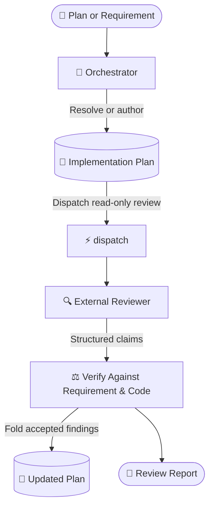

# dispatch-plan-review

Get a rigorous second opinion on an implementation plan before code is written, then adjudicate
every claim against the requirement and host repository rules.

---

## What It Does

`dispatch-plan-review` delegates inspection of an implementation plan to external agent CLIs. It
keeps delegates read-only, asks for section-level claims (and line citations when existing code is
involved), and folds only verified findings back into the plan.



## Prerequisites & Installation

`dispatch` is the source of truth for runtime requirements, provider CLIs, installation scopes,
runner flags, and shared fallback behavior. See its
[prerequisites and installation guide](../dispatch/README.md#prerequisites--installation) first.

Install both skills together:

```bash
npx skills add Gyunikuchan/dispatch-skills --skill dispatch --skill dispatch-plan-review
```

Add `-g` to install globally, or use `--all` for the complete suite. Keep companion skills in the
same scope so sibling scripts and prompt templates can resolve one another.

---

## How to Use

Trigger `/dispatch-plan-review` directly or describe the plan review in natural language.

### 1. Review an Existing Plan

Review the active plan:

```markdown
/dispatch-plan-review
```

Or pass an explicit plan:

```markdown
/dispatch-plan-review .scratch/plan/2026-09-08-billing-engine.md
```

### 2. Focus the Review

Pass focus areas after the command:

```markdown
/dispatch-plan-review focus on backward compatibility and data migrations
```

```markdown
/dispatch-plan-review .scratch/plan/2026-09-08-auth-v2.md focus on trust boundaries and session revocation
```

### 3. Pin Reviewer Providers

Use the shared `(<pins>)` grammar from [`dispatch`](../dispatch/SKILL.md#invocation). Pins are
effective configured platform keys, supported aliases, or `all`; inspect the effective keys with
`node <dispatch-skill>/scripts/dispatch.mjs --list-platforms`.

```markdown
/dispatch-plan-review (all)
/dispatch-plan-review (claude,copilot) focus on state-machine lifecycles
```

Unpinned runs use `dispatch`'s diversity-sorted cascade. Every pinned key, including keys expanded
from `all`, must be present in the effective configuration.

### 4. Author and Review on the Fly

If no plan exists, provide the requirement. The skill authors a structured scratch plan and reviews
it immediately:

```markdown
/dispatch-plan-review Replace redis-pubsub with Postgres LISTEN/NOTIFY
```

```markdown
/dispatch-plan-review Add token bucket rate limiting to /api/v1/auth endpoints
```

### 5. Multi-Round Re-Reviews

Run the command again after editing the plan. The skill counts `### Round` headings under
`## Review Findings & Resolutions` and reviews only sections changed since the previous round.

---

## Review Behavior

- **Plan-first**: Accepted findings and user-resolved disputes are folded into the plan on disk,
  including `Proposed Changes`, `Verification Plan`, and `Rollback & Blast Radius`.
- **Plan resolution**: The skill resolves or authors the target plan, records each round, and checks
  for a stale plan before dispatching a new requirement.
- **Requirement grounding**: Claims are checked against the requirement, the plan, cited code, and
  host repository rules.
- **Orchestrated handoff**: `implement-dispatch` owns artifact resolution, approval, and final
  reporting when it invokes this skill.

Claim adjudication, provider fallback, read-only enforcement, and shared artifact conventions are
defined by [`dispatch`](../dispatch/README.md) and its
[alignment reference](../dispatch/references/alignment.md).

---

## The Seven Evaluation Axes

Every plan is evaluated across seven dimensions:

| Axis | Focus Tags | What Is Evaluated |
|---|---|---|
| **Requirement & Intent Fidelity** | `traceability`, `user-gap`, `scope-creep` | Requirement coverage, premise flaws, missing prerequisites, and unrequested scope. |
| **Domain & Business Logic** | `domain-logic`, `invariant`, `state-machine` | Domain rules, invariants, units, and valid lifecycle transitions. |
| **Plan Coherence & Architecture** | `coherence`, `approach`, `standards` | Producer-consumer contracts, sequencing, layering, and repository conventions. |
| **Security & Permissions** | `security`, `auth`, `validation` | Trust boundaries, credentials, tenant isolation, authorization, and input validation. |
| **Blast Radius & Reversibility** | `blast-radius`, `migration`, `compat` | Caller impact, persisted data changes, serialization compatibility, and rollback. |
| **Testability & Success Criteria** | `testability`, `spec-gap` | Checkable acceptance criteria and named automated tests. |
| **Simplicity & Failure Modes** | `simplicity`, `yagni`, `edge-case` | YAGNI, simpler alternatives, boundary values, and recovery paths. |

---

## Findings Grammar & Adjudication

Every actionable finding cites a target plan section:

```text
§ <Section> — <tag>: <defect> → <required change>
```

Include an exact `<file>:L<line>` when the finding relies on existing code. Verify each claim before
classifying it:

| Verdict | Criterion | Action |
|---|---|---|
| **Accept** | The requirement, rules, or cited code confirms the defect. | Fold the change into the plan and record the resolution. |
| **Reject** | The claim is contradicted, already handled, uncited, or unverifiable. | Drop it and record the rationale. |
| **Downgrade** | The issue is real but subjective or minor. | Move it to `## Out of Scope` or drop it. |
| **Disputed** | Intent or trade-offs cannot be settled from the plan and code. | Ask the user in standalone mode; return it to the consensus loop when orchestrated. |

Append every round under `## Review Findings & Resolutions`. In orchestrated `consensus: true`
runs, rejections of delegate-reported MUST-FIX / SHOULD-FIX findings remain
`[Rejected — pending confirmation]` until the citing reviewer confirms the counter-evidence.

---

## Troubleshooting & Artifacts

- If a requirement does not match the existing plan for the resolved slug, the stale-plan guard asks
  whether to reuse it, overwrite it, or create a fresh slug.
- On protected branches or detached HEADs, pass an explicit plan path or slug when automatic
  resolution cannot derive one.
- Keep dependent code present in the workspace before review; delegates inspect the active tree,
  including uncommitted changes.
- For provider discovery, authentication, fallback, live logs, and platform-specific behavior, use
  the [`dispatch` troubleshooting guide](../dispatch/README.md#nuances-quirks--troubleshooting).
