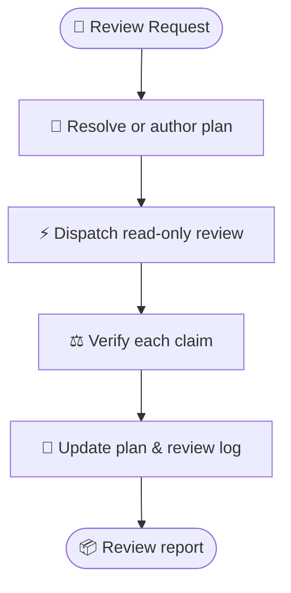

# dispatch-plan-review

Get a rigorous second opinion on an implementation plan before code is written. The skill checks
the plan against the requirement, the host repository, and the existing code, then records
verified findings and resolutions in the plan.



## Prerequisites & Installation

`dispatch` provides the provider setup and runner used by this skill. See its
[prerequisites and installation guide](../dispatch/README.md#prerequisites--installation) first.

Install both skills in the same installation scope:

```bash
npx skills add Gyunikuchan/dispatch-skills --skill dispatch --skill dispatch-plan-review
```

Use `-g` for a global installation, or `--all` to install the complete suite.

> [!NOTE]
> `dispatch-plan-review` has no separate provider configuration. It uses the effective
> configuration from `dispatch`.

## How to Use

Run `/dispatch-plan-review` in your agent session.

### Review an existing plan

Review the plan resolved for the current branch:

```text
/dispatch-plan-review
```

Review a specific plan instead:

```text
/dispatch-plan-review .scratch/plan/2026-09-08-billing-engine.md
```

### Add review focus

Name the risks that deserve extra attention after the plan path:

```text
/dispatch-plan-review .scratch/plan/2026-09-08-auth-v2.md focus on trust boundaries and session revocation
```

If the plan is already well-scoped, a general review is enough:

```text
/dispatch-plan-review focus on backward compatibility and data migrations
```

### Review from a requirement

When no plan exists, provide the requirement and the skill creates a structured scratch plan before
reviewing it:

```text
/dispatch-plan-review Replace redis-pubsub with Postgres LISTEN/NOTIFY
```

```text
/dispatch-plan-review Add token bucket rate limiting to /api/v1/auth endpoints
```

> [!NOTE]
> A requirement can produce a new plan, but the skill does not implement the change. Use
> the repository's implementation workflow when you want the reviewed plan to drive implementation.

### Choose reviewers

Use the provider-pin syntax documented by [`dispatch`](../dispatch/README.md#choose-a-provider) when
you need a particular provider or several independent perspectives:

```text
/dispatch-plan-review (claude,copilot) .scratch/plan/2026-09-08-auth-v2.md
/dispatch-plan-review (all) focus on state-machine lifecycles
```

Leave providers unpinned to use `dispatch`'s normal cascade and fallback behavior.

### Re-review an edited plan

Run the command again after changing the plan:

```text
/dispatch-plan-review .scratch/plan/2026-09-08-billing-engine.md focus on the revised migration steps
```

The skill uses the `### Round` headings in `## Review Findings & Resolutions` to identify the next
review round and narrow the review to changed sections.

## What to expect

1. The skill resolves the target plan, or authors one from the requirement.
2. Delegates inspect the workspace in read-only mode and return claims about the plan.
3. The skill verifies each claim against the requirement, cited code, and repository rules.
4. Accepted findings are folded into the plan, and every review round is recorded in
   `## Review Findings & Resolutions`.
5. A settled review checkpoints compact JSON frontmatter so later runs can identify changed plan
   sections without inferring freshness from prose.
6. The standalone run returns a concise report; another workflow can receive the reviewed plan.

> [!NOTE]
> This skill may update the target plan, but delegates never edit files, create commits, or push
> changes. The skill never changes code.

## Detailed review rubric

Use this disclosed rubric for focused or high-risk reviews. Every plan is checked across seven
areas:

| Area | Focus tags | Questions it answers |
|---|---|---|
| **Requirement & Intent Fidelity** | `intent`, `traceability`, `user-gap`, `scope`, `scope-creep` | Bidirectional requirement mapping; flawed premises, conflicts, and missing prerequisites; unrequested work or gold-plating. |
| **Domain & Business Logic** | `correctness`, `domain-logic`, `invariant`, `state-machine` | Project and domain rules; state consistency across multi-step mutations; valid lifecycle transitions and reachable states. |
| **Plan Coherence & Architecture** | `architecture`, `coherence`, `approach`, `standards` | Producer-consumer contract alignment, sequencing, module boundaries, codebase idioms, and authoritative specifications. |
| **Security & Permissions** | `security`, `auth`, `validation` | Trust boundaries, credential exposure, isolation, authorization, input validation, injection, and traversal risks. |
| **Blast Radius & Reversibility** | `compatibility`, `blast-radius`, `migration`, `compat`, `rollback` | Adjacent callers, persisted schemas, multi-version compatibility, graceful degradation, and rollback. |
| **Testability & Success Criteria** | `verification`, `testability`, `spec-gap` | Checkable outcomes, named automated or concrete verification, edge expectations, and pass/fail definitions. |
| **Simplicity & Failure Modes** | `simplicity`, `yagni`, `edge-case` | Delete/reuse/stdlib before new abstraction; empty, zero, boundary, partial-failure, race, and fallback behavior. |

## Findings and resolutions

Actionable findings identify the plan section they affect:

```text
§ Verification Plan — testability: missing coverage for expired sessions → add an integration test
```

Claims based on existing code include an exact file and line. The skill classifies each claim as
accepted, rejected, downgraded, or disputed, then records the rationale in the plan.

## Nuances & troubleshooting

- **The plan is stale:** If a new requirement does not match the plan resolved for its branch slug,
  choose whether to reuse it, overwrite it, or review under a fresh slug.
- **Preparation fails:** `scripts/prepare-review.mjs --request <json-file|->` validates both skill
  manifests, request fields, artifact freshness, and temporary dispatch inputs before launch.
- **No automatic plan path:** On a protected branch or detached `HEAD`, pass an explicit plan path.
- **Provider or authentication issue:** Follow [`dispatch`'s troubleshooting guide](../dispatch/README.md#nuances-quirks--troubleshooting).
