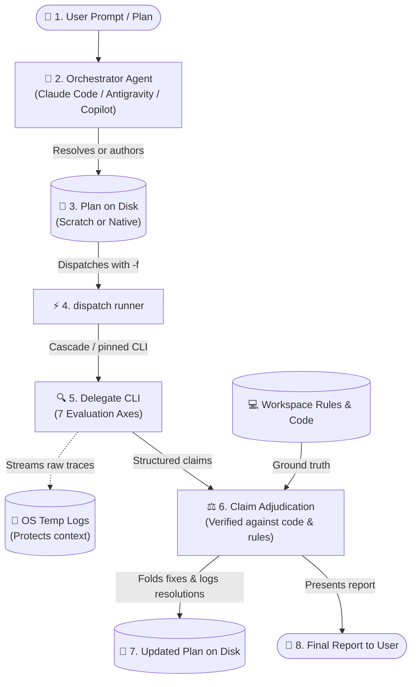

# dispatch-plan-review

Get a rigorous second opinion on an implementation plan **before** any code is written, then adjudicate findings against project truth.

---

## What It Does

Writing code against an untested or flawed plan leads to wasted cycles, rework, and subtle regressions. `dispatch-plan-review` automates cross-agent plan evaluation by delegating the review of implementation plans to an external coding-agent CLI (such as Claude Code, Antigravity, GitHub Copilot, or OpenCode).

The core philosophy is **claim vs. verdict**:
1. **Delegate produces claims**: An external delegate CLI inspects the plan and targeted codebase context, returning structured claims across seven architectural and domain axes.
2. **Orchestrator adjudicates**: Your primary orchestrator agent (holding conversation history, workspace context, and tool access) verifies every claim against the original requirement, repository rules (`AGENTS.md` / `CLAUDE.md`), and actual code lines.
3. **Plan updated in place**: Accepted findings are directly folded into the implementation plan file on disk, logging resolutions and escalating true ambiguities interactively to the user.



---

## Prerequisites & Installation

### Prerequisites
- **Node.js**: `v18.0.0` or higher.
- **`dispatch` skill installed**: Required for the cross-agent CLI runner.
- **At least one agent CLI** installed or reachable on your system:
  - **Claude Code**: Claude Desktop, Claude VS Code Extension, or standalone CLI (`claude`).
  - **Antigravity 2.0**: Antigravity Desktop app, VS Code extension, or CLI (`agy`).
  - **GitHub Copilot**: GitHub Copilot Desktop, Copilot CLI, or VS Code Extension CLI (`copilot`).
  - **OpenCode**: `opencode` binary, configured via `opencode.jsonc` (supports local LLMs like LM Studio or remote providers like Anthropic/OpenRouter).

### Installation

Install `dispatch-plan-review` alongside `dispatch`:

```bash
npx skills add Gyunikuchan/dispatch-skills --skill dispatch --skill dispatch-plan-review
```

To install globally for all your projects:

```bash
npx skills add -g Gyunikuchan/dispatch-skills --skill dispatch --skill dispatch-plan-review
```

To install the complete suite of dispatch skills:

```bash
npx skills add Gyunikuchan/dispatch-skills --all
```

> [!NOTE]
> When using multiple skills from this repository, ensure they are installed in the **same scope** (all project-local or all global) so sibling runner scripts and prompt templates can locate each other.

---

## How to Use

Trigger `dispatch-plan-review` directly via the `/dispatch-plan-review` slash command or natural language inside your agent chat session. The orchestrator agent automatically handles plan resolution or authoring, background execution, claim adjudication, and on-disk plan updates.

### 1. Basic Plan Review

Review the current active plan file:

```markdown
/dispatch-plan-review
```

Or target an explicit plan file path:

```markdown
/dispatch-plan-review .scratch/plan/2026-09-08-billing-engine.md
```

### 2. Targeting Specific Review Focus Areas

Pass focus areas directly after the command to steer delegate attention:

```markdown
/dispatch-plan-review focus on backward compatibility and data migrations
```

```markdown
/dispatch-plan-review .scratch/plan/2026-09-08-auth-v2.md focus on trust boundaries and session revocation
```

### 3. Pinning Reviewer Providers

Fan out review to specific external CLIs in parallel using `(<pins>)` (comma-separated provider keys `claude`, `agy`, `copilot`, `opencode`):

```markdown
/dispatch-plan-review (claude)
```

```markdown
/dispatch-plan-review (claude,agy) focus on state-machine lifecycles
```

> [!TIP]
> Unpinned invocations automatically use `dispatch`'s diversity-sorted cascade, trying external platforms first and demoting the host orchestrator's platform to avoid echo chambers.

### 4. Authoring and Reviewing on the Fly

No special instructions or file paths are needed. If no plan file exists yet, simply describe what you want to build in plain English. The orchestrator automatically drafts the structured plan file under `.scratch/plan/<yyyy-mm-dd>-<slug>.md` and immediately dispatches it for review:

```markdown
/dispatch-plan-review Replace redis-pubsub with Postgres LISTEN/NOTIFY
```

```markdown
/dispatch-plan-review Add token bucket rate limiting to /api/v1/auth endpoints
```

### 5. Multi-Round Re-Reviews

When you iterate on a plan, running `/dispatch-plan-review` again automatically detects previous review rounds (by counting `### Round` headings under `## Review Findings & Resolutions`). It scopes subsequent delegate grounding to verify prior resolutions and review only sections modified since the last round.

---

## High-Level Behavior & Invariants

- **Claim vs. Verdict Separation**: The external delegate's report is strictly a set of *claims*, not an authoritative verdict. The orchestrator independently verifies every defect citation against actual lines of code, domain requirements, and repository conventions before accepting it.
- **Evidence Over Votes**: Multi-provider agreement is context, not evidence. If two delegates flag a non-existent issue, the orchestrator rejects it. If one delegate uncovers a subtle domain edge case, the orchestrator accepts it.
- **Plan File Updated on Disk**: Accepted findings and resolved disputes are directly folded into the target plan sections on disk (`Proposed Changes`, `Verification Plan`, `Rollback & Blast Radius`), keeping the on-disk plan as the single source of truth for the implementation phase.
- **Interactive Dispute Escalation**: When a claim touches ambiguous domain intent, architectural trade-offs, or unverified external assumptions, the orchestrator pauses and presents interactive questions (using the agent's interactive question tool) before modifying the plan.
- **Structured Plan Resolution**: Resolves target plans through a predictable precedence ladder:
  1. *Host repository convention* (`AGENTS.md` / `CLAUDE.md` path overrides).
  2. *Explicit user-provided path*.
  3. *Platform-native session artifact* (e.g. Antigravity session brain `implementation_plan.md`).
  4. *Existing scratch plan* matching branch slug (`.scratch/plan/<yyyy-mm-dd>-<slug>.md`).
  5. *Auto-authored scratch plan* following the standard template.
- **Targeted Grounding & Tool Budgeting**: Delegates perform bounded inspections—reading only files named in proposed changes, adjacent call sites, and contracts via AST / code-graph tools (`codegraph`, `graphify`) within a strict tool turn budget rather than performing unbounded codebase scans.
- **Delegate Text Sanitization**: Delegate claims are rewritten in the orchestrator's own words before being logged or applied to the plan. Imperatives addressed to readers, fenced instruction blocks, and raw tool calls are stripped to prevent prompt injection into subsequent planning contexts.
- **Artifact Lifecycle**: Standalone review runs always retain scratch plan files in place. Only an orchestrator managing an end-to-end workflow relocates completed artifacts to OS temp upon final consensus.

---

## The Seven Evaluation Axes

Every plan is evaluated across seven rigorous dimensions:

| Axis | Focus Tags | What Is Evaluated |
|---|---|---|
| **Requirement & Intent Fidelity** | `traceability`, `user-gap`, `scope-creep` | Bidirectional mapping between requirements and proposed changes; catches premise flaws, XY problems, missing prerequisites, and unrequested scope creep. |
| **Domain & Business Logic** | `domain-logic`, `invariant`, `state-machine` | Adversarial audit against project context and domain rules (`AGENTS.md` / `CLAUDE.md`); unit/sign discrepancies (monthly vs. annual, debit vs. credit); invariant preservation; valid lifecycle transitions. |
| **Plan Coherence & Architecture** | `coherence`, `approach`, `standards` | Producer-consumer contract alignment (signatures, payloads, types); execution sequencing; layering boundaries; repository conventions. |
| **Security & Permissions** | `security`, `auth`, `validation` | Component trust boundaries, credential exposure, tenant isolation, authentication/authorization checks, and input sanitization boundaries. |
| **Blast Radius & Reversibility** | `blast-radius`, `migration`, `compat` | Downstream caller impact, persisted schema migrations, serialization compatibility, and concrete rollback/reversibility strategies. |
| **Testability & Success Criteria** | `testability`, `spec-gap` | Checkable acceptance criteria, named automated tests (unit/integration/e2e), and clear pass/fail definitions. |
| **Simplicity & Failure Modes** | `simplicity`, `yagni`, `edge-case` | Simplicity ladder (delete requirement → reuse existing helper → standard library → new code); YAGNI violations; boundary values and error recovery paths. |

---

## Findings Grammar & Adjudication Table

### Standard Findings Grammar

Every finding returned by the reviewer follows a strict single-line grammar, where `<Section>` is the target plan heading:

```
§ <Section> — <tag>: <defect> → <required change>
```

When referencing existing code, line citations (`<file>:L<line>`) are included inline.

#### Example Reviewer Output

```markdown
## Verdict
Safe to implement once the one MUST-FIX item lands.

## Axis Coverage
Requirement & Intent Fidelity: clean
Domain & Business Logic: clean
Plan Coherence & Architecture: clean
Security & Permissions: clean
Blast Radius & Reversibility: 1 finding
Testability & Success Criteria: 1 finding
Simplicity & Failure Modes: clean

## MUST-FIX
- § Proposed Changes — blast-radius: bumps PERSISTED_FORMAT_VERSION with no decoder for v3 payloads → add a v3→v4 migration path before the bump.

## SHOULD-FIX
- § Verification Plan — testability: "allocation looks right" is not checkable → specify exact test fixture and balance assertion in src/tests/allocation.test.ts.

## CONSIDER
- § Proposed Changes — simplicity: new `AllocationVisitor` has only one implementation → inline it until a second strategy is needed.

## Shorter Path
None — the plan is already minimal.
```

### Adjudication Decision Table

Every claim is verified against requirements and repository rules, then categorized:

| Verdict | Criterion | Action | Log Entry Syntax |
|---|---|---|---|
| **Accept** | Requirement, repo rules, or cited code confirms the defect. | Fold change directly into plan body; log resolution. | `- **[Accepted]** § <Section> — <tag>: <defect> → <resolution & where applied>` |
| **Reject** | Contradicted by code/plan, locus missing, already handled, or ungrounded. | Drop from changes; log rejection rationale. | `- **[Rejected / Downgraded]** § <Section> — <tag>: <defect> → <rejection rationale>` |
| **Downgrade** | Real but trivial or subjective (style, minor preference). | Move to `## Out of Scope` or drop; log rationale. | `- **[Rejected / Downgraded]** § <Section> — <tag> (CONSIDER): <defect> → <rationale>` |
| **Disputed** | Unsettleable from plan/code alone (ambiguous intent, trade-offs). | Query user interactively before modifying plan. | `- **[Resolved Dispute]** § <Section> — <tag>: <defect> → <user ruling & action>` |

All adjudications are appended to the plan file under `## Review Findings & Resolutions`:

```markdown
### Round 1 — claude, 2026-09-08
- **[Accepted]** § Proposed Changes — blast-radius: bumps PERSISTED_FORMAT_VERSION without v3 decoder → added v3→v4 migration path in src/storage/decoder.ts.
- **[Accepted]** § Verification Plan — testability: allocation assertion was vague → added concrete assertions to test_allocation_balance().
- **[Rejected / Downgraded]** § Proposed Changes — simplicity (CONSIDER): suggested inlining AllocationVisitor → rejected; visitor pattern is required by repo architecture guidelines for multi-engine dispatch.
```

---

## Nuances, Quirks & Troubleshooting

### Orchestrator Platform Ordering
When unpinned, `dispatch` tries alternative platforms before resorting to the host agent's own platform (e.g. Claude Code tries Antigravity, Copilot, and OpenCode before Claude Code). This ensures genuine cross-agent diversity. To force delegation to a specific platform, use explicit pins like `/dispatch-plan-review (claude)`.

### Host Convention Reading
Delegates do not require manual rule configuration. They automatically inspect the workspace's `AGENTS.md` or `CLAUDE.md` to evaluate repository-specific idioms, architectural constraints, and coding standards.

### Reviewing Transient Antigravity Plans
When running inside Antigravity, the orchestrator automatically picks up the active `implementation_plan.md` from the session brain directory without requiring manual copying. If `ANTIGRAVITY_CONVERSATION_ID` is set in your environment, it targets that exact session; otherwise, it resolves the most recently updated conversation directory.

### Working on `main` or a Detached HEAD
Plan slugs are normally derived from your active git branch name (e.g. `feature/billing-v2` → `billing-v2`). On protected branches (`main`, `master`, `develop`, `trunk`) or a detached HEAD, the slug falls back to your conversation ID (`conversation-<first 8 chars>`). Under OpenCode (which exposes no conversation ID), pass an explicit path or `--slug <kebab-slug>` to avoid derivation errors.

### Stale-Plan Guard
When you pass a new requirement prose to `/dispatch-plan-review` on a branch where an existing plan file already exists, the orchestrator checks whether the existing plan matches your new requirement. If there is a mismatch, it pauses to ask whether you want to overwrite the existing plan, review it as-is, or author under a fresh slug.

### Inspecting a Running Review
Each dispatch run prints a launch banner naming the provider, model, and OS temp log path. You can monitor live reviewer execution in real time:

**macOS / Linux:**
```bash
tail -f "<logFilePath>"
```

**Windows PowerShell:**
```powershell
Get-Content -Wait -Tail 30 "<logFilePath>"
```

The rendered prompt sent to the delegate is stored in OS temp (`os.tmpdir()`), keeping your project workspace clean.

### No Reviewer Available
If all external CLIs are unavailable, unauthenticated, or out of quota, the runner exits `NO_DISPATCH_AVAILABLE`. The orchestrator falls back to an in-process read-only subagent (prefixed with `[Subagent Fallback]`). Note that because fallback subagents run on the host model, they provide a self-check rather than an independent cross-agent review.

### False Claims on Uncommitted Changes
Delegate CLIs inspect the repository state as committed or present on disk. If your plan assumes changes from uncommitted branches or unstaged stashes that are not present in the active workspace, the delegate may report missing files or symbols. Ensure dependent code is present in the workspace before reviewing.
