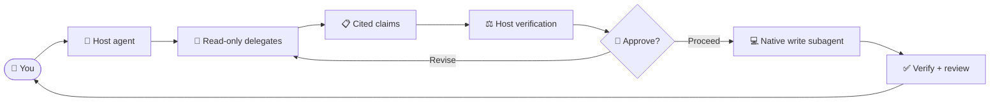

# Dispatch

Bring independent agent perspectives into planning, implementation, and review without leaving your preferred agent CLI. `dispatch` keeps external delegates read-only, verifies their claims against the repository, and leaves production changes under your approval.

## Contents

- [How dispatch works](#how-dispatch-works)
- [Before you start](#before-you-start)
- [Choose a verb](#choose-a-verb)
- [Command anatomy](#command-anatomy)
- [Common workflows](#common-workflows)
- [Configure routing](#configure-routing)
- [Safety and artifacts](#safety-and-artifacts)
- [Troubleshooting](#troubleshooting)

## How dispatch works

Your host agent remains the orchestrator. It asks configured delegates for independent analysis, checks their evidence, and decides what moves forward. During implementation, only the host's native write subagent edits production files—and only after approval.



Use one verb for a focused question or standalone review, or let `implement` run the approval-gated delivery loop.

## Before you start

You need:

- Node.js `>=22`
- At least one supported agent CLI or bundle: Claude Code, Antigravity, GitHub Copilot, OpenCode, or Codex
- An active dispatch configuration

From this directory, create a config and check it:

```bash
cp config.sample.jsonc config.jsonc
# Keep only providers and models available to you.
node scripts/dispatch.mjs --validate-only
node scripts/dispatch.mjs --doctor --level high
```

> [!NOTE]
> `config.sample.jsonc` is an example, not a built-in default. Dispatch does nothing until you create `config.jsonc` or `config.local.jsonc`.

For installation instructions, see the [repository README](../../README.md). For a guided setup and tuning reference, see [Configure dispatch](references/readme/configuration.md).

## Choose a verb

| Verb | Use it when… | Result |
|---|---|---|
| `ask` | You have a focused repository question | Verified, attributed analysis; no edits |
| `plan` | A change fits one coherent delivery unit | A reviewed implementation plan |
| `design` | Work crosses boundaries or needs multiple increments | A reviewed design and ordered increments |
| `review` | A plan, design, diff, or branch already exists | Settled findings; report-only by default |
| `implement` | You want a requirement or artifact carried through delivery | Approval-gated edits, verification, review, and handoff |

Read [Dispatch verbs](references/readme/verbs.md) for decision guidance, each verb's flow, artifact behavior, and more examples.

## Command anatomy

```text
/dispatch [level] [(pins)] [verb-clause]: <argument>
```

```text
/dispatch high (claude,agy) review code: main..HEAD
          ─┬─  ─────┬─────  ─────┬─────  ────┬────
         level      pins          verb       argument
```

- **Level**: `low`, `medium`, `high`, `xhigh`, or `max`. Your config decides the models, breadth, and review policy behind each level.
- **Pins**: provider names, a target count such as `(3)`, or `(all)`.
- **Verb**: `ask` (the default), `plan`, `design`, `review [plan|design|code] [--fix]`, or `implement [--phases from:<phase>]`.
- **Argument**: a question, requirement, artifact path, or Git range. The colon is required when an argument follows.

Use `node scripts/dispatch.mjs --help` for the exhaustive, current CLI flag reference.

## Common workflows

### Ask several providers to investigate

```text
/dispatch high (all): Could concurrent refreshes issue two valid tokens?
```

Use a bounded question and name the relevant behavior or code area. Dispatch returns claims for your host to verify; delegates do not edit files.

### Review the current work and apply safe fixes

```text
/dispatch review code --fix
```

> [!NOTE]
> Reviews are report-only unless you add `--fix`. With no range, a dirty tree means staged, unstaged, and untracked changes only; use `main..HEAD` when committed branch work should be included.

### Plan and deliver a contained change

```text
/dispatch implement: Add idempotency keys to webhook delivery
```

This starts at planning, reviews the plan, asks for approval, establishes a test baseline, delegates implementation, verifies approved checks, and reviews the resulting code.

If the `brainstorming` skill is installed, dispatch first uses it to settle scope and solution in chat (followed by any grilling-style skill you invoke), then writes a single plan or design.

### Design a cross-cutting migration

```text
/dispatch max (all) design: Migrate billing from mutable balances to a ledger
```

Design is for work that should be delivered in dependency-aware increments. One invocation implements one selected increment; the handoff provides the resume command for the next.

### Resume from an existing artifact

```text
/dispatch implement: .scratch/plan/2026-09-24-webhooks-plan.md
/dispatch implement --phases from:code-review: .scratch/plan/2026-09-24-webhooks-plan.md
```

> [!NOTE]
> Resume controls never bypass prerequisites. Dispatch stops and names the missing producing phase when the artifact, approval, or recorded state is incomplete.

## Configure routing

The active configuration has three parts:

| Section | Controls |
|---|---|
| `read-delegates` | Read-only targets used for questions and reviews |
| `write-subagents` | Native writer used by each host platform during implementation |
| `phases` | Target count, rounds, consensus, and optional provider filters for each review type |

`config.local.jsonc` takes priority over `config.jsonc`; they are complete alternatives and are not merged. Every entry in a provider's `targets` array is an independent review voice. Model arrays are fallback aliases within one target, not extra voices.

See [Configure dispatch](references/readme/configuration.md) for level resolution, pins, phase policies, sandbox settings, and diagnostics. Provider installation and failure details live in the [provider reference](references/providers.md).

## Safety and artifacts

- Read delegates run with credentials stripped and provider-specific read-only controls.
- Production edits require approval and use a configured native write subagent.
- Verification runs the commands approved in the plan; review fixes are verified and reviewed again.
- Plans, designs, and walkthroughs live in `.scratch/plan/` so interrupted work can resume.
- Noisy prompts, logs, and run state stay in the OS temporary directory.
- Dispatch never commits, pushes, or opens a pull request.

> [!NOTE]
> When OS sandboxing is unavailable, dispatch warns, records `sandboxDowngraded`, and continues unsandboxed. Provider read-only controls remain where supported; see the [provider reference](references/providers.md) for each boundary.

## Troubleshooting

| Problem | Next step |
|---|---|
| No candidates are available | Run `node scripts/dispatch.mjs --doctor --level <level>` and check `read-delegates` |
| A model or phase is unexpected | Inspect the active file, requested level, pins, and `--doctor` output |
| Implementation cannot start | Configure `write-subagents` for the host platform |
| A prerequisite is missing | Resume from the producing phase named in the diagnostic |
| A verification gate failed | Open the reported `logPath`; dispatch preserves the working tree for a recorded recovery decision |
| Review reached its round cap with live MUST findings | Extend by another cap-sized block (default), or stop, rule live findings, and run one final verification wave; resume from the resolution log if interrupted |
| A provider failed | Use the probe and failure guidance in the [provider reference](references/providers.md) |

For complete configuration diagnostics, see [Validate and diagnose](references/readme/configuration.md#validate-and-diagnose).
