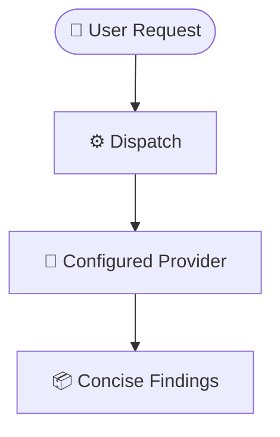

# dispatch

Delegate a focused, read-only investigation to another coding-agent CLI and receive a concise
result in your current agent session. Use it for code traces, research, architecture questions,
and reviews that benefit from an independent context.



## Prerequisites & Installation

### Requirements

- Node.js 22 or later.
- At least one supported provider installed and ready to run. Authenticate it if the provider
  requires sign-in:

  | Provider | Pin | Command |
  |---|---|---|
  | Claude Code | `claude` | `claude` |
  | Antigravity | `agy` | `agy` |
  | GitHub Copilot | `copilot` | `copilot` |
  | OpenCode | `opencode` | `opencode` |

- OpenCode also needs a working provider configuration in `opencode.jsonc`.

### Install

Install `dispatch` in the current project:

```bash
npx skills add Gyunikuchan/dispatch-skills --skill dispatch
```

Install it globally:

```bash
npx skills add -g Gyunikuchan/dispatch-skills --skill dispatch
```

To install the complete dispatch-skills suite:

```bash
npx skills add Gyunikuchan/dispatch-skills -s '*'
```

> [!NOTE]
> If you install multiple skills from this repository, install them in the same installation scope: either all
> project-local or all global. Companion skills share runner files and may not resolve correctly
> when scopes are mixed.

## How to Use

Run `/dispatch` in your agent session and describe one bounded task.

### Basic examples

```text
/dispatch Trace how discount stacking is calculated in src/domain/pricing.ts
/dispatch Investigate why token refreshes fail in src/auth/session.ts
/dispatch Review the retry behavior in src/worker/queue.ts for lost jobs
```

Good prompts name the relevant files and the question to answer. Keep one investigation per
dispatch so the result stays focused.

### Attach a brief or artifact

Repository files are available to the delegate automatically. Use `-f` for a scratch brief,
generated output, or other context that is not already part of the workspace; repeat it for
multiple attachments:

```text
/dispatch -f .scratch/api-migration.md Check the migration for backward-compatibility risks
/dispatch -f schema.sql -f migration.sql Identify indexes missing from the migration
```

> [!NOTE]
> Do not attach ordinary repository files just to make them visible. The delegate can inspect the
> workspace directly; use `-f` when an artifact needs to be supplied or highlighted.

### Choose a provider

Without a provider pin, `dispatch` uses the configured providers in cascade order and can fall
back when one is unavailable:

```text
/dispatch Investigate the cache invalidation path
```

Pin one provider when you need a particular tool or model:

```text
/dispatch --provider claude Review the GraphQL schema for N+1 query risks
```

Run several providers in parallel for independent perspectives:

```text
/dispatch (claude,copilot) Compare two approaches to the retry logic
/dispatch (2) Review the migration with two configured targets
/dispatch (all) Audit the authentication flow from independent perspectives
```

Named platforms all run when configured. A number launches up to that many configured targets;
`all` launches every configured target. The available provider keys are `claude`, `agy`, `copilot`, and `opencode`.

> [!NOTE]
> A provider pin disables fallback to other providers. Remove the pin when resilience matters more
> than choosing a specific provider; configured candidates within the pinned provider can still be
> tried.

### Tune model, effort, or timeout

Command-line overrides are useful for one-off runs:

```text
/dispatch --provider copilot -m gpt-5.6-luna -e high Audit src/crypto/tokens.ts
/dispatch -m claude-opus-5 -e high Verify concurrency safety in src/worker/queue.ts
/dispatch -t 3600 Trace the slow report-generation path
```

`-e` accepts levels supported by the selected provider. The default timeout is 1,800 seconds
(30 minutes).

### Common options

| Option | Use |
|---|---|
| `-f <path>` / `--file` / `--artifact` | Attach a file or artifact; repeat for multiple files. |
| `-p <string>` / `--prompt <string>` | Pass the prompt as an option instead of trailing text. |
| `--prompt-file <path>` | Read the prompt from a file. |
| `--response-schema-file <path>` | Require provider-native structured output matching a JSON Schema; currently Claude-only. |
| `--provider <name>` | Restrict the run to one configured provider. |
| `--candidate-index <n>` | Select one zero-based configured candidate; requires `--provider`. |
| `-m <model>` / `--model <model>` | Override the configured model for one run. |
| `-e <level>` / `--effort <level>` | Override reasoning effort for one run. |
| `-t <seconds>` / `--timeout <seconds>` | Set the execution timeout. |

### Advanced options

Most users can ignore these options; they are useful for provider-specific runs, automation, or
diagnostics.

| Option | Use |
|---|---|
| `-a <name>` / `--agent <name>` | Select an agent for the OpenCode provider only. |
| `--json` | Request structured output from the OpenCode provider only. |
| `-v` / `--verbose` | Show live provider traces while diagnosing a long-running run. |
| `--max-buffer <MB>` | Raise the output buffer if a provider result is truncated. |
| `--batch-file <path>` | Execute caller-resolved targets and reserves from a temporary JSON manifest. |
| `--orchestrator <name>` | Override automatic host-platform detection. |
| `--orchestrator-model <model>` | Override automatic host-model detection. |
| `--no-config` | Skip configuration; requires `--provider`. |
| `--validate-only` | Validate configuration without dispatching. |
| `--list-platforms` | List provider keys in the effective configuration. |
| `--list-targets` | List configured targets in count/`all` selection order as JSON. |
| `--doctor` | Validate configuration and report the selected file, ordered candidates, and provider health. |

## Configuration

The shipped defaults work without configuration. To customize provider membership, models, or
reasoning effort, create `config.local.jsonc` or `config.jsonc` next to the installed skill. Use
[`config.default.jsonc`](config.default.jsonc) as the schema reference.

Run `node scripts/dispatch.mjs --doctor` from the installed skill directory to inspect the
effective file, candidate order, binary/mode reachability, sandbox support, and corrective
commands. Standalone defaults may intentionally differ from a workflow's phase-and-level model
policy.

Plan/code review skills prepare their own artifacts, freshness metadata, prompts, and temporary
batch manifests. `dispatch` remains the generic read-only execution and fallback boundary.

The first existing file wins:

1. `config.local.jsonc`
2. `config.jsonc`
3. `config.default.jsonc`

> [!NOTE]
> Configuration files replace one another rather than merge. If you create an override, include
> every provider you want to keep enabled; an omitted provider is unavailable to both normal
> fallback and `(all)` runs.

### Use one provider

For a simple setup, configure only the provider you want and let its CLI choose the model:

```jsonc
{
  "platforms": {
    "claude": {
      "effort": "high"
    }
  }
}
```

### Add provider and model fallbacks

Use a model array for alternatives within one provider, and an array of objects for ordered
provider candidates:

```jsonc
{
  "platforms": {
    "claude": {
      "model": ["claude-opus-5", "claude-sonnet-5"],
      "effort": "high"
    },
    "copilot": {
      "model": "gpt-5.6-luna",
      "effort": "medium"
    },
    "opencode": [
      {
        "model": "opencode-go/glm-5.3-flash",
        "effort": "max"
      },
      {
        "model": "lmstudio/qwen3.8-27b-ridge"
      }
    ]
  }
}
```

Unpinned runs use the configured cascade; `-m` and `-e` take precedence for a single run.

### Use a local OpenCode model

To keep dispatch local, configure only an OpenCode model and make sure its local server is
running:

```jsonc
{
  "platforms": {
    "opencode": {
      "model": "lmstudio/qwen3.8-27b-ridge"
    }
  }
}
```

## What to expect

1. `dispatch` sends the prompt to the selected provider or providers in read-only mode.
2. The result is a synthesized answer rather than raw provider logs.
3. When supported, the result includes a provider session link or resume command.
4. The user or an upstream review/orchestration skill verifies and adjudicates reports before edits or other action; the host agent remains responsible for applying any resulting edits.

> [!NOTE]
> Delegates can inspect the workspace but do not edit files, create commits, or push changes.

## Nuances, Quirks & Troubleshooting

- **No provider is available:** install and authenticate at least one provider listed above.
- **A pinned provider is unavailable:** remove the pin to allow the normal cascade, or add the
  provider to the effective configuration.
- **The run needs more time:** increase the timeout, for example `-t 3600`.
- **You need diagnostics:** rerun with `-v` and inspect the log path printed by `dispatch`.
- **OpenCode fails to start:** check that `opencode.jsonc` names an available model and has the
  required credentials or local server.
