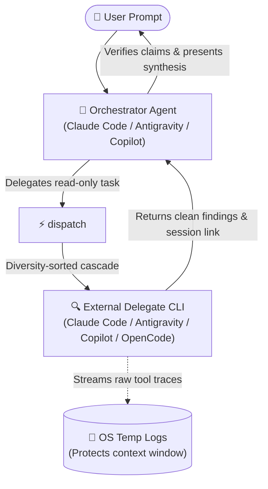

# dispatch

Hand bounded, read-only tasks to external coding-agent CLIs—Claude Code, Antigravity, GitHub Copilot, and OpenCode—and receive clean, synthesized results without polluting your primary agent's context window.

---

## What It Does

When working with an AI coding assistant (the **orchestrator**—such as Claude Code, Antigravity, or GitHub Copilot), large investigations, code trace requests, and architectural inquiries can flood the active context window with hundreds of lines of raw search outputs, AST dumps, and intermediate tool iterations.

`dispatch` serves as a **cross-agent delegation bridge**:
1. **Delegates bounded read-only work** to an external agent CLI (`claude`, `agy`, `copilot`, or `opencode`).
2. **Preserves context hygiene**: Runs the delegate in the background, streaming verbose traces and tool logs out-of-context to OS temporary files.
3. **Returns clean syntheses & session handles**: Delivers a concise answer to the orchestrator along with an interactive session resume command or Antigravity canvas deep-link.
4. **Enforces structural read-only safety**: Delegates cannot mutate workspace code or stage git commits. File edits and final decisions remain strictly with your primary orchestrator agent.

This is the canonical reference for the shared runtime, installation, provider-pin grammar,
runner flags, configuration, and troubleshooting used by the companion skills.



---

## Prerequisites & Installation

### Prerequisites
- **Node.js**: `v18.0.0` or higher.
- **At least one agent CLI** installed or reachable on your system:
  - **Claude Code**: Claude Desktop, Claude VS Code Extension, or standalone CLI (`claude`).
  - **Antigravity 2.0**: Antigravity Desktop app, Antigravity VS Code extension, or CLI (`agy`).
  - **GitHub Copilot**: GitHub Copilot Desktop, Copilot CLI, or VS Code Extension CLI (`copilot`).
  - **OpenCode**: `opencode` binary, configured via `opencode.jsonc` (supports local LLMs like LM Studio or remote providers like Anthropic/OpenRouter).

### Installation

Install `dispatch` into your current project workspace:

```bash
npx skills add Gyunikuchan/dispatch-skills --skill dispatch
```

To install globally for all your projects:

```bash
npx skills add -g Gyunikuchan/dispatch-skills --skill dispatch
```

To install the complete suite of dispatch skills:

```bash
npx skills add Gyunikuchan/dispatch-skills --all
```

> [!NOTE]
> When using multiple skills from this repository, ensure they are installed in the **same scope** (all project-local or all global) so sibling runner scripts can locate each other.

---

## How to Use

Trigger `dispatch` directly via the `/dispatch` slash command or natural language inside your agent chat session. The orchestrator agent automatically handles argument assembly, background execution, log capture, and claim verification.

### 1. Basic Invocations

Delegate an investigation, architectural question, or code trace:

```markdown
/dispatch Investigate why token refreshes fail silently in src/auth/session.ts
```

```markdown
/dispatch Trace how discount stacking is calculated in src/domain/pricing.ts and check for order dependence
```

### 2. Attaching Files & Context (`-f`)

Attach specific files or out-of-workspace artifacts as bounded context:

```markdown
/dispatch -f src/services/payment.ts -f src/types/billing.ts Check for race conditions in charge capture
```

> [!TIP]
> Delegate CLIs already have direct tool access to inspect workspace files. Use `-f` primarily for non-workspace artifacts, specific scratch briefs, or files you want the delegate to inspect with priority.

### 3. Pinning a Specific Provider (`--provider`)

Force delegation to a specific provider and bypass fallback to other platforms. If that provider has
multiple configured candidates, dispatch may still try those candidates in order:

```markdown
/dispatch --provider claude Analyze the state transitions in src/workflow/engine.ts
```

```markdown
/dispatch --provider claude Review our GraphQL schema definition for N+1 query vulnerabilities
```

The review and orchestration skills share the same provider-pin grammar:

```markdown
/dispatch (all) Audit the configured delegate platforms in parallel
/dispatch (claude,copilot) Compare two configured delegates
```

Pins are limited to platform keys printed by `node scripts/dispatch.mjs --list-platforms` (aliases
such as `antigravity` and `claudecode` are normalized first). `all` expands to that effective
configuration; it never includes a platform that is only present in the shipped defaults.

### 4. Overriding Model & Reasoning Effort (`-m`, `-e`)

Specify a custom model or elevated reasoning effort:

```markdown
/dispatch --provider copilot -m gpt-5.6-luna -e max Audit src/crypto/tokens.ts for timing attacks
```

```markdown
/dispatch -m claude-opus-5 -e high Verify concurrency safety in src/worker/queue.ts
```

### 5. Overriding Execution Timeout (`-t`)

Extend or shorten the execution timeout (default: `1800` seconds / 30 minutes):

```markdown
/dispatch -t 300 Quick dependency sanity check across all workspace package.json files
```

---

## Options & Flags Reference

The following flags are supported when calling `/dispatch` or configuring dispatch runs:

| Option / Flag | Description | Example Usage |
|---|---|---|
| `-f <path>` | Attach context file or artifact (repeatable; capped at 128 KB/file, 512 KB total). | `/dispatch -f src/api.ts Audit error handling` |
| `-p <string>` | Pass the prompt explicitly as a flag instead of positional text. | `/dispatch -p "Trace the retry path"` |
| `--prompt-file <path>` | Read the prompt from a file on disk (mutually exclusive with `-p` and positional prompt). | `/dispatch --prompt-file .scratch/brief.md` |
| `--provider <name>` | Pin one platform key printed by `--list-platforms`; disables fallback to other platforms while retaining that platform's configured candidates. | `/dispatch --provider claude Trace workflow state` |
| `-m <model>` | Override the delegate model identifier. | `/dispatch -m claude-opus-5 Review core types` |
| `-e <level>` | Override reasoning effort (CLI-specific, e.g. `low`, `medium`, `high`, `max`; OpenCode receives `--variant`). | `/dispatch -e max Verify crypto primitives` |
| `-t <sec>` | Override execution timeout in seconds (default: `1800`). | `/dispatch -t 600 Inspect index coverage` |
| `--orchestrator <name>` | Override auto-detected host platform (`claude`, `agy`, `copilot`, `opencode`). | `/dispatch --orchestrator claude ...` |
| `--orchestrator-model <model>` | Override auto-detected host model (demotes matching platform+model to end of cascade). | `/dispatch --orchestrator-model claude-opus-5 ...` |
| `--json` | Request structured JSON output (OpenCode provider only). | `/dispatch --provider opencode --json Parse AST` |
| `-a <name>` | Override the delegate agent name (OpenCode provider only). | `/dispatch --provider opencode -a delegate ...` |
| `-v` | Stream live verbose execution traces to the active terminal (interactive debugging). | `/dispatch -v Run complex benchmark trace` |
| `--no-config` | Skip loading cascade config; requires `--provider`. | `/dispatch --no-config --provider claude ...` |
| `--validate-only` | Validate loaded configuration shape and exit without dispatching. | `node scripts/dispatch.mjs --validate-only` |
| `--list-platforms` | Print the effective config's platform keys in cascade order, one per line, and exit. Answers "which platforms can this repo actually dispatch to?" and is how an `all` pin is expanded. | `node scripts/dispatch.mjs --list-platforms` |
| `--max-buffer <MB>` | Raise subprocess stdout/stderr buffer cap (default: `10` MB) if delegate output is truncated. | `/dispatch --max-buffer 25 ...` |

---

## Configuration & Cascade Routing

Cascade order, per-provider models, and reasoning effort defaults live in JSONC configuration files.

### Configuration Precedence

`dispatch` loads the first configuration file found in the following precedence order (no merging across tiers):
1. `skills/dispatch/config.local.jsonc` *(project/user local override; git-ignored)*
2. `skills/dispatch/config.jsonc` *(project override; git-ignored)*
3. `skills/dispatch/config.default.jsonc` *(shipped repository default)*

### Example `config.jsonc`

```jsonc
{
  "platforms": {
    // Key order defines initial cascade priority
    "claude": { "model": ["claude-opus-5", "claude-sonnet-5"], "effort": "high" },
    "agy": { "model": "gemini-3.8-flash", "effort": "medium" },
    "copilot": { "model": "gpt-5.6-luna", "effort": "max", "sandbox": true },
    "opencode": [
      { "model": "opencode-go/glm-5.3-flash", "effort": "max" },
      { "model": "opencode-go/deepseek-v4.1-flash", "effort": "max" },
      { "model": "lmstudio/qwen3.8-27b-ridge" }
    ]
  }
}
```

### Cascade Rules & Diversity Sorting

- **Diversity-Sorted Cascade**: To ensure independent perspectives, `dispatch` tries the first candidate of each configured platform in key order before trying any platform's second candidate.
- **Orchestrator Demotion**: The host agent's own platform is tried last (and candidates matching the active orchestrator model are demoted further) to avoid self-reinforcing echo chambers.
- **In-Slot Fallbacks**: When `model` is configured as an array (e.g. `["claude-opus-5", "claude-sonnet-5"]`), the runner cascades through those models within that candidate slot before moving to the next platform.
- **Explicit Flag Precedence**: Command-line flags (`-m`, `-e`) always override config values.

---

## Key Features & Behaviors

- **Structural Read-Only Enforcement**: Delegates operate under strict read-only execution modes:
  - **Antigravity & Copilot**: Enforced via `--mode plan`.
  - **Claude Code**: Enforced via `--permission-mode plan`, tool allowlists (`Read`, `Glob`, `Grep`), and explicit tool disallow rules (`Write`, `Edit`, `NotebookEdit`).
  - **OpenCode**: Enforced via prompt guardrails, credential stripping, and Bubblewrap (`bwrap`) read-only mounts on Linux.
- **Context Window Protection**: All verbose subprocess logs, search dumps, and tool iterations stream to OS temp files (`os.tmpdir()`). Only the high-signal synthesized conclusion reaches the orchestrator's context window.
- **Session Continuity & Deep-Links**: When supported by the delegate, `dispatch` captures persistent session handles:
  - **Antigravity 2.0**: Emits a `conversation://<id>` deep-link that opens the full trajectory directly in the Antigravity desktop canvas.
  - **Claude Code**: Emits a `claude --resume <session_id>` command handle.
  - **GitHub Copilot**: Emits a `copilot --resume <session_id>` command handle.
- **Pre- and Post-Run Git Integrity Checks**: Takes a `git status --porcelain` snapshot before and after delegate execution. Any detected file modifications are flagged immediately as integrity warnings.
- **Graceful In-Process Fallback**: If all configured external CLIs are unavailable, unauthenticated, or rate-limited, the runner exits `NO_DISPATCH_AVAILABLE`. The orchestrator cleanly falls back to an in-process read-only subagent (`research` in Antigravity, `Explore` in Claude Code, `explore` in OpenCode, `self` in Copilot) without failing the workflow.

---

## Nuances, Quirks & Troubleshooting

### Binary Auto-Discovery
`dispatch` automatically scans standard directories across macOS, Windows, and Linux for standalone CLI binaries, Desktop application bundles, and VS Code extension caches. Explicit binary paths do not need to be configured in your environment.

### Claude Code Sandbox & Antigravity Language Server
When Claude Code dispatches a task to Antigravity, it executes the runner with `dangerouslyDisableSandbox: true`. This is required because Antigravity's local language server binds to a local TCP socket, which Claude Code's restricted Bash sandbox blocks (`bind: operation not permitted`). Safety remains structurally guaranteed through Antigravity's `--mode plan` flag.

### Inspecting In-Flight Progress
If a long-running dispatch task is in progress, you can inspect real-time delegate output using the log path emitted in the launch banner:

**macOS / Linux:**
```bash
tail -n 30 "<logFilePath>"
```

**Windows PowerShell:**
```powershell
Get-Content -Tail 30 "<logFilePath>"
```

### Environment Isolation & Authentication
Delegates run in a sanitized environment where sensitive API keys and tokens are stripped from environment variables (see [references/providers.md](references/providers.md) for the exact variable allowlist). Ensure each CLI is logged in interactively once on your system (`claude`, `agy`, `copilot`), or provide credentials in `opencode.jsonc`.

### Git Integrity False Positives
`dispatch` checks for workspace file changes across each run. Concurrent background activities—such as IDE auto-saves, background compilers, or active test watchers—can trigger false-positive integrity warnings. Check the modified files list reported in the warning before assuming delegate misbehavior.

### OpenCode Provider Setup
`opencode` resolves models and providers via `opencode.jsonc`:
- **Local LLMs (e.g. LM Studio)**: Ensure the local server is running at `http://127.0.0.1:1234/v1` and `opencode` is on `PATH`. Outbound network traffic is confined to prevent data leakage.
- **Remote Providers**: Specify any `<provider>/<model>` pair (e.g. `anthropic/claude-opus-5`, `openrouter/...`) and configure credentials in `opencode.jsonc`.
