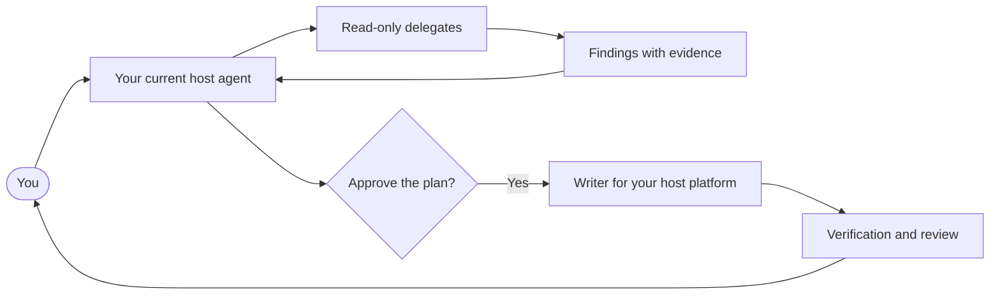

# Dispatch

Use Dispatch to bring independent agent perspectives into repository work without leaving your current agent environment. Your host agent checks delegates' evidence and makes the decisions; read delegates do not make production changes.

Dispatch can answer a focused question, help shape a design or plan, review existing work, or carry an approved change through implementation and verification.

## Contents

- [How Dispatch works](#how-dispatch-works)
- [Before you start](#before-you-start)
- [Choose a verb](#choose-a-verb)
- [Command pattern](#command-pattern)
- [Common workflows](#common-workflows)
- [Configure routing](#configure-routing)
- [Safety and session files](#safety-and-session-files)
- [Troubleshooting](#troubleshooting)

## How Dispatch works

Your current agent is the **host agent**. It routes work to configured read delegates, checks their evidence against the repository, and decides what to do with their findings.

For implementation, Dispatch prepares a plan and applies the review and fix rounds enabled by the selected level's policy before asking you to approve it. After approval, a writer native to your host platform makes changes. Your host agent checks the results and reports the handoff.

The diagram below shows the implementation path; questions and standalone reviews can finish without an approval gate.


```mermaid
flowchart LR
    You([You]) --> Host[Your current host agent]
    Host --> Delegates[Read-only delegates]
    Delegates --> Evidence[Findings with evidence]
    Evidence --> Host
    Host --> Gate{Approve the plan?}
    Gate -->|Yes| Writer[Writer for your host platform]
    Writer --> Checks[Verification and review]
    Checks --> You
```

## Before you start

You need Node.js `^22.18 || >=23.6`, at least one supported provider CLI installed and authenticated (Claude Code, Antigravity, GitHub Copilot, OpenCode, or Codex), and an active configuration with a read delegate.

For installation instructions, see the [repository README](../../README.md). Copy `config.sample.jsonc` beside the Dispatch skill as `config.local.jsonc` or `config.jsonc`, then replace example model names with ones available to you. The sample is not loaded automatically. If both files exist, `config.local.jsonc` takes precedence as a complete configuration; the files are not merged.

From the repository root, check your setup with:

```bash
node skills/dispatch/scripts/dispatch.ts doctor --level high
```

Questions and reviews use `read-delegates`. Implementation also needs a `write-subagents` entry for the platform running your host agent. See [Configure Dispatch](references/readme/configuration.md).

## Choose a verb

| Verb | Use it when… | Result |
|---|---|---|
| [`ask`](references/readme/ask.md) | You have a focused repository question | Independent analysis for your host agent to verify |
| [`design`](references/readme/design.md) | Work crosses boundaries or needs several increments | A design and delivery outline, with reviews set by configuration |
| [`plan`](references/readme/plan.md) | The change is one coherent unit | A plan after its configured review and fix rounds |
| [`review`](references/readme/review.md) | A design, plan, or code change already exists | Evidence-backed findings; fixes only when requested |
| [`implement`](references/readme/implement.md) | You want a requirement or approved artifact delivered | Approved changes, verification, review, and handoff |

Use `design` when delivery needs multiple ordered increments, `plan` for one coherent unit, and `implement` when you want a clear requirement or approved artifact delivered. If the requested verb does not fit the scope or outcome, Dispatch recommends a better fit before starting and waits for your choice; it does not silently switch verbs. You can skip work you have already completed.

## Command pattern

```text
/dispatch [level] [(pins)] [verb:] <question, requirement, artifact, or range>
```

- **Level**: `low`, `medium`, or `high` can be selected automatically based on failure impact, reversibility, uncertainty, and the assurance needed. Choose `xhigh` or `max` explicitly. See [levels](references/readme/configuration.md#understand-levels-and-pins) for the criteria.
- **Pins**: provider names such as `(claude,agy)`, a target count such as `(3)`, or `(all)`.
- **Verb**: `ask` is the default; other choices are `design`, `plan`, `review`, and `implement`.
- **Argument**: a question, requirement, artifact path, or Git range.

## Common workflows

Ask a focused question:

```text
/dispatch high (all): Could concurrent refreshes issue two valid tokens?
```

Plan and deliver one change:

```text
/dispatch plan: Add idempotency keys to webhook delivery
/dispatch review: <path/to/change.plan.md>
/dispatch implement: <approved plan path>
```

Plan review and accepted safe fixes run according to the selected level's `plan-review` policy. The `.plan.md` extension lets `/dispatch review:` infer the target type; that command is an optional additional pass. Plans present task summaries before file ownership and prerequisites. Read the plan and approve its verification commands before production changes begin.

Design work that needs multiple increments:

```text
/dispatch design: Migrate billing from mutable balances to a ledger
/dispatch implement: <approved design path>
```

Review current or committed work:

```text
/dispatch review code
/dispatch review code --fix
/dispatch review code: main..HEAD
```

Without a range, code review covers uncommitted changes. Reviews report findings by default. With `--fix`, your host agent adjudicates findings, applies accepted safe fixes, and verifies and reviews the changes again within the configured round limit.

## Configure routing

| Setting | Controls |
|---|---|
| `diagnostics` | Optional shareable retrospective for Dispatch maintainers, with per-phase time and token tables; adds one retro turn per run when on |
| `write-concurrency` | Maximum number of implementation task writers running at once |
| `read-delegates` | Models used for questions and reviews |
| `write-subagents` | Native writer used by your host agent during implementation |
| `phases` | Optional review breadth and round limits |

The [configuration guide](references/readme/configuration.md) covers setup, levels, pins, and sandbox settings.

## Safety and session files

- Read delegates use provider-specific read-only controls and credential stripping. Dispatch requests an OS sandbox where the provider and execution mode support it; Doctor reports unsupported sandboxing. Setting `sandbox: false` opts out of OS isolation, which provider read-only controls do not replace.
- Production changes require your approval and use a writer configured for the host platform.
- Dispatch runs the verification commands approved in the plan. Review fixes are checked and reviewed again.
- Each chat keeps its artifacts under `.scratch/dispatch-skills/` in the workspace. The handoff reports the folder path; the same chat can reuse it if you continue later.
- Dispatch does not commit, push, or open a pull request.

See [Workspaces and results](references/readme/concepts.md) for session files and verification.

## Troubleshooting

| Problem | What to check |
|---|---|
| No delegates are available | Run `doctor`; check `read-delegates`, provider authentication, and the requested level |
| The selected model or review breadth is unexpected | Check the active config, level, and pins |
| Implementation cannot start | Configure `write-subagents` for the host platform and complete the plan prerequisites |
| Code review finds no changes | Without a range, it reviews uncommitted changes; provide a Git range for committed work |
| Verification fails | Read the reported log and follow the decision Dispatch presents |
| A provider or sandbox fails | Follow the diagnostic, then check the active configuration and provider CLI installation/authentication |

For step-by-step help, see [Troubleshooting](references/readme/troubleshooting.md).
