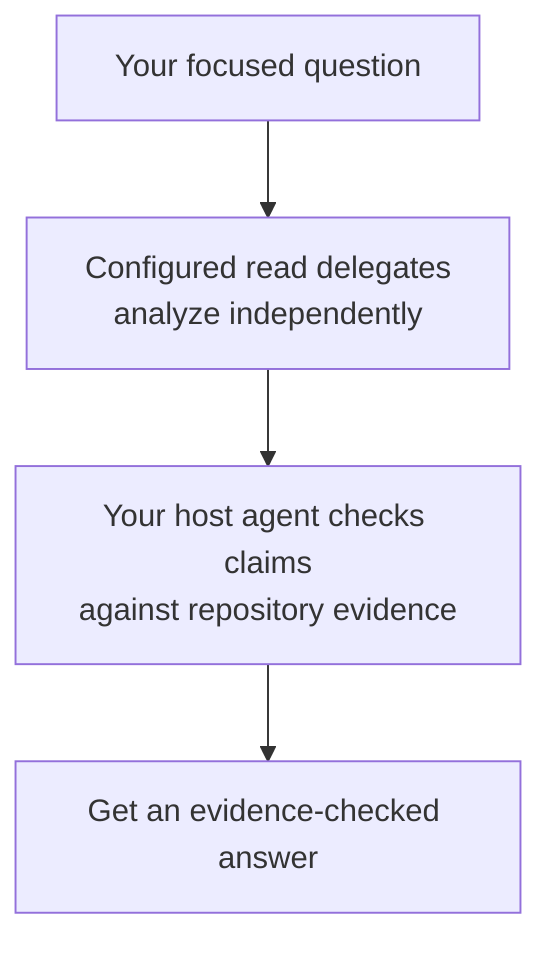

# Ask

Use `ask` when you have a focused question about code, behavior, or a decision in the repository.

## What happens

Dispatch gathers independent analysis from configured read delegates. Your host agent checks their claims against repository evidence and gives you an answer. An ask does not make repository changes.

### Flow at a glance



## How to use it

Ask a bounded question that names what you want to understand. You can omit the verb because `ask` is the default, or include `ask:` explicitly.

```text
/dispatch: Trace how expired sessions are removed
/dispatch high (all): Could concurrent refreshes issue two valid tokens?
```

Levels and provider pins are optional. See [Configure Dispatch](configuration.md) for routing and level settings.

## What next

Use [plan](plan.md) if the answer points to one coherent change, or [design](design.md) if the work needs ordered increments. Ask can also stand alone when you only need an explanation.
