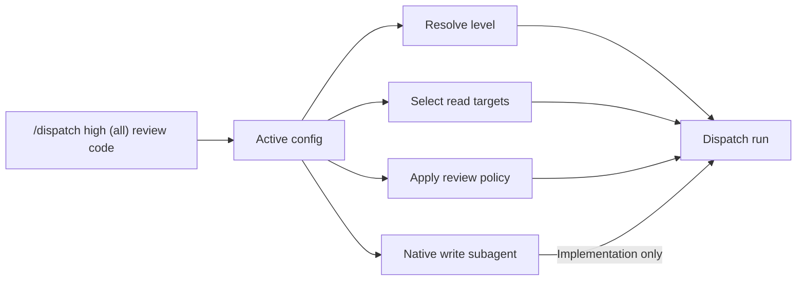

# Configure dispatch

Configuration connects `dispatch` to the agent CLIs and models you want to use. Start with one dependable read delegate; add review breadth and a native write subagent only when you need them.

## Contents

- [Configuration at a glance](#configuration-at-a-glance)
- [Create your configuration](#create-your-configuration)
- [Read delegates](#read-delegates)
- [Levels and model selection](#levels-and-model-selection)
- [Pins and target breadth](#pins-and-target-breadth)
- [Write subagents](#write-subagents)
- [Review phase policy](#review-phase-policy)
- [Sandboxing](#sandboxing)
- [Validate and diagnose](#validate-and-diagnose)

## Configuration at a glance



The active file supplies three independent tables:

| Table | Purpose | Required? |
|---|---|---|
| `read-delegates` | Models used for questions and all review types | Yes |
| `write-subagents` | Native writer selected by the host during implementation | For implementation |
| `phases` | Target count, rounds, consensus, and optional provider filters per review phase | No |

## Create your configuration

From `skills/dispatch/`, copy `config.sample.jsonc` to one of these untracked files:

```bash
cp config.sample.jsonc config.jsonc
```

Keep only providers and models available to you, then inspect the result:

```bash
node scripts/dispatch.mjs --validate-only
node scripts/dispatch.mjs --doctor --level high
```

`config.local.jsonc` has priority over `config.jsonc`; the files are whole alternatives and are not merged. This makes a local override predictable: copy the complete configuration you want active.

> [!NOTE]
> The sample demonstrates the schema; it is not a runtime default. Dispatch remains unconfigured until you create an active config file.

## Read delegates

Each provider contains a `targets` array. Every entry is an independent analysis or review voice—even when two targets use the same provider.

```jsonc
{
  "read-delegates": {
    "claude": {
      "sandbox": true,
      "targets": [
        {
          "low": { "model": "claude-sonnet", "effort": "low" },
          "high": { "model": "claude-opus", "effort": "medium" }
        }
      ]
    }
  }
}
```

Use model identifiers accepted by the installed provider CLI. A model array defines an availability cascade within the same target:

```jsonc
"high": {
  "model": ["preferred-model", "fallback-alias"],
  "effort": "high"
}
```

Dispatch tries aliases in order when one fails. They do not create extra review voices.

## Levels and model selection

A level map may define any subset of `low`, `medium`, `high`, `xhigh`, and `max`. Dispatch resolves the requested level to the nearest configured lower level, or the lowest higher level when none is lower. Automatic classification selects only `low`, `medium`, or `high`; `xhigh` and `max` require an explicit level in the invocation.

For example, with only `medium` and `max` configured:

| Requested | Selected |
|---|---|
| `low` | `medium` |
| `medium` | `medium` |
| `high` | `medium` |
| `xhigh` | `medium` |
| `max` | `max` |

The selected object is used as-is: fields do not inherit between levels. Omit `effort` when a model rejects effort options; its provider default then applies.

> [!NOTE]
> A level is a routing policy, not a universal model-quality label. Its actual models, target counts, review rounds, and consensus behavior come from your active configuration.

## Pins and target breadth

Pins override ordinary target selection for one invocation:

```text
/dispatch (claude,agy): compare both retry implementations
/dispatch high (3) review code: main..HEAD
/dispatch max (all) design: migrate the authorization model
```

- Provider names select the configured targets beneath those providers.
- A number selects that many targets in dispatch order.
- `(all)` selects every eligible configured target.

Target counts refer to independent targets, not provider count. Two entries under `copilot.targets`, for example, count as two.

## Write subagents

Implementation uses the host platform's native subagent for production edits. Configure one level map per host you plan to implement from:

```jsonc
{
  "write-subagents": {
    "copilot": {
      "low": { "model": "writer-model", "effort": "medium" },
      "high": { "model": "stronger-writer", "effort": "high" }
    }
  }
}
```

The writer is separate from `read-delegates`: read delegates remain read-only, while production writing remains approval-gated and native to the orchestrating host. A missing host entry prevents implementation but does not prevent questions or reviews.

## Review phase policy

The optional `phases` table tunes `plan-review`, `design-review`, and `code-review` independently:

```jsonc
{
  "phases": {
    "code-review": {
      "targets": { "low": 1, "medium": 2, "max": "all" },
      "rounds": { "low": 1, "medium": 3, "max": 5 },
      "consensus": { "low": false, "medium": true },
      "only": ["claude", "copilot"]
    }
  }
}
```

| Setting | Meaning |
|---|---|
| `targets` | Number of eligible review targets, or `"all"` |
| `rounds` | Maximum review/rebuttal rounds |
| `consensus` | Whether the phase seeks settlement across read delegates |
| `only` | Optional provider allowlist for that phase |

An absent phase uses one target for one round with the host making final rulings. At a level, `rounds: 0` disables the phase; an unpinned `targets: 0` also disables it.

Use broader settings where defects are expensive, and smaller settings for routine work. A practical starting point is one or two read delegates for plans and code, then increase breadth after observing your latency and provider limits.

## Sandboxing

Sandboxing is provider-wide for Claude, Copilot, and OpenCode and defaults to `true`. Set `sandbox: false` only when compatibility requires it.

When the requested sandbox is unavailable, dispatch continues with the provider's read-only controls, prints a warning, and marks structured output with `sandboxDowngraded`. Antigravity does not provide an OS sandbox; plan mode supplies its write boundary.

> [!NOTE]
> Read-only controls and credential stripping are defense in depth, not a complete secret boundary. Keep sensitive files out of delegated scope and review downgrade warnings before relying on isolation.

Provider installation, sandbox mechanics, probes, and failure behavior are documented in [the provider reference](../providers.md).

## Validate and diagnose

Use the smallest command that answers your question:

```bash
# Check syntax and schema only
node scripts/dispatch.mjs --validate-only

# See resolved targets, phase policy, writers, and provider health
node scripts/dispatch.mjs --doctor --level high

# Inspect target order as JSON
node scripts/dispatch.mjs --list-targets --level high

# View the complete current CLI reference
node scripts/dispatch.mjs --help
```

Common diagnoses:

| Symptom | Check |
|---|---|
| No candidates | Confirm the active config contains `read-delegates`, then run `--doctor` |
| Unexpected model | Inspect level resolution and command-line overrides in `--doctor` |
| Implementation cannot start | Add `write-subagents.<host>` for the orchestrating platform |
| A review is too broad or too narrow | Inspect the matching `phases` entry and any command pins |
| Provider cannot launch | Follow its probe and failure guidance in [the provider reference](../providers.md) |
