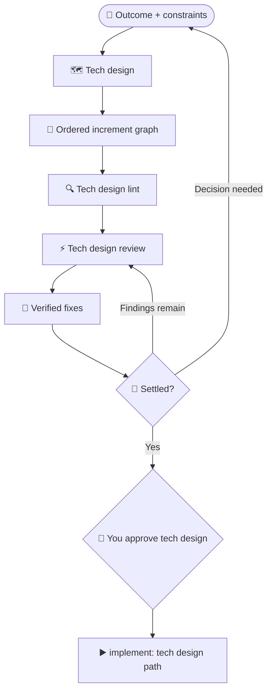

# Design

Use `design` when a change crosses components, has migration or rollback concerns, or needs several ordered increments.

## What happens

Dispatch helps shape a design and delivery outline, with reviews selected by your configuration. You review the resulting design and settle its decisions before asking Dispatch to implement it.

### Flow at a glance



## How to use it

Describe the outcome and the important constraints. For example:

```text
/dispatch design: Migrate billing from mutable balances to a ledger
/dispatch implement: <approved design path>
```

The first command develops and reviews the design. After you approve it, pass its path to `implement` to deliver the increments in order.

## Choose between design and plan

Use [plan](plan.md) when the change can be delivered and verified as one coherent unit. Use design when the work needs an ordered delivery outline.
