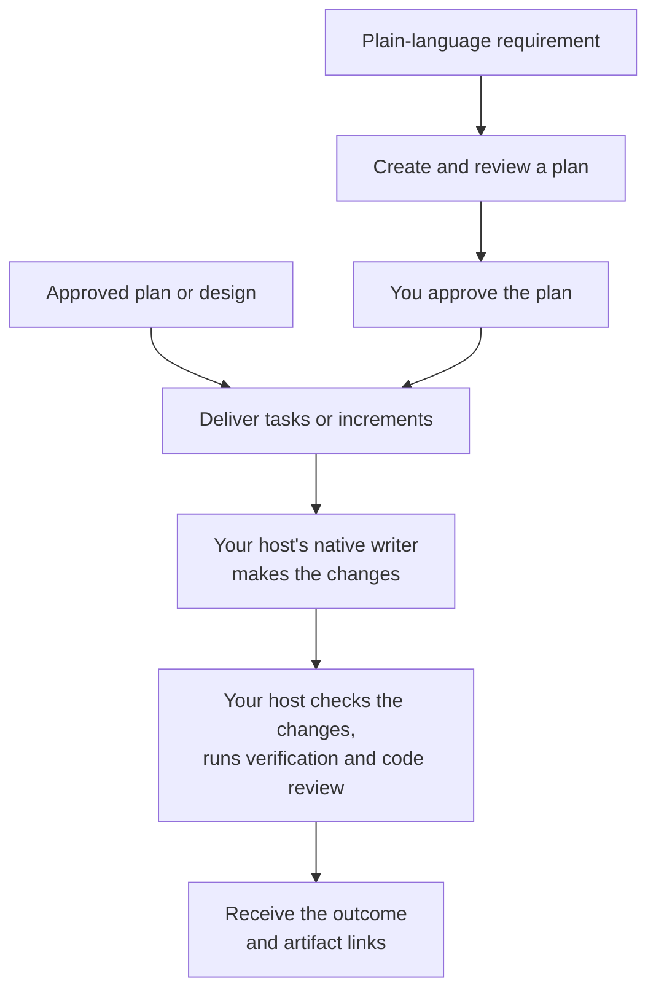

# Implement

Use `implement` to deliver a requirement or continue from an approved plan or design.

## What happens

A plain-language requirement starts with planning and the reviews enabled for your configuration. Dispatch asks you to approve the plan before production changes begin. A writer on your host platform then makes the changes; Dispatch checks the result, runs the approved verification and configured code review, and reports the handoff.

### Flow at a glance



## How to use it

Describe the change you want, or pass the path to an approved plan or design.

```text
/dispatch implement: Add CSV export to the transactions page
/dispatch implement: <approved plan path>
/dispatch implement: <approved design path>
```

Implementation follows the artifact's prerequisites and recorded decisions. If the host platform has no configured writer, see [Configure Dispatch](configuration.md).
