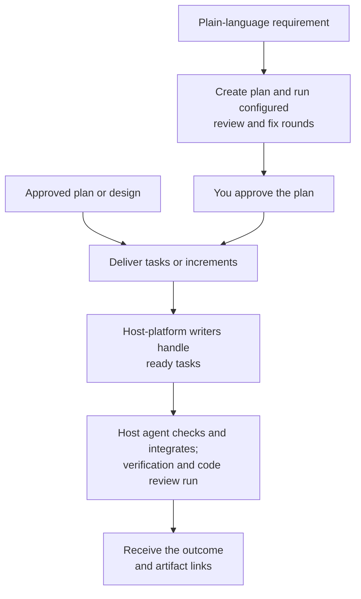

# Implement

Use `implement` to deliver a requirement or continue from an approved plan or design.

## What happens

A plain-language requirement starts with a plan and its review and fix rounds enabled by the selected level's policy. Dispatch asks you to approve the plan and its verification commands before production changes begin. The plan breaks the work into tasks with outcomes, criteria, owned paths, and prerequisites. Each task runs in an isolated worktree with a writer native to your host platform. Tasks with unmet prerequisites wait; independent tasks can overlap up to `write-concurrency` (default `1`).

For each task, the writer inspects the relevant code, adds discriminating tests for the task criteria, and captures the expected failing result (RED) before production edits. It then implements the behavior and runs the task checks. Your host agent checks and integrates each result, then Dispatch runs final approved verification and the configured code-review policy, when enabled. Accepted safe findings can be fixed and rechecked within the configured review rounds before Dispatch reports the handoff.

### Flow at a glance



## How to use it

Describe the change you want, or pass the path to an approved plan or design.

```text
/dispatch implement: Add CSV export to the transactions page
/dispatch implement: <approved plan path>
/dispatch implement: <approved design path>
```

Implementation follows the artifact's prerequisites and recorded decisions. Independent tasks may run concurrently when `write-concurrency` is above one. The task flow uses a RED checkpoint before production edits; the contract does not require a separate refactor stage. If the host platform has no configured writer, see [Configure Dispatch](configuration.md).
