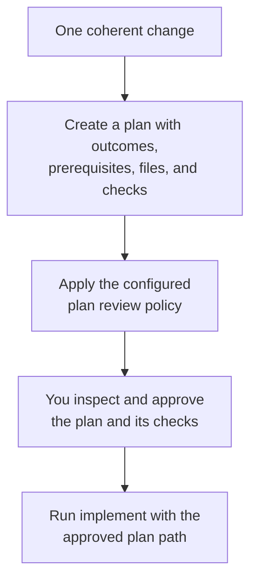

# Plan

Use `plan` when the change can be delivered and verified as one coherent unit.

## What happens

Dispatch helps identify the outcomes, affected files, prerequisites, and verification steps, then applies the review policy enabled for your level. Read the plan and approve its verification commands before production changes begin.

### Flow at a glance



## How to use it

Describe the behavior you want, its constraints, and how you will know it is complete.

```text
/dispatch plan: Add idempotency keys to webhook delivery
/dispatch review plan: <plan path returned by Dispatch>
/dispatch implement: <approved plan path>
```

The separate review command is useful when you want another review pass. For work that needs ordered delivery increments, use [design](design.md) instead.
