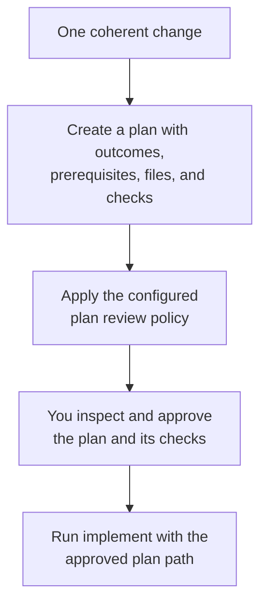

# Plan

Use `plan` when the change can be delivered and verified as one coherent unit.

## What happens

Dispatch helps identify the outcomes, affected files, prerequisites, and verification steps, then runs the plan review and fix rounds enabled by your level's `plan-review` policy. A level configured with zero targets or rounds can skip plan review. Read the plan and approve its verification commands before production changes begin.

### Flow at a glance



## How to use it

Describe the behavior you want, its constraints, and how you will know it is complete.

```text
/dispatch plan: Add idempotency keys to webhook delivery
/dispatch review: <path/to/change.plan.md>
/dispatch implement: <approved plan path>
```

The separate review command is an optional additional pass; `.plan.md` lets Dispatch infer that the target is a plan. For work that needs ordered delivery increments, use [design](design.md) instead.
