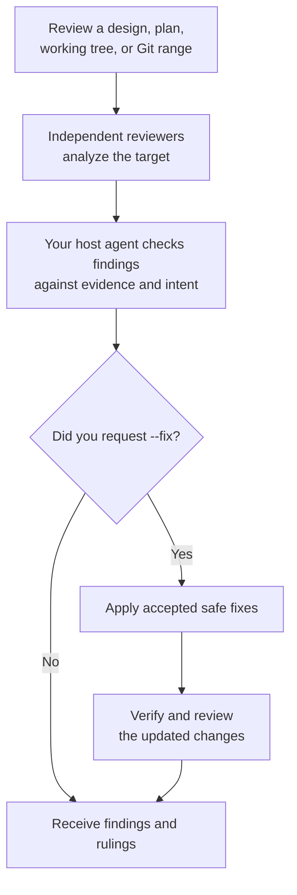

# Review

Use `review` when a design, plan, working tree, or Git range already exists and you want evidence-backed findings.

## What happens

Dispatch reports findings by default. It does not apply fixes unless you ask for them. With `--fix`, your host agent adjudicates findings, applies accepted safe fixes, and verifies and reviews the changes again within the configured round limit. Disputed or intent-dependent findings can still be escalated to you.

### Flow at a glance



## How to use it

Name what you want reviewed. For code, no range means uncommitted changes; provide a Git range to include committed work.

```text
/dispatch review: <path/to/system.design.md>
/dispatch review: <path/to/change.plan.md>
/dispatch review code
/dispatch review code: main..HEAD
/dispatch review code --fix
```

The `.plan.md` and `.design.md` extensions let Dispatch infer the target type; other paths default to code review. Your host agent evaluates findings against the work's intended outcome. See [review rules](../review-rules.md) for how findings are assessed and resolved.
