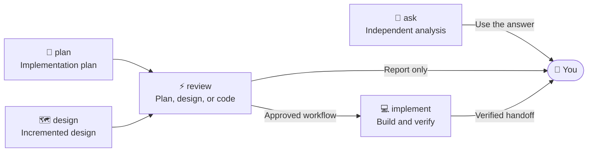
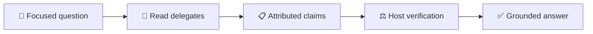
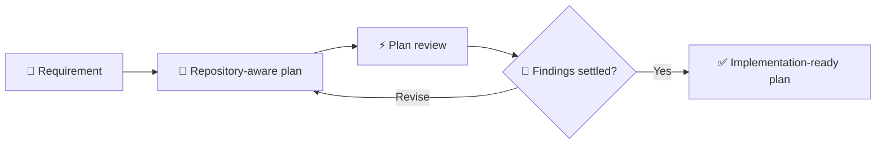
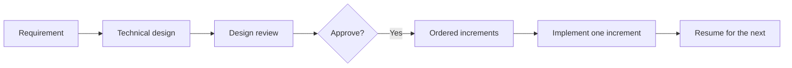
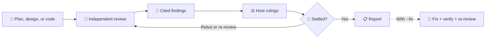
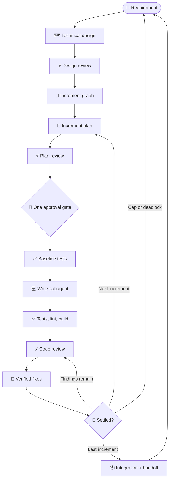

# Dispatch verbs

Choose how much of the development workflow `dispatch` should run. A verb can ask one focused question, produce or review an artifact, or carry approved work through implementation.

## Contents

- [Workflow at a glance](#workflow-at-a-glance)
- [How to use a verb](#how-to-use-a-verb)
- [`ask`: get an independent analysis](#ask-get-an-independent-analysis)
- [`plan`: prepare implementation](#plan-prepare-implementation)
- [`design`: split larger work into increments](#design-split-larger-work-into-increments)
- [`review`: challenge an artifact or change](#review-challenge-an-artifact-or-change)
- [`implement`: run the delivery loop](#implement-run-the-delivery-loop)
- [Choosing the right starting point](#choosing-the-right-starting-point)
- [Artifacts and resuming](#artifacts-and-resuming)

## Workflow at a glance



The verbs are entry points, not mandatory steps. Start at the point that matches what you already have.

## How to use a verb

```text
/dispatch [level] [(pins)] [verb-clause]: <argument>
```

- **Level** (`low` through `max`) selects progressively broader or more capable configured routing.
- **Pins** select particular providers or breadth, such as `(claude,agy)`, `(3)`, or `(all)`.
- **Verb clause** is one of `ask`, `plan`, `design`, `review [plan|design|code] [--fix]`, or `implement [--phases from:<phase>]`.
- **Argument** is a question, requirement, artifact path, or Git range. Keep the colon when an argument follows.

`ask` is the default, so `/dispatch: <question>` and `/dispatch ask: <question>` are equivalent.

## `ask`: get an independent analysis

Use `ask` for a bounded question that benefits from another model reading the repository. It returns attributed claims for your host agent to verify; it does not change files.



```text
/dispatch: Trace how expired sessions are removed
/dispatch high (all): Could concurrent refreshes issue two valid tokens?
/dispatch (claude,agy): Compare the two retry strategies in src/queue/
```

A good question names the decision or uncertainty and narrows the relevant area. Use `review` instead when you have a concrete artifact or diff that should be checked systematically.

## `plan`: prepare implementation

Use `plan` for a change that can be delivered as one coherent unit. Dispatch authors a repository-aware plan, reviews it according to your phase policy, and leaves the resulting artifact ready for approval or implementation.



```text
/dispatch plan: Add idempotency keys to webhook delivery
/dispatch high (claude,copilot) plan: Replace polling with server-sent events
```

Prefer a requirement over a proposed patch: include the behavior, constraints, and success criteria, then let the plan identify affected code and verification.

## `design`: split larger work into increments

Use `design` when work crosses shared boundaries, needs a migration or rollback strategy, or is too large for one implementation pass. It creates and reviews a technical design, then organizes delivery into dependency-aware increments.

```text
/dispatch design: Migrate billing from mutable balances to a ledger
/dispatch max (all) design: Introduce tenant isolation across API, jobs, and storage
```



> [!NOTE]
> One invocation implements one selected design increment. This keeps approval, testing, and recovery bounded; the handoff tells you exactly how to resume.

## `review`: challenge an artifact or change

Use `review` when the plan, design, or code already exists. Specify the kind when clarity matters; otherwise dispatch can infer it from the argument.



| Review | Typical argument | Example |
|---|---|---|
| Plan | Plan path | `/dispatch review plan: .scratch/plan/2026-09-24-export-plan.md` |
| Design | Design path | `/dispatch review design: .scratch/plan/2026-09-24-billing-design.md` |
| Code | Git range, or no argument | `/dispatch review code: main..HEAD` |

Reviews verify cited evidence rather than accepting findings by vote. Findings are reconciled across rounds until settled or the configured cap needs your decision.

> [!NOTE]
> Standalone reviews are report-only. Add `--fix` to authorize application of accepted, safe findings followed by verification and re-review.

Code review without an explicit range chooses scope from repository state:

- A dirty tree reviews staged, unstaged, and untracked changes only.
- A clean tree compares the branch with `origin/HEAD`, then `main` or `master` when needed.
- Use an explicit range when you want committed branch work included.

```text
/dispatch review code
/dispatch review code --fix
/dispatch high review code: main..HEAD
```

## `implement`: run the delivery loop

Use `implement` when you want dispatch to carry a requirement or existing artifact through approval-gated delivery. A plain-language requirement starts with planning; a canonical plan or design path resumes from what already exists.

```text
/dispatch implement: Add CSV export to the transactions page
/dispatch high implement: .scratch/plan/2026-09-24-export-plan.md
/dispatch implement --phases from:code-review: .scratch/plan/2026-09-24-export-plan.md
```

The complete delivery loop is shown below. A plain-language `implement` request starts at planning; design-driven work enters through its increment plan.



At an explicitly typed `low` level, the driver may approve the gate itself when there is nothing to rule on. That approval still authorizes the plan's commands, so read the plan before running `low`.

> [!TIP]
> For a trivial edit, skip `implement` and ask your host to make the change directly. `implement` is for delivery that needs a plan, verification, and review on record.

> [!NOTE]
> `--phases from:<phase>` is a recovery control, not a shortcut around prerequisites. Dispatch stops when the required artifact, approval, or recorded state is missing.

## Choosing the right starting point

| You have… | Start with… |
|---|---|
| A focused repository question | `ask` |
| A change small enough for one delivery unit | `plan` |
| Cross-cutting work or multiple dependent increments | `design` |
| An existing plan, design, diff, or branch | `review` |
| A requirement or approved artifact you want delivered | `implement` |

If uncertain between `plan` and `design`, start with the expected delivery shape: one independently verifiable unit favors `plan`; several ordered units or a shared migration favors `design`.

## Artifacts and resuming

Plans, designs, and walkthroughs live in `.scratch/plan/`. They are the durable handoff for interrupted runs; operational logs and traces stay in the run's OS temporary directory. At completion, dispatch reports retained or relocated artifacts and the exact next command when more work remains.

Dispatch does not commit, push, or open a pull request. Publication remains under your control.
