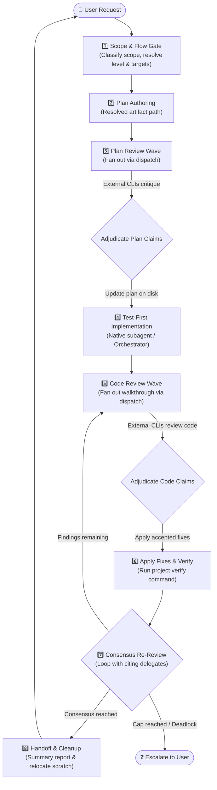

# implement-dispatch

Implement features or fixes with multi-agent review loops across external coding-agent CLIs—plan review before code is written, code review after, and re-review to consensus.

---

## What It Does

When working with an AI coding assistant (the **orchestrator**—like Claude Code, Antigravity, or GitHub Copilot), complex features and fixes benefit immensely from second opinions. However, manually coordinating multiple agent CLIs, managing review templates, resolving contradictory feedback, and tracking re-reviews across iterations is tedious and error-prone.

`implement-dispatch` acts as the **orchestrator and control loop** for end-to-end multi-agent development:
1. **Plans & Reviews First**: Drafts a structured implementation plan, then fans out to external agent CLIs (Claude Code, Antigravity 2.0, Copilot, or Local OpenCode) for pre-implementation critique.
2. **Adjudicates & Implements**: Evaluates reviewer claims against repository ground truth, folds accepted changes into the plan, and implements code test-first via native subagents.
3. **Reviews Code & Re-Reviews**: Generates a detailed walkthrough, collects multi-agent code reviews, applies accepted fixes, and loops with reviewers until reaching consensus.
4. **Maintains Strict Boundaries**: External delegates act strictly as read-only reviewers; the orchestrating agent alone owns decision-making, code edits, verification, and git operations.



---

## Prerequisites & Installation

### Prerequisites
- **Node.js**: `v18.0.0` or higher.
- **At least one agent CLI** installed or reachable (`claude`, `agy`, `copilot`, `opencode`).
- **`dispatch` skill**: Required runner and provider cascade.

### Companion Skills
`implement-dispatch` coordinates review criteria defined by its companion skills:

| Skill | Role | Status |
|---|---|---|
| [`dispatch`](../dispatch) | Runner execution, CLI flags, sandboxing, and provider cascade | **Required** |
| [`dispatch-plan-review`](../dispatch-plan-review) | Plan template, review axes, adjudication grammar | **Optional** *(skips plan review if absent)* |
| [`dispatch-code-review`](../dispatch-code-review) | Walkthrough template, review axes, adjudication grammar | **Optional** *(skips code review if absent)* |

### Installation

Install `implement-dispatch` into your current project workspace:

```bash
npx skills add Gyunikuchan/dispatch-skills --skill implement-dispatch
```

To install the complete multi-agent suite (`dispatch`, `dispatch-plan-review`, `dispatch-code-review`, `implement-dispatch`):

```bash
npx skills add Gyunikuchan/dispatch-skills --all
```

To install globally for all projects:

```bash
npx skills add -g Gyunikuchan/dispatch-skills --all
```

---

## How to Use

Trigger `implement-dispatch` directly via the slash command `/implement-dispatch` (or natural language) in your agent chat session:

```
/implement-dispatch [<level>] [(<pins>)]: <feature | fix | task description>
```

Both `<level>` and `(<pins>)` are optional (defaults to `medium` depth with automatic cascade selection; the colon is optional).

### 1. Basic Invocations

Run a balanced implementation with default settings (`medium` depth):

```markdown
/implement-dispatch Add a CSV export button to the transactions table
```

```markdown
/implement-dispatch Fix off-by-one error in cursor pagination
```

### 2. Controlling Depth with Levels (`low`, `medium`, `high`, `xhigh`, `max`)

Tune review rigor, round budgets, and consensus requirements to match the scope and risk of your change:

```markdown
/implement-dispatch low: Rename Household.owner field to primaryHolder
```

```markdown
/implement-dispatch high: Refactor payment webhook idempotency handler
```

```markdown
/implement-dispatch xhigh: Audit cryptographic key derivation and session storage
```

```markdown
/implement-dispatch max: Migrate database schema and state machine to v4
```

### 3. Pinning Specific Reviewers (`(<pins>)`)

Force the review fan-out wave to target specific external providers (`claude`, `agy`, `copilot`, `opencode`; the `dispatch` skill's `--provider` aliases, e.g. `antigravity` for `agy` or `claudecode` for `claude`, are also accepted and normalized to the canonical key):

```markdown
/implement-dispatch (claude,agy): Implement OAuth2 PKCE authorization flow
```

```markdown
/implement-dispatch high (copilot,opencode): Optimize bulk ingestion SQL queries
```

```markdown
/implement-dispatch max (claude): Audit and rewrite token refresh rotation
```

---

## Review Levels

Levels represent ascending tiers of review depth, reviewer breadth, and verification rigor. Rather than hardcoding behavior, levels are policy profiles resolved from configuration (`config.default.jsonc`, or your local `config.jsonc` / `config.local.jsonc`), which controls wave caps (`maxRounds`), reviewer breadth (`targetCount`), consensus requirements (`consensus`), tool-turn budgets (`toolTurns`), self-review eligibility (`includeSelf`), and model/effort selection for each phase.

Choose a level based on the risk and complexity of your change:

- **`low`** — **Fast-path / minimal overhead**. Best for minor bug fixes, mechanical changes, or low-risk tasks where extensive review isn't needed. Typically minimizes review rounds and reviewer breadth to move fast.
- **`medium`** *(default)* — **Balanced everyday development**. Best for standard features and regular tasks. Provides a balanced review flow across planning and code review without excessive round overhead.
- **`high`** — **Thorough review**. Best for significant features, architectural changes, or complex refactoring that benefits from multi-reviewer critique and deeper verification loops.
- **`xhigh`** — **Deep multi-agent scrutiny**. Best for security-sensitive areas, core interfaces, or mission-critical logic requiring broader cross-agent review and higher verification budgets.
- **`max`** — **Maximum depth & exhaustive verification**. Best for high-stakes migrations, cryptographic code, or complex subsystem overhauls where you want the widest possible reviewer fan-out and maximum round limits.

### Key Execution Mechanics
- **Waves, Not Individual Dispatches**: `maxRounds` caps the parallel waves a phase may spend, counting the first review. Plan review and code review maintain separate, independent counters.
- **Pins Override Breadth**: Naming providers is the most explicit input available, so `(claude,agy,copilot)` dispatches to all three live pins regardless of the level's configured `targetCount`. Pins do not resurrect a phase configured off (`maxRounds: 0`).
- **Target Affinity in Re-Reviews**: Re-reviews are sent back specifically to the delegate handle that raised the finding, providing the resolution log and exact code delta to verify fixes efficiently.
- **Consensus Enforcement**:
  - When `consensus` is disabled (`false`), the orchestrator can reject claims directly if verified counter-evidence exists.
  - When `consensus` is enabled (`true`), the orchestrator cannot unilaterally dismiss a finding. Every dispute must be accepted, escalated to the user, or rebutted with verified counter-evidence during re-dispatch.
- **Automatic Scope Downshifting**: Trivial changes (single-file mechanical edits, typo/comment fixes, simple constant changes) are automatically downshifted to `low` to avoid unnecessary review overhead. Explicitly requested levels are never overridden upward.

---

## Configuration & Flow Policy

`config.default.jsonc` holds the whole flow policy: the review knobs per phase plus the models and reasoning effort per platform. Customize it by creating a local `config.local.jsonc` or `config.jsonc` alongside it, which **replaces** the default file wholly rather than merging into it — so copy the default as your starting point, and expect a clear validation error listing every problem if a section or knob is missing.

Config files are loaded fully (without merging) based on this order of precedence (`config.local.jsonc` takes precedence over `config.jsonc`):
1. `<skill-root>/config.local.jsonc`
2. `<skill-root>/config.jsonc`
3. `<skill-root>/config.default.jsonc`

A local config omitting a platform under a section's `platforms` map (e.g. dropping `opencode` after it's added to `config.default.jsonc`) is intentional and supported — not every user wants every platform configured, and an omitted platform is simply never picked as a candidate. This differs from omitting a required top-level knob (`maxRounds`, `targetCount`, etc.), which does fail validation.

The three sections (`plan-review`, `implementation`, `code-review`) each nest their per-platform model settings under `platforms`, whose key order is the priority order candidates are picked in. The two review sections additionally carry five level-keyed knobs:

| Knob | Meaning |
|---|---|
| `maxRounds` | Cap on total fan-out waves for the phase, counting the first review |
| `targetCount` | How many platforms an unpinned wave dispatches to — a whole number or `"all"` |
| `consensus` | When `true`, no finding may be dismissed without verified counter-evidence |
| `includeSelf` | When `true`, the host CLI is an eligible reviewer (sorted last). Optional; defaults to `false` |
| `toolTurns` | Tool-turn budget handed to each reviewer |

Either `maxRounds: 0` or `targetCount: 0` skips a phase entirely. When `targetCount` is `0`, the resolver normalizes `maxRounds` to `0` as well, so `maxRounds === 0` is the single sentinel: a phase is off when it is `0`, and providers are merely unavailable when it is `> 0` with an empty `targets` list.

> **Upgrading an existing `config.jsonc`**: per-platform entries used to sit directly under each section; they now nest under `platforms`. A pre-existing flat config fails validation with errors like `plan-review.platforms must be an object` and `unrecognized key "claude"` — both mean the entries need moving under `platforms`. Run `--validate-only` (below) to check before your next run.

```jsonc
{
  "plan-review": {
    "maxRounds": { "low": 0, "medium": 1, "max": 3 },
    "targetCount": { "low": 0, "medium": 1, "max": "all" },
    "consensus": { "low": false, "high": true },
    "includeSelf": { "low": false, "max": true },
    "toolTurns": { "low": 3, "medium": 4, "high": 6, "max": 8 },
    "platforms": {
      "claude": {
        "low": { "model": "claude-opus-5", "effort": "low" },
        "medium": { "model": "claude-opus-5", "effort": "medium" },
        "high": { "model": "claude-opus-5", "effort": "high" },
        "max": { "model": "claude-opus-5", "effort": "xhigh" }
      },
      "agy": { "model": "gemini-3.8-flash", "effort": "high" }
    }
  },
  "implementation": {
    "platforms": {
      "claude": {
        "low": { "model": "claude-sonnet-5", "effort": "medium" },
        "high": { "model": "claude-opus-5", "effort": "low" }
      }
    }
  }
}
```

Validate a config without spawning any provider probes:

```bash
node <skills-dir>/implement-dispatch/scripts/resolve-flow.mjs --validate-only
```

It checks the config schema and nothing else, so combining it with any run flag (`--platform`, `--level`, `--pins`) is an error rather than a silent no-op.

### Level Matching & Fallback Rules

Knobs and platform entries are **sparse by design**: define only the levels where the spend changes. Every value resolves by the same rule.

- **Exact Match First**: Matches the requested level directly.
- **Round Down Floor**: If an exact level is missing, it rounds down to the nearest configured level below it.
- **Round Up Ceiling**: If nothing is configured below, it matches the lowest level above it.
- **Sparse Keys Set Floors**: Because levels only ever round down, the lowest key you define is the floor for everything beneath it — define `low` to set the base and a higher key to mark where spend increases.
- **Top-Heavy Reasoning**: Default configurations intentionally invest reasoning budget (`high` / `max` effort) into review phases to catch subtle flaws, keeping implementation lean.

---

## High-Level Behavior & Invariants

- **Delegates Propose Claims; Orchestrator Decides**: Reviewers return structured findings (`<locus> — <tag>: <defect> → <required change>`). The orchestrating agent independently verifies each claim against repository code and tests before accepting or rejecting.
- **Strict Read-Only Delegate Isolation**: All external reviews run under read-only sandboxes (`--mode plan` or restricted tool whitelists). Implementation is executed exclusively by native write-capable subagents or the orchestrator.
- **Evidence Over Votes**: If two reviewers disagree, ground truth is determined by actual execution, project requirements, and test suites—not sheer headcount.
- **Host Repository Conventions**: The orchestrator reads your project's `AGENTS.md` or `CLAUDE.md` to discover:
  - **Verify command**: The test/lint command that must remain green across all iterations.
  - **Escalation triggers**: Domain-specific decisions that require immediate user input.
- **Scratch Space Lifecycle**: `dispatch`'s `resolve-artifact-paths.mjs` (not the flow resolver — it resolves the review/implementation flow only) generates the plan and walkthrough paths under `.scratch/plan/` from the run's date and slug, so nothing assembles a path by hand mid-run. Where your platform already produces a native plan or walkthrough artifact, that one is preferred and left in place. On successful consensus, the scratch files the run created are moved to the OS temp directory (never deleted); if a run terminates in deadlock or requires user intervention, they are preserved in place for easy resumption.
- **Git Boundaries**: The skill strictly leaves git operations (`git commit`, `git push`, branch creation, and PRs) to the user.

---

## Nuances, Quirks & Troubleshooting

### Graceful Degradation Without Companion Skills
If `dispatch-plan-review` or `dispatch-code-review` are not installed, `implement-dispatch` continues running seamlessly:
- Missing `dispatch-plan-review`: Skips Step 3 (Plan Review) and proceeds directly to implementation.
- Missing `dispatch-code-review`: Skips Steps 5–7 (Code Review & Re-review) and completes after implementation verification.
- The handoff report explicitly lists any omitted review phases.

### Round Cap Escalation & Resumption
When a review phase exhausts its allotted round budget before reaching full consensus:
1. The orchestrator halts and presents the remaining disputed findings to you.
2. Answering the escalation resets the round counter for that phase, allowing additional review iterations if needed.

### Fast Direct Execution for Trivial Tasks
For mechanical one-line changes or renames classified as `trivial`, the orchestrator skips spawning background subagents and applies the edit directly, saving round-trip latency.

### Inspecting Delegate Review Progress
External reviews run asynchronously in the background. If you want to check what a reviewer is currently doing, you can monitor the temp logs emitted during launch:
```bash
tail -f "<logFilePath>"
```
