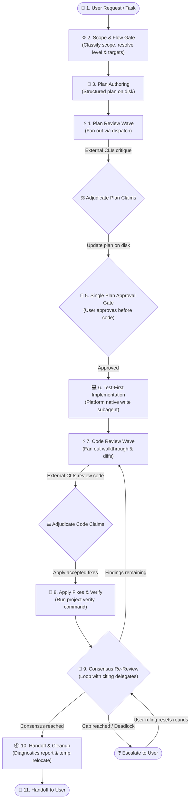

# implement-dispatch

Implement features and fixes with autonomous multi-agent review loops across external coding-agent CLIs—plan review before code is written, test-first implementation, and code review to consensus.

---

## What It Does

When working with an AI coding assistant (the **orchestrator**—such as Claude Code, Antigravity, or GitHub Copilot), complex features and fixes benefit immensely from second opinions. However, manually coordinating multiple agent CLIs, managing review templates, resolving contradictory feedback, and tracking re-reviews across iterations is tedious and error-prone.

`implement-dispatch` acts as the **orchestrator and control loop** for end-to-end multi-agent development:

1. **Plans & Reviews First**: Drafts a structured implementation plan, then fans out to external agent CLIs (Claude Code, Antigravity 2.0, GitHub Copilot, or OpenCode) for adversarial pre-implementation critique across seven architectural axes.
2. **Adjudicates Claims & Solicits Approval**: Evaluates reviewer claims against repository ground truth, folds accepted changes into the plan, and presents the plan to the user for a **single approval gate** before writing code.
3. **Implements Test-First**: Hands implementation to platform-native write subagents to implement changes test-first while keeping project verification commands green.
4. **Reviews Code & Converges on Consensus**: Generates a detailed walkthrough, collects multi-agent code reviews across six software engineering axes, applies accepted fixes, and loops with reviewers until reaching verified consensus.
5. **Maintains Strict Least Privilege**: External delegates act strictly as read-only reviewers; the orchestrating agent alone owns decision-making, code edits, verification, and artifact lifecycle.



---

## Prerequisites & Installation

### Prerequisites

- **Node.js**: `v18.0.0` or higher.
- **`dispatch` skill installed**: Required runner execution, CLI flags, sandboxing, and provider cascade.
- **At least one agent CLI** installed or reachable on your system:
  - **Claude Code**: Claude Desktop, Claude VS Code Extension, or standalone CLI (`claude`).
  - **Antigravity 2.0**: Antigravity Desktop app, VS Code extension, or CLI (`agy`).
  - **GitHub Copilot**: GitHub Copilot Desktop, Copilot CLI, or VS Code Extension CLI (`copilot`).
  - **OpenCode**: `opencode` binary, configured via `opencode.jsonc` (supports local LLMs like LM Studio or remote providers like Anthropic/OpenRouter).

### Companion Skills

`implement-dispatch` orchestrates the complete development lifecycle by integrating with companion review skills:

| Skill | Role | Status |
|---|---|---|
| [`dispatch`](../dispatch) | Runner execution, CLI flags, sandboxing, and provider cascade | **Required** |
| [`dispatch-plan-review`](../dispatch-plan-review) | Plan template, review axes, plan adjudication | **Optional** *(skips plan review if absent)* |
| [`dispatch-code-review`](../dispatch-code-review) | Walkthrough template, review axes, code adjudication | **Optional** *(skips code review if absent)* |

> [!NOTE]
> If an optional companion skill is absent, `implement-dispatch` gracefully degrades by skipping that review phase, noting its absence in the final handoff report, and proceeding with the remaining workflow.

### Installation

Install `implement-dispatch` alongside `dispatch`:

```bash
npx skills add Gyunikuchan/dispatch-skills --skill dispatch --skill implement-dispatch
```

To install the complete multi-agent suite (`dispatch`, `dispatch-plan-review`, `dispatch-code-review`, `implement-dispatch`):

```bash
npx skills add Gyunikuchan/dispatch-skills --all
```

To install globally for all your projects:

```bash
npx skills add -g Gyunikuchan/dispatch-skills --all
```

> [!NOTE]
> When using multiple skills from this repository, ensure they are installed in the **same scope** (all project-local or all global) so sibling runner scripts, configuration resolvers, and prompt templates can locate each other.

---

## How to Use

Trigger `implement-dispatch` directly via the `/implement-dispatch` slash command or natural language inside your agent chat session.

### Invocation Grammar

```
/implement-dispatch [<level>] [(<pins>)]: <feature | fix | task description>
```

Both `<level>` and `(<pins>)` are optional:
- **`<level>`**: Controls wave caps (`maxRounds`), reviewer breadth (`targetCount`), consensus gates (`consensus`), and model/effort budgets (`low`, `medium`, `high`, `xhigh`, `max`). When omitted, the skill automatically evaluates scope and selects `low`, `medium`, or `high`.
- **`(<pins>)`**: Pins review targets to specific providers (`claude`, `agy`, `copilot`, `opencode`, or `all`), or pins a specific reviewer count `n` (e.g. `(3)`) across available platforms.

---

### 1. Basic Invocations

Run a standard implementation with automatic scope evaluation and default settings:

```markdown
/implement-dispatch Add a CSV export button to the transactions table
```

```markdown
/implement-dispatch Fix off-by-one error in cursor pagination
```

### 2. Controlling Depth with Levels (`low`, `medium`, `high`, `xhigh`, `max`)

Explicitly set review rigor and round limits based on the risk and complexity of your change:

```markdown
/implement-dispatch low: Rename Household.owner field to primaryHolder
```

```markdown
/implement-dispatch high: Refactor payment webhook idempotency handler
```

```markdown
/implement-dispatch xhigh: Audit cryptographic key derivation and session storage
```

```markdown
/implement-dispatch max: Migrate database schema and state machine to v4
```

### 3. Pinning Specific Reviewer Providers

Direct review fan-out waves to specific external CLIs using `(<pins>)` (comma-separated provider keys `claude`, `agy`, `copilot`, `opencode` or `--provider` aliases like `antigravity` / `claudecode`):

```markdown
/implement-dispatch (claude): Implement OAuth2 PKCE authorization flow
```

```markdown
/implement-dispatch (claude,agy): Add rate-limiting middleware to API gateway
```

```markdown
/implement-dispatch (all): Audit authentication token revocation logic
```

### 4. Pinning Reviewer Count

Specify an exact number of reviewers rather than naming providers. The count replaces `targetCount` for review phases while preserving the level's other settings:

```markdown
/implement-dispatch high (3): Refactor payment webhook idempotency handler
```

### 5. Combining Levels, Pins, and Tasks

Compose levels, reviewer pins, and detailed task requirements together:

```markdown
/implement-dispatch high (claude,agy): Refactor session store to use Redis cluster with connection pooling and automated failover
```

---

## Review Levels & Scope Gating

Levels represent ascending tiers of review depth, reviewer breadth, and verification rigor. Rather than hardcoding behavior, levels are policy profiles resolved from configuration (`config.default.jsonc`, or your local `config.jsonc` / `config.local.jsonc`).

### Shipped Default Profiles (`config.default.jsonc`)

| Level | Ideal For | Plan Review | Code Review | Consensus Gate |
|---|---|---|---|---|
| **`low`** | Minor bug fixes, mechanical changes, typos, renames, isolated tweaks | Off (`maxRounds: 0`, `targetCount: 0`) | Fast single-pass (`maxRounds: 1`, `targetCount: 1`) | Relaxed (`consensus: false`) |
| **`medium`** *(default)* | Standard features, bounded multi-file changes, routine bug fixes | Up to 2 rounds (`targetCount: 1`, `maxRounds: 2`) | Up to 3 rounds (`targetCount: 2`, `maxRounds: 3`) | Strict (`consensus: true`) |
| **`high`** | Complex refactoring, architectural changes, public contract/API shifts | Up to 3 rounds (`targetCount: 2`, `maxRounds: 3`) | Up to 3 rounds (`targetCount: 3`, `maxRounds: 3`) | Strict (`consensus: true`) |
| **`xhigh`** | Security-sensitive subsystems, auth/token boundaries, core domain invariants | Deep review (`targetCount: 3`, `maxRounds: 3`) | Multi-round fan-out (`targetCount: 4`, `maxRounds: 3`) | Strict (`consensus: true`) |
| **`max`** | High-stakes migrations, cryptographic code, critical subsystem overhauls | Exhaustive fan-out (`targetCount: "all"`, `maxRounds: 5`) | Exhaustive fan-out (`targetCount: "all"`, `maxRounds: 5`) | Strict (`consensus: true`) |

> [!NOTE]
> Under `consensus: false` (`low` level), orchestrator rejections are immediately final at its own discretion. Under `consensus: true` (`medium` and above), any orchestrator rejection or downgrade of a MUST-FIX or SHOULD-FIX claim must be confirmed by the citing reviewer or ruled interactively by the user.

### Automatic Scope Classification Gate

When no explicit `<level>` is provided in the prompt, the orchestrator evaluates the scope and risk of the task before authoring the plan:
- **`trivial`** / low risk → Evaluates at **`low`** (fast-path, skips plan review).
- **`focused`** / moderate risk → Evaluates at **`medium`** (standard review flow).
- **`cross-cutting`** / high risk → Evaluates at **`high`** (multi-reviewer, strict consensus).

> [!NOTE]
> `xhigh` and `max` levels represent deep reasoning investments and are **manual-only**; the automatic scope gate will never select them without explicit user instruction. Provider or count pins (`(<pins>)`) alone do not alter level selection.

---

## Configuration & Flow Policy

`config.default.jsonc` defines the complete flow policy: review knobs per phase, per-platform models, and reasoning effort levels. You can customize behavior by creating `config.local.jsonc` or `config.jsonc` in the skill root directory.

### Configuration Loading & Precedence

Config files are loaded as a whole (without deep merging) following this precedence order:

1. `<skill-root>/config.local.jsonc` *(highest precedence, ignored by git)*
2. `<skill-root>/config.jsonc`
3. `<skill-root>/config.default.jsonc` *(shipped defaults)*

> [!TIP]
> To customize your setup, copy `config.default.jsonc` to `config.local.jsonc` and edit your desired values. Omission of individual platforms under `platforms` is supported (omitted platforms are simply excluded from selection), but omitting required top-level knobs (`maxRounds`, `targetCount`, `consensus`) triggers a clear schema validation error.

### Flow Sections & Knobs

The configuration defines three sections: `plan-review`, `implementation`, and `code-review`. Review sections configure three level-keyed knobs:

| Knob | Description |
|---|---|
| `maxRounds` | Cap on total review fan-out waves for that phase. Setting `0` turns the phase off entirely (pins cannot resurrect it). |
| `targetCount` | Number of review candidates dispatched in an unpinned wave (integer or `"all"`). Candidates beyond `targetCount` become ordered reserves. Setting `0` disables unpinned waves while allowing explicit pins to run. |
| `consensus` | When `true`, rejections of delegate MUST-FIX or SHOULD-FIX findings require reviewer confirmation or interactive user ruling. When `false`, the orchestrator adjudicates independently. |

### Sparse Level Resolution

Knobs and platform models use sparse configuration inheritance:
- **Exact Match**: Uses the requested level if defined.
- **Round-Down Floor**: If exact level is missing, falls back to the nearest defined level below it.
- **Round-Up Ceiling**: If no lower level is defined, falls back to the lowest level above it.

### Diversity-Sorted Candidates

Unpinned review waves automatically prioritize external platforms and demote the host orchestrator's platform to the end of the candidate list (with matching platform+model candidates placed dead last). This prevents self-review echo chambers and maximizes review diversity.

### Validating Configuration

Validate your configuration schema without triggering network probes or running dispatches:

```bash
node <skills-dir>/implement-dispatch/scripts/resolve-flow.mjs --validate-only
```

---

## High-Level Behavior & Invariants

- **Claim vs. Verdict Separation**: External reviewer feedback consists strictly of *claims*, not authoritative verdicts. The orchestrator independently verifies every defect citation against actual lines of code, test suites, and repository rules before accepting or rejecting it.
- **Structural Least Privilege**: Delegate reviews run strictly in read-only sandbox mode (`--mode plan` or restricted tool whitelists). Implementation and code modifications are performed exclusively by native write-capable subagents or the orchestrator.
- **Single Plan Approval Gate**: You are asked to approve the implementation plan exactly once—immediately before code implementation begins. Plan authoring, pre-implementation plan reviews, and claim adjudications proceed autonomously without intermediate interruptions.
- **Test-First Implementation via Native Write Subagents**: Code implementation is delegated test-first to platform-native write subagents (`general-purpose` on Claude Code, `self` on Antigravity / Copilot, `general` on OpenCode), keeping the host verify command green.
- **Mechanical Consensus Engine**: Multi-round review loops continue deterministically until `check-consensus.mjs` exits 0 (all claims accepted & applied, rebutted & confirmed, or ruled by user).
- **Evidence Over Votes**: Multi-agent agreement is context, not evidence. A single verified finding is accepted regardless of other reviewer opinions, while ungrounded or incorrect findings are rejected even if raised by multiple delegates.
- **Host Repository Conventions**: The orchestrator reads your project's `AGENTS.md` or `CLAUDE.md` to discover:
  - **Verify command**: The test, lint, or build command that must remain green across all iterations.
  - **Escalation triggers**: Domain-specific decisions or high-risk paths that require user input.
- **Scratch Space Lifecycle & Relocation**: Plan and walkthrough files are generated under `.scratch/plan/` (or resolved to platform-native session artifacts). Upon successful consensus completion, scratch files created during the run are cleanly relocated to OS temp (`os.tmpdir()`), keeping your project workspace clean. If a run halts or escalates, artifacts are preserved on disk for seamless resumption.
- **Git Boundaries**: The skill strictly modifies working-tree files and never executes git commits, pushes, branch creation, or PR creation, leaving version control operations entirely to you.

---

## Platform Write Subagents

When implementing non-trivial changes, `implement-dispatch` invokes the host platform's native write-capable subagent:

| Platform | Native Write Subagent | Execution Role |
|---|---|---|
| **Claude Code** (`claude`) | `general-purpose` | Test-first code implementation and verify command execution |
| **Antigravity 2.0** (`agy`) | `self` | Test-first code implementation and verify command execution |
| **GitHub Copilot** (`copilot`) | `self` | Test-first code implementation and verify command execution |
| **OpenCode** (`opencode`) | `general` | Test-first code implementation and verify command execution |

---

## Finding Grammar & Adjudication Table

### Standard Finding Grammar

Reviewers return structured single-line findings citing exact plan sections (`§ <Section>`) or code lines (`<file>:L<line>`):

```
<locus> — <tag>: <defect> → <required change>
```

### Adjudication Decision Table

Every claim is verified against repository truth and recorded in the artifact's `## Review Findings & Resolutions`:

| Verdict / State | Criterion | Action | Log Entry Syntax |
|---|---|---|---|
| **Accept** | Requirement, repo rules, or cited code confirms defect. | Apply fix directly; update walkthrough/plan. | `- **[Accepted]** <locus> — <tag>: <defect> → <resolution & where applied>` |
| **Pending Rejection** | Orchestrator disputes finding under `consensus: true`. | Hand back counter-evidence to citing delegate in re-review. | `- **[Rejected — pending confirmation]** <locus> — <tag>: <defect> → <rationale>` |
| **Settled Rejection** | Citing delegate confirmed counter-evidence or `consensus: false`. | Reject claim permanently; log rationale. | `- **[Rejected / Downgraded]** <locus> — <tag>: <defect> → <rejection rationale>` |
| **Downgrade** | Real but subjective or minor preference. | Move to `## Follow-ups` / `## Out of Scope` or drop. | `- **[Rejected / Downgraded]** <locus> — <tag> (CONSIDER): <defect> → <rationale>` |
| **Disputed / Ruled** | Ambiguous intent or trade-off ruled by user. | Solicit user decision; record resolution. | `- **[Resolved Dispute]** <locus> — <tag>: <defect> → <user ruling & action>` |

---

## Nuances, Quirks & Troubleshooting

### Graceful Degradation Without Companion Skills

If `dispatch-plan-review` or `dispatch-code-review` are not installed, `implement-dispatch` continues running smoothly:
- **Missing `dispatch-plan-review`**: Skips the pre-implementation Plan Review phase (`SKILL.md` Step 3) and proceeds directly to the user approval gate. The single plan approval gate still fires before code is written.
- **Missing `dispatch-code-review`**: Skips the post-implementation Code Review and Re-review phases (`SKILL.md` Steps 5–7) and completes after implementation verification.
- The final handoff report explicitly lists any omitted review phases.

### Round Cap Escalation & Resumption

When a review phase exhausts its allotted `maxRounds` budget before reaching consensus:
1. The orchestrator pauses and presents remaining disputed findings to you via interactive questions.
2. Your ruling settles the dispute (logged as `[Resolved Dispute]`) and grants **exactly one additional re-review round** with a refreshed tool budget to verify the resolution. Rounds already spent are not forgiven; reaching the cap a second time halts the loop and escalates.

### Write Subagent Git Guard

During implementation, write subagents are strictly prohibited from executing destructive git commands (`git stash`, `git reset`, `git checkout -- <path>`, `git clean`). Untracked `.scratch/` plan and walkthrough files are not git-ignored, and working-tree resets would destroy them. Subagents use read-only inspections (`git status`, `git diff`, `git log`) or verify command outputs instead.

### Fast Direct Execution for Trivial Tasks

For mechanical single-file edits, renames, or simple typo fixes classified as `trivial`, the orchestrator skips spawning background subagents and applies the edit directly, saving round-trip execution latency.

### Inspecting Delegate Review Progress

External review dispatches run asynchronously in the background. You can monitor live reviewer execution and tool traces in real time via OS temp logs:

**macOS / Linux:**
```bash
tail -f "<logFilePath>"
```

**Windows PowerShell:**
```powershell
Get-Content -Wait -Tail 30 "<logFilePath>"
```

### Sticky Platform Exclusion

If a reviewer fails due to authentication issues (`[auth]`) or exhausted quota (`[quota]`), the orchestrator marks that platform as excluded for the remainder of the run. Subsequent review waves automatically re-resolve candidates to skip the failing platform and pick from available reserves.

### No Reviewer Available Fallback

If all external CLIs are unavailable or unauthenticated, the runner reports `NO_DISPATCH_AVAILABLE`. The orchestrator automatically falls back to an in-process read-only subagent (prefixed with `[Subagent Fallback]`) to ensure the review criteria are still evaluated before proceeding.

### Tool Turn Budgeting

Reviewer delegates receive a dynamic tool turn budget calculated as `8 + 2 × <units under review>` (where a unit is a modified file for code review or a `## Proposed Changes` entry for plan review). On re-review rounds, only units modified since the previous round are counted, giving delegates ample headroom without arbitrary cutoffs.

