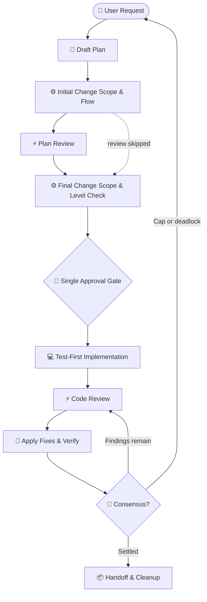

# implement-dispatch

Run a feature or fix through a plan, implementation, verification, and review loop when a single
agent pass is not enough. It coordinates optional plan and code review skills around
[`dispatch`](../dispatch/README.md).



## Prerequisites & Installation

### Requirements

`dispatch` is required. Install `dispatch-plan-review` to review the plan before implementation
and `dispatch-code-review` to review the resulting changes. See [`dispatch`'s prerequisites and
installation guide](../dispatch/README.md#prerequisites--installation) for Node.js, provider
setup, installation scopes, and shared runner behavior.

### Install

Install the workflow with its required dependency:

```bash
npx skills add Gyunikuchan/dispatch-skills --skill dispatch --skill implement-dispatch
```

Add `-g` to install globally, or `-s '*'` to install the complete suite:

> [!NOTE]
> Install companion skills in the same installation scope: keep them all project-local or all global so sibling
> scripts and templates can resolve one another.

## How to Use

Run `/implement-dispatch` and describe the feature or fix.

### Basic examples

Use automatic change-scope selection for a typical feature:

```text
/implement-dispatch Add a CSV export button to the transactions table
```

Choose a lighter pass for a small, mechanical change:

```text
/implement-dispatch low: Rename Household.owner to primaryHolder
```

Request deeper review for a cross-cutting change:

```text
/implement-dispatch high: Refactor the payment webhook idempotency handler
```

### Choose a review level

The level is optional. If omitted, the skill selects `low`, `medium`, or `high` from the request's change scope.

| Level | Use for |
|---|---|
| `low` | Small, mechanical, or low-risk changes |
| `medium` | Typical features, fixes, and bounded refactors |
| `high` | Cross-cutting changes, complex refactors, or public contracts |
| `xhigh` | Security-sensitive or invariant-heavy work |
| `max` | Critical migrations or subsystem overhauls |

`medium` is the usual choice. Request `xhigh` or `max` explicitly when the change warrants it.

> [!NOTE]
> In `config.sample.jsonc`, `low` skips plan review but still runs one code-review round. An
> uninstalled optional companion skips its phase entirely.

### Choose providers or reviewer count

Use the same provider-pin syntax as [`dispatch`](../dispatch/README.md#choose-a-provider), or
replace the configured reviewer count for both review phases:

```text
/implement-dispatch (all): Implement the OAuth2 PKCE authorization flow
/implement-dispatch (claude,copilot): Compare two approaches to the cache invalidation change
/implement-dispatch high (3): Refactor the payment webhook idempotency handler
```

Named platforms all run when configured. A number such as `(3)` requests up to three reviewers
for each enabled review phase; `(all)` uses every configured review target. Count and `all`
selection preserve configured order, moving the current platform behind alternatives and an exact
current platform/model match to the end.

> [!NOTE]
> Provider pins select review delegates. The implementation subagent is selected separately in
> this skill's configuration, and every review provider must also be enabled in `dispatch`.

## Configuration

Create `config.local.jsonc` or `config.jsonc` beside this skill and use
[`config.sample.jsonc`](config.sample.jsonc) as the schema reference. Provider credentials,
models, fallback, and shared runner settings remain in `dispatch`.

Inspect the resolved policy before a run with:

```bash
node scripts/resolve-flow.mjs --show-effective --platform copilot --level high
```

The workflow matrix intentionally differs from `dispatch`'s standalone defaults: this skill
chooses phase- and level-specific reviewers plus a native implementation model; `dispatch` owns
general cascade membership and provider defaults. A level key resolves by exact match, otherwise
the nearest lower key, otherwise the lowest higher key. With `{ medium: A, max: B }`, `low` uses
`medium`, `high` uses `medium`, and `max` uses `max`.

> [!NOTE]
> Configuration files replace one another rather than merge. Copy `config.sample.jsonc` to
> `config.jsonc` (or `config.local.jsonc`) and keep every review provider enabled in `dispatch` as
> well.

## What to expect

1. The skill prepares an initial draft plan.
2. It scopes the draft and resolves the execution flow.
3. It reviews the plan when `dispatch-plan-review` is installed and enabled.
4. It asks for approval once, after the final change-scope check and before changing code.
5. It implements the approved plan and runs the repository's verification command.
6. It reviews and fixes the changes when `dispatch-code-review` is installed and enabled,
   repeating the review until findings are settled or the configured limit is reached.
7. Review-owned preparation manifests carry artifact freshness, bounded views, and dispatch argv;
   settled reviews checkpoint metadata for the next invocation.
8. It reports unresolved disagreements or configuration problems instead of silently ignoring them.

`dispatch` appends content-free telemetry to `<tmp>/dispatch-telemetry-<username>/telemetry.jsonl`;
disable it with `DISPATCH_TELEMETRY=0`.

> [!NOTE]
> Plan approval is the workflow's only approval gate. The skill does not write code before you
> approve the reviewed plan.

The skill changes the working tree but does not commit, push, create branches, or open pull
requests.

## Nuances, Quirks & Troubleshooting

- **A review phase is missing:** Install the corresponding companion skill, or install the complete
  suite with `npx skills add Gyunikuchan/dispatch-skills -s '*'`.
- **A provider is unavailable:** Configure and authenticate it through `dispatch`; see
  [`dispatch`'s troubleshooting guide](../dispatch/README.md#nuances-quirks--troubleshooting).
- **You need a different review depth:** Pass a level such as `low` or `high`, or adjust the
  level-specific settings in `config.local.jsonc`.
