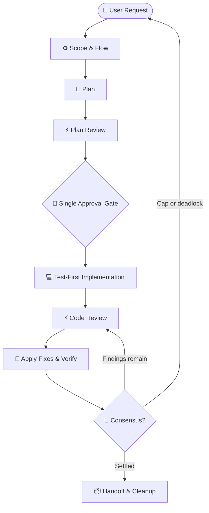

# implement-dispatch

Implement features and fixes through an autonomous plan → review → implementation → consensus
loop. `implement-dispatch` owns control flow; the companion skills provide the review criteria.

---

## What It Does

1. Classifies scope and resolves the review flow.
2. Authors and reviews a plan before code is written.
3. Pauses for one plan approval gate.
4. Implements test-first through a native write subagent when the task is non-trivial.
5. Reviews the resulting changes, applies verified fixes, and repeats until consensus.
6. Records diagnostics and cleans up artifacts after completion.



## Prerequisites & Installation

`dispatch` is required. Its README is the source of truth for Node.js, provider CLIs, installation
scopes, runner flags, sandboxing, and provider cascade behavior.

### Companion Skills

| Skill | Role | Status |
|---|---|---|
| [`dispatch`](../dispatch/README.md) | Runner, flags, sandboxing, and provider cascade | **Required** |
| [`dispatch-plan-review`](../dispatch-plan-review/README.md) | Plan template, review axes, and plan adjudication | **Optional** |
| [`dispatch-code-review`](../dispatch-code-review/README.md) | Walkthrough template, review axes, and code adjudication | **Optional** |

If an optional companion is absent, its phase is skipped and the final diagnostics name the
reduced workflow.

### Installation

Install `implement-dispatch` alongside `dispatch`:

```bash
npx skills add Gyunikuchan/dispatch-skills --skill dispatch --skill implement-dispatch
```

Install the complete suite with:

```bash
npx skills add Gyunikuchan/dispatch-skills --all
```

Add `-g` to either command for a global installation. Keep companion skills in the same scope.

---

## How to Use

Trigger `/implement-dispatch` directly or describe the task in natural language.

### Invocation Grammar

```text
/implement-dispatch [<level>] [(<pins>)]: <feature | fix | task description>
```

- **`<level>`**: `low`, `medium`, `high`, `xhigh`, or `max`; controls wave caps, reviewer breadth,
  consensus gates, and model budgets.
- **`(<pins>)`**: Uses the shared platform-key, alias, `all`, or reviewer-count syntax from
  [`dispatch`](../dispatch/SKILL.md#invocation). `implement-dispatch` resolves platform pins through
  `resolve-flow.mjs`; `all` is limited to platforms configured for both this skill and `dispatch`.
- **Reviewer count**: A single integer such as `(3)` replaces the level's `targetCount` for both
  review phases.

### Basic Invocations

```markdown
/implement-dispatch Add a CSV export button to the transactions table
/implement-dispatch Fix off-by-one error in cursor pagination
/implement-dispatch low: Rename Household.owner field to primaryHolder
/implement-dispatch high: Refactor payment webhook idempotency handler
/implement-dispatch (all): Implement OAuth2 PKCE authorization flow
/implement-dispatch high (3): Refactor payment webhook idempotency handler
```

---

## Review Levels & Scope Gating

Levels are policy profiles resolved from `config.default.jsonc`, or a local `config.jsonc` /
`config.local.jsonc` override.

| Level | Ideal For | Plan Review | Code Review | Consensus Gate |
|---|---|---|---|---|
| **`low`** | Minor bug fixes, mechanical changes, typos, renames | Off (`maxRounds: 0`, `targetCount: 0`) | One reviewer, one round | Relaxed (`consensus: false`) |
| **`medium`** *(default)* | Standard features and bounded multi-file changes | One reviewer, up to two rounds | Two reviewers, up to three rounds | Strict (`consensus: true`) |
| **`high`** | Complex refactors and public contract changes | Two reviewers, up to three rounds | Three reviewers, up to three rounds | Strict (`consensus: true`) |
| **`xhigh`** | Security-sensitive or invariant-heavy work | Three reviewers, up to three rounds | Four reviewers, up to three rounds | Strict (`consensus: true`) |
| **`max`** | Critical migrations and subsystem overhauls | All configured reviewers, up to five rounds | All configured reviewers, up to five rounds | Strict (`consensus: true`) |

When no level is given, the scope gate selects `low` for trivial work, `medium` for focused work,
or `high` for cross-cutting work. `xhigh` and `max` are manual-only. Pins and reviewer counts do
not change automatic level selection.

---

## Configuration & Flow Policy

### Loading and Precedence

The resolver loads one complete config, without deep merging:

1. `config.local.jsonc`
2. `config.jsonc`
3. `config.default.jsonc`

Each phase (`plan-review`, `implementation`, and `code-review`) uses level-keyed policy knobs:

| Knob | Meaning |
|---|---|
| `maxRounds` | Maximum review waves; `0` disables the phase. |
| `targetCount` | Unpinned reviewer count, or `"all"`; `0` disables unpinned waves. |
| `consensus` | Whether MUST-FIX / SHOULD-FIX rejections require reviewer confirmation or a user ruling. |

Levels resolve by exact match, nearest lower level, then lowest higher level.

### Platform Agreement

Every review target is dispatched through `dispatch --provider <key>`. `resolve-flow.mjs` therefore
fails closed when a platform configured in this skill is absent from `dispatch`'s effective set,
instead of allowing a later `PLATFORM_NOT_CONFIGURED` failure.

Inspect the authoritative set with:

```bash
node <skills-dir>/dispatch/scripts/dispatch.mjs --list-platforms
```

Validate the flow without dispatching:

```bash
node <skills-dir>/implement-dispatch/scripts/resolve-flow.mjs --validate-only
```

Unpinned waves inherit `dispatch`'s diversity-sorted ordering. The resolver records targets and
reserves, and excludes platforms that fail authentication or quota checks.

---

## Workflow Invariants

- **Single approval gate**: The user approves the reviewed plan exactly once before implementation.
- **Test-first implementation**: Focused and cross-cutting work uses the native write subagent;
  trivial work may run directly in the orchestrator.
- **Mechanical consensus**: `check-consensus.mjs` must report every finding settled before handoff.
- **Optional phases**: Missing review companions skip only their phase and are named in diagnostics.
- **Artifact lifecycle**: Scratch artifacts remain on escalation and move to OS temp only after
  successful completion.
- **Git boundary**: The skill modifies the working tree but never commits, pushes, creates branches,
  or opens pull requests.

Read-only delegation, claim verification, provider fallback, and host convention discovery are
shared behavior documented by [`dispatch`](../dispatch/README.md) and the
[alignment reference](../dispatch/references/alignment.md).

## Platform Write Subagents

| Platform | Native Write Subagent |
|---|---|
| `claude` | `general-purpose` |
| `agy` | `self` |
| `copilot` | `self` |
| `opencode` | `general` |

---

## Finding Grammar & Consensus

Reviewers cite plan sections or code lines:

```text
<locus> — <tag>: <defect> → <required change>
```

The orchestrator verifies every claim, applies accepted fixes, and records the result in the plan
or walkthrough:

| State | Meaning |
|---|---|
| **Accepted** | Requirement or evidence confirms the defect; apply the fix and log it. |
| **Pending rejection** | Under `consensus: true`, a rejected delegate MUST-FIX / SHOULD-FIX awaits citing-reviewer confirmation. |
| **Settled rejection** | Counter-evidence is confirmed, or consensus is disabled. |
| **Downgrade** | A minor or subjective issue moves to follow-ups or out of scope. |
| **Disputed** | User intent or a trade-off needs a ruling before the loop can settle it. |

`check-consensus.mjs` is the mechanical gate: exit `0` means settled, exit `1` lists unsettled
entries, and exit `2` reports a file or syntax error.

---

## Troubleshooting & Run Diagnostics

- If an optional review skill is absent, the corresponding phase is skipped and named in the handoff.
- When a review phase reaches its round cap, the skill escalates remaining disputes; a user ruling
  grants one additional verification round.
- Write subagents may inspect Git but must not run commands that rewrite or discard the working tree
  or index, including `git stash`, `git reset`, `git checkout -- <path>`, or `git clean`.
- Trivial mechanical tasks can run directly without a background implementation subagent.
- Failed authentication or quota checks exclude that platform from later waves; reserves are resolved
  again before the next wave.
- Reviewer budget is `8 + 2 × <units under review>` tool turns; later rounds count only changed units.
- For provider discovery, authentication, fallback, live logs, and platform-specific behavior, use
  the [`dispatch` troubleshooting guide](../dispatch/README.md#nuances-quirks--troubleshooting).
